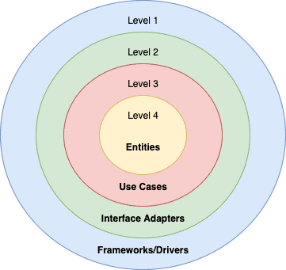
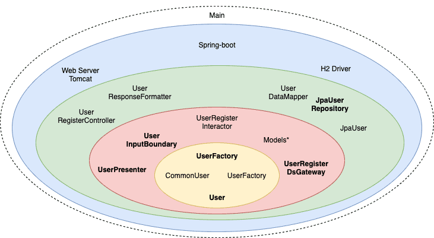

# [使用 Spring Boot 构建简洁的架构](https://www.baeldung.com/spring-boot-clean-architecture)

1. 概述

    当我们开发长期系统时，我们应该期待一个易变的环境。

    一般来说，我们的功能需求、框架、I/O 设备甚至代码设计都可能因各种原因而发生变化。考虑到这一点，"简洁架构"（Clean Architecture）就是一个考虑到我们周围所有不确定因素的高可维护性代码指南。

    在本文中，我们将按照罗伯特-C-马丁（Robert C. Martin）的 "简洁架构"（[Clean Architecture](https://blog.cleancoder.com/uncle-bob/2012/08/13/the-clean-architecture.html)）创建一个用户注册 API 的示例。我们将使用他的原始层--实体、用例、接口适配器和框架/驱动程序。

2. 简洁架构概述

    简洁架构包含许多代码设计和原则，如 [SOLID](https://www.baeldung.com/solid-principles)、[稳定抽象](https://wiki.c2.com/?StableAbstractionsPrinciple)等。但是，其核心思想是根据业务价值将系统划分为不同层次。因此，最高级别具有业务规则，而每个较低的级别则更接近 I/O 设备。

    此外，我们还可以将级别转化为层。在本例中，情况正好相反。内层等于最高层，以此类推：

    

    考虑到这一点，我们可以根据业务需要设置尽可能多的层级。但是，一定要考虑到依赖规则--高层绝不能依赖于低层。

3. 规则

    让我们开始为用户注册 API 定义系统规则。首先是业务规则：

    - 用户密码必须超过五个字符

    其次是应用规则。这些规则可以采用不同的格式，如用例或故事。我们将使用故事短语：

    - 系统接收用户名和密码，验证用户是否不存在，并保存新用户和创建时间。

    注意这里没有提到任何数据库、用户界面或类似内容。因为我们的业务并不关心这些细节，所以我们的代码也不应该关心这些细节。

4. 实体层

    正如简洁的架构所示，让我们从业务规则开始：

    main/.pattern.cleanarchitecture.usercreation/User.java

    还有一个 UserFactory：

    main/.pattern.cleanarchitecture.usercreation/UserFactory.java

    我们创建用户工厂方法有两个原因。一是为了遵循稳定抽象原则，二是为了隔离用户创建过程。

    接下来，让我们实现这两个功能：

    main/.pattern.cleanarchitecture.usercreation/CommonUser.java

    main/.pattern.cleanarchitecture.usercreation/CommonUserFactory.java

    如果我们的业务很复杂，那么我们就应该尽可能构建清晰的域代码。因此，这一层是应用[设计模式](https://www.baeldung.com/design-patterns-series)的绝佳场所。尤其要考虑到[领域驱动设计](https://www.baeldung.com/java-modules-ddd-bounded-contexts)。

    1. 单元测试

        现在，让我们测试 CommonUser：

        test/.pattern.cleanarchitecture.usercreation/UserUnitTest.java:given123Password_whenPasswordIsNotValid_thenIsFalse()

        我们可以看到，单元测试非常清晰。毕竟，没有模拟对这一层来说是一个很好的信号。

        一般来说，如果我们在这里开始考虑模拟，也许我们就把实体和用例混为一谈了。

5. 用例层

    用例是与系统自动化相关的规则。在 "简洁架构" 中，我们称其为 "交互者"（Interactors）。

    1. 用户注册交互器

        首先，我们将创建 UserRegisterInteractor，以便了解我们的工作方向。然后，我们将创建并讨论所有用到的部分：

        main/.pattern.cleanarchitecture.usercreation/UserRegisterInteractor.java

        我们可以看到，我们正在执行所有的用例步骤。此外，这一层还负责控制实体的舞动。不过，我们并没有对用户界面或数据库的工作方式做出任何假设。但是，我们正在使用 UserDsGateway 和 UserPresenter。那么，我们怎么可能不知道它们呢？因为它们与 UserInputBoundary 一起构成了我们的输入和输出边界。

    2. 输入和输出边界

        边界是定义组件如何交互的契约。输入边界将我们的用例暴露给外层：

        main/.pattern.cleanarchitecture.usercreation/UserInputBoundary.java

        接下来是输出边界，用于使用外层。首先，让我们定义数据源网关：

        main/.pattern.cleanarchitecture.usercreation/UserRegisterDsGateway.java

        第二，视图展示器：

        main/.pattern.cleanarchitecture.usercreation/UserPresenter.java

        请注意，我们使用了[依赖反转](https://www.baeldung.com/java-dependency-inversion-principle)原则，使我们的业务不受数据库和用户界面等细节的影响。

    3. 解耦模式

        在继续之前，请注意边界合约是如何定义系统的自然划分的。但我们还必须决定如何交付应用程序：

        - [单体(Monolithic)](https://www.baeldung.com/cs/microservices-vs-monolithic-architectures)-可能使用某种包结构来组织
        - 使用模块
        - 使用服务/微服务

        考虑到这一点，我们可以通过任何解耦模式实现简洁的架构目标。因此，我们应该准备好根据当前和未来的业务需求在这些策略之间进行切换。选定解耦模式后，应根据我们的边界进行代码划分。

    4. 请求和响应模型

        到目前为止，我们已经使用接口创建了跨层操作。接下来，让我们看看如何在这些边界之间传输数据。

        请注意，我们所有的边界都只处理字符串或模型对象：

        main/.pattern.cleanarchitecture.usercreation/UserRequestModel.java

        基本上，只有简单的数据结构可以跨越边界。此外，所有模型都只有字段和访问器。另外，数据对象属于内侧。因此，我们可以保留依赖规则。

        但为什么我们会有这么多类似的对象呢？重复代码有两种情况：

        - 假重复或意外重复--代码相似是一个意外，因为每个对象都有不同的变化原因。如果我们试图删除它，就有可能违反[单一责任原则](https://www.baeldung.com/java-single-responsibility-principle)。
        - 真正的重复--代码更改的原因相同。因此，我们应该删除它

        由于每个模型都有不同的责任，我们得到了所有这些对象。

    5. 测试 UserRegisterInteractor

        现在，让我们创建单元测试：

        test/.pattern.cleanarchitecture.usercreation/UserUnitTest.java:givenBaeldungUserAnd123456Password_whenCreate_thenSaveItAndPrepareSuccessView()

        我们可以看到，大部分用例测试都是关于控制实体和边界请求的。我们的接口允许我们轻松地模拟细节。

6. 接口适配器

    至此，我们完成了所有业务。现在，让我们开始插入细节。

    我们的业务应只处理最方便的数据格式，我们的外部代理（如数据库或用户界面）也应如此。但是，这种格式通常是不同的。因此，接口适配器层负责转换数据。

    1. 使用 JPA 的 UserRegisterDsGateway

        首先，让我们使用 JPA 映射我们的用户表：

        main/.pattern.cleanarchitecture.usercreation/UserDataMapper.java

        我们可以看到，映射器的目标是将我们的对象映射为数据库格式。

        接下来，JpaRepository 将使用我们的[实体](https://www.baeldung.com/jpa-entities)：

        main/.pattern.cleanarchitecture.usercreation/JpaUserRepository.java

        考虑到我们将使用 Spring-boot，这就是保存用户所需的全部。

        现在，是时候实现我们的 UserRegisterDsGateway 了：

        main/.pattern.cleanarchitecture.usercreation/JpaUser.java

        代码的大部分内容不言自明。除了我们的方法，请注意 UserRegisterDsGateway 的名称。如果我们选择 UserDsGateway，那么其他用户用例就会违反接口隔离原则。

    2. 用户注册 API

        现在，让我们创建 HTTP 适配器：

        main/.pattern.cleanarchitecture.usercreation/UserRegisterController.java

        正如我们所见，这里的唯一目标就是接收请求并将响应发送给客户端。

    3. 准备响应

        在返回响应之前，我们应该格式化我们的响应：

        main/.pattern.cleanarchitecture.usercreation/UserResponseFormatter.java

        UserRegisterInteractor 迫使我们创建一个演示器。不过，演示规则只与适配器有关。此外，只要是难以测试的东西，我们就应该将其分为可测试对象和[不起眼的对象](https://martinfowler.com/bliki/HumbleObject.html)。因此，UserResponseFormatter 可以让我们轻松地验证我们的演示规则：

        test/.pattern.cleanarchitecture.usercreation/UserResponseFormatterUnitTest.java:givenDateAnd3HourTime_whenPrepareSuccessView_thenReturnOnly3HourTime()

        正如我们所见，在将逻辑发送到视图之前，我们测试了所有逻辑。因此，只有卑微对象的可测试部分较少。

7. 驱动程序和框架

    事实上，我们通常不会在这里编写代码。这是因为这一层代表了与外部代理连接的最低层。例如，连接数据库或网络框架的 H2 驱动程序。在本例中，我们将使用 spring-boot 作为网络和[依赖注入](https://www.baeldung.com/spring-dependency-injection)框架。 因此，我们需要它的启动点：

    main/.pattern.cleanarchitecture/CleanArchitectureApplication.java

    到目前为止，我们还没有在业务中使用任何[Spring注解](https://www.baeldung.com/spring-bean-annotations)。除了 Spring 特有的适配器，就像我们的 UserRegisterController。这是因为我们应该像对待其他细节一样对待 spring-boot。

8. 可怕的主类

    最后，最后一块！

    到目前为止，我们遵循了[稳定抽象原则](https://wiki.c2.com/?StableAbstractionsPrinciple)。此外，我们还通过[反转控制](https://www.baeldung.com/inversion-control-and-dependency-injection-in-spring)保护了内层，使其不受外部代理的影响。最后，我们将所有对象的创建和使用分离开来。现在，我们需要创建其余的依赖项，并将它们注入到项目中：

    main/.pattern.cleanarchitecture/CleanArchitectureApplication.java:

    beanFactoryPostProcessor()

    genericApplicationContext()

    removeModelAndEntitiesFilter()

    在我们的例子中，我们使用 Spring-boot 依赖注入来创建所有实例。由于我们没有使用 [@Component](https://www.baeldung.com/spring-bean-annotations#component)，所以我们扫描了根包，只忽略了 Model 对象。

    虽然这种策略看起来更复杂，但它将我们的业务与 DI 框架分离开来。另一方面，主类有权管理我们所有的系统。这就是为什么简洁架构将其视为一个包含所有其他对象的特殊层：

    

9. 结论

    在本文中，我们了解了鲍勃叔叔的简洁架构是如何建立在许多设计模式和原则之上的。此外，我们还创建了一个使用 Spring Boot 的用例。

    不过，我们还是忽略了一些原则。但是，所有这些原则都指向同一个方向。我们可以引用它的创造者的话来总结一下： "一个好的架构师必须最大限度地增加未做决定的数量。" 我们通过使用边界来保护业务代码，使其不受细节的影响。
