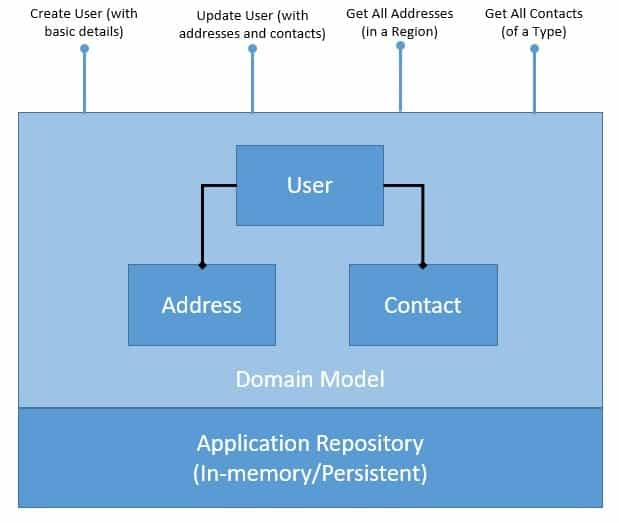

# [Java 中的 CQRS 和事件源](https://www.baeldung.com/cqrs-event-sourcing-java)

1. 简介

    在本教程中，我们将探讨命令查询责任隔离（CQRS）和事件源设计模式的基本概念。

    虽然这两种设计模式经常被视为互补模式，但我们将尝试分别理解它们，最后看看它们是如何互补的。有几种工具和框架（如 Axon）可以帮助采用这些模式，但我们将用 Java 创建一个简单的应用程序来了解基础知识。

2. 基本概念

    在尝试实现这些模式之前，我们首先要从理论上理解它们。此外，由于它们作为单独的模式非常适合，我们将尽量在不混用它们的情况下理解它们。

    请注意，这些模式通常会在企业应用程序中一起使用。在这方面，它们也受益于其他几种企业架构模式。我们将继续讨论其中一些模式。

    1. 事件源

        事件源为我们提供了一种将应用程序状态持久化为有序事件序列的新方法。我们可以有选择地查询这些事件，并在任意时间点重建应用程序的状态。当然，要做到这一点，我们需要将应用程序状态的每一次变化都重新映射为事件：

        

        这些事件是已经发生的事实，不能更改，换句话说，它们必须是不可变的。重新创建应用程序状态只需重播所有事件即可。

        请注意，这也为有选择地重放事件、反向重放某些事件等提供了可能性。因此，我们可以将应用程序状态本身视为次要公民，而将事件日志作为主要的真相来源。

    2. CQRS

        简单地说，CQRS 就是将应用程序架构中的命令和查询分离开来。CQRS 基于 Bertrand Meyer 提出的命令查询分离（Command Query Separation, CQS）原则。CQS 建议我们将领域对象的操作分为两个不同的类别：查询和命令：

        

        查询返回结果，不改变系统的可观测状态。命令会改变系统状态，但不一定返回值。

        我们通过将领域模型的命令和查询清晰地分开来实现这一点。当然，我们还可以更进一步，通过引入保持同步的机制，将数据存储的写侧和读侧也分离开来。

3. 一个简单的应用程序

    首先，我们将介绍一个构建领域模型的 Java 应用程序。

    该应用程序将对[领域模型进行 CRUD 操作](https://www.baeldung.com/spring-boot-crud-thymeleaf)，还将为领域对象提供持久化功能。CRUD 表示创建、读取、更新和删除，是我们可以对领域对象执行的基本操作。

    在后面的章节中，我们将使用相同的应用程序来介绍事件源和 CQRS。

    在此过程中，我们将在示例中利用领域驱动设计（[DDD](https://www.baeldung.com/spring-data-ddd)）中的一些概念。

    领域驱动设计（DDD）针对依赖于复杂的特定领域知识的软件进行分析和设计。它建立在软件系统需要基于完善的领域模型这一理念之上。DDD 最早是由 Eric Evans 作为模式目录提出的。我们将使用其中一些模式来构建我们的示例。

    1. 应用程序概述

        创建用户配置文件并对其进行管理是许多应用程序的典型要求。我们将定义一个简单的领域模型来捕获用户配置文件和持久性：

        

        正如我们所看到的，我们的领域模型已经规范化，并公开了几个 CRUD 操作。这些操作只是为了演示，根据需求可以是简单的，也可以是复杂的。此外，这里的持久化存储库可以是内存存储库，也可以使用数据库。

    2. 应用程序的实现

        首先，我们要创建代表领域模型的 Java 类。这是一个相当简单的领域模型，甚至可能不需要像事件源和 CQRS 这样复杂的设计模式。不过，我们将保持简单，以便集中精力理解基础知识：

        main/.patterns.domain/User.java

        main/.patterns.domain/Contact.java

        main/.patterns.domain/Address.java

        此外，我们还将定义一个简单的内存存储库，用于持久化应用程序状态。当然，这并不会增加任何价值，但足以满足我们稍后的演示：

        main/.patterns.crud.repository/UserRepository.java

        现在，我们将定义一个服务，在领域模型上公开典型的 CRUD 操作：

        main/.patterns.crud.repository/UserService.java

        这就是我们要建立的简单应用程序。这还远远不是可以投入生产的代码，但它揭示了本教程稍后要讨论的一些要点。

    3. 应用程序中的问题

        在进一步讨论事件源和 CQRS 之前，我们有必要讨论一下当前解决方案存在的问题。毕竟，我们将通过应用这些模式来解决相同的问题！

        在我们可能注意到的众多问题中，我们只想重点讨论其中两个：

        - Domain Model：读写操作发生在同一个领域模型上。虽然对于这样一个简单的领域模型来说这不是问题，但随着领域模型变得复杂，问题可能会越来越严重。我们可能需要优化领域模型及其底层存储，以满足读写操作的个性化需求。
        - Persistence：我们为领域对象提供的持久性只存储领域模型的最新状态。虽然这在大多数情况下是足够的，但它使一些任务变得具有挑战性。例如，如果我们需要对领域对象的状态变化进行历史审计，这在这里是不可能的。为此，我们必须使用一些审计日志来补充我们的解决方案。

4. 引入 CQRS

    我们将通过在应用程序中引入 CQRS 模式来解决上一节讨论的第一个问题。作为其中的一部分，我们将分离领域模型及其持久性，以处理写入和读取操作。让我们看看 CQRS 模式是如何重组我们的应用程序的：

    

    图中说明了我们打算如何将应用程序架构干净利落地分为写和读两部分。不过，我们在这里引入了许多新组件，我们必须更好地理解它们。请注意，这些组件与 CQRS 并无严格关联，但 CQRS 可从中受益匪浅：

    - 聚合/聚合器(Aggregate/Aggregator)

    聚合是领域驱动设计（DDD）中描述的一种模式，它通过将实体绑定到聚合根来对不同实体进行逻辑分组。聚合模式提供了实体间的事务一致性。

    CQRS 自然得益于聚合模式，它将写领域模型分组，提供事务保证。聚合通常会保留缓存状态，以提高性能，但没有缓存状态也能完美运行。

    - 投影/投影器(Projection/Projector)：

    投影是另一种重要模式，对 CQRS 大有裨益。投影主要是指用不同的形状和结构来表示域对象。

    原始数据的这些投影是只读的，并经过高度优化，以提供更好的读取体验。我们可能会再次决定缓存投影以获得更好的性能，但这并非必要。

    1. 实现应用程序的写入端

        我们首先来实现应用程序的写入部分。

        首先，我们将定义所需的命令。命令是改变领域模型状态的意图。是否成功取决于我们配置的业务规则。

        让我们来看看我们的命令：

        main/.patterns.cqrs.commands/CreateUserCommand.java

        main/.patterns.cqrs.commands/UpdateUserCommand.java

        这些都是非常简单的类，用于保存我们打算更改的数据。

        接下来，我们定义一个聚合体，它负责接收和处理命令。聚合体可以接受或拒绝命令：

        main/.patterns.cqrs.aggregates/UserAggregate.java

        聚合器使用存储库检索当前状态，并持久保存对当前状态的任何更改。此外，它还可以在本地存储当前状态，以避免在处理每条命令时往返存储库的成本。

        最后，我们需要一个存储库来保存领域模型的状态。这通常是一个数据库或其他持久存储库，但在这里我们只需用一个内存数据结构来代替它们：

        main/.patterns.cqrs.repository/UserWriteRepository.java

        应用程序的写入部分到此为止。

    2. 实现应用程序的读取端

        现在让我们切换到应用程序的读取端。我们将首先定义领域模型的读取端：

        main/.patterns.domain/UserAddress.java

        main/.patterns.domain/UserContact.java

        如果我们回想一下读取操作，就不难发现这些类完全可以映射处理这些操作。这就是围绕查询创建领域模型的魅力所在。

        接下来，我们将定义读取存储库。我们将再次使用内存数据结构，尽管在实际应用中这将是一个更持久的数据存储：

        main/.patterns.cqrs.repository/UserReadRepository.java

        现在，我们将定义必须支持的查询。查询是一种获取数据的意图，不一定会产生数据。

        让我们来看看我们的查询：

        main/.patterns.cqrs.queries/ContactByTypeQuery.java

        main/.patterns.cqrs.queries/AddressByRegionQuery.java

        同样，这些都是简单的 Java 类，其中包含定义查询的数据。

        我们现在需要的是一个可以处理这些查询的投影：

        main/.patterns.cqrs.projections/UserProjection.java

        这里的投影使用我们之前定义的读取存储库来处理我们的查询。至此，我们应用程序的读取部分也基本完成。

    3. 同步读写数据

        这个难题还有一块没有解决：没有任何东西可以同步我们的写和读存储库。

        这就是我们需要的投影器。投影器具有将写领域模型投射到读领域模型的逻辑。

        还有更复杂的方法来处理这个问题，但我们将保持相对简单：

        main/.patterns.cqrs.projectors/UserProjector.java

        这是一种非常粗略的方法，但足以让我们了解 CQRS 运行所需的条件。此外，读取和写入存储库并不需要放在不同的物理存储区中。分布式系统也有自己的问题！

        请注意，将写域的当前状态投射到不同的读域模型中并不方便。我们在这里所举的例子相当简单，因此看不出问题所在。

        不过，随着写入和读取模型变得越来越复杂，投影也会变得越来越困难。我们可以通过基于事件的投影，而不是基于状态的投影来解决这个问题。我们将在本教程稍后部分了解如何实现这一点。

    4. CQRS 的优点和缺点

        我们讨论了 CQRS 模式，并学习了如何在典型应用程序中引入该模式。我们已经明确尝试解决与处理读写时领域模型的刚性有关的问题。

        现在，让我们来讨论一下 CQRS 为应用程序架构带来的其他一些好处：

        - CQRS 为我们提供了一种方便的方法，让我们可以分别选择适合写入和读取操作的领域模型；我们不必创建一个复杂的领域模型来同时支持写入和读取操作。
        - 它可以帮助我们选择适合处理读写操作复杂性的存储库，如写操作的高吞吐量和读操作的低延迟。
        - 通过提供关注点分离和更简单的领域模型，在分布式架构中自然地补充了基于事件的编程模型

        然而，这并不是免费的。从这个简单的例子可以看出，CQRS 增加了架构的复杂性。在许多情况下，CQRS 可能并不适合，也不值得为此付出代价：

        - 只有复杂的领域模型才能从这种模式增加的复杂性中获益；简单的领域模型可以不采用这种模式进行管理
        - 自然会在一定程度上导致代码重复，与它带来的收益相比，这是一种可以接受的恶果；不过，建议根据个人情况作出判断
        - 独立的资源库会导致一致性问题，而且很难保证写入和读取资源库始终保持完全同步；我们往往不得不满足于最终的一致性。

5. 引入事件源

    接下来，我们将讨论我们在简单应用中讨论的第二个问题。如果我们还记得，它与我们的持久性存储库有关。

    我们将引入事件源来解决这个问题。事件源极大地改变了我们对应用程序状态存储的看法。

    让我们看看它是如何改变我们的存储库的：

    

    在这里，我们构建了存储库，以存储域事件的有序列表。域对象的每次更改都被视为一个事件。事件的粗粒度或细粒度取决于领域设计。这里需要考虑的重要事项是，事件具有时间顺序和不可变性。

    1. 实现事件和事件存储

        事件驱动应用程序的基本对象是事件，事件源也不例外。正如我们前面所看到的，事件代表了领域模型状态在特定时间点的特定变化。因此，我们首先要为我们的简单应用程序定义基本事件：

        main/.patterns.es.events/Event.java

        这将确保我们在应用程序中生成的每个事件都有唯一标识和创建时间戳。这些都是进一步处理它们所必需的。

        当然，我们可能会对其他一些属性感兴趣，例如用于确定事件来源的属性。

        接下来，让我们创建一些继承自基本事件的特定域事件：

        main/.patterns.es.events/UserCreatedEvent.java

        main/.patterns.es.events/UserContactAddedEvent.java

        main/.patterns.es.events/UserContactRemovedEvent.java

        main/.patterns.es.events/UserAddressAddedEvent.java

        main/.patterns.es.events/UserAddressRemovedEvent.java

        这些都是简单的 Java POJO，包含域事件的详细信息。不过，这里需要注意的是事件的粒度。

        我们本可以为用户更新创建一个事件，但我们决定为地址和联系人的添加和删除创建单独的事件。这种选择是为了更有效地使用领域模型。

        现在，我们自然需要一个存放域事件的存储库：

        main/.patterns.es.repository/EventStore.java

        这是一个简单的内存数据结构，用于保存我们的领域事件。实际上，有几种解决方案专门用于处理事件数据，如 Apache Druid。还有许多通用的分布式数据存储能够处理事件源，包括 Kafka 和 [Cassandra](https://www.baeldung.com/cassandra-with-java)。

    2. 生成和消费事件

        现在，我们处理所有 CRUD 操作的服务将发生变化。现在，它不再更新移动的域状态，而是附加域事件。它还将使用相同的域事件来响应查询。

        让我们看看如何实现这一点：

        main/.patterns.es.service/UserService.java

        请注意，作为处理更新用户操作的一部分，我们正在生成多个事件。此外，值得注意的是，我们是如何通过重放迄今为止生成的所有领域事件来生成领域模型的当前状态的。

        当然，在实际应用中，这种策略并不可行，我们必须维护一个本地缓存，以避免每次都生成状态。还有其他策略，如事件存储库中的快照和滚动，可以加快这一过程。

        至此，我们在简单应用中引入事件源的努力就告一段落了。

    3. 事件源的优点和缺点

        现在，我们已经成功地采用了另一种使用事件源存储域对象的方法。事件源是一种强大的模式，如果使用得当，会给应用程序架构带来很多好处：

        - 由于不需要读取、更新和写入，写入操作变得更快；写入只是将事件追加到日志中
        - 消除了对象与关系之间的阻抗，因此不再需要复杂的映射工具；当然，我们仍然需要重新创建对象。
        - 提供完全可靠的审计日志作为副产品；我们可以准确调试领域模型的状态是如何变化的
        - 它可以支持时态查询并实现时间旅行（域状态处于过去的某一点）！
        - 它非常适合在微服务架构中设计松散耦合的组件，这些组件通过交换消息进行异步通信

        不过，即使是事件源也不是万能的。它确实迫使我们采用一种截然不同的方式来存储数据。在某些情况下，这可能证明并无用处：

        - 采用事件源需要学习曲线和思维方式的转变；从一开始就不直观
        - 除非将状态保存在本地缓存中，否则我们需要重新创建状态，这使得处理典型查询变得相当困难
        - 虽然它可以应用于任何领域模型，但它更适合事件驱动架构中的基于事件的模型

6. 带有事件源的 CQRS

    既然我们已经了解了如何在简单的应用程序中单独引入事件源和 CQRS，现在是时候将它们结合起来了。现在我们应该很直观地看到，这些模式可以从彼此身上获益匪浅。不过，我们将在本节中更明确地说明这一点。

    让我们先看看应用程序架构是如何将它们结合在一起的：

    

    这一点现在已经不足为奇了。我们将存储库的写入端替换为事件存储，而存储库的读取端则保持不变。

    请注意，这并不是在应用程序架构中使用事件源和 CQRS 的唯一方法。我们可以大胆创新，将这些模式与其他模式结合使用，并提出多种架构选项。

    重要的是，我们要确保使用它们来管理复杂性，而不是简单地进一步增加复杂性！

    6.1. 将 CQRS 和事件源结合起来

    在单独实施了事件源和 CQRS 之后，我们应该不难理解如何将它们结合在一起。

    我们将从引入 CQRS 的应用程序开始，只需进行相关更改即可将事件源纳入其中。我们还将利用在引入事件源的应用程序中定义的相同事件和事件存储。

    只有几处改动。首先，我们将改变聚合器，使其生成事件而不是更新状态：

    main/.patterns.escqrs.aggregates/UserAggregate.java

    唯一需要更改的是投影仪，它现在需要处理事件而不是域对象状态：

    main/.patterns.escqrs.projectors/UserProjector.java

    如果我们回想一下在处理基于状态的投影时讨论过的问题，这就是一个潜在的解决方案。

    基于事件的投影相当方便，也更容易实现。我们所要做的就是处理所有发生的领域事件，并将它们应用到所有读取的领域模型中。通常情况下，在基于事件的应用程序中，投影器会监听它感兴趣的领域事件，而不会依赖于有人直接调用它。

    这就是我们在简单应用中将事件源和 CQRS 结合在一起所要做的全部工作。

7. 结束语

在本教程中，我们讨论了事件源和 CQRS 设计模式的基础知识。我们开发了一个简单的应用程序，并分别应用了这些模式。

在此过程中，我们了解了这些模式的优点和缺点。最后，我们理解了为什么以及如何将这两种模式结合到我们的应用程序中。

我们在本教程中讨论的简单应用甚至不足以证明 CQRS 和事件源的必要性。我们的重点是理解基本概念，因此示例是微不足道的。但如前所述，只有在具有相当复杂的领域模型的应用程序中，才能实现这些模式的优势。
