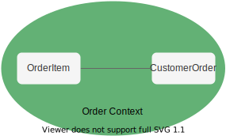

# [DDD 有界上下文和 Java 模块](https://www.baeldung.com/java-modules-ddd-bounded-contexts)

1. 概述

    领域驱动设计（DDD）是一套原则和工具，可帮助我们设计有效的软件架构，从而实现更高的商业价值。有界上下文（Bounded Context）是将整个应用领域隔离成多个语义一致的部分，从而将体系结构从 "大泥球"（Big Ball Of Mud）中解救出来的核心和基本模式之一。

    同时，利用 [Java 9 模块系统](https://www.baeldung.com/java-9-modularity)，我们可以创建强封装模块。

    在本教程中，我们将创建一个简单的商店应用程序，了解如何利用 Java 9 模块，同时为有界上下文定义明确的边界。

2. DDD 有界上下文

    如今，软件系统已不再是简单的 [CRUD 应用程序](https://www.baeldung.com/spring-boot-crud-thymeleaf)。事实上，典型的单体企业系统由一些遗留代码库和新添加的功能组成。然而，随着每次更改，维护此类系统变得越来越难。最终，它可能会变得完全无法维护。

    1. 有界上下文和泛在语言

        为解决上述问题，DDD 提供了 "有界上下文"（Bounded Context）的概念。有界上下文是一个领域的逻辑边界，在这个边界内，特定的术语和规则一致适用。在这个边界内，所有术语、定义和概念都构成了泛在语言。

        尤其是，泛在语言的主要优势在于将来自不同领域的项目成员围绕特定业务领域组合在一起。

        此外，多个语境可能会使用同一事物。但是，在每个语境中，它可能具有不同的含义。

        

    2. 订单上下文

        让我们从定义订单上下文开始实施我们的应用程序。此上下文包含两个实体： OrderItem 和 CustomerOrder。

        

        CustomerOrder 实体是一个[聚合根](https://www.baeldung.com/spring-persisting-ddd-aggregates)：

        main/.dddcontexts.ordercontext.model/CustomerOrder.java

        我们可以看到，该类包含了 calculateTotalPrice 业务方法。但是，在实际项目中，它可能要复杂得多--例如，在最终价格中包含折扣和税金。

        接下来，让我们创建 OrderItem 类：

        main/.dddcontexts.ordercontext.model/OrderItem.java

        我们已经定义了实体，但还需要向应用程序的其他部分公开一些 API。让我们创建 CustomerOrderService 类：

        main/.dddcontexts.ordercontext.service/CustomerOrderService.java

        在此，我们要强调一些要点。placeOrder 方法负责处理客户订单。订单处理完毕后，事件将发布到 EventBus。我们将在接下来的章节中讨论事件驱动通信。该服务提供了 OrderService 接口的默认实现：

        main/.dddcontexts.ordercontext.service/OrderService.java

        此外，该服务需要 CustomerOrderRepository 来持久化订单：

        main/.dddcontexts.ordercontext.repository/CustomerOrderRepository.java

        重要的是，这个接口不是在本上下文中实现的，而是由基础设施模块提供的，我们稍后会看到。

    3. 发货上下文

        现在，我们来定义发货上下文。它也很简单，包含三个实体： 包裹、PackageItem 和 ShippableOrder。

        

        让我们从 ShippableOrder 实体开始：

        main/.dddcontexts.shippingcontext.model/ShippableOrder.java

        在这种情况下，实体不包含 paymentMethod 字段。这是因为，在我们的出货上下文中，我们并不关心使用哪种付款方式。出货上下文只负责处理订单的出货。

        另外，Parcel 实体是出货上下文所特有的：

        main/.dddcontexts.shippingcontext.model/Parcel.java

        我们可以看到，它还包含特定的业务方法，并充当聚合根。

        最后，让我们定义 ParcelShippingService：

        main/.dddcontexts.shippingcontext.service/ParcelShippingService.java

        该服务同样使用 ShippingOrderRepository 按 ID 获取订单。更重要的是，它订阅了由另一个上下文发布的 OrderReadyForShipmentEvent 事件。当该事件发生时，服务会应用一些规则并装运订单。为简单起见，我们将已发货订单存储在 HashMap 中。

3. 上下文映射

    到目前为止，我们定义了两个上下文。但是，我们没有在它们之间设置任何明确的关系。为此，DDD 提出了上下文映射的概念。上下文映射是对系统不同上下文之间关系的可视化描述。该地图显示了不同部分如何共存以形成领域。

    有界上下文之间的关系主要有五种类型：

    - 合作关系(Partnership)-两个上下文之间的关系，通过合作使两个团队的目标一致
    - 共享内核（Shared Kernel）--几种上下文的共同部分被提取到另一种上下文/模块中，以减少代码重复的一种关系
    - 客户-供应商(Customer-supplier)-两个上下文之间的联系，其中一个上下文（上游）生产数据，另一个（下游）消费数据。在这种关系中，双方都希望建立尽可能好的沟通
    - 遵从者(Conformist)-这种关系也有上游和下游之分，但下游总是遵从上游的应用程序接口
    - 反中断层(Anticorruption layer)-这种类型的关系广泛用于传统系统，使其适应新的架构，并逐步从传统代码库迁移。反中断层充当适配器，翻译来自上游的数据，防止不必要的更改。

    在我们的示例中，我们将使用共享内核关系。我们不会以纯粹的形式定义它，但它将主要充当系统中事件的中介。

    因此，SharedKernel 模块将不包含任何具体实现，只包含接口。

    让我们从 EventBus 接口开始：

    main/.dddcontexts.sharedkernel.events/EventBus.java

    稍后，我们将在基础设施模块中实现该接口。

    接下来，我们创建一个带有默认方法的基础服务接口，以支持事件驱动通信：

    main/.dddcontexts.sharedkernel.service/ApplicationService.java

    因此，有界上下文中的服务接口都会扩展此接口，以获得与事件相关的通用功能。

4. Java 9 模块化

    现在，是时候探索 Java 9 模块系统如何支持已定义的应用程序结构了。

    Java 平台模块系统（JPMS）鼓励构建更可靠、封装更强的模块。因此，这些功能有助于隔离我们的上下文并建立清晰的边界。

    让我们来看看最终的模块图：

    

    1. 共享内核模块

        让我们从 SharedKernel 模块开始，它不依赖于其他模块。因此，ddd-contexts-sharedkernel/.main/./module-info.java。

        我们导出模块接口，以便其他模块可以使用它们。

    2. OrderContext 模块

        接下来，让我们把注意力转移到 OrderContext 模块上。它只需要 SharedKernel 模块中定义的接口：

        ddd-contexts-ordercontext/.main/./module-info.java

        此外，我们还可以看到该模块导出了 OrderService 接口的默认实现。

    3. 发货上下文模块

        与前一个模块类似，让我们创建 ShippingContext 模块定义文件：

        ddd-contexts-shippingcontext/.main/./module-info.java

        同样，我们导出了 ShippingService 接口的默认实现。

    4. 基础架构模块

        现在该介绍基础设施模块了。该模块包含已定义接口的实现细节。我们先为 EventBus 接口创建一个简单的实现：

        main/.dddcontexts.infrastructure.events/SimpleEventBus.java

        接下来，我们需要实现 CustomerOrderRepository 和 ShippingOrderRepository 接口。在大多数情况下，订单实体将存储在同一个表中，但在有界上下文中作为不同的实体模型使用。

        单个实体包含来自业务域或底层数据库映射的不同领域的混合代码的情况非常常见。在我们的实现中，我们根据有界上下文拆分了实体： 客户订单（CustomerOrder）和可发货订单（ShippableOrder）。

        首先，让我们创建一个代表整个持久化模型的类：

        ```java
        public static class PersistenceOrder {
            public int orderId;
            public String paymentMethod;
            public String address;
            public List<OrderItem> orderItems;

            public static class OrderItem {
                public int productId;
                public float unitPrice;
                public float itemWeight;
                public int quantity;
            }
        }
        ```

        我们可以看到，该类包含 CustomerOrder 和 ShippableOrder 实体的所有字段。

        为了简单起见，我们来模拟一个内存数据库：

        main/.dddcontexts.infrastructure.db/InMemoryOrderStore.java

        在这里，我们通过将持久化模型转换为或转换为适当类型来持久化和检索不同类型的实体。

        最后，让我们创建模块定义：

        ddd-contexts-infrastructure/.main/./module-info.java

        通过使用 provides with 子句，我们提供了其他模块中定义的一些接口的实现。

        此外，该模块是依赖关系的聚合器，因此我们使用了 requirements 传递关键字。因此，需要 Infrastructure 模块的模块将获得所有这些依赖关系。

    5. 主模块

        最后，让我们定义一个模块，作为应用程序的入口：

        ddd-contexts-mainapp/.main/./module-info.java

        由于我们刚刚在基础设施模块上设置了传递依赖关系，因此这里不需要明确要求它们。

        另一方面，我们使用 uses 关键字列出了这些依赖关系。uses 子句会指示 ServiceLoader（我们将在下一章了解它），本模块希望使用这些接口。但是，它并不要求在编译时实现这些接口。

5. 运行应用程序

    最后，我们差不多可以构建应用程序了。我们将利用 Maven 来构建我们的项目。这样，使用模块就容易多了。

    1. 项目结构

        我们的项目包含[五个模块和父模块](https://www.baeldung.com/maven-multi-module-project-java-jpms)。让我们来看看我们的项目结构：

        ```txt
        ddd-modules (the root directory)
        pom.xml
        |-- infrastructure
            |-- src
                |-- main
                    | -- java
                    module-info.java
                    |-- com.baeldung.dddmodules.infrastructure
            pom.xml
        |-- mainapp
            |-- src
                |-- main
                    | -- java
                    module-info.java
                    |-- com.baeldung.dddmodules.mainapp
            pom.xml
        |-- ordercontext
            |-- src
                |-- main
                    | -- java
                    module-info.java
                    |--com.baeldung.dddmodules.ordercontext
            pom.xml
        |-- sharedkernel
            |-- src
                |-- main
                    | -- java
                    module-info.java
                    |-- com.baeldung.dddmodules.sharedkernel
            pom.xml
        |-- shippingcontext
            |-- src
                |-- main
                    | -- java
                    module-info.java
                    |-- com.baeldung.dddmodules.shippingcontext
            pom.xml
        ```

    2. 主应用程序

        现在，除了主程序，我们已经拥有了一切，因此让我们定义一下主方法：

        main/.dddcontexts.mainapp/Application.java:main(String args[])

        让我们简要讨论一下我们的主要方法。在该方法中，我们使用先前定义的服务模拟一个简单的客户订单流程。首先，我们创建了包含三件商品的订单，并提供了必要的发货和付款信息。接着，我们提交订单，最后检查订单是否已成功发货和处理。

        但是，我们是如何获得所有依赖关系的，为什么 createContainer 方法会返回 `Map<Class<?>, Object>`? 让我们仔细看看这个方法。

    3. 使用服务加载器进行依赖注入

        在本项目中，我们没有任何 [Spring IoC](https://www.baeldung.com/inversion-control-and-dependency-injection-in-spring) 依赖项，因此我们将使用 ServiceLoader API 来发现服务的实现。这并不是什么新功能，ServiceLoader API 本身早在 Java 6 中就已经存在了。

        我们可以通过调用 ServiceLoader 类的静态加载方法之一来获取加载器实例。加载方法返回 Iterable 类型，因此我们可以遍历已发现的实现。

        现在，让我们应用加载器来解决我们的依赖关系：

        main/.dddcontexts.mainapp/Application.java:createContainer()

        在这里，我们为需要的每个接口调用静态加载方法，每次都会创建一个新的加载器实例。因此，它不会缓存已解析的依赖关系，而是每次都创建新实例。

        一般来说，服务实例有两种创建方式。要么服务实现类必须有一个无参数的公共构造函数，要么必须使用静态提供者方法。

        因此，我们的大多数服务都有无参数构造函数和依赖关系设置方法。但是，正如我们已经看到的，InMemoryOrderStore 类实现了两个接口： CustomerOrderRepository 和 ShippingOrderRepository。

        但是，如果我们使用加载方法分别请求这两个接口，就会得到不同的 InMemoryOrderStore 实例。这种行为并不可取，因此我们使用提供者方法技术来缓存实例：

        main/.dddcontexts.infrastructure.db/InMemoryOrderStore.java

        我们应用了[单例模式](https://www.baeldung.com/java-singleton)来缓存 InMemoryOrderStore 类的单个实例，并从提供程序方法中返回该实例。

        如果服务提供者声明了提供者方法，那么 ServiceLoader 将调用该方法获取服务实例。否则，它会尝试通过 Reflection 使用无参数构造函数创建实例。因此，我们可以在不影响 createContainer 方法的情况下更改服务提供者机制。

        最后，我们通过设置器向服务提供已解析的依赖关系，并返回已配置的服务。

        最后，我们就可以运行应用程序了。

6. 结论

    在本文中，我们讨论了一些重要的 DDD 概念： 有界上下文、泛在语言和上下文映射。虽然将系统划分为 "有界上下文 "有很多好处，但同时也没有必要在所有地方都采用这种方法。

    接下来，我们了解了如何使用 Java 9 模块系统和 Bounded Context 来创建强封装模块。

    此外，我们还介绍了用于发现依赖关系的默认 ServiceLoader 机制。
