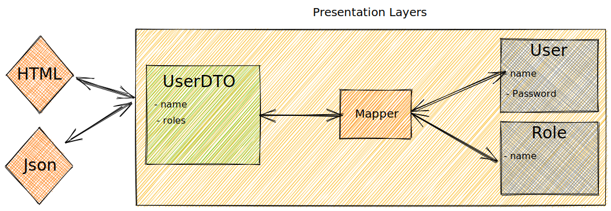

# [DTO 模式（数据传输对象）](https://www.baeldung.com/java-dto-pattern)

1. 概述

    在本教程中，我们将讨论 [DTO](https://martinfowler.com/eaaCatalog/dataTransferObject.html) 模式、它是什么、如何以及何时使用它。最后，我们将知道如何正确使用它。

    进一步阅读：

    - [Spring 框架中的设计模式](https://www.baeldung.com/spring-framework-design-patterns)
      - 了解 Spring 框架中最常用的四种设计模式
    - [MVC 与 MVP 模式的区别](https://www.baeldung.com/mvc-vs-mvp-pattern)
      - 了解 MVC 与 MVP 模式之间的区别。
    - [使用 Spring Boot 实现简洁架构](https://www.baeldung.com/spring-boot-clean-architecture)
      - 一般来说，我们的功能需求、框架、I/O 设备甚至代码设计都可能因各种原因而发生变化。有鉴于此，考虑到我们周围的所有不确定性，Clean Architecture是实现高可维护性代码的指导原则。

2. 模式

    DTO 或数据传输对象（Data Transfer Objects）是在进程间传输数据的对象，目的是减少方法调用的次数。该模式由 Martin Fowler 在其著作《[EAA](https://martinfowler.com/books/eaa.html)》中首次提出。

    Fowler 解释说，该模式的主要目的是通过在一次调用中批处理多个参数来减少服务器的往返次数。这就减少了此类远程操作的网络开销。

    另一个好处是封装了序列化逻辑（将对象结构和数据转换为可存储和传输的特定格式的机制）。它提供了序列化细微差别的单点变化。它还将领域模型与表现层分离开来，允许两者独立变化。

3. 如何使用？

    DTO 通常以 POJO 的形式创建。它们是不包含业务逻辑的平面数据结构。它们只包含存储、访问器和最终与序列化或解析相关的方法。

    数据从[领域模型](https://martinfowler.com/eaaCatalog/domainModel.html)映射到 DTO，通常是通过表现层或门面层中的映射器组件实现的。

    下图说明了组件之间的交互：

    

4. 何时使用？

    DTO 在有远程调用的系统中非常有用，因为它有助于减少远程调用的数量。

    当领域模型由许多不同的对象组成，而表现模型需要一次性获得所有对象的数据时，DTO 也能提供帮助，甚至可以减少客户端和服务器之间的往返。

    有了 DTO，我们就可以从领域模型中建立不同的视图，从而可以创建同一领域的其他表现形式，并在不影响领域设计的前提下根据客户需求对其进行优化。这种灵活性是解决复杂问题的有力工具。

5. 使用案例

    为了演示该模式的实现，我们将使用一个包含两个主要领域模型（本例中为用户和角色）的简单应用程序。为了突出该模式的重点，我们来看两个功能示例--用户检索和创建新用户。

    1. DTO 与域

        以下是两种模式的定义：

        main/.dtopattern.domain/User.java

        main/.dtopattern.domain/Role.java

        现在我们来看看 DTO，以便将它们与域模型进行比较。

        此时，重要的是要注意 DTO 代表从 API 客户端发送或接收的模型。

        因此，这些微小的差异要么是为了将发送到服务器的请求打包在一起，要么是为了优化客户端的响应：

        main/.dtopattern.api/UserDTO.java

        上述 DTO 只向客户端提供了相关信息，例如，出于安全原因隐藏了密码。

        下一个 DTO 将创建用户所需的所有数据分组，并通过单个请求发送到服务器，从而优化了与 API 的交互：

        main/.dtopattern.api/UserCreationDTO.java

    2. 连接双方

        接下来，连接两个类的层使用映射器组件将数据从一方传递到另一方，反之亦然。

        这通常发生在表现层：

        main/.dtopattern.api/UserController.java

        最后，我们有一个 Mapper 组件，它负责传输数据，确保 DTO 和领域模型无需相互了解：

        main/.dtopattern.api/Mapper.java

6. 常见错误

    虽然 DTO 模式是一种简单的设计模式，但我们在应用这种技术时可能会犯一些错误。

    第一个错误是为各种场合创建不同的 DTO。这会增加我们需要维护的类和映射器的数量。请尽量保持简洁，并评估添加一个或重用一个现有 DTO 的利弊。

    我们还要避免在许多情况下使用一个类。这种做法可能会导致许多属性经常不被使用的大合同(contracts)。

    另一个常见错误是在这些类中添加业务逻辑，这是不应该发生的。该模式的目的是优化数据传输和合约结构。因此，所有业务逻辑都应放在领域层中。

    最后，我们还有所谓的 [LocalDTO](https://martinfowler.com/bliki/LocalDTO.html)，即 DTO 跨域传递数据。问题再次出现在所有映射的维护成本上。

    支持这种方法的最常见论点之一是封装领域模型。但这里的问题是，我们的领域模型要与持久性模型耦合。通过解耦，暴露领域模型的风险几乎消失了。

    其他模式也有类似的结果，但它们通常用于更复杂的场景，如 [CQRS](https://cqrs.files.wordpress.com/2010/11/cqrs_documents.pdf)、[Data Mappers](https://martinfowler.com/eaaCatalog/dataMapper.html)、[CommandQuerySeparation](https://martinfowler.com/bliki/CommandQuerySeparation.html) 等。

    1. 数据映射器

        映射器层，在对象和数据库之间移动数据，同时保持它们之间以及映射器本身的独立性。

        

        对象和关系数据库有不同的数据结构机制。对象的许多部分，如集合和继承，都不存在于关系数据库中。当你建立一个包含大量业务逻辑的对象模型时，使用这些机制来更好地组织数据和与之相关的行为是很有价值的。这样做会导致模式变异，即对象模式和关系模式不匹配。

        你仍然需要在两种模式之间传输数据，而这种数据传输本身就很复杂。如果内存对象知道关系数据库结构，其中一个结构的变化往往会波及另一个结构。

        数据映射器是将内存对象与数据库分开的一层软件。它的职责是在两者之间传输数据，并将它们相互隔离。有了数据映射器，内存对象甚至不需要知道有数据库存在；它们不需要 SQL 接口代码，当然也不需要知道数据库模式。由于数据映射器是映射器的一种形式，因此域层甚至不知道数据映射器本身。

    2. 命令查询分离

        命令查询分离 "一词是伯特兰-迈耶（Bertrand Meyer）在他的《面向对象的软件结构》（Object Oriented Software Construction）一书中提出的。

        这本书的基本思想是，我们应该把一个对象的方法分成两个截然不同的类别：

        - 查询：返回结果，不改变系统的可观测状态（无副作用）。
        - 命令：改变系统状态，但不返回值。

        由于 "命令" 一词在其他语境中被广泛使用，我更愿意将其称为 "修改器"，你也可以看到 "突变器" 一词。

        这一原则的真正价值在于，如果能将改变状态的方法与不改变状态的方法明确区分开来，就会非常方便。这是因为你可以在很多情况下更自信地使用查询，在任何地方引入它们，改变它们的顺序。对于修饰符，你必须更加小心。

        原则中的概念是，返回类型是区别的关键。这是一个很好的约定，因为大多数时候它都能很好地发挥作用。考虑一下 Java 用来迭代集合的习语：next 方法既能给出集合中的下一项，又能使迭代器前进。

        Meyer 绝对喜欢使用命令-查询分离，但也有例外。弹出堆栈就是一个很好的修改状态查询的例子。Meyer 正确地指出，你可以避免使用这种方法，但它是一个有用的习语。

        如果语言本身能支持这一概念就更好了。我可以想象有一种语言可以检测到状态改变的方法，或者至少允许程序员标记它们。语言不能自动检测这些方法的一个原因是，不改变状态的规则实际上只适用于系统的可观察状态（ObservableState）。使用程序员标记似乎更合理，但却很少见。我真正遇到的唯一情况是 C++ 中的 const 修饰符。

7. 结论

在本文中，我们了解了 DTO 模式的定义、存在的原因以及实现方法。

我们还了解了与实现该模式有关的一些常见错误以及避免这些错误的方法。
