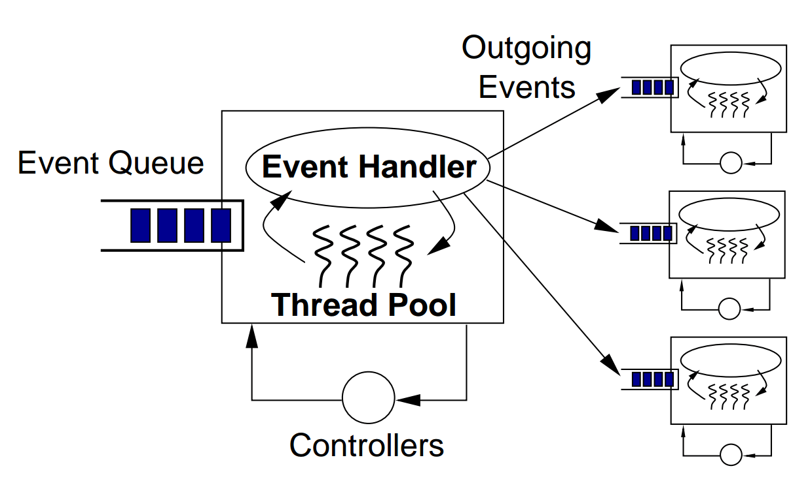
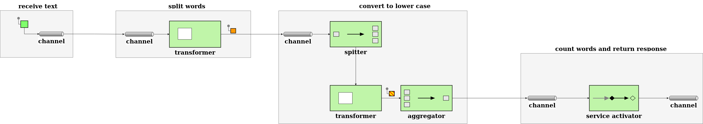

# [带有Spring集成和Apache Camel的SEDA](https://www.baeldung.com/spring-apache-camel-seda-integration)

1. 简介

    SEDA(Staged Event-Driven Architecture)，即阶段性事件驱动架构，是Matt Welsh在其[博士论文](https://citeseerx.ist.psu.edu/viewdoc/download?doi=10.1.1.18.9268&rep=rep1&type=pdf)中提出的一种架构风格。它的主要优点是可扩展性，支持高并发流量，以及可维护性。

    在本教程中，我们将使用SEDA来计算一个句子中的唯一单词，使用两个独立的实现： [Spring Integration](../../spring-integration/README-zh.md#spring集成简介)和[Apache Camel](https://www.baeldung.com/apache-camel-intro)。

2. SEDA

    SEDA解决了在线服务特有的几个非功能需求：

    - 高并发性 High concurrency： 该架构必须支持尽可能多的并发请求。
    - 动态内容 Dynamic content： 软件系统必须经常支持复杂的商业用例，需要许多步骤来处理用户的请求并产生响应。
    - 对负载的稳健性-鲁棒性 Robustness to load： 在线服务的用户流量可能是不可预测的，该架构需要优雅地处理流量的变化。

    为了满足这些要求，SEDA将复杂的服务分解为事件驱动的阶段。这些阶段与队列间接连接，因此可以完全与对方解耦。此外，每个阶段都有一个扩展机制来应对其传入的负载：

    

    上图来自Matt Welsh的论文，描述了一个用SEDA实现的网络服务器的整体结构。每个矩形代表一个处理HTTP请求的单一阶段。这些阶段可以独立地从其传入的队列中消耗任务，做一些处理或I/O工作，然后将消息传递给下一个队列。

    1. 组件

        为了更好地理解SEDA的组件，让我们看看Matt Welsh的论文中的这张图是如何展示单个阶段的内部运作的：

        

        我们可以看到，每个SEDA阶段都有以下的组成部分：

        - Event事件：事件是数据结构，包含了该阶段需要执行其处理的任何数据。例如，对于一个HTTP网络服务器，事件可能包含用户数据--如正文、标题和请求参数--以及基础设施数据，如用户的IP，请求的时间戳等。
        - Event Queue 事件队列：这个队列保存着舞台上的传入事件。
        - Event Handler 事件处理程序：事件处理程序是阶段的程序性逻辑。这可能是一个简单的路由阶段，将数据从其事件队列转发到其他相关的事件队列，或者是一个更复杂的阶段，以某种方式处理数据。事件处理程序可以单独或分批读取事件--当分批处理有性能优势时，后者很有帮助，比如用一次查询更新多个数据库记录。
        - Outgoing Events 外发事件：根据业务用例和流程的整体结构，每个阶段可以向零个或多个事件队列发送新事件。创建和发送外发信息是在事件处理方法中完成的。
        - Thread Pool 线程池：线程是一种著名的并发机制。在SEDA中，线程是本地化的，并为每个阶段定制。换句话说，每个阶段都有一个线程池。因此，与每请求一个线程的模式不同，在SEDA中，每个用户的请求都由几个线程处理。这种模式使我们能够根据每个阶段的复杂程度独立地进行调整。
        - Controllers 控制器： SEDA控制器是任何管理资源消耗的机制，如线程池大小、事件队列大小、调度等。控制器负责SEDA的弹性行为。一个简单的控制器可能会管理每个线程池中的活动线程数量。一个更复杂的控制器可以实现复杂的性能调整算法，在运行时监控整个应用程序并调整各种参数。此外，控制器将性能调整逻辑与业务逻辑解耦。这种关注点的分离使得我们的代码更容易维护。

        通过将所有这些组件放在一起，SEDA提供了一个强大的解决方案来处理高的和波动的流量负载。

3. 示例问题

    在下面的章节中，我们将创建两个实现，用SEDA解决同样的问题。

    我们的例子问题将是直接的：计算每个词在一个给定的字符串中不分大小写出现的次数。

    让我们把一个词定义为一个没有空格的字符序列，我们将忽略其他复杂的因素，如标点符号。我们的输出将是一个地图，其中包含作为键的单词和作为值的计数。例如，鉴于输入 "My name is Hesam"，输出将是：

    ```json
    {
    "my": 1,
    "name": 1,
    "is": 1,
    "hesam": 1
    }
    ```

    1. 使问题适应SEDA

        让我们从SEDA阶段的角度来看看我们的问题。由于可扩展性是SEDA的一个核心目标，通常情况下，最好是设计一些专注于特定操作的小阶段，特别是当我们有I/O密集型的任务时。此外，拥有小的阶段有助于我们更好地调整每个阶段的规模。

        为了解决我们的字数问题，我们可以用下面的阶段来实现一个解决方案：

        

        现在我们有了我们的阶段设计，让我们在接下来的章节中使用两种不同的企业集成技术来实现它。在这个表格中，我们可以预览SEDA将如何在我们的实现中显示出来：

        | SEDA Component | Spring Integration                      | Apache Camel                                           |
        |----------------|-----------------------------------------|--------------------------------------------------------|
        | Event          | org.springframework.messaging.Message   | org.apache.camel.Exchange                              |
        | Event Queue    | org.springframework.integration.channel | Endpoints defined by URI strings (由URI字符串定义的端点) |
        | Event Handler  | Instances of functional interfaces      | Camel processors, Camel utility classes, and Functions |
        | Thread Pool    | Spring abstraction of TaskExecutor      | Out-of-the-box support in SEDA endpoints (在SEDA端点中的开箱即用支持) |

4. 使用Spring集成的解决方案

    对于我们的第一个实现，我们将使用Spring集成。Spring Integration建立在Spring模型的基础上，支持流行的企业集成模式。

    Spring Integration有三个主要组件：

    - 一个消息是一个数据结构，包含一个头和一个主体。
    - 一个通道将消息从一个端点传送到另一个端点。在Spring Integration中，有两种通道：
    - 点对点：只有一个端点可以消费该通道中的消息。
    - 发布-订阅：多个端点可以消费这个通道中的消息。
    - 一个端点将消息路由到一个执行某些业务逻辑的应用组件。在Spring Integration中，有各种各样的端点，如转化器、路由器、服务激活器和过滤器。

    让我们来看看我们的Spring Integration解决方案的概述：

    

    1. 依赖关系

        让我们开始为Spring Integration、Spring Boot Test和Spring Integration Test添加依赖项：

        ```xml
        <dependencies>
            <dependency>
            <groupId>org.springframework.boot</groupId>
            <artifactId>spring-boot-starter-integration</artifactId>
            </dependency>
            <dependency>
            <groupId>org.springframework.boot</groupId>
            <artifactId>spring-boot-starter-test</artifactId>
            <scope>test</scope>
            </dependency>
            <dependency>
            <groupId>org.springframework.integration</groupId>
            <artifactId>spring-integration-test</artifactId>
            <scope>test</scope>
            </dependency>
        </dependencies>
        ```

    2. 消息网关

        [消息网关](https://www.enterpriseintegrationpatterns.com/MessagingGateway.html)是一个代理，它隐藏了向集成流发送消息的复杂性。让我们为我们的Spring集成流设置一个：

        ```java
        @MessagingGateway
        public interface IncomingGateway {
            @Gateway(requestChannel = "receiveTextChannel", replyChannel = "returnResponseChannel")
            public Map<String, Long> countWords(String input);
        }
        ```

        以后，我们就可以用这个网关方法来测试我们的整个流程：

        `incomingGateway.countWords("My name is Hesam");`

        Spring在org.springframework.messaging.Message的实例中封装了 "My name is Hesam" 的输入，并将其传递给receiveTextChannel，随后从returnResponseChannel中给出最终结果。

    3. 消息通道

        在这一节中，我们将看看如何设置我们网关的初始消息通道，receiveTextChannel。

        在SEDA下，通道需要通过一个相关的线程池来实现可扩展性，所以让我们从创建一个线程池开始：

        seda.springintegration\TaskExecutorConfiguration.java: receiveTextChannelThreadPool()

        接下来，我们将使用我们的线程池来创建我们的通道：

        seda.springintegration\ChannelConfiguration.java: getReceiveTextChannel()

        MessageChannels是一个Spring集成类，帮助我们创建各种类型的通道。在这里，我们使用executor()方法来创建一个ExecutorChannel，它是一个由线程池管理的通道。

        我们的其他通道和线程池的设置方法与上述相同。

    4. 接收文本阶段

        设置好通道后，我们可以开始实现我们的阶段。让我们来创建我们的初始阶段：

        seda.springintegration\IntegrationConfiguration.java: receiveText()

        IntegrationFlows是一个流畅的Spring集成API，用于创建IntegrationFlow对象，代表我们流程的阶段。from()方法配置了我们阶段的传入通道，而channel()配置了传出通道。

        在这个例子中，我们的阶段将网关的输入信息传递给 splitWordsChannel。在生产应用中，这个阶段可能更复杂，I/O也更密集，从持久性队列或通过网络读取消息。

    5. 分词阶段

        我们的下一个阶段只有一个责任：将我们的输入字符串分割成一个由句子中的各个单词组成的字符串阵列：

        seda.springintegration\IntegrationConfiguration.java: splitWords()

        除了我们之前使用的from()和channel()调用外，这里我们还使用了transform()，它将提供的Function应用于我们的输入消息。 我们的 splitWordsFunction 实现非常简单：

        `final Function<String, String[]> splitWordsFunction = sentence -> sentence.split(" ");`

    6. 转换为小写字母阶段

        这个阶段将我们的字符串数组中的每个词都转换为小写：

        seda.springintegration\IntegrationConfiguration.java: toLowerCase()

        我们在这里使用的第一个新的 IntegrationFlows 方法是 split()。split()方法使用[分割器模式](https://www.enterpriseintegrationpatterns.com/Sequencer.html)，将我们的输入消息的每个元素作为单独的消息发送到toLowerCase。

        我们看到的下一个新方法是aggregator()，它实现了[聚合器模式](https://www.enterpriseintegrationpatterns.com/Aggregator.html)。聚合器模式有两个基本参数：

        - release strategy 发布策略，它决定何时将消息合并成一个单一的消息
        - processor 处理器，它决定了如何将消息合并成一个单一的消息。

        我们的释放策略函数使用listSizeReached，它告诉聚合器在输入数组的所有元素都被收集后开始聚合：

        `final ReleaseStrategy listSizeReached = r -> r.size() == r.getSequenceSize();`

        buildMessageWithListPayload处理器然后将我们的小写字母结果打包成一个List：

        ```java
        final MessageGroupProcessor buildMessageWithListPayload = messageGroup ->
        MessageBuilder.withPayload(messageGroup.streamMessages()
            .map(Message::getPayload)
            .toList())
            .build();
        ```

    7. 计算字数阶段

        我们的最后阶段是将我们的字数打包成一个Map，其中键是原始输入中的字，而值是每个字的出现次数：

        ```java
        @Bean
        IntegrationFlow countWords() {
            return IntegrationFlows.from(countWordsChannel)
            .transform(convertArrayListToCountMap)
            .channel(returnResponseChannel)
            .get();
        }
        ```

        在这里，我们使用我们的convertArrayListToCountMap函数将我们的计数打包成一个Map：

        ```java
        final Function<List<String>, Map<String, Long>> convertArrayListToCountMap = list -> list.stream()
            .collect(Collectors.groupingBy(Function.identity(), Collectors.counting()));
        ```

    8. 测试我们的流程

        我们可以向我们的网关方法传递一个初始消息来测试我们的流程：

        SpringIntegrationSedaIntegrationTest.java

5. 使用Apache Camel的解决方案

    Apache Camel是一个流行而强大的开源集成框架。它以四个主要概念为基础：

    - Camel context 上下文：Camel运行时将不同的部分粘在一起。
    - 路由 Routes：路由决定了一个消息应该如何被处理，以及它接下来应该去哪里。
    - 处理程序 Processors：这些是各种企业集成模式的即用型实现。
    - 组件 Components：组件是通过JMS、HTTP、文件IO等集成外部系统的扩展点。

    Apache Camel有一个专门用于SEDA功能的组件，使得建立SEDA应用程序变得简单明了。

    1. 依赖关系

        让我们为Apache Camel和Apache Camel Test添加必要的Maven依赖项：

        ```xml
        <dependencies>
            <dependency>
                <groupId>org.apache.camel</groupId>
                <artifactId>camel-core</artifactId>
                <version>3.18.0</version>
            </dependency>
            <dependency>
                <groupId>org.apache.camel</groupId>
                <artifactId>camel-test-junit5</artifactId>
                <version>3.18.0</version>
                <scope>test</scope>
            </dependency>
        </dependencies>
        ```

    2. 定义SEDA端点

        首先，我们需要定义端点。一个端点是一个用URI字符串定义的组件。SEDA端点必须以 "seda:[endpointName]"开头：

        ```java
        static final String receiveTextUri = "seda:receiveText?concurrentConsumers=5";
        static final String splitWordsUri = "seda:splitWords?concurrentConsumers=5";
        static final String toLowerCaseUri = "seda:toLowerCase?concurrentConsumers=5";
        static final String countWordsUri = "seda:countWords?concurrentConsumers=5";
        static final String returnResponse = "mock:result";
        ```

        我们可以看到，每个端点被配置为有五个并发的消费者。这相当于每个端点最多有5个线程。

        为了测试起见，returnResponse是一个模拟的端点。

    3. 扩展RouteBuilder

        接下来，让我们定义一个扩展Apache Camel的RouteBuilder并重写其configure（）方法的类。这个类连接所有的SEDA端点：

        seda.apachecamel/WordCountRoute.java

        在下面的章节中，我们将使用从RouteBuilder继承的方便方法，通过向这个configure()方法添加行来定义我们的阶段。

    4. 接收文本阶段

        这个阶段接收来自SEDA端点的消息，并将其路由到下一个阶段，不做任何处理：

        `from(receiveTextUri).to(splitWordsUri);`

        在这里，我们使用我们继承的from()方法来指定传入端点，to()方法来设置传出端点。

    5. 拆分单词阶段

        让我们来实现将输入文本分割成单个单词的阶段：

        ```java
        from(splitWordsUri)
        .transform(ExpressionBuilder.bodyExpression(s -> s.toString().split(" ")))
        .to(toLowerCaseUri);
        ```

        transform()方法将我们的Function应用于我们的输入信息，将其分割成一个数组。

    6. 转换为小写阶段

        我们的下一个任务是将输入的每个单词转换成小写字母。因为我们需要将我们的转换函数应用于消息中的每个字符串，而不是数组本身，所以我们将使用split()方法来分割输入的消息进行处理，并在之后将结果聚合到ArrayList中：

        ```java
        from(toLowerCaseUri)
        .split(body(), new ArrayListAggregationStrategy())
        .transform(ExpressionBuilder.bodyExpression(body -> body.toString().toLowerCase()))
        .end()
        .to(countWordsUri);
        ```

        end()方法标志着分割过程的结束。一旦列表中的每个项目被转换，Apache Camel就会应用我们指定的聚合策略ArrayListAggregationStrategy。

        ArrayListAggregationStrategy扩展了Apache Camel的AbstractListAggregationStrategy，以定义消息的哪一部分应该被聚合。在这种情况下，消息的主体就是新的小写字母的单词：

        ```java
        class ArrayListAggregationStrategy extends AbstractListAggregationStrategy<String> {
            @Override
            public String getValue(Exchange exchange) {
                return exchange.getIn()
                .getBody(String.class);
            }
        }
        ```

    7. 计算字数阶段

        最后一个阶段使用一个转换器将数组转换为单词与单词计数的映射：

        ```java
        from(countWordsUri)
        .transform(ExpressionBuilder.bodyExpression(List.class, body -> body.stream()
            .collect(Collectors.groupingBy(Function.identity(), Collectors.counting()))))
        .to(returnResponse);
        ```

    8. 测试我们的路由

        让我们测试一下我们的路由：seda.apachecamel/ApacheCamelSedaIntegrationTest.java

        CamelTestSupport超类提供了许多字段和方法来帮助我们测试我们的流程。我们使用getMockEndpoint()和expectedBodiesReceived()来设置我们的预期结果，并使用template.sendBody()来提交测试数据到我们的模拟端点。最后，我们使用assertMockEndpointsSatisfied()来测试我们的期望值是否与实际结果相符。

6. 总结

    在这篇文章中，我们了解了SEDA及其组件和用例。之后，我们探讨了如何使用SEDA来解决同样的问题，首先使用Spring Integration，然后使用Apache Camel。
