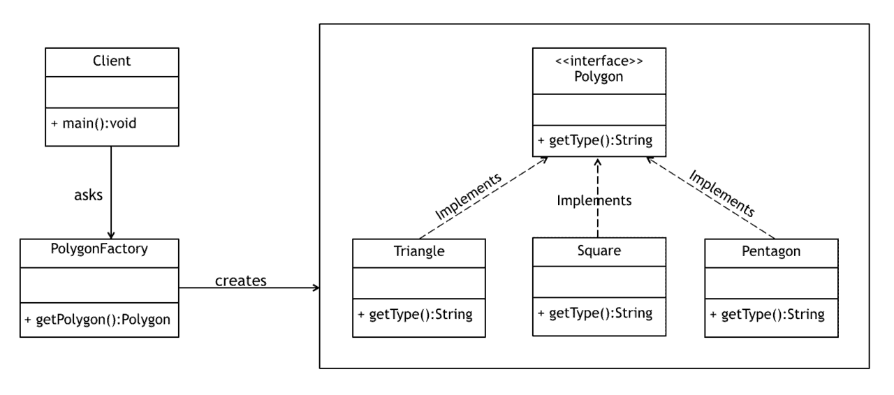

# [创造性设计模式简介](https://www.baeldung.com/creational-design-patterns)

1. 设计模式简介

    在软件工程中，"设计模式"（Design Pattern）描述的是软件设计中最常遇到的问题的既定解决方案。它代表了有经验的软件开发人员通过长期的试验和错误总结出的最佳实践。

    设计模式一书出版后，设计模式开始流行起来： 这本书由 Erich Gamma、John Vlissides、Ralph Johnson 和 Richard Helm（又称"四人帮"或 GoF）于 1994 年出版。

    在本文中，我们将探讨创造性设计模式及其类型。我们还将查看一些代码示例，并讨论在哪些情况下这些模式适合我们的设计。

2. 创造性设计模式

    创建设计模式关注对象的创建方式。它们通过有控制地创建对象来减少复杂性和不稳定性。

    新操作符通常被认为是有害的，因为它会将对象分散到整个应用程序中。随着时间的推移，由于类变得紧密耦合，改变实现方式会变得非常困难。

    创建设计模式通过将客户端与实际初始化过程完全解耦来解决这一问题。

    本文将讨论四种创建设计模式：

    - 单例(Singleton) - 确保整个应用程序中最多只有一个对象实例存在
    - 工厂方法(Factory Method) - 创建多个相关类的对象，无需指定要创建的确切对象
    - 抽象工厂(Abstract Factory) - 创建相关依赖对象族
    - 构建器(Builder) - 使用逐步方法构建复杂对象

    现在我们来详细讨论上述每种模式。

3. 单例设计模式

    单例设计模式旨在通过确保在整个 Java 虚拟机中只存在一个对象实例来检查特定类对象的初始化。

    单例类还为对象提供了一个唯一的全局访问点，因此每次对访问点的后续调用都只会返回该特定对象。

    1. 单例模式示例

        尽管 Singleton 模式是由 GoF 引入的，但众所周知，其原始实现在多线程情况下存在问题。

        因此，在这里我们将采用一种更优化的方法，即使用静态内部类：

        

        在这里，我们创建了一个静态内部类，用于保存 Singleton 类的实例。只有当有人调用 getInstance() 方法时，它才会创建实例，而不是在加载外层类时。

        对于 Singleton 类来说，这是一种广泛使用的方法，因为它不需要同步、线程安全、强制执行懒初始化，而且模板相对较少。

        此外，请注意构造函数具有私有访问修饰符。这是创建单例的必要条件，因为公共构造函数意味着任何人都可以访问它并开始创建新实例。

        请记住，这不是最初的 GoF 实现。有关原始版本，请访问 Baeldung 关于 Java 中的 Singletons 的链接文章。

    2. 何时使用单例设计模式

        - 对于创建成本较高的资源（如数据库连接对象）
        - 将所有日志记录器保持为单例是一种好的做法，可提高性能
        - 可访问应用程序配置设置的类
        - 包含以共享模式访问的资源的类

4. 工厂方法设计模式

    工厂设计模式或工厂方法设计模式是 Java 中最常用的设计模式之一。

    根据 GoF，该模式 "定义了创建对象的接口，但让子类决定实例化哪个类。工厂方法允许类将实例化推迟到子类中"。

    这种模式通过创建一种虚拟构造函数，将初始化类的责任从客户端委托给特定的工厂类。

    为此，我们依赖于一个工厂，它为我们提供对象，隐藏实际的实现细节。创建的对象可通过通用接口访问。

    1. 工厂方法设计模式示例

        在本示例中，我们将创建一个多边形接口，由多个具体类来实现。PolygonFactory 将用于从该系列中获取对象：

        

        首先创建 Polygon 接口：

        

        接下来，我们将创建一些实现，如正方形、三角形等，这些实现将实现此接口并返回 Polygon 类型的对象。

        现在我们可以创建一个工厂，将边数作为参数，并返回该接口的相应实现：

        

        请注意，客户端无需直接初始化对象，就可以依靠该工厂为我们提供合适的多边形。

    2. 何时使用工厂方法设计模式

        - 当预期接口或抽象类的实现会经常变化时
        - 当前的实现无法适应新的变化时
        - 初始化过程相对简单，构造函数只需要少量参数时

5. 抽象工厂设计模式

    在上一节中，我们看到了工厂方法设计模式如何用于创建与单个系列相关的对象。

    相比之下，抽象工厂设计模式用于创建相关或依赖对象的系列。它有时也被称为 "工厂中的工厂"。

    有关详细解释，请查看我们的抽象工厂[教程](https://www.baeldung.com/java-abstract-factory-pattern)。

6. 构建器设计模式

    构建器设计模式（Builder Design Pattern）是另一种创建模式，设计用于构建相对复杂的对象。

    当创建对象的复杂性增加时，构建器模式可以通过使用另一个对象（构建器）来构建对象，从而将实例化过程分离出来。

    然后，可以使用这种构建器，通过简单的逐步方法创建许多其他类似的表示法。

    1. 构造器模式示例

        GoF 最初引入的构建器设计模式侧重于抽象，在处理复杂对象时非常出色，但设计略显复杂。

        Joshua Bloch 在他的《Effective Java》一书中介绍了构建器模式的改进版本，该版本简洁、可读性高（因为它使用了[流畅设计](https://en.wikipedia.org/wiki/Fluent_interface)），而且从客户的角度来看易于使用。在本例中，我们将讨论该版本。

        本例中只有一个类，即 BankAccount，它包含一个作为静态内部类的构建器：

        

        请注意，由于我们不希望外部对象直接访问这些字段，因此字段上的所有访问修饰符都声明为私有。

        构造函数也是私有的，因此只有分配给该类的 Builder 才能访问它。构造函数中设置的所有属性都是从我们作为参数提供的生成器对象中提取的。

        我们在一个静态内部类中定义了 BankAccountBuilder 。

        请注意，我们声明了与外层类相同的字段集。任何必填字段都必须作为内部类构造函数的参数，而其余可选字段可使用设置器方法指定。

        通过让设置器方法返回构建器对象，该实现还支持流畅的设计方法。

        最后，构建方法会调用外层类的私有构造函数，并将自身作为参数传递。返回的 BankAccount 将使用 BankAccountBuilder 设置的参数进行实例化。

        让我们来看一个构建器模式的快速示例：

        ```java
        BankAccount newAccount = new BankAccount
        .BankAccountBuilder("Jon", "22738022275")
        .withEmail("jon@example.com")
        .wantNewsletter(true)
        .build();
        ```

    2. 何时使用生成器模式

        - 当创建对象的过程极其复杂，包含大量必选和可选参数时
        - 当构造函数参数的增加导致构造函数列表过大时
        - 当客户希望所构造的对象有不同的表现形式时

7. 结论

    在本文中，我们了解了 Java 中的创建设计模式。我们还讨论了它们的四种不同类型，即单例（Singleton）、工厂方法（Factory Method）、抽象工厂（Abstract Factory）和生成器模式（Builder Pattern），以及它们的优点、示例和使用时机。
