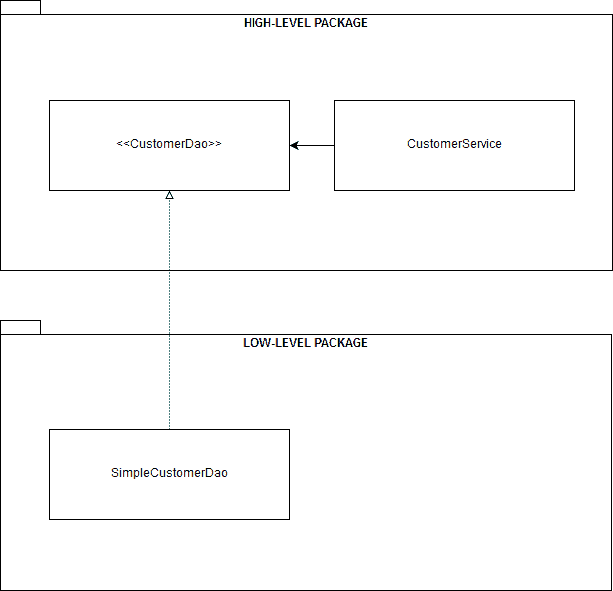
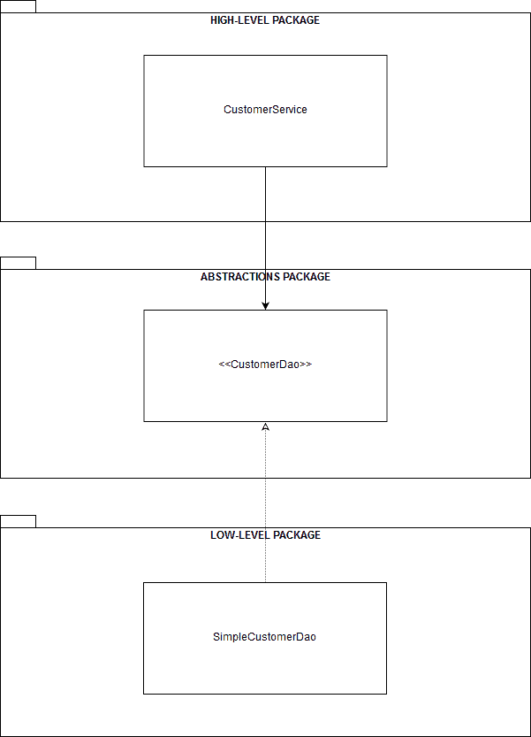
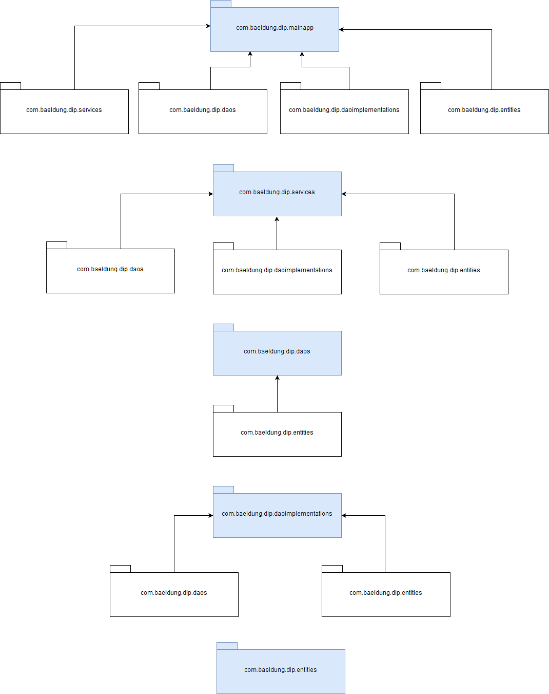

# [Java中的依赖反转原则](https://www.baeldung.com/java-dependency-inversion-principle)

1. 概述

    依赖反转原则（DIP）是俗称 SOLID 的面向对象编程原则集合的一部分。

    简而言之，DIP 是一种简单而强大的编程范式，我们可以利用它来实现结构良好、高度解耦和可重用的软件组件。

    在本教程中，我们将探索实现 DIP 的不同方法--一种是在 Java 8 中，另一种是在 Java 11 中使用 [JPMS](https://www.baeldung.com/java-9-modularity)（Java Platform Module System，Java 平台模块系统）。

2. 依赖注入和反转控制不是 DIP 实现

    首先，让我们从根本上区分一下，以正确理解基本原理：DIP 既不是依赖注入（DI），也不是控制反转（IoC）。即便如此，它们在一起也能发挥巨大作用。

    简单地说，依赖注入就是让软件组件通过其应用程序接口（API）明确声明其依赖关系或协作者，而不是自行获取。

    如果没有 DI，软件组件之间就会紧密耦合。因此，它们很难被重用、替换、模拟和测试，从而导致设计僵化。

    有了 DI，提供组件依赖关系和连接对象图的责任就从组件转移到了底层注入框架。从这个角度看，DI 只是实现 IoC 的一种方法。

    另一方面，IoC 是一种反向控制应用程序流程的模式。在传统编程方法中，我们的自定义代码控制着应用程序的流程。相反，使用 IoC 时，控制权转移到外部框架或容器。

    框架是一个可扩展的代码库，它定义了用于插入我们自己代码的钩点。

    反过来，框架通过一个或多个专门的子类、使用接口的实现以及注解来回调我们的代码。Spring 框架就是最后一种方法的典范。

3. DIP 的基本原理

    要了解 DIP 背后的动机，让我们从罗伯特-C-马丁（Robert C. Martin）在其著作《[敏捷软件开发：原则、模式和实践](https://www.pearson.com/us/higher-education/program/Martin-Agile-Software-Development-Principles-Patterns-and-Practices/PGM272869.html)》中给出的 DIP 正式定义开始：

    - 高层模块不应依赖于低层模块。两者都应依赖于抽象。
    - 抽象不应依赖于细节。细节应该依赖于抽象。

    因此，很明显，DIP 的核心是通过抽象掉高层组件和低层组件之间的交互，从而颠倒它们之间的传统依赖关系。

    在传统的软件开发中，高级组件依赖于低级组件。因此，很难重用高层组件。

    1. 设计选择和 DIP

        让我们考虑一个简单的 StringProcessor 类，它使用 StringReader 组件获取字符串值，并使用 StringWriter 组件将其写入其他地方：

        ```java
        public class StringProcessor {
            private final StringReader stringReader;
            private final StringWriter stringWriter;
            public StringProcessor(StringReader stringReader, StringWriter stringWriter) {
                this.stringReader = stringReader;
                this.stringWriter = stringWriter;
            }
            public void printString() {
                stringWriter.write(stringReader.getValue());
            }
        }
        ```

        虽然 StringProcessor 类的实现是基本的，但我们可以在这里做出几种设计选择。

        让我们将每个设计选择分解成不同的项目，以便清楚地了解每个项目会如何影响整体设计：

        1. StringReader 和 StringWriter 作为底层组件，是放置在同一个包中的具体类。高级组件 StringProcessor 放在不同的软件包中。StringProcessor 依赖于 StringReader 和 StringWriter。由于不存在反向依赖关系，因此 StringProcessor 无法在不同的上下文中重复使用。
        2. StringReader 和 StringWriter 是接口，与实现放在同一个软件包中。StringProcessor 现在依赖于抽象，但底层组件不依赖于抽象。我们还没有实现依赖关系的反转。
        3. StringReader 和 StringWriter 是与 StringProcessor 放在同一个包中的接口。现在，StringProcessor 明确拥有抽象的所有权。StringProcessor、StringReader 和 StringWriter 都依赖于抽象。通过抽象组件之间的交互，我们实现了从上到下的反向依赖。StringProcessor 现在可以在不同的上下文中重复使用。
        4. StringReader 和 StringWriter 是与 StringProcessor 分开的接口。我们实现了依赖关系的反转，也更容易替换 StringReader 和 StringWriter 的实现。StringProcessor 也可以在不同的上下文中重复使用。

        在上述所有情况中，只有第 3 项和第 4 项是 DIP 的有效实现。

    2. 定义抽象的所有权

        第 c. 项是直接 DIP 实现，即高层组件和抽象组件放在同一个软件包中。因此，高层组件拥有抽象。在这种实现方式中，高层组件负责定义与低层组件交互的抽象协议。

        同样，第 d. 项是一种更加去耦的 DIP 实现。在这种模式的变体中，高层组件和低层组件都不拥有抽象协议的所有权。

        抽象被放置在一个单独的层中，这有利于切换低层组件。同时，所有组件都相互隔离，从而产生更强的封装性。

    3. 选择正确的抽象层次

        在大多数情况下，选择高层组件使用的抽象应该是相当简单的，但有一点值得注意：抽象的层次。

        在上面的例子中，我们使用 DI 将 StringReader 类型注入到 StringProcessor 类中。只要 StringReader 的抽象层次与 StringProcessor 的领域接近，这种方法就会有效。

        相比之下，如果 StringReader 是一个从文件中读取字符串值的 [File](https://www.baeldung.com/java-how-to-create-a-file) 对象，我们就会失去 DIP 的固有优势。在这种情况下，StringReader 的抽象级别将远远低于 StringProcessor 的域级别。

        简单地说，高层组件与低层组件互操作时所使用的抽象层次应始终接近前者的领域。

4. Java 8 实现

    我们已经深入研究了 DIP 的关键概念，现在我们来探讨 Java 8 中该模式的一些实际实现。

    1. 直接 DIP 实现

        让我们创建一个演示应用程序，从持久层获取一些客户，并以其他方式对其进行处理。

        持久层的底层存储通常是数据库，但为了保持代码的简洁，这里我们将使用普通的 Map。

        让我们从定义高级组件开始：

        main/.dip.services/CustomerService.java

        我们可以看到，CustomerService 类实现了 findById() 和 findAll() 方法，这两个方法使用简单的 DAO 实现从持久层获取客户。当然，我们本可以在类中封装更多的功能，但为了简单起见，我们还是这样做吧。

        在本例中，CustomerDao 类型是 CustomerService 用来消费底层组件的抽象。

        由于这是一个直接的 DIP 实现，让我们把这个抽象定义为 CustomerService 包中的一个接口：

        main/.dip.services/CustomerDao.java

        通过将抽象放到高级组件的同一个包中，我们让组件负责拥有抽象。这一实现细节真正颠倒了高级组件和低级组件之间的依赖关系。

        此外，CustomerDao 的抽象层次与 CustomerService 的抽象层次接近，这也是良好的 DIP 实现所必需的。

        现在，让我们在另一个包中创建低级组件。在本例中，它只是一个基本的 CustomerDao 实现：

        main/.dip.services/SimpleCustomerDao.java

        最后，让我们创建一个单元测试来检查 CustomerService 类的功能：

        test/.dip.tests/CustomerServiceUnitTest.java:

        该单元测试对 CustomerService API 进行了练习。此外，它还展示了如何手动将抽象注入高级组件。在大多数情况下，我们会使用某种 DI 容器或框架来实现这一点。

        此外，下图从高层到底层包的角度展示了演示应用程序的结构：

        

    2. 替代 DIP 实现

        正如我们之前所讨论的，也可以使用另一种 DIP 实现，即把高级组件、抽象组件和低级组件放在不同的包中。

        由于显而易见的原因，这种变体更加灵活，能更好地封装组件，也更容易替换低级组件。

        当然，实现该模式的这一变体只需将 CustomerService、MapCustomerDao 和 CustomerDao 放在不同的包中即可。

        因此，只需一张图就足以显示每个组件在这种实现方式下是如何布局的：

        

5. Java 11 模块化实现

    将我们的演示应用程序重构为模块化应用程序非常简单。

    这是展示 JPMS 如何通过 DIP 执行最佳编程实践（包括强大的封装、抽象和组件重用）的一种非常好的方式。

    我们不需要从头开始重新实现我们的示例组件。因此，只需将每个组件文件连同相应的模块描述符放在一个单独的模块中，就能将示例应用程序模块化。

    下面是模块化项目的结构：

    ```text
    project base directory (could be anything, like dipmodular)
    |- com.baeldung.dip.services
    module-info.java
       |- com
        |- baeldung
            |- dip
            |- services
                CustomerService.java
    |- com.baeldung.dip.daos
    module-info.java
       |- com
        |- baeldung
            |- dip
            |- daos
                CustomerDao.java
    |- com.baeldung.dip.daoimplementations 
        module-info.java 
        |- com 
            |- baeldung 
            |- dip 
                |- daoimplementations 
                SimpleCustomerDao.java  
    |- com.baeldung.dip.entities
        module-info.java
        |- com
            |- baeldung
            |- dip
                |- entities
                Customer.java
    |- com.baeldung.dip.mainapp 
        module-info.java 
        |- com 
            |- baeldung 
            |- dip 
                |- mainapp
                MainApplication.java
    ```

    1. 高级组件模块

        我们先将 CustomerService 类放入自己的模块中。

        我们将在根目录 com.baeldung.dip.services 中创建该模块，并添加模块描述符 module-info.java。

        由于显而易见的原因，我们不会详细介绍 JPMS 是如何工作的。即便如此，通过查看 requirements 指令，我们还是可以清楚地看到模块的依赖关系。

        这里最值得注意的细节是 uses 指令。它说明该模块是一个客户端模块，需要使用 CustomerDao 接口的实现。

        当然，我们仍然需要在该模块中放置高级组件 CustomerService 类。因此，在 com.baeldung.dip.services 根目录下，我们创建以下类似软件包的目录结构：com/baeldung/dip/services。

        最后，将 CustomerService.java 文件放入该目录。

    2. 抽象模块

        同样，我们需要将 CustomerDao 接口放在自己的模块中。因此，我们在根目录 com.baeldung.dip.daos 中创建该模块，并添加模块描述符 module-info.java。

        现在，让我们导航到 com.baeldung.dip.daos 目录，并创建以下目录结构：com/baeldung/dip/daos。将 CustomerDao.java 文件放入该目录。

    3. 底层组件模块

        从逻辑上讲，我们也需要将底层组件 SimpleCustomerDao 放在一个单独的模块中。不出所料，这个过程与我们刚才处理其他模块的过程非常相似。

        让我们在根目录 com.baeldung.dip.daoimplementations 中创建新模块，并包含模块描述符 module-info.java。

        在 JPMS 上下文中，这是一个服务提供者模块，因为它声明了 provides 和 with 指令。

        在这种情况下，该模块通过 SimpleCustomerDao 实现将 CustomerDao 服务提供给一个或多个消费者模块。

        请记住，我们的消费者模块 com.baeldung.dip.services 是通过 uses 指令来消费该服务的。

        这清楚地表明，只需在不同的模块中定义消费者、服务提供者和抽象，就可以通过 JPMS 直接实现 DIP，这是多么简单的事情。

        同样，我们需要将 SimpleCustomerDao.java 文件放到这个新模块中。让我们导航到 com.baeldung.dip.daoimplementations 目录，并创建一个新的类似软件包的目录结构，命名为：com/baeldung/dip/daoimplementations。

        最后，将 SimpleCustomerDao.java 文件放入该目录。

    4. 实体模块

        此外，我们还必须创建另一个模块，在其中放置 Customer.java 类。与之前一样，创建根目录 com.baeldung.dip.entities，并包含模块描述符 module-info.java。

        在包的根目录下，创建 com/baeldung/dip/entities 目录，并添加以下 Customer.java 文件。

    5. 主应用程序模块

        接下来，我们需要创建一个附加模块，用于定义演示程序的入口点。因此，让我们创建另一个根目录 com.baeldung.dip.mainapp，并在其中放置模块描述符 module-info.java。

        现在，让我们导航到模块的根目录，并创建以下目录结构：com/baeldung/dip/mainapp。在该目录中，我们添加一个 MainApplication.java 文件，它只需实现一个 main() 方法。

        最后，让我们在集成开发环境或命令控制台中编译并运行演示应用程序。

        不出所料，当应用程序启动时，我们会在控制台中看到一个客户对象列表：

        ```log
        Customer{name=John}
        Customer{name=Susan}
        ```

        此外，下图显示了应用程序各模块的依赖关系：

        

6. 结论

    在本教程中，我们深入探讨了 DIP 的关键概念，还展示了该模式在 Java 8 和 Java 11 中的不同实现，后者使用了 JPMS。

    GitHub 上提供了 [Java 8 DIP](/patterns-modules/dip) 实现和 [Java 11](/patterns-modules/dipmodular) 实现的所有示例。
