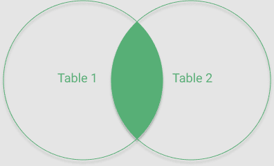
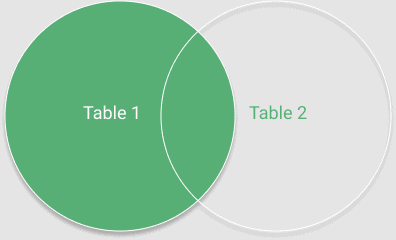
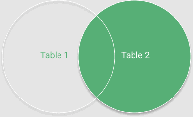
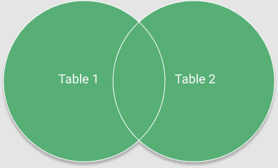

# [SQL 连接的类型](https://www.baeldung.com/sql-joins)

1. 简介

    在本教程中，我们将展示不同类型的 SQL 连接，以及如何在 Java 中轻松实现这些连接。

2. 定义模型

    让我们先创建两个简单的表：

    ```sql
    CREATE TABLE AUTHOR
    (
    ID int NOT NULL PRIMARY KEY,
    FIRST_NAME varchar(255),
    LAST_NAME varchar(255)
    );

    CREATE TABLE ARTICLE
    (
    ID int NOT NULL PRIMARY KEY,
    TITLE varchar(255) NOT NULL,
    AUTHOR_ID int,
    FOREIGN KEY(AUTHOR_ID) REFERENCES AUTHOR(ID)
    );
    ```

    并用一些测试数据填充它们：

    ```sql
    INSERT INTO AUTHOR VALUES 
    (1, 'Siena', 'Kerr'),
    (2, 'Daniele', 'Ferguson'),
    (3, 'Luciano', 'Wise'),
    (4, 'Jonas', 'Lugo');

    INSERT INTO ARTICLE VALUES
    (1, 'First steps in Java', 1),
    (2, 'SpringBoot tutorial', 1),
    (3, 'Java 12 insights', null),
    (4, 'SQL JOINS', 2),
    (5, 'Introduction to Spring Security', 3);
    ```

    请注意，在我们的示例数据集中，并非所有作者都有文章，反之亦然。这将在我们的示例中发挥重要作用，稍后我们将看到。

    让我们定义一个 POJO，在整个教程中我们将用它来存储 JOIN 操作的结果：

    main/.spring.jdbc.joins/ArticleWithAuthor.java

    在我们的示例中，我们将从 ARTICLE 表中提取标题，并从 AUTHOR 表中提取作者数据。

3. 配置

    在示例中，我们将使用运行于 5432 端口的 PostgreSQL 外部数据库。除了 MySQL 和 H2 都不支持的 FULL JOIN 外，所有提供的代码段都应适用于任何 SQL 提供商。

    对于我们的 Java 实现，我们需要一个 [PostgreSQL驱动程序](https://mvnrepository.com/artifact/org.postgresql/postgresql)：

    ```xml
    <dependency>
        <groupId>org.postgresql</groupId>
        <artifactId>postgresql</artifactId>
        <version>42.5.4</version>
        <scope>test</scope>
    </dependency>
    ```

    让我们先配置一个 java.sql.Connection 来与我们的数据库协同工作：

    ```java
    Class.forName("org.postgresql.Driver");
    Connection connection = DriverManager.
    getConnection("jdbc:postgresql://localhost:5432/myDb", "user", "pass");
    ```

    接下来，让我们创建一个 DAO 类和一些实用方法：

    main/.spring.jdbc.joins/ArticleWithAuthorDAO.java

    在本文中，我们不会深入讨论使用 [ResultSet](https://www.baeldung.com/jdbc-resultset)、Statement 和 Connection 的细节。这些主题已在我们的 [JDBC](https://www.baeldung.com/java-jdbc) 相关文章中涉及。

    让我们从下面的章节开始探索 SQL 连接。

4. 内连接

    让我们从可能是最简单的连接类型开始。内连接是从两个表中选择符合所提供条件的记录的操作。查询至少包括三个部分：选择列、连接表和连接条件。

    考虑到这一点，语法本身就变得非常简单了：

    ```sql
    SELECT ARTICLE.TITLE, AUTHOR.LAST_NAME, AUTHOR.FIRST_NAME
    FROM ARTICLE INNER JOIN AUTHOR 
    ON AUTHOR.ID=ARTICLE.AUTHOR_ID
    ```

    我们还可以将 INNER JOIN 的结果作为交集的常见部分加以说明：

    

    现在让我们在 ArticleWithAuthorDAO 类中实现 INNER JOIN 方法：

    main/.spring.jdbc.joins/ArticleWithAuthorDAO.java:articleInnerJoinAuthor()

    并进行测试：

    test/.spring.jdbc.joins/ArticleWithAuthorDAOLiveTest.java:whenQueryWithInnerJoin_thenShouldReturnProperRows()

    如前所述，INNER JOIN 只根据提供的条件选择共同的记录。查看我们的插入信息，可以发现有一条没有作者的文章和一条没有文章的作者。由于这些行不符合所提供的条件，因此被跳过。因此，我们检索到四条连接结果，其中没有一条是空作者数据或空标题。

5. 左连接

    接下来，让我们关注左连接。这种连接会选择第一个表中的所有记录，并匹配第二个表中的相应记录。如果不匹配，列中就会填入空值。

    在深入了解 Java 实现之前，让我们先看看左连接的图形表示：

    

    在这种情况下，LEFT JOIN 的结果包括代表第一个表的集合中的每一条记录和第二个表中的交叉值。

    现在，让我们来看看 Java 的实现：

    main/.spring.jdbc.joins/ArticleWithAuthorDAO.java:articleLeftJoinAuthor()

    与前一个示例的唯一区别是，我们使用了 LEFT 关键字，而不是 INNER 关键字。

    在测试 LEFT JOIN 方法之前，让我们再次看看我们的插入操作。在这种情况下，我们将从 ARTICLE 表中接收所有记录，并从 AUTHOR 表中接收与之匹配的记录。正如我们之前提到的，并非每篇文章都有作者，因此我们希望用空值来代替作者数据：

    test/.spring.jdbc.joins/ArticleWithAuthorDAOLiveTest.java:whenQueryWithLeftJoin_thenShouldReturnProperRows()

6. 右连接

    右连接与左连接很相似，但它会返回第二个表中的所有记录，并匹配第一个表中的记录。与 LEFT JOIN 一样，空匹配会被空值替换。

    这种连接的图形表示法与我们为左连接所作的说明如出一辙：

    

    让我们用 Java 实现右连接：

    main/.spring.jdbc.joins/ArticleWithAuthorDAO.java:articleRightJoinAuthor()

    我们再来看看测试数据。由于此连接操作会检索第二个表中的所有记录，我们预计会检索五行，而且由于不是每个作者都写过文章，我们预计 TITLE 列中会出现一些空值：

    test/.spring.jdbc.joins/ArticleWithAuthorDAOLiveTest.java:whenQueryWithRightJoin_thenShouldReturnProperRows()

7. 全外连接

    这种连接操作可能是最棘手的。无论条件是否满足，全外连接都会选择第一个表和第二个表中的所有记录。

    我们也可以将相同的想法表示为从每个相交集合中选择所有值：

    

    让我们看看 Java 的实现：

    main/.spring.jdbc.joins/ArticleWithAuthorDAO.java:articleOuterJoinAuthor()

    现在，我们可以测试我们的方法了：

    test/.spring.jdbc.joins/ArticleWithAuthorDAOLiveTest.java:whenQueryWithFullJoin_thenShouldReturnProperRows()

    再来看看测试数据。我们有五篇不同的文章，其中一篇没有作者，还有四位作者，其中一位没有指定文章。通过 FULL JOIN，我们预计将检索到六条记录。其中四条相互匹配，其余两条不匹配。因此，我们还假设至少有一条记录的 AUTHOR 数据列和 TITLE 列均为空值。

8. 结论

    在本文中，我们探讨了 SQL 连接的基本类型。我们查看了四种连接类型的示例以及如何在 Java 中实现这些连接。
