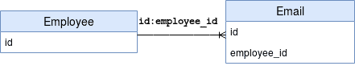

# [@JoinColumn和mappedBy之间的区别](https://www.baeldung.com/jpa-joincolumn-vs-mappedby)

1. 一览表

    JPA关系可以是单向的，也可以是双向的。这只是意味着我们可以将它们建模为其中一个关联实体或两个实体的属性。

    定义实体之间关系的方向对数据库映射没有影响。它只定义了我们在域模型中使用该关系的方向。

    对于双向关系，我们通常定义

    - 拥有方
    - 反向或或引用方

    @JoinColumn注释有助于我们指定用于加入实体关联或元素集合的列。另一方面，mappedBy属性用于定义关系的引用方（非拥有方）。

    在这个快速教程中，我们将看看JPA中@JoinColumn和mappedBy之间的区别。我们还将介绍如何在一对多关联中使用它们。

2. 初始设置

    为了遵循本教程，假设我们有两个实体：员工和电子邮件。

    显然，员工可以有多个电子邮件地址。然而，给定的电子邮件地址可能完全属于一名员工。

    这意味着他们共享一对多关联：

    

    同样在我们的RDBMS模型中，我们的电子邮件实体中将有一个外来键employee_id，引用anEmployee的id属性。

3. @JoinColumn注释

    在一对一/多对一的关系中，拥有方通常在关系的多面上定义。通常是拥有外键的一方。

    @JoinColumn注释定义了拥有方的实际物理映射：

    ```java
    @Entity
    public class Email {

        @Id
        @GeneratedValue(strategy = GenerationType.AUTO)
        private Long id;

        @ManyToOne(fetch = FetchType.LAZY)
        @JoinColumn(name = "employee_id")
        private Employee employee;

        // ...

    }
    ```

    这只是意味着我们的电子邮件实体将有一个名为employee_id的外键列，该列指的是我们员工实体的主要属性id。

4. 映射属性

    一旦我们定义了关系的拥有方，Hibernate就已经拥有了在我们的数据库中映射该关系所需的所有信息。

    要使这种关联成为双向的，我们所要做的就是定义引用方。反向或参考侧只是映射到拥有方。

    我们可以轻松地使用@OneToMany注释的mappedBy属性来做到这一点。

    所以，让我们定义一下我们的员工实体：

    ```java
    @Entity
    public class Employee {

        @Id
        @GeneratedValue(strategy = GenerationType.AUTO)
        private Long id;

        @OneToMany(fetch = FetchType.LAZY, mappedBy = "employee")
        private List<Email> emails;
        
        // ...
    }
    ```

    在这里，mappedBy的值是拥有方关联映射属性的名称。有了这个，我们现在在员工和电子邮件实体之间建立了双向关联。

5. 结论

    在本文中，我们研究了@JoinColumn和mappedBy之间的区别，以及如何在一对多双向关系中使用它们。

    @JoinColumn注释定义了拥有方的实际物理映射。另一方面，引用侧是使用@OneToMany注释的mappedBy属性定义的。
