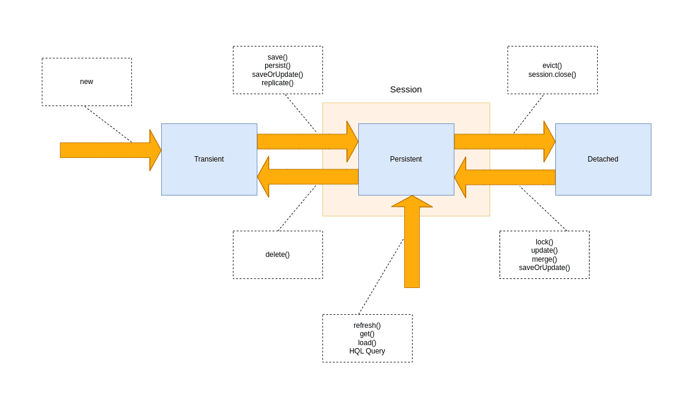

# [Hibernate：保存、持久、更新、合并、保存或更新](https://www.baeldung.com/hibernate-save-persist-update-merge-saveorupdate)

1. 介绍

    在本教程中，我们将讨论会话界面的几种方法之间的区别：保存、持久、更新、合并、保存或更新、刷新和复制。

    这不是Hibernate的介绍，我们应该已经了解配置、对象关系映射和使用实体实例的基础知识。有关Hibernate的介绍性文章，请访问我们关于Hibernate 4 with Spring的[教程](https://www.baeldung.com/hibernate-4-spring)。

2. 会话作为持久性上下文实现

    [Session](http://docs.jboss.org/hibernate/orm/5.2/javadocs/org/hibernate/Session.html)接口有几种最终将数据保存到数据库的方法：[persist](http://docs.jboss.org/hibernate/orm/5.2/javadocs/org/hibernate/Session.html#persist-java.lang.Object-)、[save](http://docs.jboss.org/hibernate/orm/5.2/javadocs/org/hibernate/Session.html#save-java.lang.Object-)、[update](http://docs.jboss.org/hibernate/orm/5.2/javadocs/org/hibernate/Session.html#update-java.lang.Object-)、[merge](http://docs.jboss.org/hibernate/orm/5.2/javadocs/org/hibernate/Session.html#merge-java.lang.Object-)和[saveOrUpdate](http://docs.jboss.org/hibernate/orm/5.2/javadocs/org/hibernate/Session.html#saveOrUpdate-java.lang.Object-)。为了理解这些方法之间的区别，我们必须首先讨论会话作为持久性上下文的目的，以及与会话相关的实体实例状态之间的差异。

    我们还应该了解Hibernate的开发历史，这导致了一些部分重复的API方法。

    1. 管理实体实例

        除了对象关系映射本身外，Hibernate解决的问题之一是在运行时管理实体的问题。“坚持性上下文”的概念是Hibernate解决这个问题的办法。我们可以将持久性上下文视为我们在会话期间加载或保存到数据库的所有对象的容器或一级缓存。

        会话是一个逻辑事务，其边界由应用程序的业务逻辑定义。当我们通过持久性上下文与数据库合作时，并且我们所有的实体实例都附加到此上下文中，我们应该始终为会话期间与之交互的每个数据库记录提供单个实体实例。

        在Hibernate中，持久上下文由[org.hibernate.Session](http://docs.jboss.org/hibernate/orm/5.2/javadocs/org/hibernate/Session.html)实例表示。对于JPA来说，它是[jakarta.persistence.EntityManager](http://docs.oracle.com/javaee/7/api/javax/persistence/EntityManager.html)。当我们使用Hibernate作为JPA提供程序，并通过EntityManager接口操作时，该接口的实现基本上会包装底层会话对象。然而，HibernateSession提供了一个更丰富的界面，具有更多的可能性，因此有时直接与Session合作是有用的。

    2. 实体实例状态

        我们应用程序中的任何实体实例都以与会话持久性上下文相关的三种主要状态之一出现：

        - 瞬态(transient)——此实例没有，也从未附加到会话中。此实例在数据库中没有相应的行；它通常只是我们为保存到数据库而创建的新对象。
        - 持久性(persistent)——此实例与唯一的会话对象相关联。将会话刷新到数据库时，保证此实体在数据库中拥有相应的一致记录。
        - 分离(detached)——此实例曾经附加到会话（处于持久状态），但现在不是了。如果我们将其从上下文中驱逐，清除或关闭会话，或将实例通过序列化/反序列化过程，实例将进入此状态。

        这是一个简化的状态图，上面对使状态转换发生的会话方法有注释：

        

        当实体实例处于持久状态时，我们对此实例的映射字段所做的所有更改将在刷新会话时应用于相应的数据库记录和字段。持久实例是“online”，而分离实例是“offline”，不会监控更改。

        这意味着，当我们更改持久对象的字段时，我们不必调用保存、更新或任何这些方法来获取数据库的这些更改。我们只需要提交交易、刷新会话或关闭会话。

    3. 符合JPA规范

        Hibernate是最成功的Java ORM实现。因此，Hibernate API严重影响了Java持久性API（JPA）的规格。不幸的是，也有很多差异，有些是大的，有些是更微妙的。

        为了作为JPA标准的实现，必须修改Hibernate API。为了匹配EntityManager接口，在会话接口中添加了几种方法。这些方法与原始方法具有相同的目的，但符合规范，因此存在一些差异。

3. 操作之间的差异

    重要的是从一开始就要明白，所有方法（persist、save、update、merge、saveOrUpdate）不会立即产生相应的SQL UPDATE或INSERT语句。在提交事务或刷新会话时，将数据实际保存到数据库中。

    上述方法基本上通过在生命周期的不同状态之间转换实体实例来管理实体实例的状态。

    例如，我们将使用一个简单的注释映射实体，Person：

    ```java
    @Entity
    public class Person {

        @Id
        @GeneratedValue
        private Long id;

        private String name;

        // ... getters and setters

    }
    ```

    1. Persist

        持久方法旨在将一个新的实体实例添加到持久性上下文中，即将实例从瞬态过渡到持久状态。

        当我们想将记录添加到数据库（坚持实体实例）时，我们通常会调用它：

        ```java
        Person person = new Person();
        person.setName("John");
        session.persist(person);
        ```

        我们调用持久方法后会发生什么？人对象已经从瞬态过渡到持久状态。对象现在处于持久性上下文中，但尚未保存到数据库中。只有在提交事务、刷新或关闭会话时，才会生成INSERT语句。

        请注意，持久方法具有无效返回类型。它在“原地”传递的对象上运行，改变其状态。人称变量引用实际持久的对象。

        此方法是会话接口的后期添加。该方法的主要差异化特征是它符合JSR-220规范（EJB持久性）。我们在规范中严格定义了该方法的语义，该规范基本上指出，瞬态实例变得持久（操作级联到其与cascade=PERSIST或cascade=ALL的所有关系）：

        - 如果实例已经持久，那么此调用对该特定实例没有影响（但它仍然会级联到其与cascade=PERSIST或cascade=ALL的关系）。
        - 如果实例被分离，我们将在调用此方法时或提交或刷新会话时获得异常。

        请注意，这里没有与实例的标识符有关的东西。规范没有说明id将立即生成，无论id生成策略如何。持久方法的规范允许实现发布语句，以在提交或刷新时生成id。调用此方法后，id不一定非空，因此我们不应该依赖它。

        我们可能会在已经持久的实例上调用此方法，但什么也没有发生。但是，如果我们尝试持续一个分离的实例，实现将抛出一个异常。在以下示例中，我们将持久化实体，将其从上下文中驱逐出，使其分离，然后尝试再次持久化。第二次调用session.persist（）会导致异常，因此以下代码将不起作用：

        ```java
        Person person = new Person();
        person.setName("John");
        session.persist(person);

        session.evict(person);

        session.persist(person); // PersistenceException!
        ```

    2. Save

        保存方法是一种不符合JPA规范的“original”Hibernate方法。

        它的目的基本上与坚持相同，但它有不同的实现细节。此方法的文档严格规定，它坚持实例，“首先分配生成的标识符。”该方法将返回此标识符的可序列化值：

        ```java
        Person person = new Person();
        person.setName("John");
        Long id = (Long) session.save(person);
        ```

        保存已持久的实例的效果与持久的实例的效果相同。当我们尝试保存分离的实例时，就会出现差异：

        ```java
        Person person = new Person();
        person.setName("John");
        Long id1 = (Long) session.save(person);

        session.evict(person);
        Long id2 = (Long) session.save(person);
        ```

        id2变量将与id1不同。分离实例的保存调用会创建一个新的持久实例，并为其分配一个新的标识符，这会导致在提交或刷新时在数据库中出现重复记录。

    3. Merge

        合并方法的主要目的是使用来自附加实体实例的新字段值更新持久实体实例。

        例如，假设我们有一个RESTful接口，该接口有一个方法，通过调用方的id检索JSON序列化对象，以及一个从调用方接收此对象的更新版本的方法。通过此类序列化/反序列化的实体将以分离状态出现。

        将此实体实例反序列化后，我们需要从持久上下文中获取持久实体实例，并使用此分离实例的新值更新其字段。所以合并方法正是这样做的：

        - 通过从传递对象中提取的id查找实体实例（要么从持久性上下文中检索现有实体实例，要么从数据库加载新实例）
        - 将传递对象的字段复制到此实例
        - 返回一个新更新的实例

        在以下示例中，我们从上下文中驱逐（分离）保存的实体，更改名称字段，然后合并分离的实体：

        ```java
        Person person = new Person();
        person.setName("John");
        session.save(person);

        session.evict(person);
        person.setName("Mary");

        Person mergedPerson = (Person) session.merge(person);
        ```

        请注意，合并方法返回一个对象。我们加载到持久性上下文中并更新的是合并的Person对象，而不是我们作为参数传递的person对象。它们是两个不同的物体，我们通常需要丢弃人物。

        与持久方法一样，JSR-220指定了合并方法，具有我们可以依赖的某些语义：

        - 如果实体被分离，它将复制到现有的持久实体上。
        - 如果实体是瞬态的，它会复制到新创建的持久实体上。
        - 此操作对cascade=MERGE或cascade=ALL映射的所有关系进行级联。
        - 如果实体是持久的，那么此方法调用不会对它产生影响（但级联仍然发生）。

    4. Update

        与持久和保存一样，更新方法是“original”休眠方法。它的语义在几个关键点上有所不同：

        - 它作用于传递的对象（其返回类型为无效）。更新方法将传递的对象从附加状态过渡到持久状态。
        - 如果我们传递一个瞬态实体，此方法会抛出异常。

        在以下示例中，我们保存对象，将其从上下文中驱逐（分离），然后更改其名称并调用更新。请注意，我们不会将更新操作的结果放在一个单独的变量中，因为更新发生在人员对象本身上。基本上，我们正在将现有实体实例重新附加到持久性上下文中，这是JPA规范不允许我们做的事情：

        ```java
        Person person = new Person();
        person.setName("John");
        session.save(person);
        session.evict(person);

        person.setName("Mary");
        session.update(person);
        ```

        尝试在瞬态实例上调用更新将导致异常。以下将不起作用：

        ```java
        Person person = new Person();
        person.setName("John");
        session.update(person); // PersistenceException!
        ```

    5. SaveOrUpdate

        此方法仅出现在Hibernate API中，没有标准化的对应物。与更新类似，我们也可以用它来重新附加实例。

        实际上，处理更新方法的内部DefaultUpdateEventListener类是DefaultSaveOrUpdateListener的子类，只是覆盖了一些功能。saveOrUpdate方法的主要区别在于，当应用于瞬态实例时，它不会抛出异常，而是使这个瞬态实例持久。以下代码将持续新创建的Person实例：

        ```java
        Person person = new Person();
        person.setName("John");
        session.saveOrUpdate(person);
        ```

        我们可以将这种方法视为一种通用工具，使对象持久，无论其状态如何，无论是瞬态还是分离。

    6. Refresh

        刷新方法出现在Hibernate API和JPA中。顾名思义，调用刷新方法来刷新处于持久状态的实体，从而将其与数据库中的行同步。

        调用刷新方法会覆盖对实体所做的任何更改。当使用数据库触发器初始化对象的一些属性时，这很有用。让我们看看一个快速代码示例，该示例将刷新新保存的Person实例：

        ```java
        Person person = new Person();
        person.setName("John");
        session.save(person);
        session.flush();
        session.refresh(person);
        ```

        这将重新加载人员对象及其所有相关对象和集合，以便刷新已保存的对象后触发的任何修改都会重新加载。

        需要注意的是，刷新与合并有何不同：刷新刷新使用数据库中的版本刷新持久性上下文中的实体，而合并使用持久性上下文中的版本更新数据库内的实体。

    7. Replicate

        复制方法仅在Hibernate API中可用，不是JPA的EntityManager接口的一部分。我们还应该注意，自Hibernate 6.0版本以来，此方法已被弃用，没有替代品。

        有时，我们可能需要加载持久实例的图形，并在不重新生成标识符值的情况下将其复制到另一个数据存储中。这就是复制方法发挥作用的地方：

        ```java
        Session session1 = factory1.openSession();
        Person p = session1.get(Person.class, id);
        Session session2 = factory2.openSession();
        session2.replicate(p, ReplicationMode.LATEST_VERSION);
        ```

        复制模式决定了复制将如何处理与数据库中现有行的冲突：

        - ReplicationMode.IGNORE：当现有具有相同标识符的数据库行时，忽略对象。
        - ReplicationMode.OVERWRITE：用相同的标识符覆盖任何现有数据库行。
        - ReplicationMode.EXCEPTION：如果现有数据库行具有相同标识符，则抛出异常。
        - ReplicationMode.LATEST_VERSION：如果行的版本号早于对象的版本号，则覆盖该行，否则将忽略该对象。

4. 用什么？

    如果我们没有任何特殊要求，我们应该坚持使用持久和合并方法，因为它们是标准化的，并将符合JPA规范。

    如果我们决定切换到另一个持久性提供程序，它们也是可移植的；然而，它们有时似乎不如“原始”的Hibernate方法、保存、更新和保存或更新那么有用。

5. 弃用的方法

    从Hibernate6开始，以下方法被标记为弃用，不鼓励使用：

    - save
    - update
    - saveOrUpdate

6. 结论

    在本文中，我们讨论了不同Hibernate Session方法在运行时管理持久实体的目的。我们了解了这些方法如何通过其生命周期传输实体实例，以及为什么其中一些方法具有重复功能。
