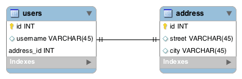
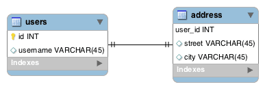
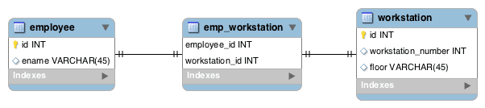

# [JPA中的一对一关系](https://www.baeldung.com/jpa-one-to-one)

1. 一览表

    在本教程中，我们将看看在JPA中创建一对一映射的不同方法。

    我们需要对Hibernate框架有基本的了解，因此请查看我们的Hibernate 5 with Spring指南以获取更多背景。

2. 描述

    假设我们正在构建一个用户管理系统，我们的老板要求我们为每个用户存储一个邮寄地址。用户将有一个邮寄地址，而一个邮寄地址将只有一个用户与之绑定。

    这是一个一对一关系的例子，在这种情况下，用户和地址实体之间。

    让我们看看我们如何在下一节中实现这一点。

3. 使用外键

    1. 使用外键进行建模

        让我们来看看下面的[ER图](https://www.baeldung.com/cs/erd)，它代表了基于外键的一对一映射：

        

        在本例中，用户中的address_id列是地址的[外键](https://en.wikipedia.org/wiki/Foreign_key)。

    2. 在JPA中使用外键实现

        首先，让我们创建用户类并适当地注释：

        ```java
        @Entity
        @Table(name = "users")
        public class User {
            
            @Id
            @GeneratedValue(strategy = GenerationType.AUTO)
            @Column(name = "id")
            private Long id;
            //... 

            @OneToOne(cascade = CascadeType.ALL)
            @JoinColumn(name = "address_id", referencedColumnName = "id")
            private Address address;

            // ... getters and setters
        }
        ```

        请注意，我们将@OneToOne注释放在相关实体字段地址上。

        此外，我们需要放置@JoinColumn注释，以配置用户表中映射到地址表中的主键的列名称。如果我们不提供名称，Hibernate将遵循一些[规则](http://docs.jboss.org/hibernate/jpa/2.2/api/javax/persistence/JoinColumn.html)来选择默认名称。

        最后，在下一个实体中注意，我们不会在那里使用@JoinColumn注释。这是因为我们只需要在外键关系的拥有方需要它。简单地说，无论谁拥有外来键列，都会获得@JoinColumn注释。

        地址实体变得简单一些：

        ```java
        @Entity
        @Table(name = "address")
        public class Address {

            @Id
            @GeneratedValue(strategy = GenerationType.AUTO)
            @Column(name = "id")
            private Long id;
            //...

            @OneToOne(mappedBy = "address")
            private User user;

            //... getters and setters
        }
        ```

        我们还需要在这里放置@OneToOne注释。那是因为这是双向关系。关系的地址侧被称为非拥有侧。

4. 使用共享主键

    1. 使用共享主密钥进行建模

        在此策略中，我们将地址表的主键列（user_id）标记为用户表的外键，而不是创建一个新列address_id：

        

        我们利用这些实体之间存在一对一关系这一事实，优化了存储空间。

    2. 在JPA中使用共享主密钥实现

        请注意，我们的定义只有轻微变化：

        ```java
        @Entity
        @Table(name = "users")
        public class User {

            @Id
            @GeneratedValue(strategy = GenerationType.AUTO)
            @Column(name = "id")
            private Long id;

            //...

            @OneToOne(mappedBy = "user", cascade = CascadeType.ALL)
            @PrimaryKeyJoinColumn
            private Address address;

            //... getters and setters
        }

        @Entity
        @Table(name = "address")
        public class Address {

            @Id
            @Column(name = "user_id")
            private Long id;

            //...

            @OneToOne
            @MapsId
            @JoinColumn(name = "user_id")
            private User user;
        
            //... getters and setters
        }
        ```

        mappedBy属性现在被移动到用户类，因为外来键现在出现在地址表中。我们还添加了@PrimaryKeyJoinColumn注释，该注释表明用户实体的主键被用作关联地址实体的外键值。

        我们仍然必须在地址类中定义一个@Id字段。但请注意，这引用了user_id列，它不再使用@GeneratedValue注释。此外，在引用用户的字段上，我们添加了@MapsId注释，该注释表示主键值将从用户实体复制。

5. 使用连接表

    一对一映射可以有两种类型：可选的和强制的。到目前为止，我们只看到了强制性关系。

    现在让我们想象一下，我们的员工与工作站相关联。这是一对一的，但有时员工可能没有工作站，反之亦然。

    1. 用连接表建模

        到目前为止，我们讨论的策略迫使我们在列中放置空值来处理可选关系。

        通常，当我们考虑连接表时，我们会想到多对多关系，但在这种情况下，使用连接表可以帮助我们消除这些空值：

        

        现在，每当我们有关系时，我们都会在emp_workstation表中进行条目，并完全避免空值。

    2. 在JPA中用加入表实现

        我们的第一个例子使用了@JoinColumn。这一次，我们将使用@JoinTable：

        ```java
        @Entity
        @Table(name = "employee")
        public class Employee {
            @Id
            @GeneratedValue(strategy = GenerationType.AUTO)
            @Column(name = "id")
            private Long id;

            //...

            @OneToOne(cascade = CascadeType.ALL)
            @JoinTable(name = "emp_workstation", 
            joinColumns = 
                { @JoinColumn(name = "employee_id", referencedColumnName = "id") },
            inverseJoinColumns = 
                { @JoinColumn(name = "workstation_id", referencedColumnName = "id") })
            private WorkStation workStation;

            //... getters and setters
        }

        @Entity
        @Table(name = "workstation")
        public class WorkStation {

            @Id
            @GeneratedValue(strategy = GenerationType.AUTO)
            @Column(name = "id")
            private Long id;

            //...

            @OneToOne(mappedBy = "workStation")
            private Employee employee;

            //... getters and setters
        }
        ```

        [@JoinTable](http://docs.jboss.org/hibernate/jpa/2.2/api/javax/persistence/JoinTable.html)指示Hibernate在维持关系的同时采用加入表策略。

        此外，员工是这种关系的所有者，因为我们选择在上面使用连接表注释。

6. 结论

    在本文中，我们学习了在JPA和Hibernate中保持一对一关联的不同方法，以及何时使用每种方法。
