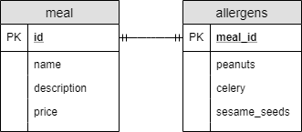

# [在JPA中将单个实体映射到多个表](https://www.baeldung.com/jpa-mapping-single-entity-to-multiple-tables)

1. 一览表

    [JPA](https://www.baeldung.com/the-persistence-layer-with-spring-and-jpa)使处理Java应用程序的关系数据库模型不那么痛苦。当我们将每个表映射到单个实体类时，事情就很简单了。

    但有时我们有理由以不同的方式对实体和表进行建模：

    - 当我们想要创建逻辑字段组时，我们可以将[多个类映射到单个表](https://www.baeldung.com/jpa-embedded-embeddable)中。
    - 如果涉及继承，我们可以将类层次结构映射到表结构。
    - 如果相关字段分散在多个表之间，我们希望用单个类对这些表进行建模

    在这个简短的教程中，我们将了解如何解决最后一个场景。

2. 数据模型

    假设我们经营一家餐厅，我们想存储我们供应的每顿饭的数据：

    - 姓名
    - 描述
    - 价格
    - 它含有什么样的过敏原

    由于有很多可能的过敏原，我们将把这些数据集分组在一起。

    此外，我们还将使用以下表格定义对此进行建模：

    

    现在让我们看看如何使用标准JPA注释将这些表映射到实体。

3. 创建多个实体

    最明显的解决方案是为两个类创建一个实体。

    让我们从定义MealWithMultipleEntities实体开始：

    ```java
    @Entity
    @Table(name = "meal")
    public class MealWithMultipleEntities {

        @Id
        @GeneratedValue(strategy = GenerationType.IDENTITY)
        @Column(name = "id")
        Long id;

        @Column(name = "name")
        String name;

        @Column(name = "description")
        String description;

        @Column(name = "price")
        BigDecimal price;

        @OneToOne(mappedBy = "meal")
        AllergensAsEntity allergens;

        // standard getters and setters
    }
    ```

    接下来，我们将添加AllergensAsEntity实体：

    ```java
    @Entity
    @Table(name = "allergens")
    class AllergensAsEntity {

        @Id
        @GeneratedValue(strategy = GenerationType.IDENTITY)
        @Column(name = "meal_id")
        Long mealId;

        @OneToOne
        @PrimaryKeyJoinColumn(name = "meal_id")
        Meal meal;

        @Column(name = "peanuts")
        boolean peanuts;

        @Column(name = "celery")
        boolean celery;

        @Column(name = "sesame_seeds")
        boolean sesameSeeds;

        // standard getters and setters
    }
    ```

    我们可以看到meal_id既是主键，也是外键。这意味着我们需要使用@PrimaryKeyJoinColumn来定义一对一关系列。

    然而，这个解决方案有两个问题：

    - 我们总是想在一餐中储存过敏原，而这个解决方案并没有执行这一规则。
    - 膳食和過敏原数据在逻辑上是一起的。因此，即使我们为它们创建了多个表，我们也可能希望将此信息存储在同一Java类中。

    第一个问题的一个可能解决方案是将@NotNull注释添加到我们的MealWithMultipleEntities实体上的过敏原字段中。如果我们有nullAllergensAsEntity，JPA不会让我们坚持MealWithMultipleEntities。

    然而，这不是一个理想的解决方案。我们想要一个更具限制性的，在那里我们甚至没有机会尝试在没有AllergensAsEntity的情况下坚持使用MultipleEntities的MealWithMultipleEntities。

4. 使用@SecondaryTable创建单个实体

    我们可以使用@SecondaryTableannotation创建一个实体，指定我们在不同的表中有列：

    ```java
    @Entity
    @Table(name = "meal")
    @SecondaryTable(name = "allergens", pkJoinColumns = @PrimaryKeyJoinColumn(name = "meal_id"))
    class MealAsSingleEntity {

        @Id
        @GeneratedValue(strategy = GenerationType.IDENTITY)
        @Column(name = "id")
        Long id;

        @Column(name = "name")
        String name;

        @Column(name = "description")
        String description;

        @Column(name = "price")
        BigDecimal price;

        @Column(name = "peanuts", table = "allergens")
        boolean peanuts;

        @Column(name = "celery", table = "allergens")
        boolean celery;

        @Column(name = "sesame_seeds", table = "allergens")
        boolean sesameSeeds;

        // standard getters and setters

    }
    ```

    在幕后，JPA将主表与次要表连接起来，并填充字段。这个解决方案类似于@OneToOne关系，但这样，我们可以在同一类中拥有所有属性。

    需要注意的是，如果我们有一个列在次要表中，我们必须使用@Column注释的表参数来指定它。如果一列在主表中，我们可以省略表参数，因为JPA默认在主表中寻找列。

    此外，请注意，如果我们将它们嵌入@SecondaryTables中，我们可以拥有多个次要表。或者，从Java 8中，我们可以用多个@SecondaryTable注释标记实体，因为它是可[重复的注释](https://www.baeldung.com/java-default-annotations)。

5. 将@SecondaryTable与@Embedded结合

    正如我们所看到的，@SecondaryTable将多个表映射到同一个实体。我们也知道@Embedded和@Embeddable的做法相反，将单个表映射到多个类。

    让我们看看当我们将@SecondaryTable与@Embedded和@Embeddable结合时，我们得到了什么：

    ```java
    @Entity
    @Table(name = "meal")
    @SecondaryTable(name = "allergens", pkJoinColumns = @PrimaryKeyJoinColumn(name = "meal_id"))
    class MealWithEmbeddedAllergens {

        @Id
        @GeneratedValue(strategy = GenerationType.IDENTITY)
        @Column(name = "id")
        Long id;

        @Column(name = "name")
        String name;

        @Column(name = "description")
        String description;

        @Column(name = "price")
        BigDecimal price;

        @Embedded
        AllergensAsEmbeddable allergens;

        // standard getters and setters

    }

    @Embeddable
    class AllergensAsEmbeddable {

        @Column(name = "peanuts", table = "allergens")
        boolean peanuts;

        @Column(name = "celery", table = "allergens")
        boolean celery;

        @Column(name = "sesame_seeds", table = "allergens")
        boolean sesameSeeds;

        // standard getters and setters

    }
    ```

    这与我们使用@OneToOne看到的方法相似。然而，它有几个优点：

    - JPA为我们一起管理两张桌子，因此我们可以确定两张桌子每顿饭都排成一排。
    - 此外，代码更简单一些，因为我们需要更少的配置。

    尽管如此，这种一对一的解决方案只有在两个表具有匹配的id时才有效。

    值得一提的是，如果我们想重复使用AllergensAsEmbeddable类，最好使用@AttributeOverride在MealWithEmbeddedAllergens类中定义次要表的列。

6. 结论

    在这个简短的教程中，我们看到了如何使用@SecondaryTable JPA注释将多个表映射到同一实体。

    我们还看到了将@SecondaryTable与@Embedded和@Embeddable相结合的优势，以获得类似于一对一的关系。
