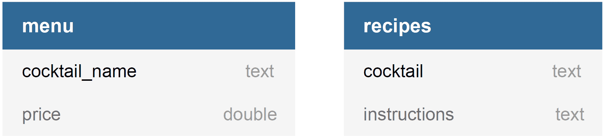
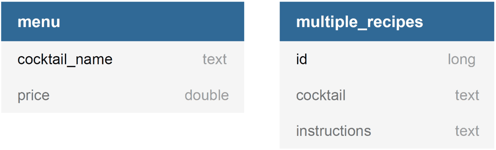
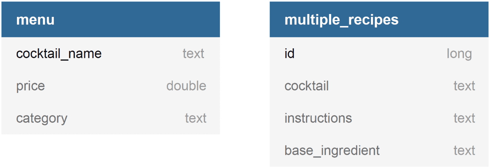

# [在不相关的实体之间构建JPA查询](https://www.baeldung.com/jpa-query-unrelated-entities)

1. 一览表

    在本教程中，我们将了解如何在不相关的实体之间构建JPA查询。

2. Maven附属机构

    让我们从向我们的pom.xml添加必要的依赖项开始。

    然后，我们为实现Java持久性API的Hibernate ORM添加了一个依赖项：

    ```xml
    <dependency>
        <groupId>org.hibernate.orm</groupId>
        <artifactId>hibernate-core</artifactId>
        <version>6.5.2.Final</version>
    </dependency>
    ```

    雅加达持久性API是对休眠核心的瞬态依赖。

    最后，我们添加了一些[QueryDSL](https://www.baeldung.com/querydsl-with-jpa-tutorial)依赖项；即querydsl-apt和querydsl-jpa：

    ```xml
    <dependency>
        <groupId>com.querydsl</groupId>
        <artifactId>querydsl-apt</artifactId>
        <classifier>jakarta</classifier>
        <version>5.0.0</version>
        <scope>provided</scope>
    </dependency>
    <dependency>
        <groupId>com.querydsl</groupId>
        <artifactId>querydsl-jpa</artifactId>
        <classifier>jakarta</classifier>
        <version>5.0.0</version>
    </dependency>
    ```

    添加jakarta.xml.bind-api：

    ```xml
    <dependency>
        <groupId>jakarta.xml.bind</groupId>
        <artifactId>jakarta.xml.bind-api</artifactId>
        <version>4.0.0</version>
    </dependency>
    ```

3. 域模型

    我们的例子的领域是鸡尾酒吧。在这里，我们在数据库中有两个表格：

    - 存放我们酒吧出售的鸡尾酒及其价格的菜单桌，以及
    - 食谱表上存放着制作鸡尾酒的说明

    

    这两个表彼此没有严格的关系。鸡尾酒可以在我们的菜单上，无需保留其配方说明。此外，我们可以提供尚未出售的鸡尾酒配方。

    在我们的示例中，我们将在菜单上找到所有有可用配方的鸡尾酒。

4. JPA实体

    我们可以轻松地创建两个JPA实体来表示我们的表格：

    ```java
    @Entity
    @Table(name = "menu")
    public class Cocktail {
        @Id
        @Column(name = "cocktail_name")
        private String name;

        @Column
        private double price;

        // getters & setters
    }

    @Entity
    @Table(name="recipes")
    public class Recipe {
        @Id
        @Column(name = "cocktail")
        private String cocktail;

        @Column
        private String instructions;
        
        // getters & setters
    }
    ```

    在菜单和食谱表之间，有一个基本的一对一关系，没有明确的外键约束。例如，如果我们有一个菜单记录，其鸡尾酒_名称列的值为“莫吉托”，而arecipes记录，其鸡尾酒列的值为“莫吉托”，那么菜单记录与此食谱记录相关联。

    为了在我们的鸡尾酒实体中代表这种关系，我们添加了带有各种注释的食谱字段：

    ```java
    @Entity
    @Table(name = "menu")
    public class Cocktail {
        // ...

        @OneToOne
        @JoinColumn(name = "cocktail_name", 
        referencedColumnName = "cocktail", 
        insertable = false, updatable = false, 
        foreignKey = @jakarta.persistence
            .ForeignKey(value = ConstraintMode.NO_CONSTRAINT))
        private Recipe recipe;
    
        // ...
    }
    ```

    第一个注释是@OneToOne，它声明了与Recipe实体的基本一对一关系。

    接下来，我们用 @NotFound(action = NotFoundAction.IGNORE) Hibernate注释注释食谱字段。这告诉我们，当菜单上没有鸡尾酒配方时，我们的ORM不要破例。

    将鸡尾酒与其相关食谱关联的注释是@JoinColumn。通过使用此注释，我们定义了两个实体之间的伪外键关系。

    最后，通过将foreignKey属性设置为@javax.persistence.ForeignKey(value = ConstraintMode.NO_CONSTRAINT)，我们指示JPA提供程序不要生成外来键约束。

5. JPA和QueryDSL查询

    由于我们有兴趣检索与食谱关联的鸡尾酒实体，我们可以通过将其与其关联的食谱实体加入来查询鸡尾酒实体。

    我们构建查询的一种方法是使用[JPQL](https://docs.oracle.com/html/E13946_04/ejb3_langref.html)：

    `entityManager.createQuery("select c from Cocktail c join c.recipe")`

    或者通过使用QueryDSL框架：

    ```java
    new JPAQuery<Cocktail>(entityManager)
    .from(QCocktail.cocktail)
    .join(QCocktail.cocktail.recipe)
    ```

    另一种获得预期结果的方法是将鸡尾酒与食谱实体连接，并使用on子句直接定义查询中的基本关系。

    我们可以使用JPQL来做到这一点：

    `entityManager.createQuery("select c from Cocktail c join Recipe r on c.name = r.cocktail")`

    或者使用QueryDSL框架：

    ```java
    new JPAQuery(entityManager)
    .from(QCocktail.cocktail)
    .join(QRecipe.recipe)
    .on(QCocktail.cocktail.name.eq(QRecipe.recipe.cocktail))
    ```

6. 一对一加入单元测试

    让我们开始创建一个单元测试来测试上述查询。在测试用例运行之前，我们必须将一些数据插入到我们的数据库表中。

    ```java
    public class UnrelatedEntitiesUnitTest {
        // ...

        @BeforeAll
        public static void setup() {
            // ...

            mojito = new Cocktail();
            mojito.setName("Mojito");
            mojito.setPrice(12.12);
            ginTonic = new Cocktail();
            ginTonic.setName("Gin tonic");
            ginTonic.setPrice(10.50);
            Recipe mojitoRecipe = new Recipe(); 
            mojitoRecipe.setCocktail(mojito.getName()); 
            mojitoRecipe.setInstructions("Some instructions for making a mojito cocktail!");
            entityManager.persist(mojito);
            entityManager.persist(ginTonic);
            entityManager.persist(mojitoRecipe);
        
            // ...
        }

        // ... 
    }
    ```

    在设置方法中，我们正在保存两个鸡尾酒实体，莫吉托和杜松子酒。然后，我们添加了一个制作“Mojito”鸡尾酒的食谱。

    现在，我们可以测试上一节查询的结果。我们知道，只有莫吉托鸡尾酒有关联的配方实体，因此我们预计各种查询只会返回莫吉托鸡尾酒：

    ```java
    public class UnrelatedEntitiesUnitTest {
        // ...

        @Test
        public void givenCocktailsWithRecipe_whenQuerying_thenTheExpectedCocktailsReturned() {
            // JPA
            Cocktail cocktail = entityManager.createQuery("select c " +
            "from Cocktail c join c.recipe", Cocktail.class)
            .getSingleResult();
            verifyResult(mojito, cocktail);

            cocktail = entityManager.createQuery("select c " +
            "from Cocktail c join Recipe r " +
            "on c.name = r.cocktail", Cocktail.class).getSingleResult();
            verifyResult(mojito, cocktail);

            // QueryDSL
            cocktail = new JPAQuery<Cocktail>(entityManager).from(QCocktail.cocktail)
            .join(QCocktail.cocktail.recipe)
            .fetchOne();
            verifyResult(mojito, cocktail);

            cocktail = new JPAQuery<Cocktail>(entityManager).from(QCocktail.cocktail)
            .join(QRecipe.recipe)
            .on(QCocktail.cocktail.name.eq(QRecipe.recipe.cocktail))
            .fetchOne();
            verifyResult(mojito, cocktail);
        }

        private void verifyResult(Cocktail expectedCocktail, Cocktail queryResult) {
            assertNotNull(queryResult);
            assertEquals(expectedCocktail, queryResult);
        }

        // ...
    }
    ```

    verifyResult方法帮助我们验证从查询中返回的结果是否等于预期结果。

7. 一对多的底面关系

    让我们改变我们示例的域，以展示我们如何以一对多底层关系连接两个实体。

    

    我们没有食谱表，而是multiple_recipes表，我们可以在其中存储相同鸡尾酒的任意数量的食谱。

    ```java
    @Entity
    @Table(name = "multiple_recipes")
    public class MultipleRecipe {
        @Id
        @Column(name = "id")
        private Long id;

        @Column(name = "cocktail")
        private String cocktail;

        @Column(name = "instructions")
        private String instructions;

        // getters & setters
    }
    ```

    现在，鸡尾酒实体通过一对多的基本关系与MultipleRecipe实体相关联：

    ```java
    @Entity
    @Table(name = "cocktails")
    public class Cocktail {
        // ...

        @OneToMany
        @JoinColumn(
        name = "cocktail", 
        referencedColumnName = "cocktail_name", 
        insertable = false, 
        updatable = false, 
        foreignKey = @jakarta.persistence
            .ForeignKey(value = ConstraintMode.NO_CONSTRAINT))
        private List<MultipleRecipe> recipeList;

        // getters & setters
    }
    ```

    为了查找和获取我们至少有一个可用的MultipleRecipe的鸡尾酒实体，我们可以通过将其与其关联的MultipleRecipe实体加入来查询鸡尾酒实体。

    我们可以使用JPQL来做到这一点：

    `entityManager.createQuery("select c from Cocktail c join c.recipeList");`

    或者使用QueryDSL框架：

    ```java
    new JPAQuery(entityManager).from(QCocktail.cocktail)
    .join(QCocktail.cocktail.recipeList);
    ```

    还有一个选项是不使用recipeList字段，该字段定义了鸡尾酒和MultipleRecipe实体之间的一对多关系。相反，我们可以为两个实体编写一个连接查询，并使用JPQL“on”子句来确定它们的基本关系：

    ```java
    entityManager.createQuery("select c "
    + "from Cocktail c join MultipleRecipe mr "
    + "on mr.cocktail = c.name");
    ```

    最后，我们可以使用QueryDSL框架构建相同的查询：

    ```java
    new JPAQuery(entityManager).from(QCocktail.cocktail)
    .join(QMultipleRecipe.multipleRecipe)
    .on(QCocktail.cocktail.name.eq(QMultipleRecipe.multipleRecipe.cocktail));
    ```

8. 一对多加入单元测试

    在这里，我们将添加一个新的测试用例来测试之前的查询。在这样做之前，我们必须在设置方法期间坚持一些MultipleRecipe实例：

    ```java
    public class UnrelatedEntitiesUnitTest {
        // ...

        @BeforeAll
        public static void setup() {
            // ...
            
            MultipleRecipe firstMojitoRecipe = new MultipleRecipe();
            firstMojitoRecipe.setId(1L);
            firstMojitoRecipe.setCocktail(mojito.getName());
            firstMojitoRecipe.setInstructions("The first recipe of making a mojito!");
            entityManager.persist(firstMojitoRecipe);
            MultipleRecipe secondMojitoRecipe = new MultipleRecipe();
            secondMojitoRecipe.setId(2L);
            secondMojitoRecipe.setCocktail(mojito.getName());
            secondMojitoRecipe.setInstructions("The second recipe of making a mojito!"); 
            entityManager.persist(secondMojitoRecipe);
        
            // ...
        }

        // ... 
    }
    ```

    然后，我们可以开发一个测试用例，其中我们验证，当我们在上一节中显示的查询被执行时，它们会返回与至少一个MultipleRecipe实例关联的鸡尾酒实体：

    ```java
    public class UnrelatedEntitiesUnitTest {
        // ...

        @Test
        public void givenCocktailsWithMultipleRecipes_whenQuerying_thenTheExpectedCocktailsReturned() {
            // JPQL
            Cocktail cocktail = entityManager.createQuery("select c "
            + "from Cocktail c join c.recipeList", Cocktail.class)
            .getSingleResult();
            verifyResult(mojito, cocktail);

            cocktail = entityManager.createQuery("select c "
            + "from Cocktail c join MultipleRecipe mr "
            + "on mr.cocktail = c.name", Cocktail.class)
            .getSingleResult();
            verifyResult(mojito, cocktail);

            // QueryDSL
            cocktail = new JPAQuery<Cocktail>(entityManager).from(QCocktail.cocktail)
            .join(QCocktail.cocktail.recipeList)
            .fetchOne();
            verifyResult(mojito, cocktail);

            cocktail = new JPAQuery<Cocktail>(entityManager).from(QCocktail.cocktail)
            .join(QMultipleRecipe.multipleRecipe)
            .on(QCocktail.cocktail.name.eq(QMultipleRecipe.multipleRecipe.cocktail))
            .fetchOne();
            verifyResult(mojito, cocktail);
        }

        // ...

    }
    ```

9. 多对多的底面关系

    在本节中，我们选择根据其基本成分在菜单上对鸡尾酒进行分类。例如，莫吉托鸡尾酒的基本成分是朗姆酒，所以朗姆酒是我们菜单上的鸡尾酒类别。

    为了在我们的域中描述上述内容，我们将类别字段添加到鸡尾酒实体中：

    ```java
    @Entity
    @Table(name = "menu")
    public class Cocktail {
        // ...

        @Column(name = "category")
        private String category;
        
        // ...
    }
    ```

    此外，我们可以将base_ingredient列添加到multiple_recipes表中，以便能够根据特定饮料搜索食谱。

    ```java
    @Entity
    @Table(name = "multiple_recipes")
    public class MultipleRecipe {
        // ...

        @Column(name = "base_ingredient")
        private String baseIngredient;
        
        // ...
    }
    ```

    在上述之后，以下是我们的数据库模式：

    

    现在，我们在鸡尾酒和多重食谱实体之间存在着许多对多的潜在关系。ManyMultipleRecipe实体可以与许多鸡尾酒实体相关联，其类别值等于MultipleRecipe实体的baseIngredient值。

    为了查找和获取其baseIngredient作为类别存在于鸡尾酒实体中的MultipleRecipe实体，我们可以使用JPQL加入这两个实体：

    ```java
    entityManager.createQuery("select distinct r " 
    + "from MultipleRecipe r " 
    + "join Cocktail c " 
    + "on r.baseIngredient = c.category", MultipleRecipe.class)
    ```

    或者通过使用QueryDSL：

    ```java
    QCocktail cocktail = QCocktail.cocktail;
    QMultipleRecipe multipleRecipe = QMultipleRecipe.multipleRecipe;
    new JPAQuery(entityManager).from(multipleRecipe)
    .join(cocktail)
    .on(multipleRecipe.baseIngredient.eq(cocktail.category))
    .fetch();
    ```

10. 多对多加入单元测试

    在继续测试案例之前，我们必须设置鸡尾酒实体的类别和多重食谱实体的基础成分：

    ```java
    public class UnrelatedEntitiesUnitTest {
        // ...

        @BeforeAll
        public static void setup() {
            // ...

            mojito.setCategory("Rum");
            ginTonic.setCategory("Gin");
            firstMojitoRecipe.setBaseIngredient(mojito.getCategory());
            secondMojitoRecipe.setBaseIngredient(mojito.getCategory());

            // ...
        }

        // ... 
    }
    ```

    然后，我们可以验证，当我们之前显示的查询被执行时，它们会返回预期结果：

    ```java
    public class UnrelatedEntitiesUnitTest {
        // ...

        @Test
        public void givenMultipleRecipesWithCocktails_whenQuerying_thenTheExpectedMultipleRecipesReturned() {
            Consumer<List<MultipleRecipe>> verifyResult = recipes -> {
                assertEquals(2, recipes.size());
                recipes.forEach(r -> assertEquals(mojito.getName(), r.getCocktail()));
            };

            // JPQL
            List<MultipleRecipe> recipes = entityManager.createQuery("select distinct r "
            + "from MultipleRecipe r "
            + "join Cocktail c " 
            + "on r.baseIngredient = c.category",
            MultipleRecipe.class).getResultList();
            verifyResult.accept(recipes);

            // QueryDSL
            QCocktail cocktail = QCocktail.cocktail;
            QMultipleRecipe multipleRecipe = QMultipleRecipe.multipleRecipe;
            recipes = new JPAQuery<MultipleRecipe>(entityManager).from(multipleRecipe)
            .join(cocktail)
            .on(multipleRecipe.baseIngredient.eq(cocktail.category))
            .fetch();
            verifyResult.accept(recipes);
        }

        // ...
    }
    ```

11. 结论

    在本教程中，我们介绍了在不相关实体之间以及使用JPQL或QueryDSL框架构建JPA查询的各种方法。
