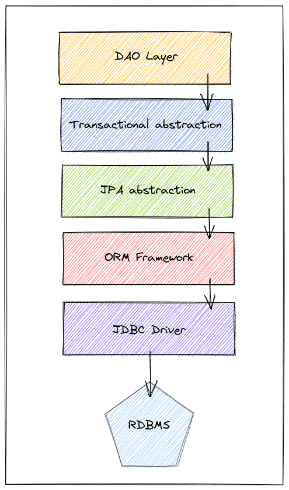

# [使用事务进行只读操作](https://www.baeldung.com/spring-transactions-read-only)

1. 一览表

    在本文中，我们将讨论只读Transaction。我们将讨论它们的目的和如何使用它们，并检查它们与性能和优化相关的一些细微差别。为了简单起见，我们将专注于MySQL的InnoDB引擎。但是，请记住，描述的一些信息可能会根据数据库/存储引擎而变化。

2. 什么是Transaction？

    Transaction是一种由一个或多个语句组成的原子操作。它是原子的，因为此操作中的所有语句要么成功（提交）要么失败（回滚），这意味着要么全有，要么全无。ACID属性的字母“A”代表Transaction的原子性。

    另一个需要理解的关键是，InnoDB引擎中的所有语句都成为事务，如果不是显式，那么是隐式。当我们在方程中添加并发性时，这样的概念就变得更加难以理解。然后，我们需要澄清另一个ACID属性，即隔离的“我”。

    了解隔离水平属性对于我们能够推理性能与一致性保证的权衡至关重要。然而，在详细说明隔离级别之前，请记住，由于InnoDB中的所有语句都是事务，它们可以提交或回滚。如果没有指定事务，数据库会创建一个事务，并根据自动提交属性，它可能被提交或不提交。

    1. 隔离级别

        对于这篇文章，我们将假设MySQL的默认版本——[可重复读取](https://dev.mysql.com/doc/refman/5.6/en/innodb-transaction-isolation-levels.html#isolevel_repeatable-read)。它在同一事务中提供一致的读取，这意味着第一次读取将建立快照（时间点），所有后续的读取将彼此一致。我们可以参考[MySQL官方文档](https://dev.mysql.com/doc/refman/5.6/en/innodb-transaction-isolation-levels.html)以获取有关它的更多信息。当然，保留这样的快照会有后果，但保证了良好的一致性水平。

        不同的数据库可能有其他名称或隔离级别选项，但最有可能的是，它们会相似。

3. 为什么以及在哪里使用Transaction？

    既然我们更了解了什么是Transaction及其不同的属性，让我们来谈谈只读Transaction。如前所述，在InnoDB引擎中，所有语句都是事务，因此，它们可能涉及锁定和快照等内容。然而，我们可以看到，一些与事务协调相关的开销，例如使用事务ID和其他内部结构标记行，可能不需要进行普通查询。这就是只读Transaction发挥作用的地方。

    我们可以使用“START TRANSACTION READ ONLY”语法明确定义只读事务。MySQL还尝试自动检测只读转换。但在明确声明时，可以应用进一步的优化。阅读密集型应用程序可以利用这些优化，并节省我们数据库集群的资源利用率。

    1. 应用程序与数据库

        我们需要知道，在我们的应用程序中处理持久性层可能涉及许多抽象层。每一层都有不同的责任。然而，为了简化，让我们说，最终，这些层要么影响我们的应用程序如何处理数据库，要么影响数据库如何处理数据操作。

        当然，并非所有应用程序都有所有这些层，但它代表了一个很好的概括。假设我们有一个Spring应用程序，简而言之，这些图层具有以下目的：

        

        - [DAO](https://www.baeldung.com/java-dao-pattern)：充当商业逻辑和持久性细微差别之间的桥梁
        - 事务抽象：处理事务的应用程序级复杂性（开始、提交、回滚）
        - JPA抽象：在供应商之间提供标准API的Java规范
        - ORM框架：JPA背后的实际实现（例如，Hibernate）
        - [JDBC](https://www.baeldung.com/java-jdbc)：负责与数据库的实际通信

        主要要点是，其中许多因素可能会影响我们的Transaction行为。尽管如此，让我们专注于直接影响这种行为的特定属性组。通常，客户端可以在全局或会话级别定义这些属性。所有属性的列表很广泛，因此我们只讨论其中两个至关重要的属性。然而，我们应该已经熟悉他们了。

    2. Transaction管理

        JDBC驱动程序从应用程序端启动事务的方式是关闭自动提交属性。它等同于BEGIN TRANSACTION语句，从那一刻起，必须提交或回滚以下所有语句才能完成Transaction。

        在全局级别定义，此属性告诉数据库将所有传入的请求视为手动事务，并要求用户提交或回滚。然而，如果用户在会话级别覆盖此定义，则此定义不再有效。因此，许多驱动程序默认关闭此属性，以保证一致的行为，并确保应用程序可以控制它。

        接下来，我们可以使用[事务](https://dev.mysql.com/doc/refman/5.6/en/set-transaction.html)属性来定义是否允许写入操作。但有一个注意事项：即使在只读事务中，也可以操作使用TEMPORARY关键字创建的表。此属性还具有全局和会话范围，尽管我们通常在应用程序中的会话级别处理此属性和其他属性。

        一个注意事项是，在使用连接池时，由于打开连接和重复使用它们的性质。处理事务和连接的框架或库，在开始新事务之前，必须确保会话处于干净状态。

        出于这个原因，可能会执行一些语句来丢弃任何剩余的待定更改，并使会话设置正确。

        我们已经看到，读取重的应用程序可以利用只读事务来优化和节省我们数据库集群中的资源。但是，许多开发人员也忘记了，在设置之间切换也会导致数据库的往返，影响连接的吞吐量。

        在MySQL中，我们可以在全局级别将这些属性定义为：

        ```sql
        SET GLOBAL TRANSACTION READ WRITE;
        SET autocommit = 0;
        /* transaction */
        commit;
        ```

        或者，我们可以在会话级别设置属性：

        ```sql
        SET SESSION TRANSACTION READ ONLY;
        SET autocommit = 1;
        /* transaction */
        ```

    3. Hints

        在只执行一次查询的事务的情况下，启用自动提交属性可能会为我们节省往返费用。如果这是我们应用程序中最常见的原因，那么使用单独的数据源集作为只读，并默认启用自动提交将效果更好。

        现在，如果事务有更多的查询，我们应该使用显式只读事务。创建只读数据源还可以通过避免在写入和只读事务之间切换来帮助节省往返。但是，如果我们有混合的工作量，管理新数据源的复杂性可能无法证明自己是合理的。

        在处理具有多个语句的Transaction时，另一个重要点是考虑由隔离级别决定的行为，因为它可能会改变我们的Transaction结果，并可能影响性能。为了简单起见，我们在示例中只考虑默认的（可重复读取）。

4. 把它付诸实践

    现在，从应用程序方面，我们将尝试了解如何处理这些属性，以及哪些层可以访问此类行为。但是，同样，很明显，有许多不同的方法可以这样做，根据框架的不同，这可能会发生变化。因此，以JPA和Spring为例，我们也可以很好地了解它在其他情况下会是什么样子。

    1. JPA

        让我们看看如何使用JPA/Hibernate在我们的应用程序中有效地定义只读事务：

        ```java
        EntityManagerFactory entityManagerFactory = Persistence.createEntityManagerFactory("jpa-unit");
        EntityManager entityManager = entityManagerFactory.createEntityManager();
        entityManager.unwrap(Session.class).setDefaultReadOnly(true);
        entityManager.getTransaction().begin();
        entityManager.find(Book.class, id);
        entityManager.getTransaction().commit();
        ```

        需要注意的是，在JPA中没有定义只读事务的标准方法。出于这个原因，我们需要获得实际的Hibernate会话，将其定义为只读。

    2. JPA+Spring

        使用Spring事务管理系统时，它变得更加直接，如下见：

        ```java
        @Transactional(readOnly = true)
        public Book getBookById(long id) {
            return entityManagerFactory.createEntityManager().find(Book.class, id);
        }
        ```

        通过这样做，Spring承担了打开、关闭和定义Transaction模式的责任。然而，即使这有时也是不必要的，因为在使用Spring Data JPA时，我们已经准备好这样的配置。

        Spring JPA存储库[基类](https://docs.spring.io/spring-data/data-jpa/docs/current/api/org/springframework/data/jpa/repository/support/SimpleJpaRepository.html)将所有方法标记为只读事务。通过在类级别添加此注释，只需在方法级别添加@Transactional，就可以改变方法的行为。

        最后，在配置数据源时，也可以定义只读连接并更改autcommit属性。正如我们所看到的，如果我们只需要读取，这可以进一步提高应用程序的性能。数据源包含这些配置：

        ```java
        @Bean
        public DataSource readOnlyDataSource() {
            HikariConfig config = new HikariConfig();
            config.setJdbcUrl("jdbc:mysql://localhost/baeldung?useUnicode=true&characterEncoding=UTF-8");
            config.setUsername("baeldung");
            config.setPassword("baeldung");
            config.setReadOnly(true);
            config.setAutoCommit(true);
            return new HikariDataSource(config);
        }
        ```

        然而，这只有在我们应用程序的主要特征是单个查询资源的情况下才有意义。此外，如果使用Spring Data JPA，则有必要禁用Spring创建的默认事务。因此，我们只需要将enableDefaultTransactions属性配置为false：

        ```java
        @Configuration
        @EnableJpaRepositories(enableDefaultTransactions = false)
        @EnableTransactionManagement
        public class Config {
            //Definition of data sources and other persistence related beans
        }
        ```

        从这一刻起，我们完全控制并有责任在必要时添加@Transactional（只读=true）。尽管如此，大多数应用程序的情况并非如此，因此我们不应该更改这些配置，除非我们确定我们的应用程序会从中获利。

    3. 路由语句

        在更真实的场景中，我们可以有两个数据源，一个写入源，一个只读数据源。然后，我们必须定义在组件级别使用哪个数据源。这种方法更有效地处理读取连接，并防止使用不必要的命令来确保会话干净并具有适当的设置。

        有多种方法可以达到这个结果，但我们将首先创建一个路由器数据源类：

        ```java
        public class RoutingDS extends AbstractRoutingDataSource {

            public RoutingDS(DataSource writer, DataSource reader) {
                Map<Object, Object> dataSources = new HashMap<>();
                dataSources.put("writer", writer);
                dataSources.put("reader", reader);

                setTargetDataSources(dataSources);
            }

            @Override
            protected Object determineCurrentLookupKey() {
                return ReadOnlyContext.isReadOnly() ? "reader" : "writer";
            }
        }
        ```

        关于[路由数据源](https://www.baeldung.com/spring-abstract-routing-data-source)，还有很多需要了解的。然而，综上所述，在我们的案例中，当应用程序请求时，该类将返回适当的数据源。为此，我们使用ReadOnlyContent类，该类将在运行时保留数据源上下文：

        ```java
        public class ReadOnlyContext {

            private static final ThreadLocal<AtomicInteger> READ_ONLY_LEVEL = ThreadLocal.withInitial(() -> new AtomicInteger(0));

            //default constructor

            public static boolean isReadOnly() {
                return READ_ONLY_LEVEL.get()
                    .get() > 0;
            }

            public static void enter() {
                READ_ONLY_LEVEL.get()
                    .incrementAndGet();
            }

            public static void exit() {
                READ_ONLY_LEVEL.get()
                    .decrementAndGet();
            }
        }
        ```

        接下来，我们需要定义这些数据源，并在Spring上下文中注册它们。为此，我们只需要使用之前创建的RoutingDS类：

        ```java
        //annotations mentioned previously
        public Config {
            //other beans...

            @Bean
            public DataSource routingDataSource() {
                return new RoutingDS(
                dataSource(false, false),
                dataSource(true, true)
                );
            }
            
            private DataSource dataSource(boolean readOnly, boolean isAutoCommit) {
                HikariConfig config = new HikariConfig();
                config.setJdbcUrl("jdbc:mysql://localhost/baeldung?useUnicode=true&characterEncoding=UTF-8");
                config.setUsername("baeldung");
                config.setPassword("baeldung");
                config.setReadOnly(readOnly);
                config.setAutoCommit(isAutoCommit);
                return new HikariDataSource(config);
            }

            // other beans...
        }
        ```

        快到了——现在，让我们创建一个注释，告诉Spring何时在只读上下文中包装组件。为此，我们将使用@ReaderDS注释：

        ```java
        @Inherited
        @Retention(RetentionPolicy.RUNTIME)
        public @interface ReaderDS {
        }
        ```

        最后，我们使用AOP在上下文中包装组件执行：

        ```java
        @Aspect
        @Component
        public class ReadOnlyInterception {
            @Around("@annotation(com.baeldung.readonlytransactions.mysql.spring.ReaderDS)")
            public Object aroundMethod(ProceedingJoinPoint joinPoint) throws Throwable {
                try {
                    ReadOnlyContext.enter();
                    return joinPoint.proceed();
                } finally {
                    ReadOnlyContext.exit();
                }
            }
        }
        ```

        通常，我们希望在尽可能高的点级别添加注释。尽管如此，为了简单，我们将添加存储库层，组件中只有一个查询：

        ```java
        public interface BookRepository extends JpaRepository<BookEntity, Long> {
            @ReaderDS
            @Query("Select t from BookEntity t where t.id = ?1")
            BookEntity get(Long id);
        }
        ```

        正如我们所观察到的，这种设置允许我们通过利用整个只读事务和避免会话上下文切换来更有效地处理只读操作。因此，这可以大大提高我们应用程序的吞吐量和响应能力。
