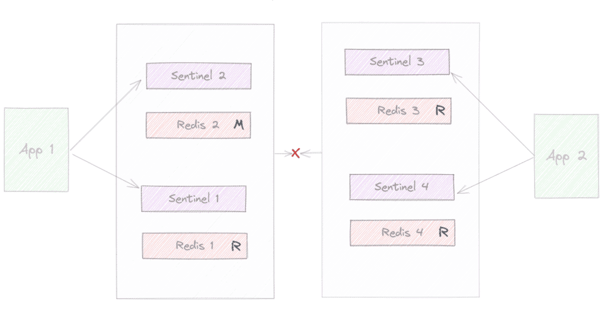
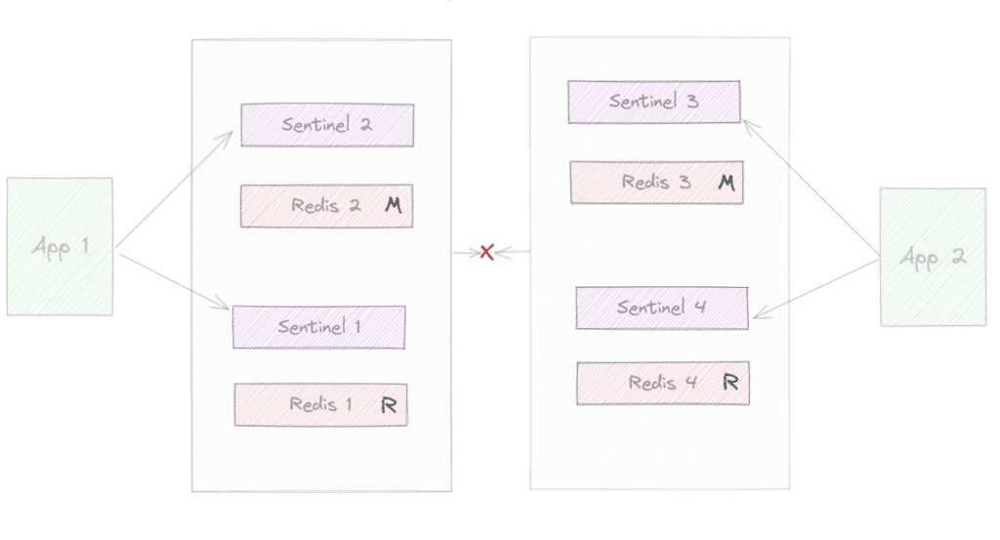

# [Redis Sentinel 与 Redis 集群对比](https://www.baeldung.com/redis-sentinel-vs-clustering)

NoSQL

Redis

1. 概述

    在本教程中，我们将介绍 Redis，更重要的是讨论它的两种不同部署策略：**Redis Sentinel** 和 **Redis Cluster（集群）**。然后，我们会深入探讨这两种策略之间的差异及其细微差别。

    最终，我们希望充分理解 Redis，以便判断哪种部署方式更能满足我们的实际需求。

2. Redis 简介

    Redis 是一个开源的内存数据结构存储系统，可用作键值数据库、缓存，以及多种其他用途。其目标是提供对数据的高速访问。

    本文的重点是比较分析两种不同的高可用部署方案：

    - **Redis Sentinel**：Redis 提供的一个独立进程，用于监控 Redis 实例，提供通知、主节点发现、故障自动切换（failover），并通过多数投票机制进行主节点选举。换言之，Sentinel 是一个分布式系统，为 Redis 增加了高可用性和故障恢复能力。它通常与标准的 Redis 主从架构配合使用。
    - **Redis Cluster**：一种更进一步的部署策略，不仅支持故障转移和配置管理，还具备**数据分片（sharding）能力**，可近乎线性地将容量扩展到多达 1000 个节点，适用于大规模场景。

3. 基本概念

    为了更好地理解这两种策略的差异，我们先来了解一些核心概念。

    有些概念并非专属于 Redis Sentinel 或 Cluster，但掌握它们有助于全面理解 Redis。

    1. 数据库（Databases）

        Redis 支持多个逻辑数据库。虽然这些数据库的数据仍保存在同一个持久化文件中，但允许用户在不同数据库中使用相同的键名而存储不同的值——类似于不同的数据库 schema。

        默认情况下，Redis 提供 16 个逻辑数据库（编号从 0 到 15），可通过配置修改数量。

        需要强调的是：**Redis 是单线程的数据存储引擎**，所有数据库操作都通过同一个执行流水线处理。

        > ⚠️ 注意：在 Redis Cluster 模式下，仅支持数据库 0，不支持多数据库功能。

    2. 哈希槽（Hash Slots）

        Redis Cluster 采用“哈希槽”机制来实现数据自动分片，而不是一致性哈希。

        - 整个集群共有 **16384 个哈希槽**。
        - 每个键通过 `CRC16(key) % 16384` 计算出对应的哈希槽 ID，详情参考[文档](https://redis.io/docs/reference/cluster-spec/#key-distribution-model)。
        - 客户端根据该哈希槽 ID 将命令路由到负责该槽的节点。

        每个节点负责一部分哈希槽，可以通过 **resharding（重新分片）或 rebalance（再平衡）** 操作在节点间移动槽位。

        > ⚠️ 限制：由于数据是按哈希槽分布的，**多键操作（multi-key operations）只有在所有涉及的键属于同一个哈希槽时才被允许**，否则 Redis 会拒绝请求。

    3. 哈希标签（Hash Tags）

        哈希标签是一种机制，让用户可以**强制多个键分配到同一个哈希槽**。

        方法是在键名中使用 `{}` 包裹一部分字符串：

        例如：
        - `app1{user:123}.mykey1`
        - `app1{user:123}.mykey2`

        这两个键的哈希值将只基于 `{user:123}` 部分计算，因此会被分配到同一个哈希槽，从而支持对这些键执行多键操作（如 `MGET`, `DEL` 等）。

    4. 异步复制（Asynchronous Replication）

        无论是 Redis Cluster 还是标准主从 + Sentinel 架构，都使用**异步复制**。

        这意味着主节点不会等待从节点确认写入操作。因此，在主节点故障且从节点尚未同步数据的情况下，**可能会丢失已确认的写操作**。

        虽然可以通过配置（如 `min-replicas-to-write`）减少这种风险窗口，但无法完全消除。

        > ⚠️ 结论：**Redis 不保证[强一致性](https://redis.io/docs/manual/scaling/#redis-cluster-consistency-guarantees)**，适合对一致性要求不高但对性能要求高的场景。

    5. 故障转移（Failover）

        Redis 提供了应对节点故障的机制，确保一定程度的容错能力。

        - **Redis Cluster**：通过[心跳（heartbeat）和 Gossip 协议](https://redis.io/docs/reference/cluster-spec/#fault-tolerance)实现节点间通信。当多个副本节点检测到主节点无响应时，会触发故障转移流程。
        - **Redis Sentinel**：关于 Sentinel，每个 Sentinel 实例会监控一个 Redis 实例。Sentinel 实例之间也会相互通信，并[根据配置](https://redis.io/docs/latest/operate/oss_and_stack/management/sentinel/)，在出现通信问题或超时的情况下，可能执行故障转移（failover）。

    6. 主节点选举（Master Election）

        两种方案都包含基于投票的选举机制。

        Sentinel 的选举流程：

        1. 达到**法定人数（quorum）**：足够多的 Sentinel 实例认为主节点失效。
        2. 授权故障转移：至少多数 Sentinel 授权并选出一个“领头 Sentinel”。
        3. 领头 Sentinel 选择最佳从节点升级为主节点。
        4. 广播新拓扑结构给其他 Sentinel。

        Redis Cluster 的选举流程：

        1. 从节点检测到主节点失效。
        2. 向所有主节点发起投票请求。
        3. 获得多数主节点投票的从节点获得故障转移权限，升级为主节点。

        > ✅ 最佳实践：**推荐使用奇数个节点**（3、5、7…），以避免选举时出现平票。

    7. 网络分区（Network Partition）

        Redis 能应对多种故障，但在发生**网络分区（split-brain）** 时面临严峻挑战。

        场景示例：

        

        假设一个 4 节点集群被分为两部分：
        - 左侧：节点 1、2 可通信
        - 右侧：节点 3、4 可通信

        若每侧都达到故障判定条件（如超时），右侧可能将节点 3 提升为主节点，形成两个“主节点”。

        

        当网络恢复后，若同一键在两侧被写入不同值，就会产生数据冲突。

        如何缓解？
        - 使用**奇数节点**确保多数派
        - 配置 `min-replicas-to-write`：主节点必须有足够从节点在线才允许写入
        - 在网络分区时，**Redis Cluster 的少数派会拒绝写入**，而 Sentinel 架构可能继续写入（取决于配置），风险更高

4. Redis Sentinel vs Redis 集群：对比总结

    | 特性 | Redis Sentinel（主从 + Sentinel） | Redis Cluster |
    |------|----------------------------------|---------------|
    | **部署复杂度** | 较低 | 较高 |
    | **节点数量要求** | 较少（最低 3 节点：1主+1从+1哨兵） | 较多（至少 6 节点：3主+3从） |
    | **扩展性** | 垂直扩展（提升单机性能）读操作可通过从节点扩展 | 水平扩展（分片）支持多达 1000 个节点 |
    | **数据分片** | ❌ 不支持 | ✅ 支持（16384 个哈希槽） |
    | **高可用性** | ✅ 支持自动故障转移 | ✅ 支持自动故障转移 |
    | **多数据库支持** | ✅ 支持 16 个逻辑数据库 | ❌ 仅支持数据库 0 |
    | **多键操作限制** | ✅ 无限制 | ⚠️ 所有键必须在同一哈希槽 |
    | **网络分区行为** | 可能出现 split-brain | 少数派拒绝写入，更安全 |
    | **成本** | 较低 | 较高（需更多节点） |
    | **适用场景** | 中小规模应用、缓存、简单高可用 | 大规模数据、高吞吐、需水平扩展 |

5. 总结

    本文深入探讨了 Redis 的两种高可用部署方案：**Redis Sentinel** 和 **Redis Cluster**。

    - **Redis Sentinel** 更适合中小型项目，成本低、部署简单，提供基本的高可用和故障转移能力。
    - **Redis Cluster** 适用于大规模、高并发、需要水平扩展的场景，通过数据分片实现近乎线性的扩展能力，但复杂度和成本更高。

    选择哪种方案应基于以下因素：

    - 数据规模
    - 吞吐量需求
    - 是否需要水平扩展
    - 运维能力
    - 成本预算

    无论选择哪种方式，理解其底层机制（如哈希槽、异步复制、选举机制、网络分区处理）对于设计稳定可靠的系统至关重要。
