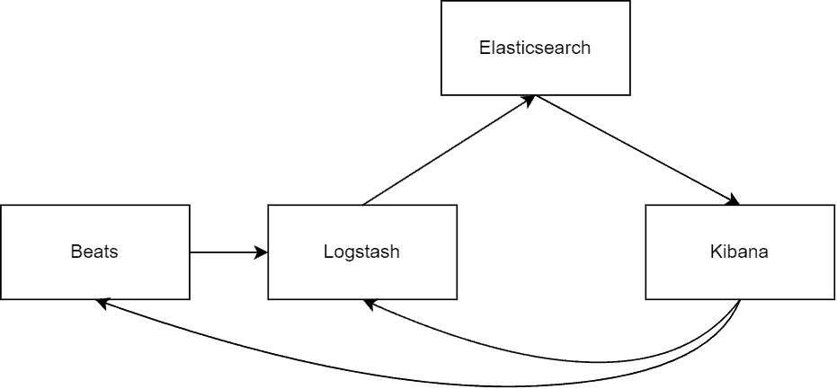

# [什么是 Elasticsearch？](https://www.baeldung.com/java-elasticsearch)

1. 概述

    在本教程中，我们将开始探索 Elasticsearch 及其配套工具。

    它是一种可以无缝处理大量数据、自动扩展并持续吸收新数据的工具。

2. 定义

    想象一下，我们有一大堆文件，数以千计，我们希望快速高效地找到特定信息。这就是 Elasticsearch 发挥作用的地方。

    想象一下，一个超级聪明的图书管理员会巧妙地组织大量文件，从而方便搜索过程。这与 Elasticsearch 有异曲同工之妙-Elasticsearch 是一个开源搜索和分析引擎，能够熟练地管理海量数据，提供我们所需的精确信息。

    Elasticsearch 采用 JSON 文档作为数据表示方式，具有分布式性质，并结合了 [NoSQL](https://www.baeldung.com/cs/sql-vs-nosql)，可以轻松与各种编程语言和系统集成。

    Elasticsearch 的突出特点是其数据处理能力，如即时存储、搜索和检查数据。Elasticsearch 使用强大的搜索系统，将文档中的所有单词和短语排序到一个易于搜索的列表中。这意味着我们可以在海量数据中执行快如闪电的搜索。

    1. 关于索引？

        与关系数据库管理系统（RDBMS）相比，Elasticsearch 有一种独特的数据组织方式。在 RDBMS 中，我们通常使用 "数据库" 一词。但是，在 Elasticsearch 中使用的术语是 "索引"，它更类似于传统数据库中的表。这只是同一概念的不同术语而已。

        此外，在关系数据库中，我们使用表格来组织数据。在 Elasticsearch 中，我们也有类似的东西，我们可以将其视为索引模式。在旧版本中，它们被称为类型。

        在这些数据库或索引中，关系数据库的表由行和列组成。在 Elasticsearch 中，我们可以将行视为文档，将单个列称为字段，这与许多 NoSQL 数据源的结构如出一辙。

        对于那些习惯于使用 [MySQL](https://www.baeldung.com/java-connect-mysql) 或 [Postgres](https://www.baeldung.com/spring-boot-postgresql-docker) 等关系型数据库的人来说，理解这种新的面向文档的搜索引擎无异于扩展我们的现有知识。它能帮助我们了解事物是如何组合在一起的，并规划我们的数据结构。这就像将我们现有的理解转化为一个新的系统，并有自己的考虑因素。

        下面是一个有用的比较表：

        

3. 与 Elasticsearch 交互

    与 Elasticsearch 交互时，值得注意的是这是通过 RESTful API 完成的。这意味着，无论是管理索引还是处理不同类型的数据，我们的所有操作都是通过可编程访问的 URL 进行的。

    这些查询通常使用 Elasticsearch 的查询 DSL 进行，这是一个灵活而强大的系统，利用 JSON 来定义查询。重要的是，Elasticsearch 的查询 DSL 允许进行简单匹配之外的复杂查询，包括布尔逻辑、通配符、范围查询等。

    它非常适合各种用例。我们可以从不同来源收集数据，如日志、不同系统的指标，甚至应用程序跟踪数据。有了 Elasticsearch，我们可以将所有这些数据合并成 JSON 文档，然后轻松地实时搜索和检索信息。

4. 解决现实世界的挑战

    下面是一些示例，说明我们如何与 Elasticsearch 进行交互。

    1. 电子商务搜索

        现在，假设我们有一堆与客户对产品的评论相关的文档。利用 Elasticsearch，我们可以快速搜索这些评论中的特定关键字或短语，并立即给出相关结果。除了能找到完全匹配的结果外，它还能根据相关性对结果进行排序，确保我们首先收到最重要的信息。

        假设我们正在索引一个大型产品目录。我们要查找所有 "red shirts" 的 Elasticsearch 查询可能如下所示：

        ```bash
        curl -X GET "localhost:9200/products/_search" -H 'Content-Type: application/json' -d'
        {
        "query": {
            "bool": {
            "must": [
                { "match": { "color": "red" }},
                { "match": { "product_type": "shirt" }}
            ]
            }
        }
        }'
        ```

    2. 地理空间搜索

        假设我们正在开发基于位置的应用程序或地图服务。我们需要搜索地点、计算距离或查找附近的位置。Elasticsearch [内置了对地理空间数据的支持](https://www.baeldung.com/elasticsearch-geo-spatial)，让我们可以毫不费力地存储和查询位置信息。无论是查找最近的咖啡店还是分析地理数据，Elasticsearch 的地理空间功能都能让我们更轻松地处理基于位置的数据。

        不过，它不仅仅是搜索。它还提供一些高级功能。例如，它可以对我们的数据进行复杂的查询、过滤和聚合。我们甚至可以用它来可视化和分析我们的数据，帮助我们获得洞察力并做出明智的决策。

        对于基于位置的搜索，例如，要查找特定地点 1km 半径范围内的所有咖啡店，我们的查询可能如下：

        ```bash
        curl -X GET "localhost:9200/places/_search" -H 'Content-Type: application/json' -d'
        {
        "query": {
            "bool": {
            "must": {
                "match": {
                "place_type": "coffee_shop"
                }
            },
            "filter": {
                "geo_distance": {
                "distance": "1km",
                "pin.location": {
                    "lat": 40.73,
                    "lon": -74.1
                }
                }
            }
            }
        }
        }'
        ```

    3. 欺诈检测

        欺诈活动（如信用卡欺诈或在线诈骗）可能是一个重大的业务问题。

        Elasticsearch 可以通过分析大量交易数据来协助欺诈检测。它可以使用高级分析和机器学习算法识别模式、异常或可疑行为。

        除了搜索功能外，它还具有高度的可扩展性和容错性。它可以将我们的数据分布到多台服务器上，确保即使一台服务器宕机，我们的数据仍然可以访问。这使它成为处理大规模应用或高数据量系统的可靠工具。

5. 生态系统

    让我们来看看整个生态系统。如果我们一直在研究 Elasticsearch，我们很可能会偶然发现 "[Elastic Stack](https://www.baeldung.com/java-application-logs-to-elastic-stack)"（以前称为 "ELK Stack"）这个术语。

    这个被广泛使用的短语汇集了三个强大的开源工具： Elasticsearch、Logstash 和 Kibana。该术语还包括 Beats，这是一套轻量级数据运载工具。这些组件共同提供了一个全面的搜索、日志分析和数据可视化解决方案：

    

    1. Kibana

        我们可以把它看作是一个方便的网络友好界面，让我们可以与 Elasticsearch 中的数据进行交互。它有点像我们的个人指挥中心，在这里我们可以深入分析它为我们索引的所有有用信息。

        利用 Kibana，我们可以创建动态仪表盘、图表、图形和可视化内容，并在新数据到达时实时更新。它是我们监控和探索流入数据的主要界面，帮助我们及时了解最新情况，毫不费力地获得洞察力。

        现在，让我们讨论一下如何将数据输入 Elasticsearch。有两个关键组件需要考虑： Logstash 和 Beats。

    2. Logstash

        Logstash 是一个开源的服务器端处理管道。它的主要作用是处理三项任务：接收数据，对数据进行一番改造，然后将其存储到安全的地方。我们可以对 Logstash 进行配置，以接收来自不同来源的数据。比如，我们可以格式化数据，然后使用 SDK 直接发送到 Logstash，或者将其与不同的系统集成。

        此外，虽然 [Logstash](https://www.baeldung.com/tomcat-jmx-elastic-stack) 支持 JSON 和 CSV 等各种数据格式，但必须强调的是，它可以使用其广泛的插件生态系统处理自定义格式。

        接收到数据后，Logstash 能够在数据进入管道前进行一系列转换，如格式化或结构化。完成这些任务后，它会将精炼数据转发到最终目的地。就我们而言，Elasticsearch 就是其中一个主要目的地。

    3. Beats

        Beats 是轻量级数据运输器。它可以被视为安装在不同服务器上收集特定类型数据的代理。无论我们使用的是无服务器架构、文件还是 Windows 服务器，Beats 都是 Logstash 的补充组件。它们拥有插件，可以与各种服务和系统集成。

        Beats 有一个很酷的地方-它可以将数据直接发送到 Logstash，进行额外的处理和存储。因此，Beats 就像一个高效的数据收集器，与 Logstash 携手合作，确保数据流的无缝衔接，并集成到我们的 Elasticsearch 环境中。

6. 结论

    在本文中，我们将 Elasticsearch 作为一个强大的搜索和分析引擎进行了探讨，它可以彻底改变我们处理和理解数据的方式。
