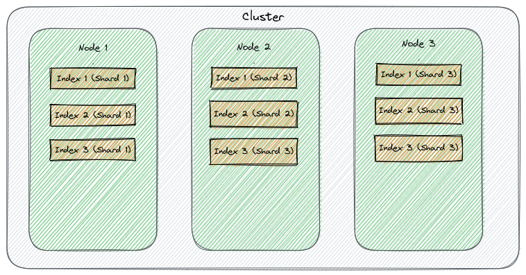
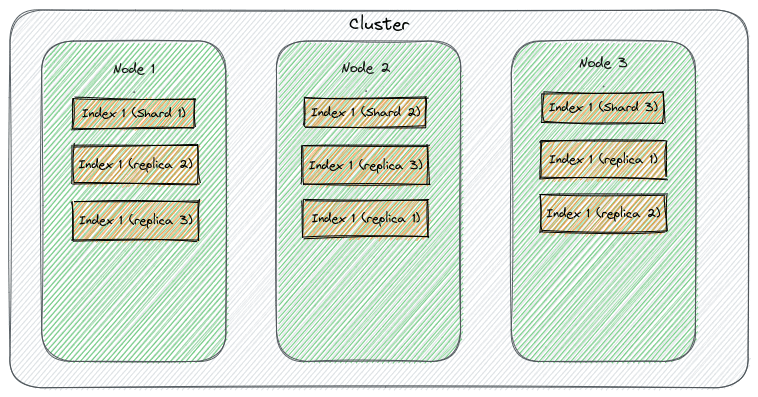

# Elasticsearch 中的分片和副本

1. 概述

    Elasticseach 是一种用于分析和全文搜索的工具，很可能是此类用途的领先开源项目之一。此外，Elasticsearch 还是一个可以处理大量数据的分布式工具引擎，它建立在 Apache Lucene 项目之上。

    在本教程中，我们将探索该工具的水平扩展、容错和高可用性功能。希望在本教程结束时，我们能了解它的所有细微差别以及如何充分利用它。

2. 分片

    使 Elasticsearch 成为容错和可扩展工具的一个关键方面是在多个节点上分发数据的能力。分片是代表存储在索引中的数据子集的构建块。不仅如此，一个分片是定义并存储在一个节点中的 Lucene 索引，而一个或多个分片的集合则代表一个 Elacticsearch 索引。分片是在集群节点/成员间水平分布数据的一种方式。

    Elacticsearch 索引代表分布在 Elasticsearch 集群中的一组数据。集群是一组运行 Elasticsearch 并能相互通信的机器。这意味着一个群集可以包含多个索引，因此也可以包含多个分片。这些分片消除了将所有数据存储在单个节点上可能造成的单点故障，从而提高了容错能力。

    分片分布在各个节点上，可以保证在数据丢失或节点宕机时，只有一部分数据不可用，但集群可以继续为另一部分数据提供服务。另一个好处是稳定性，因为每个分片都会尝试并发处理请求，这可能会优化集群资源的使用，并带来更好的性能。当然，这取决于多个因素，如索引大小、实例大小和节点负载。

    分片还可以减少 Elasticsearch 为满足每个请求而需要扫描的数据量，因为它可以将每个请求分发到不同的实例，从而并行执行查询。不过，这样做也有代价，在对索引进行分片时，我们会增加一些额外的成本，如节点间的协调和通信。

    1. 规格

        在当前的 Elasticsearch 版本（[8.7](https://www.elastic.co/guide/en/elasticsearch/reference/8.7/index-modules.html)）中，创建索引时如果没有指定所需的分片数，引擎就会返回默认值，本例中为 1。为了确定所需的分片数量，我们需要在创建索引时添加 [settings.index.number_of_shards](https://www.elastic.co/guide/en/elasticsearch/reference/8.7/index-modules.html) 属性。需要注意的是，该设置是一个静态属性，这意味着在创建后无法更改。

        Elasticsearch 会将每个分片分配给一个节点，分配完成后，每个分配的分片都会收到一个分片 ID，用于识别和定位集群中的分片。

        这些分区是主分区，主分区负责分配给它们的所有写操作。例如，下图展示了一个有效的群集设置：

        

        默认情况下，Elasticsearch 会应用一个公式来确定特定文档的索引请求将被路由到哪个分片。该[路由功能](https://www.elastic.co/guide/en/elasticsearch/reference/current/mapping-routing-field.html)使用文档 ID，不过也可以更改为使用不同的参数或字段。

        Elasticsearch 这样做是为了确保分区保持平衡，而且该算法是确定性的，这意味着给定的 ID 将始终进入相同的分区。

3. 副本

    如前所述，主分片超级重要，因为它们保存着我们索引的所有数据，并处理查询、索引和其他操作等请求。因此，它们对集群的正常运行至关重要。

    我们可以想象，由于硬件故障、数据损坏或其他任何问题而丢失其中一个分片都是非常危险的。幸运的是，Elasticsearch 有一些机制可以防止这种情况发生。

    副本(Replicas)是存在于不同节点的主分片的精确副本，我们使用它们来提高群集的可用性和容错恢复能力。鉴于每个副本都与主分片相关联，因此在主分片发生任何严重事故时，副本可以取代它成为主分片，确保数据仍然可用。

    这就是为什么副本不能和主分区一样位于同一节点的原因。否则，这就失去了它的意义。

    同样重要的是要明白，副本不是只读分片。它们实际上可以接收写操作，但只能从与之相关的主分片接收。另一个有趣的问题是，副本可以提高群集吞吐量，因为它们还可以处理读取请求，帮助分散群集负载。

    1. 规格

        再次引用当前的 Elasticsearch 版本（8.7），在创建索引时，如果没有指定所需的副本数量，引擎将返回默认值，在本例中为 1。为了确定所需的副本数量，我们需要在创建索引时添加 [settings.index.number_of_replicas](https://www.elastic.co/guide/en/elasticsearch/reference/8.7/index-modules.html#dynamic-index-settings) 属性。与分片数量不同，副本数量会在索引的生命周期中发生变化。

        Elasticsearch 会考虑主分片的位置，为每个副本分配一个节点：

        

        另一个值得一提的相关属性是 [settings.index.auto_expand_replicas](https://www.elastic.co/guide/en/elasticsearch/reference/8.7/index-modules.html#dynamic-index-settings)，它允许在更多节点加入集群时扩展副本的数量。

        Elasticsearch 索引的状态可显示索引的健康状况。相应的状态值如下：

        - 绿色：所有分片都至少分配给了群集中的一个节点，并且有足够的副本来提供配置的冗余。
        - 黄色：表示所有主分片都可用，但不是所有副本都可用。这可能是由于一个或多个副本未分配或丢失。
        - 红色：表示一个或多个主分片不可用。这可能是由于一个或多个主分区未分配或丢失。

4. 群集设置

    在定义集群设置时，必须提出正确的问题，以保证良好的服务水平和适当的预算支出。例如，对负载和数据类型进行粗略估算对于确定适当的分片至关重要。复制也是如此。了解正确的冗余级别至关重要。

    让我们来看看一些常见的错误和陷阱。

    1. 复制过度或复制不足

        Elasticsearch 提供复制功能，以促进高可用性和容错。但是，这需要付出存储和网络流量方面的代价，这意味着集群的开销。另一方面，缺乏复制可能会导致数据丢失的风险。因此，考虑到使用案例的要求，平衡这两个极端是至关重要的。

    2. 分片分布不均

        与前一点类似，分片过多会导致过度配置和高成本。但是，分片太少又会因热点问题而导致性能问题。因此，定义分片时必须考虑数据量、查询模式和实例大小。

    3. 分片分配不当

        与集群中的节点数量有关，分片分配不当会导致查询性能缓慢，集群中各节点之间的操作分配不均，从而使集群中的特定节点负荷过重，而其他节点则使用不足。

    4. 不适当的同步/刷新间隔

        基于 [settings.index.refresh_interval](https://www.elastic.co/guide/en/elasticsearch/reference/current/index-modules.html) 和 [settings.index.translog.sync_interval](https://www.elastic.co/guide/en/elasticsearch/reference/current/index-modules-translog.html) 甚至 [Flush APIS](https://www.elastic.co/guide/en/elasticsearch/reference/current/indices-flush.html) 等属性，Elasticsearch 可以在耐用性和性能之间取得平衡。这些配置会严重影响节点的健康和性能，因为如果设置为频繁更新，可能会增加磁盘 I/O 和 CPU 消耗；如果设置为更长时间更新，则会导致数据丢失。因此，需要根据使用情况谨慎管理这些配置。

5. 结论

    Elasticsearch 是一个复杂的工具，它提供了许多选项来根据我们的使用情况调整其行为。因此，我们需要充分了解其细微差别。

    在本文中，我们讨论了 Elasticsearch 分片和副本。我们了解了如何将它们结合起来，以实现高可用性、弹性和容错集群。此外，我们还了解了它们如何影响整个集群的性能和健康状况。

    希望现在我们能更多地了解这一工具，以及如何充分利用其功能并避免一些常见错误。
