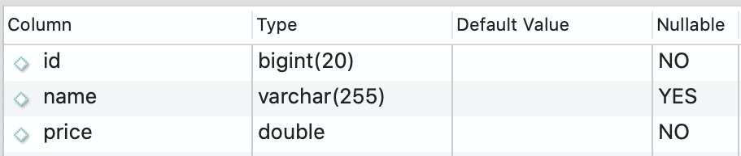
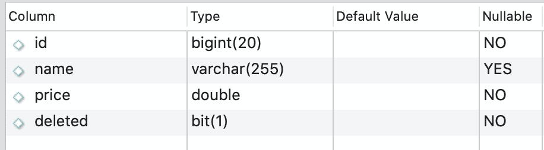

# [如何使用Spring JPA实现软删除](https://www.baeldung.com/spring-jpa-soft-delete)

1. 介绍

    物理删除表中的数据是与数据库交互时的常见要求。但有时有业务要求不要从数据库中永久删除数据。例如，这些要求需要数据历史跟踪或审计，也与参考完整性有关。

    我们可以隐藏这些数据，这样就无法从应用程序前端访问，而不是物理删除数据。

    在本教程中，我们将学习软删除以及如何使用Spring JPA实现这项技术。

2. 什么是软删除？

    软删除执行更新过程，将一些数据标记为已删除，而不是从数据库中的表格中物理删除数据。实现软删除的常见方法是添加一个字段，该字段将指示数据是否已被删除。

    例如，假设我们有一个结构如下的产品表：

    

    现在让我们来看看从表中物理删除记录时将运行的SQL命令：

    `delete from table_product where id=1`

    此SQL命令将从数据库中的表中永久删除id=1的产品。

    现在让我们来实施上面描述的软删除机制：

    

    请注意，我们添加了一个名为“deleted”的新字段。此字段将包含值0或1。

    值1表示数据已被删除，0表示数据尚未删除。我们应该将0设置为默认值，对于每个数据删除过程，我们不运行SQL删除命令，而是运行以下SQL更新命令：

    `update from table_product set deleted=1 where id=1`

    使用此SQL命令，我们实际上并没有删除该行，而只是将其标记为已删除。因此，当我们要执行读取查询时，我们只想要那些尚未删除的行，我们只应在SQL查询中添加一个过滤器：

    `select * from table_product where deleted=0`

3. 如何在Spring JPA中实现软删除

    有了Spring JPA，软删除的实施变得更加容易。为此，我们只需要几个JPA注释。

    正如我们所知，我们通常只使用几个带有JPA的SQL命令。它将在幕后创建和执行大多数SQL查询。

    现在让我们用与上述相同的表示例在Spring JPA中实现软删除。

    1. 实体类

        最重要的部分是创建实体类。

        让我们创建一个产品实体类：

        ```java
        @Entity
        @Table(name = "table_product")
        public class Product {
            @Id
            @GeneratedValue(strategy = GenerationType.IDENTITY)
            private Long id;

            private String name;

            private double price;

            private boolean deleted = Boolean.FALSE;

            // setter getter methods
        }
        ```

        如我们所见，我们添加了一个已删除的属性，默认值设置为FALSE。

        下一步将覆盖JPA存储库中的删除命令。

        默认情况下，JPA存储库中的删除命令将运行SQL删除查询，因此让我们首先向我们的实体类添加一些注释：

        ```java
        @Entity
        @Table(name = "table_product")
        @SQLDelete(sql = "UPDATE table_product SET deleted = true WHERE id=?")
        @Where(clause = "deleted=false")
        public class Product {
            @Id
            @GeneratedValue(strategy = GenerationType.IDENTITY)
            private Long id;

            private String name;

            private double price;

            private boolean deleted = Boolean.FALSE;
        
            // setter getter method
        }
        ```

        我们正在使用@SQLDelete注释来覆盖删除命令。每次我们执行删除命令时，我们实际上都会将其转换为SQL更新命令，该命令将已删除的字段值更改为true，而不是永久删除数据。

        另一方面，当我们读取产品数据时，@Where注释将添加一个过滤器。因此，根据上述代码示例，值为deleted = true的产品数据将不会包含在结果中。

    2. Repository

        存储库类中没有特殊更改，我们可以像Spring Boot应用程序中的普通存储库类一样编写它：

        `public interface ProductRepository extends CrudRepository<Product, Long>{}`

    3. Service

        同样，对于服务舱来说，还没有什么特别之处。我们可以从我们想要的存储库中调用函数。

        在本例中，让我们调用三个存储库函数来创建记录，然后执行软删除：

        ```java
        @Service
        public class ProductService {

            @Autowired
            private ProductRepository productRepository;

            public Product create(Product product) {
                return productRepository.save(product);
            }

            public void remove(Long id){
                productRepository.deleteById(id);
            }

            public Iterable<Product> findAll(){
                return productRepository.findAll();
            }
        }
        ```

4. 如何获取已删除的数据？

    通过使用@Where注释，我们无法获取已删除的产品数据，以防我们仍然希望可访问已删除的数据。这方面的一个例子是具有完全访问权限的管理员级用户，可以查看已“删除”的数据。

    为了实现这一点，我们不应该使用@Where注释，而应该使用两个不同的注释，@FilterDef和@Filter。通过这些注释，我们可以根据需要动态添加条件：

    ```java
    @Entity
    @Table(name = "tbl_products")
    @SQLDelete(sql = "UPDATE tbl_products SET deleted = true WHERE id=?")
    @FilterDef(name = "deletedProductFilter", parameters = @ParamDef(name = "isDeleted", type = "boolean"))
    @Filter(name = "deletedProductFilter", condition = "deleted = :isDeleted")
    public class Product {

        @Id
        @GeneratedValue(strategy = GenerationType.IDENTITY)
        private Long id;

        private String name;

        private double price;

        private boolean deleted = Boolean.FALSE;
    }
    ```

    在这里，@FilterDef注释定义了@Filter注释将使用的基本要求。此外，我们还需要更改ProductService服务类中的findAll（）函数来处理动态参数或过滤器：

    ```java
    @Service
    public class ProductService {

        @Autowired
        private ProductRepository productRepository;

        @Autowired
        private EntityManager entityManager;

        public Product create(Product product) {
            return productRepository.save(product);
        }

        public void remove(Long id){
            productRepository.deleteById(id);
        }

        public Iterable<Product> findAll(boolean isDeleted){
            Session session = entityManager.unwrap(Session.class);
            Filter filter = session.enableFilter("deletedProductFilter");
            filter.setParameter("isDeleted", isDeleted);
            Iterable<Product> products =  productRepository.findAll();
            session.disableFilter("deletedProductFilter");
            return products;
        }
    }
    ```

    在这里，我们添加了isDeleted参数，我们将将该参数添加到影响产品实体读取过程的对象过滤器中。

5. 结论

    使用Spring JPA很容易实现软删除技术。我们需要做的是定义一个字段，该字段将存储行是否已被删除。然后，我们必须在该特定实体类上使用@SQLDelete注释覆盖删除命令。

    如果我们想要更多控制，我们可以使用@FilterDef和@Filter注释，这样我们就可以确定查询结果是否应包含已删除的数据。
