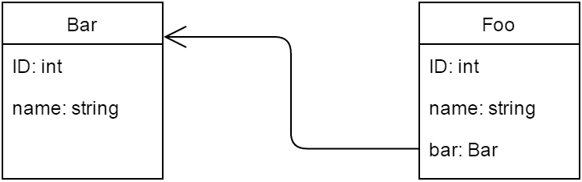

# [使用JPA、Hibernate和Spring Data JPA进行审计](https://www.baeldung.com/database-auditing-jpa)

1. 一览表

    在ORM的上下文中，数据库审计意味着跟踪和记录与持久实体相关的事件，或简单的实体版本。受SQL触发器的启发，事件是实体上的插入、更新和删除操作。数据库审计的好处与源版本控制提供的好处相似。

    在本教程中，我们将演示将审计引入应用程序的三种方法。首先，我们将使用标准JPA来实现它。接下来，我们将看看两个提供自己审计功能的JPA扩展，一个由Hibernate提供，另一个由Spring Data提供。

    以下是示例相关实体，Bar和Foo，我们将在本例中使用：

    

2. 使用JPA进行审计

    JPA没有明确包含审计API，但我们可以通过使用实体生命周期事件来实现此功能。

    1. @PrePersist、@PreUpdate和@PreRemove

        在JPA实体类中，我们可以指定一个方法作为回调，我们可以在特定实体生命周期事件期间调用该方法。由于我们对在相应的DML操作之前执行的回调感兴趣，@PrePersist、@PreUpdate和@PreRemove回调注释可用于我们的目的：

        ```java
        @Entity
        public class Bar {
            
            @PrePersist
            public void onPrePersist() { ... }
            
            @PreUpdate
            public void onPreUpdate() { ... }
            
            @PreRemove
            public void onPreRemove() { ... }
            
        }
        ```

        内部回调方法应始终返回无效，并且不接受参数。他们可以有任何名称和任何访问级别，但不应该是静态的。

        请注意，JPA中的@Version注释与我们的主题并不严格相关；它与乐观锁定有关，而不是与审计数据有关。

    2. 实现回调方法

        不过，这种方法有重大限制。如JPA 2规范（JSR 317）所述：

        > 一般来说，便携式应用程序的生命周期方法不应调用EntityManager或Query操作，访问其他实体实例，或在同一持久性上下文中修改关系。生命周期回调方法可能会修改调用它的实体的非关系状态。
        在没有审计框架的情况下，我们必须手动维护数据库模式和域模型。对于我们简单的用例，让我们向实体添加两个新属性，因为我们只能管理“实体的非关系状态”。操作属性将存储执行的操作名称，时间戳属性用于操作的时间戳：

        ```java
        @Entity
        public class Bar {
            
            //...
            
            @Column(name = "operation")
            private String operation;
            
            @Column(name = "timestamp")
            private long timestamp;
            
            //...
            
            // standard setters and getters for the new properties
            
            //...
            
            @PrePersist
            public void onPrePersist() {
                audit("INSERT");
            }
            
            @PreUpdate
            public void onPreUpdate() {
                audit("UPDATE");
            }
            
            @PreRemove
            public void onPreRemove() {
                audit("DELETE");
            }
            
            private void audit(String operation) {
                setOperation(operation);
                setTimestamp((new Date()).getTime());
            }
            
        }
        ```

        如果我们需要将此类审计添加到多个类中，我们可以使用@EntityListeners来集中代码：

        ```java
        @EntityListeners(AuditListener.class)
        @Entity
        public class Bar { ... }

        public class AuditListener {
            @PrePersist
            @PreUpdate
            @PreRemove
            private void beforeAnyOperation(Object object) { ... }
        }
        ```

3. Hibernate Envers

    借助Hibernate，我们可以利用拦截器和事件侦听器，以及数据库触发器来完成审计。但ORM框架提供了Envers，这是一个实现持久类的审计和版本管理的模块。

    1. 开始使用Envers

        要设置Envers，我们需要将休眠-envers JAR添加到我们的类路径中：

        ```xml
        <dependency>
            <groupId>org.hibernate.orm</groupId>
            <artifactId>hibernate-envers</artifactId>
            <version>6.4.4.Final</version>
        </dependency>
        ```

        然后，我们添加@Audited注释，要么在@Entity（审计整个实体），要么在特定的@Columns（如果我们只需要审计特定属性）：

        ```java
        @Entity
        @Audited
        public class Bar { ... }
        ```

        请注意，Bar与Foo有一对多的关系。在这种情况下，我们要么需要通过在Foo上添加@Audited来审核Foo，要么在Bar中的关系属性上设置@NotAudited：

        ```java
        @OneToMany(mappedBy = "bar")
        @NotAudited
        private Set<Foo> fooSet;
        ```

    2. 创建审计日志表

        有几种方法可以创建审计表：

        - 将hibernate.hbm2ddl.auto设置为创建、创建-删除或更新，这样Envers就可以自动创建它们
        - 使用org.hibernate.tool.EnversSchemaGenerator以编程方式导出完整的数据库模式
        - 设置一个蚂蚁任务来生成适当的DDL语句
        - 使用Maven插件从我们的映射（如Juplo）生成数据库模式，以导出Envers模式（适用于Hibernate 4及更高版本）

        我们将走第一条路线，因为它是最直接的，但请注意，使用hibernate.hbm2ddl.auto在生产中是不安全的。

        在我们的案例中，bar_AUD和foo_AUD（如果我们也将Foo设置为@Audited）表应该自动生成。审计表从实体表中复制所有已审计的字段，有两个字段，REVTYPE（值为：“0”用于添加，“1”用于更新，“2”用于删除实体）和REV。

        除此之外，默认情况下将生成一个名为REVINFO的额外表。它包括两个重要字段，REV和REVTSTMP，并记录每个修订的时间戳。正如我们可以猜到的那样，bar_AUD.REV和foo_AUD.REV实际上是REVINFO.REV的外来键。

    3. 配置Envers

        我们可以像任何其他Hibernate属性一样配置Envers属性。

        例如，让我们将审计表后缀（默认为“_AUD”）更改为“_AUDIT_LOG”。以下是我们如何设置相应属性org.hibernate.envers.audit_table_suffix的值：

        ```java
        Properties hibernateProperties = new Properties();
        hibernateProperties.setProperty(
        "org.hibernate.envers.audit_table_suffix", "_AUDIT_LOG");
        sessionFactory.setHibernateProperties(hibernateProperties);
        ```

        可用属性的完整列表可以在Envers文档中找到。

    4. 访问实体历史

        我们可以以类似于通过Hibernate Criteria API查询数据的方式查询历史数据。我们可以使用AuditReader接口访问实体的审计历史记录，我们可以通过AuditReaderFactory通过打开的EntityManager或Session获得该历史记录：

        `AuditReader reader = AuditReaderFactory.get(session);`

        Envers提供AuditQueryCreator（由AuditReader.createQuery（）返回），以创建特定于审计的查询。以下行将返回在修订版#2中修改的所有Bar实例（其中bar_AUDIT_LOG.REV = 2）：

        ```java
        AuditQuery query = reader.createQuery()
        .forEntitiesAtRevision(Bar.class, 2)
        ```

        以下是我们查询Bar修订版的方法。它将导致获得所有状态中所有已审计的Bar实例的列表：

        ```java
        AuditQuery query = reader.createQuery()
        .forRevisionsOfEntity(Bar.class, true, true);
        ```

        如果第二个参数为false，则结果将与REVINFO表连接。否则，只返回实体实例。最后一个参数指定是否返回已删除的条形实例。

        然后，我们可以使用AuditEntity工厂类指定约束：

        `query.addOrder(AuditEntity.revisionNumber().desc());`

4. Spring Data JPA

    Spring Data JPA是一个框架，通过在JPA提供商的顶部添加额外的抽象层来扩展JPA。此层支持通过扩展Spring JPA存储库接口来创建JPA存储库。

    出于我们的目的，我们可以扩展`CrudRepository<T，ID extends Serializable>`，这是通用CRUD操作的接口。一旦我们创建并将存储库注入另一个组件，Spring Data将自动提供实现，我们准备添加审计功能。

    1. 启用JPA审计

        首先，我们想通过注释配置启用审计。为了做到这一点，我们在@Configuration类上添加了@EnableJpaAuditing：

        ```java
        @Configuration
        @EnableTransactionManagement
        @EnableJpaRepositories
        @EnableJpaAuditing
        public class PersistenceConfig { ... }
        ```

    2. 添加Spring的实体回调侦听器

        正如我们已经知道的，JPA提供@EntityListeners注释来指定回调侦听器类。Spring Data提供自己的JPA实体侦听器类AuditingEntityListener。因此，让我们指定Bar实体的监听器：

        ```java
        @Entity
        @EntityListeners(AuditingEntityListener.class)
        public class Bar { ... }
        ```

        现在，我们可以在持续和更新Bar实体时捕获监听器的审计信息。

    3. 跟踪创建日期和最后修改日期

        接下来，我们将添加两个新属性，用于将创建的日期和上次修改的日期存储到我们的Bar实体中。属性由@CreatedDate和@LastModifiedDate注释相应地进行注释，其值会自动设置：

        ```java
        @Entity
        @EntityListeners(AuditingEntityListener.class)
        public class Bar {

            //...
            
            @Column(name = "created_date", nullable = false, updatable = false)
            @CreatedDate
            private long createdDate;

            @Column(name = "modified_date")
            @LastModifiedDate
            private long modifiedDate;
            
            //...
            
        }

        ```

        通常，我们将属性移动到基类（由@MappedSuperClass注释），我们所有的审计实体都会扩展该类。在我们的示例中，为了简单起见，我们将它们直接添加到Bar中。

    4. 使用Spring Security审核更改的作者

        如果我们的应用程序使用Spring Security，我们可以跟踪何时进行更改以及谁进行了更改：

        ```java
        @Entity
        @EntityListeners(AuditingEntityListener.class)
        public class Bar {
            
            //...
            
            @Column(name = "created_by")
            @CreatedBy
            private String createdBy;

            @Column(name = "modified_by")
            @LastModifiedBy
            private String modifiedBy;
            
            //...
            
        }
        ```

        用@CreatedBy和@LastModifiedBy注释的列填充了创建或最后修改实体的主体名称。信息来自SecurityContext的身份验证实例。如果我们想要自定义设置为注释字段的值，我们可以实现AuditorAware<T>接口：

        ```java
        public class AuditorAwareImpl implements AuditorAware<String> {

            @Override
            public String getCurrentAuditor() {
                // your custom logic
            }

        }
        ```

        为了将应用程序配置为使用AuditorAwareImpl来查找当前主体，我们声明AuditorAware类型的bean，使用AuditorAwareImpl的实例初始化，并在@EnableJpaAuditing中指定bean的名称作为auditorAwareRef参数的值：

        ```java
        @EnableJpaAuditing(auditorAwareRef="auditorProvider")
        public class PersistenceConfig {

            //...
            
            @Bean
            AuditorAware<String> auditorProvider() {
                return new AuditorAwareImpl();
            }
            
            //...
            
        }
        ```

5. 结论

    在本文中，我们考虑了实现审计功能的三种方法：

    - 纯JPA方法是最基本的，包括使用生命周期回调。然而，我们只被允许修改实体的非关系状态。这使得@PreRemove回调对我们的目的毫无用处，因为我们在方法中所做的任何设置都将与实体一起删除。
    - Envers是Hibernate提供的一个成熟的审计模块。它具有高度的可配置性，缺乏纯JPA实现的缺陷。因此，它允许我们审核删除操作，因为它会登录实体表以外的表。
    - Spring Data JPA方法抽象了使用JPA回调的工作，并为审计属性提供了方便的注释。它还准备好与Spring Security集成。缺点是它继承了JPA方法的相同缺陷，因此无法对删除操作进行审计。
