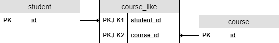
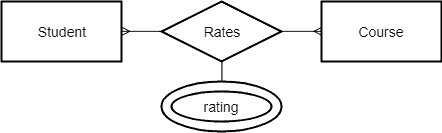
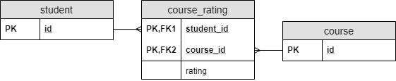
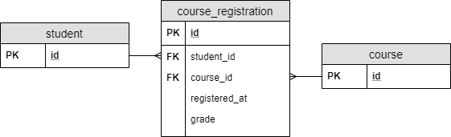

# [JPA中的多对多关系](https://www.baeldung.com/jpa-many-to-many)

1. 一览表

    在本教程中，我们将看到使用JPA处理多对多关系的多种方法。

    我们将使用学生、课程以及他们之间的各种关系的模型。

    为了简单起见，在代码示例中，我们将只显示与多对多关系相关的属性和JPA配置。

2. 基本多对多

    1. 模拟多对多关系

        关系是两种实体之间的联系。在多对多关系的情况下，双方都可以与另一方的多个实例相关联。

        请注意，实体类型有可能与自身建立关系。想想建模家谱的例子：每个节点都是一个人，所以如果我们谈论亲子关系，两个参与者都将是一个人。

        然而，我们谈论的是单一实体类型还是多个实体类型之间的关系没有区别。由于思考两种不同实体类型之间的关系更容易，我们将用它来说明我们的案例。

        让我们以学生标记他们喜欢的课程为例。

        一个学生可以喜欢很多课程，许多学生可以喜欢同一门课程。

        正如我们所知，在RDBMS中，我们可以与外键建立关系。由于双方都应该能够引用对方，我们需要创建一个单独的表来持有外键：

        

        这样的表被称为连接表。在连接表中，外键的组合将是其复合主键。

    2. 在JPA中实施

        模拟与POJO的多对多关系很容易。我们应该在两个类中包含一个集合，其中包含其他类的元素。

        之后，我们需要用@Entity标记类，用@Id标记主键，使它们成为适当的JPA实体。

        此外，我们应该配置关系类型。因此，我们用@ManyToMany注释标记集合：

        ```java
        @Entity
        class Student {

            @Id
            Long id;

            @ManyToMany
            Set<Course> likedCourses;

            // additional properties
            // standard constructors, getters, and setters
        }

        @Entity
        class Course {

            @Id
            Long id;

            @ManyToMany
            Set<Student> likes;

            // additional properties
            // standard constructors, getters, and setters
        }
        ```

        此外，我们必须配置如何在RDBMS中对关系进行建模。

        所有者一方是我们配置关系的地方。我们将使用学生班。

        我们可以在学生课堂上用@JoinTable注释来做到这一点。我们提供加入表（course_like）的名称以及带有@JoinColumn注释的外键。joinColumn属性将连接到关系的所有者侧，逆JoinColumn将连接到另一侧：

        ```java
        @ManyToMany
        @JoinTable(
        name = "course_like", 
        joinColumns = @JoinColumn(name = "student_id"), 
        inverseJoinColumns = @JoinColumn(name = "course_id"))
        Set<Course> likedCourses;
        ```

        请注意，不需要使用@JoinTable甚至@JoinColumn。JPA将为我们生成表和列名。然而，JPA使用的策略并不总是与我们使用的命名惯例相匹配。因此，我们需要配置表和列名的可能性。

        在目标方面，我们只需要提供字段的名称，该字段映射了关系。

        因此，我们在课程类中设置了@ManyToMany注释的mappedBy属性：

        ```java
        @ManyToMany(mappedBy = "likedCourses")
        Set<Student> likes;
        ```

        请记住，由于多对多关系在数据库中没有所有者侧，我们可以在课程类中配置连接表，并从学生类中引用它。

3. 使用复合密钥进行多对多

    1. 建模关系属性

        比方说，我们想让学生对课程进行评分。学生可以对任意数量的课程进行评分，任何数量的学生都可以对同一课程进行评分。因此，这也是一种多对多的关系。

        使这个例子更复杂的是，评级关系不仅仅是它存在的事实。我们需要存储学生在课程中给出的评分分数。

        我们可以在哪里存储这些信息？我们不能把它放在学生实体中，因为学生可以对不同的课程进行不同的评级。同样，将其存储在课程实体中也不是一个好的解决方案。

        这是一种关系本身具有属性的情况。

        使用此示例，将属性附加到关系在ER图中如下所示：

        

        我们可以以几乎与简单的多对多关系相同的方式建模它。唯一的区别是，我们在连接表上附加了一个新属性：

        

    2. 在JPA中创建复合密钥

        一个简单的多对多关系的实现相当直接。唯一的问题是，我们不能以这种方式将属性添加到关系中，因为我们直接连接了实体。因此，我们没有办法在关系本身中添加属性。

        由于我们将DB属性映射到JPA中的类字段，我们需要为该关系创建一个新的实体类。

        当然，每个JPA实体都需要一个主密钥。由于我们的主键是一个复合键，我们必须创建一个新类，该类将包含键的不同部分：

        ```java
        @Embeddable
        class CourseRatingKey implements Serializable {

            @Column(name = "student_id")
            Long studentId;

            @Column(name = "course_id")
            Long courseId;

            // standard constructors, getters, and setters
            // hashcode and equals implementation
        }
        ```

        请注意，复合密钥类必须满足一些密钥要求：

        - 我们必须用@Embeddable来标记它。
        - 它必须实现java.io.Serializable。
        - 我们需要提供hashcode（）和equals（）方法的实现。

    3. 在JPA中使用复合密钥

        使用此复合密钥类，我们可以创建实体类，该类对连接表进行建模：

        ```java
        @Entity
        class CourseRating {

            @EmbeddedId
            CourseRatingKey id;

            @ManyToOne
            @MapsId("studentId")
            @JoinColumn(name = "student_id")
            Student student;

            @ManyToOne
            @MapsId("courseId")
            @JoinColumn(name = "course_id")
            Course course;

            int rating;
            
            // standard constructors, getters, and setters
        }
        ```

        此代码与常规实体实现非常相似。然而，我们有一些关键的区别：

        - 我们使用@EmbeddedId来标记主键，这是CourseRatingKey类的实例。
        - 我们用@MapsId标记了学生和课程字段。

        @MapsId表示我们将这些字段绑定到密钥的一部分，它们是多对一关系的外键。

        在此之后，我们可以像以前一样在学生和课程实体中配置反向引用：

        ```java
        class Student {

            // ...

            @OneToMany(mappedBy = "student")
            Set<CourseRating> ratings;

            // ...
        }

        class Course {

            // ...

            @OneToMany(mappedBy = "course")
            Set<CourseRating> ratings;

            // ...
        }
        ```

        请注意，还有一种使用复合键的替代方法： @IdClass 注释。

    4. 进一步的特征

        我们将学生和课程的关系配置为@ManyToOne。我们可以这样做，因为通过新实体，我们在结构上将多对多关系分解为两个多对一的关系。

        我们为什么能够这样做？如果我们在前一种情况下仔细检查表格，我们可以看到它包含两个多对一的关系。换句话说，RDBMS中没有任何多对多的关系。我们把用连接表创建的结构称为多对多关系，因为这就是我们的模型。

        此外，如果我们谈论多对多关系，那就更清楚了，因为这是我们的意图。与此同时，连接表只是一个实现细节；我们并不真正关心它。

        此外，这个解决方案还有一个我们尚未提及的附加功能。简单的多对多解决方案在两个实体之间建立了一种关系。因此，我们不能将关系扩展到更多的实体。但我们在这个解决方案中没有这个限制：我们可以对任意数量的实体类型之间的关系进行建模。

        例如，当多位教师可以教授一门课程时，学生可以对特定教师如何教授特定课程进行评分。这样，评级将是三个实体之间的关系：学生、课程和教师。

4. 与新实体的多对多

    1. 建模关系属性

        比方说，我们想让学生注册课程。此外，我们需要存储学生注册特定课程的要点。除此之外，我们想存储她在课程中获得的成绩。

        在一个理想的世界里，我们可以用之前的解决方案解决这个问题，在那里我们有一个具有复合密钥的实体。然而，世界远非理想，学生并不总是第一次尝试就完成一门课程。

        在这种情况下，同一学生-课程对或多行之间存在多个连接，具有相同的student_id-course_id对。我们无法使用之前的任何解决方案对它进行建模，因为所有主键都必须是唯一的。所以，我们需要使用一个单独的主键。

        因此，我们可以引入一个实体，它将持有注册的属性：

        

        在这种情况下，注册实体代表其他两个实体之间的关系。

        由于它是一个实体，它将有自己的主密钥。

        在之前的解决方案中，请记住，我们有一个由两个外键创建的复合主键。

        现在，这两个外键将不是主键的一部分：

        

    2. 在JPA中实施

        由于course_registration变成了一个常规表，我们可以创建一个普通的旧JPA实体来建模它：

        ```java
        @Entity
        class CourseRegistration {

            @Id
            Long id;

            @ManyToOne
            @JoinColumn(name = "student_id")
            Student student;

            @ManyToOne
            @JoinColumn(name = "course_id")
            Course course;

            LocalDateTime registeredAt;

            int grade;
            
            // additional properties
            // standard constructors, getters, and setters
        }
        ```

        我们还需要配置学生和课程课程的关系：

        ```java
        class Student {

            // ...

            @OneToMany(mappedBy = "student")
            Set<CourseRegistration> registrations;

            // ...
        }

        class Course {

            // ...

            @OneToMany(mappedBy = "course")
            Set<CourseRegistration> registrations;

            // ...
        }
        ```

        同样，我们早些时候配置了关系，所以我们只需要告诉JPA在哪里可以找到该配置。

        我们还可以用这个解决方案来解决之前学生对课程进行评级的问题。然而，除非我们必须创建专用主密钥，否则感觉很奇怪。

        此外，从RDBMS的角度来看，这没有什么意义，因为结合两个外键就形成了一个完美的复合键。此外，该复合密钥具有明确的含义：我们在关系中连接哪些实体。

        否则，在这两种实现之间做出选择通常只是个人偏好。

5. 结论

在本文中，我们看到了什么是多对多关系，以及如何使用JPA在RDBMS中对多关系进行建模。

我们看到了在JPA中建模的三种方法。在这些方面，这三者和劣势都有不同的优点和劣势：

- 代码清晰度
- DB清晰度
- 为关系分配属性的能力
- 我们可以与该关系链接多少个实体
- 支持同一实体之间的多个连接
