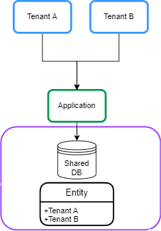

# [带有Spring Data JPA的多租户](https://www.baeldung.com/multitenancy-with-spring-data-jpa)

1. 一览表

    多租户是指软件应用程序的单个实例为多个租户或客户提供服务的架构。它允许租户之间实现所需的隔离程度，以便租户使用的数据和资源与其他数据和资源分开。在本教程中，我们将了解如何使用Spring Data JPA在Spring Boot应用程序中配置多租户。此外，我们为使用JWT的租户增加了安全性。

2. 多租户模式

    多租户(multi-tenant)系统有三种主要方法：

    - 单独的数据库(Database)
    - 共享数据库和独立模式(Schema)
    - 共享数据库和共享模式

    1. 单独的数据库

        在这种方法中，每个租户的数据都保存在单独的数据库实例中，并与其他租户隔离。这也被称为每个租户的数据库：

        

    2. 共享数据库和独立模式

        在这种方法中，每个租户的数据都保存在共享数据库上的一个不同的模式中。这有时被称为每租户的模式：

        

    3. 共享数据库和共享模式

        在这种方法中，所有租户共享一个数据库，每个表都有一个带有租户标识符的列：

        

3. Maven附属机构

    让我们从在pom.xml中的Spring Boot应用程序中声明spring-boot-starter-data-jpa依赖性开始：

    ```xml
    <dependency>
        <groupId>org.springframework.boot</groupId>
        <artifactId>spring-boot-starter-data-jpa</artifactId>
    </dependency>
    ```

    此外，我们将使用PostgreSQL数据库，因此让我们也向pom.xml文件添加postgresql依赖项：

    ```xml
    <dependency>
        <groupId>org.postgresql</groupId>
        <artifactId>postgresql</artifactId>
        <scope>runtime</scope>
    </dependency>
    ```

    分离数据库和共享数据库以及分离模式方法在Spring Boot应用程序中的配置相似。在本教程中，我们专注于分离数据库的方法。

4. 动态数据源路由

    在本节中，我们将描述每个租户模型数据库背后的一般想法。

    1. 抽象路由数据源

        使用Spring Data JPA实现多租户的一般想法是根据当前租户标识符在运行时路由数据源。为了做到这一点，我们可以使用[AbstractRoutingDatasource](https://www.baeldung.com/spring-abstract-routing-data-source)根据当前租户动态确定实际数据源。让我们创建一个MultitenantDataSource类，扩展AbstractRoutingDataSource类：

        ```java
        public class MultitenantDataSource extends AbstractRoutingDataSource {
            @Override
            protected String determineCurrentLookupKey() {
                return TenantContext.getCurrentTenant();
            }
        }
        ```

        AbstractRoutingDataSource根据查找键将getConnection调用路由到各种目标数据源之一。查找密钥通常通过一些线程绑定的事务上下文来确定。因此，我们创建aTenantContext类，用于在每个请求中存储当前租户：

        ```java
        public class TenantContext {

            private static final ThreadLocal<String> CURRENT_TENANT = new ThreadLocal<>();

            public static String getCurrentTenant() {
                return CURRENT_TENANT.get();
            }

            public static void setCurrentTenant(String tenant) {
                CURRENT_TENANT.set(tenant);
            }
        }
        ```

        我们使用[ThreadLocal](https://www.baeldung.com/java-threadlocal)对象来保留当前请求的租户ID。此外，我们使用set方法存储租户ID，使用get()方法来检索它。

    2. 根据请求设置租户ID

        设置完此配置后，当我们执行任何租户操作时，我们需要在创建任何事务之前知道租户ID。因此，在点击控制器端点之前，我们需要在[过滤器](https://www.baeldung.com/spring-boot-add-filter)或[拦截器](https://www.baeldung.com/spring-mvc-handlerinterceptor)中设置租户ID。让我们添加一个TenantFilter，在TenantContext中设置当前租户：

        ```java
        @Component
        @Order(1)
        class TenantFilter implements Filter {

            @Override
            public void doFilter(ServletRequest request, ServletResponse response,
            FilterChain chain) throws IOException, ServletException {

                HttpServletRequest req = (HttpServletRequest) request;
                String tenantName = req.getHeader("X-TenantID");
                TenantContext.setCurrentTenant(tenantName);

                try {
                    chain.doFilter(request, response);
                } finally {
                    TenantContext.setCurrentTenant("");
                }
            }
        }
        ```

        在此过滤器中，我们从请求标头X-TenantID获取租户ID，并在TenantContext中设置。我们通过过滤器链传递控制。我们最终的块确保在下一个请求之前重置当前租户。这避免了跨租户请求污染的任何风险。在下一节中，我们将在每个租户模型的数据库中实现租户和数据源声明。

5. 数据库方法

    在本节中，我们将基于每个租户的数据库模型实现多租户。

    1. 租户声明

        我们在这种方法中拥有多个数据库，因此我们需要在Spring Boot应用程序中声明多个数据源。我们可以在单独的租户文件中配置数据源。因此，我们在allTenants目录中创建tenant_1.properties文件，并声明租户的数据源：

        ```properties
        name=tenant_1
        datasource.url=jdbc:postgresql://localhost:5432/tenant1
        datasource.username=postgres
        datasource.password=123456
        datasource.driver-class-name=org.postgresql.Driver
        ```

        此外，我们为另一个租户创建一个tenant_2.properties文件：

        ```properties
        name=tenant_2
        datasource.url=jdbc:postgresql://localhost:5432/tenant2
        datasource.username=postgres
        datasource.password=123456
        datasource.driver-class-name=org.postgresql.Driver
        ```

        我们最终将为每个租户提供一个文件。

    2. 数据源声明

        现在我们需要读取租户的数据，并使用DataSourceBuilder类创建DataSource。此外，我们在AbstractRoutingDataSource类中设置了DataSources。让我们为此添加一个MultitenantConfiguration类：

        ```java
        @Configuration
        public class MultitenantConfiguration {

            @Value("${defaultTenant}")
            private String defaultTenant;

            @Bean
            @ConfigurationProperties(prefix = "tenants")
            public DataSource dataSource() {
                File[] files = Paths.get("allTenants").toFile().listFiles();
                Map<Object, Object> resolvedDataSources = new HashMap<>();

                for (File propertyFile : files) {
                    Properties tenantProperties = new Properties();
                    DataSourceBuilder dataSourceBuilder = DataSourceBuilder.create();

                    try {
                        tenantProperties.load(new FileInputStream(propertyFile));
                        String tenantId = tenantProperties.getProperty("name");

                        dataSourceBuilder.driverClassName(tenantProperties.getProperty("datasource.driver-class-name"));
                        dataSourceBuilder.username(tenantProperties.getProperty("datasource.username"));
                        dataSourceBuilder.password(tenantProperties.getProperty("datasource.password"));
                        dataSourceBuilder.url(tenantProperties.getProperty("datasource.url"));
                        resolvedDataSources.put(tenantId, dataSourceBuilder.build());
                    } catch (IOException exp) {
                        throw new RuntimeException("Problem in tenant datasource:" + exp);
                    }
                }

                AbstractRoutingDataSource dataSource = new MultitenantDataSource();
                dataSource.setDefaultTargetDataSource(resolvedDataSources.get(defaultTenant));
                dataSource.setTargetDataSources(resolvedDataSources);

                dataSource.afterPropertiesSet();
                return dataSource;
            }

        }
        ```

        首先，我们从allTenants目录中读取租户的定义，并使用DataSourceBuilder类创建DataSource bean。之后，我们需要为MultitenantDataSource类设置默认数据源和目标源，分别使用setDefaultTargetDataSource和setTargetDataSources进行连接。我们使用defaultTenant属性将其中一个租户的名称设置为application.properties文件的默认数据源。为了完成数据源的初始化，我们调用afterPropertiesSet()方法。现在我们的设置已经准备好了。

6. 测试

    1. 为租户创建数据库

        首先，我们需要在PostgreSQL中定义两个数据库：租户-数据库之后，我们使用以下脚本在每个数据库中创建一个员工表：

        `create table employee (id int8 generated by default as identity, name varchar(255), primary key (id));`

    2. 样本控制器

        让我们创建一个EmployeeController类，用于在请求标头的指定租户中创建和保存Employee实体：

        ```java
        @RestController
        @Transactional
        public class EmployeeController {

            @Autowired
            private EmployeeRepository employeeRepository;

            @PostMapping(path = "/employee")
            public ResponseEntity<?> createEmployee() {
                Employee newEmployee = new Employee();
                newEmployee.setName("Baeldung");
                employeeRepository.save(newEmployee);
                return ResponseEntity.ok(newEmployee);
            }
        }
        ```

    3. 请求示例

        让我们创建一个帖子请求，使用Postman在租户ID tenant_1中插入员工实体：租户1此外，我们向租户_2发送请求：租户2之后，当我们检查数据库时，我们看到每个请求都已保存在相关租户的数据库中。

7. 安全

    多租户应在共享环境中保护客户的数据。这意味着每个租户只能访问他们的数据。因此，我们需要为我们的租户增加安全保障。让我们建立一个系统，用户必须登录应用程序并获得JWT，然后用于证明访问租赁的权利。

    1. Maven附属机构

        让我们从在pom.xml中添加spring-boot-starter-security依赖项开始：

        ```xml
        <dependency>
            <groupId>org.springframework.boot</groupId>
            <artifactId>spring-boot-starter-security</artifactId>
        </dependency>
        ```

        此外，我们需要生成和验证JWT。为此，我们将jjwt添加到我们的pom.xml中：

        ```xml
        <dependency>
            <groupId>io.jsonwebtoken</groupId>
            <artifactId>jjwt-api</artifactId>
            <version>0.12.3</version>
        </dependency>
        ```

    2. 安全配置

        首先，我们需要为租户的用户提供身份验证功能。为了简单起见，让我们在SecurityConfiguration类中使用内存中的用户声明。从Spring Security 5.7.0-M2开始，ClassWebSecurityConfigurerAdapter被弃用，并鼓励转向基于组件的安全配置。让我们用UserDetails创建一个bean：

        ```java
        @Bean
        public InMemoryUserDetailsManager userDetailsService() {
            UserDetails user1 = User
            .withUsername("user")
            .password(passwordEncoder().encode("baeldung"))
            .roles("tenant_1")
            .build();

            UserDetails user2 = User
            .withUsername("admin")
            .password(passwordEncoder().encode("baeldung"))
            .roles("tenant_2")
            .build();
            return new InMemoryUserDetailsManager(user1, user2);
        }
        ```

        我们为两个租户添加了两个用户。此外，我们将租户视为一个角色。根据上述代码，用户名用户和管理员可以分别访问tenant_1和tenant_2。现在，我们为用户身份验证创建了一个过滤器。让我们添加登录过滤类：

        ```java
        public class LoginFilter extends AbstractAuthenticationProcessingFilter {

            public LoginFilter(String url, AuthenticationManager authManager) {
                super(new AntPathRequestMatcher(url));
                setAuthenticationManager(authManager);
            }

            @Override
            public Authentication attemptAuthentication(HttpServletRequest req, HttpServletResponse res)
            throws AuthenticationException, IOException, ServletException {

                AccountCredentials creds = new ObjectMapper().
                readValue(req.getInputStream(), AccountCredentials.class);

                return getAuthenticationManager().authenticate(
                new UsernamePasswordAuthenticationToken(creds.getUsername(),
                    creds.getPassword(), Collections.emptyList())
                );
            }
        }
        ```

        LoginFilter类扩展了AbstractAuthenticationProcessingFilter。AbstractAuthenticationProcessingFilter拦截请求，并尝试使用atpriteAuthentication（）方法执行身份验证。在此方法中，我们将用户凭据映射到AccountCredentials DTO类，并针对内存身份验证管理器对用户进行身份验证：

        ```java
        public class AccountCredentials {

            private String username;
            private String password;

        // getter and setter methods
        }
        ```

    3. JWT

        现在我们需要生成JWT并添加租户ID。为此，我们覆盖了successfulAuthentication（）方法。此方法在认证成功后执行：

        ```java
        @Override
        protected void successfulAuthentication(HttpServletRequest req, HttpServletResponse res,
        FilterChain chain, Authentication auth) throws IOException, ServletException {

            Collection<? extends GrantedAuthority> authorities = auth.getAuthorities();
            String tenant = "";
            for (GrantedAuthority gauth : authorities) {
                tenant = gauth.getAuthority();
            }

            AuthenticationService.addToken(res, auth.getName(), tenant.substring(5));
        }
        ```

        根据上述代码，我们获取用户的角色并将其添加到JWT中。为此，我们创建AuthenticationService类和addToken（）方法：

        ```java
        public class AuthenticationService {

            private static final long EXPIRATIONTIME = 864_000_00; // 1 day in milliseconds
            private static final String SECRETKEY = "q3t6w9zCFJNcQfTjWnq3t6w9zCFJNcQfTjWnZr4u7xADGKaPd";
            private static final SecretKey SIGNINGKEY = Keys.hmacShaKeyFor(SECRETKEY.getBytes(StandardCharsets.UTF_8));
            private static final String PREFIX = "Bearer";

            public static void addToken(HttpServletResponse res, String username, String tenant) {
                String JwtToken = Jwts.builder()
                .subject(username)
                .audience().add(tenant).and()
                .issuedAt(new Date(System.currentTimeMillis()))
                .expiration(new Date(System.currentTimeMillis() + EXPIRATIONTIME))
                .signWith(SIGNINGKEY)
                .compact();
                res.addHeader("Authorization", PREFIX + " " + JwtToken);
            }
        }
        ```

        addToken方法生成了包含租户ID作为受众声明的JWT，并将其添加到响应中的授权标头中。最后，我们在SecurityConfiguration类中添加了LoginFilter。正如我们上面提到的，关于WebSecurityConfigurerAdapter的弃用。通过这种方式，我们将创建一个具有所有配置的bean：

        ```java
        @Bean
        public SecurityFilterChain filterChain(HttpSecurity http) throws Exception {
            final AuthenticationManager authenticationManager = authenticationManager(http.getSharedObject(AuthenticationConfiguration.class));
            http
            .authorizeHttpRequests(authorize ->
                authorize.requestMatchers("/login").permitAll().anyRequest().authenticated())
            .sessionManagement(securityContext -> securityContext.sessionCreationPolicy(SessionCreationPolicy.STATELESS))
            .addFilterBefore(new LoginFilter("/login", authenticationManager), UsernamePasswordAuthenticationFilter.class)
            .addFilterBefore(new AuthenticationFilter(), UsernamePasswordAuthenticationFilter.class)
            .csrf(csrf -> csrf.disable())
            .headers(header -> header.frameOptions(HeadersConfigurer.FrameOptionsConfig::disable))
            .httpBasic(Customizer.withDefaults());

            return http.build();
        }
        ```

        此外，我们添加了AuthenticationFilter类，用于在SecurityContextHolder类中设置身份验证：

        ```java
        public class AuthenticationFilter extends GenericFilterBean {

            @Override
            public void doFilter(ServletRequest req, ServletResponse res, FilterChain chain)
            throws IOException, ServletException {

                Authentication authentication = AuthenticationService.getAuthentication((HttpServletRequest) req);
                SecurityContextHolder.getContext().setAuthentication(authentication);

                chain.doFilter(req, res);
            }
        }
        ```

    4. 从JWT获取租户ID

        让我们修改TenantFilter，在TenantContext中设置当前租户：

        ```java
        String tenant = AuthenticationService.getTenant((HttpServletRequest) req);
        TenantContext.setCurrentTenant(tenant);
        ```

        在这种情况下，我们使用AuthenticationServiceclass的getTenant（）方法从JWT获取租户ID：

        ```java
        public static String getTenant(HttpServletRequest req) {
            String token = req.getHeader("Authorization");
            if (token == null) {
                return null;
            }
            String tenant = Jwts.parser()
            .setSigningKey(SIGNINGKEY)
            .build().parseClaimsJws(token.replace(PREFIX, "").trim())
            .getBody()
            .getAudience()
                .iterator()
                .next();
            return tenant;
        }
        ```

8. 安全测试

    1. JWT一代

        让我们为用户名用户生成JWT。为此，我们将凭据发布到/登录端点：Jwt让我们检查一下令牌：

        `eyJhbGciOiJIUzUxMiJ9.eyJzdWIiOiJ1c2VyIiwiYXVkIjoidGVuYW50XzEiLCJleHAiOjE2NTk2MDk1Njd9.`

        当我们解码令牌时，我们会发现租户ID设置为受众声明：

        ```json
        {
        "sub": "user",
        "aud": [
            "tenant_1"
        ],
        "iat": 1705473402,
        "exp": 1705559802
        }
        ```

    2. 请求示例

        让我们创建一个帖子请求，以使用生成的令牌插入员工实体：样本令牌我们在授权标头中设置生成的令牌。租户ID已从令牌中提取，并在TenantContext中设置。
