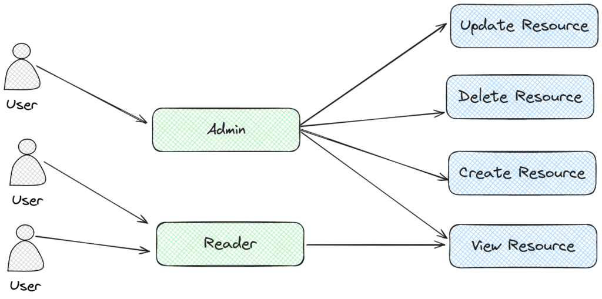
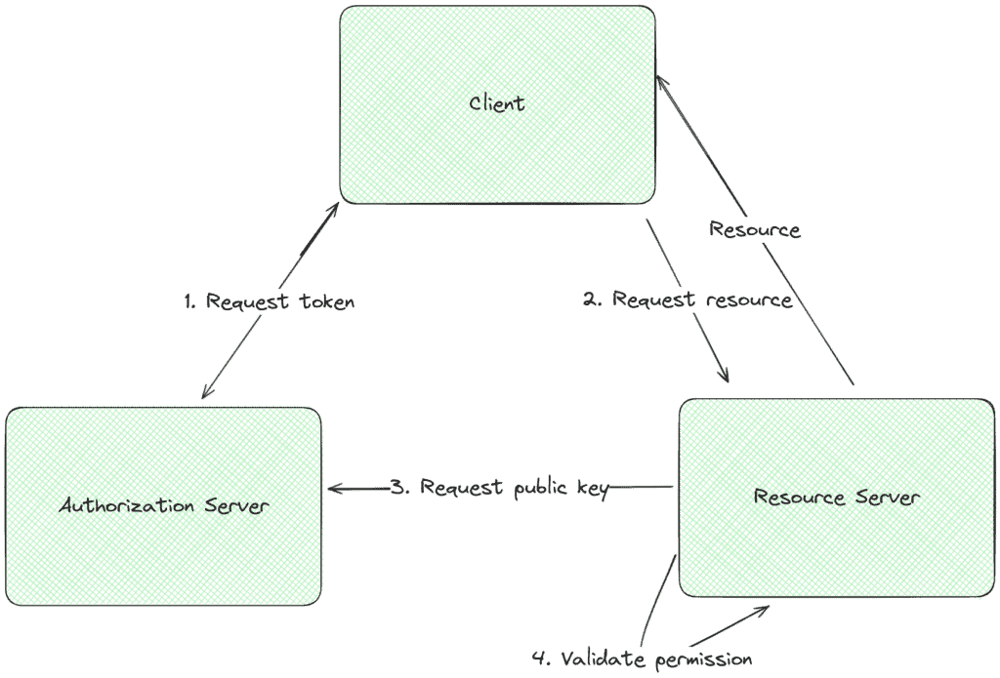
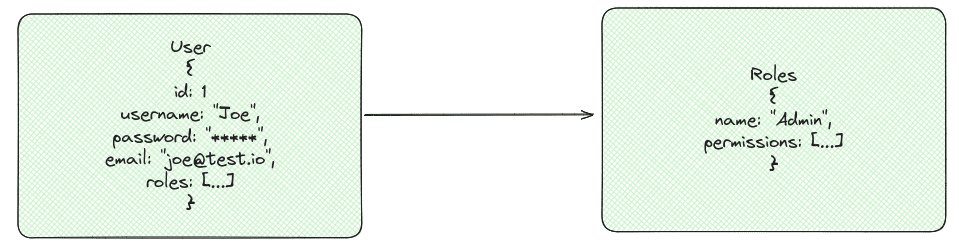

# Quarkus 中基于角色的访问控制

1. 概述

    在本教程中，我们将讨论基于角色的访问控制（RBAC）以及如何使用 [Quarkus](https://quarkus.io/) 实现该功能。

    RBAC 是实现复杂安全系统的著名机制。Quarkus 是一个现代的云原生全栈 Java 框架，开箱即支持 RBAC。

    在我们开始之前，有一点很重要，那就是角色可以有多种应用方式。在企业中，角色通常只是权限的集合，用于识别用户可以执行的特定操作组。在 [Jakarta](https://www.baeldung.com/java-enterprise-evolution) 中，角色是允许执行资源操作的标签（相当于权限）。实现 RBAC 系统的方法多种多样。

    在本教程中，我们将使用分配给资源的权限来控制访问，而角色将对权限列表进行分组。

2. 基于角色的访问控制

    基于角色的访问控制是一种根据预定义权限授予应用程序用户访问权限的安全模型。系统管理员可以在尝试访问时为特定资源分配和验证这些权限。为帮助管理权限，系统管理员会创建角色对权限进行分组：

    

    为了演示使用 Quarkus 实施 RBAC 系统，我们还需要一些其他工具，如 JSON Web 标记（JWT）、JPA 和 Quarkus 安全模块。JWT 可以帮助我们实现一种简单、自足的身份验证和授权方式，因此为了简单起见，我们将在示例中使用它。同样，JPA 将帮助我们处理领域逻辑与数据库之间的通信，而 Quarkus 则是所有这些组件的粘合剂。

3. JWT

    JSON Web 标记（JWT）是在用户和服务器之间以紧凑、URL 安全的 JSON 对象传输信息的一种安全手段。这种令牌通过数字签名进行验证，通常用于网络应用程序中的身份验证和安全数据交换。在身份验证过程中，服务器会发出一个 JWT，其中包含用户的身份和声明，客户端将在随后的请求中使用该 JWT 来访问受保护的资源。

    

    客户端通过提供一些凭据来请求令牌，然后授权服务器提供已签名的令牌；之后，在尝试访问资源时，客户端提供 JWT 令牌，资源服务器根据所需的权限对其进行验证和确认。考虑到这些基本概念，让我们来探讨如何在 Quarkus 应用程序中集成 RBAC 和 JWT。

4. 数据设计

    为了简单起见，我们将创建一个基本的 RBAC 系统用于本示例。为此，我们使用以下表格：

    

    这样我们就可以表示用户、他们的角色以及构成每个角色的权限。JPA 数据库表将代表我们的领域对象：

    main/.quarkus.rbac.users/User.java

    用户表保存登录凭证以及用户和角色之间的关系：

    main/.quarkus.rbac.users/Role.java

    同样，为了保持简单，权限使用逗号分隔值存储在一列中，为此，我们使用了 PermissionConverter。

5. JSON 网络令牌和 Quarkus

    在凭证方面，要使用 JWT 令牌并启用登录，我们需要以下依赖项：

    ```xml
    <dependency>
        <groupId>io.quarkus</groupId>
        <artifactId>quarkus-smallrye-jwt-build</artifactId>
        <version>3.9.4</version>
    </dependency>
    <dependency>
        <groupId>io.quarkus</groupId>
        <artifactId>quarkus-smallrye-jwt</artifactId>
        <version>3.9.4</version>
    </dependency>
    <dependency>
        <groupId>io.quarkus</groupId>
        <artifactId>quarkus-test-security</artifactId>
        <scope>test</scope>
        <version>3.9.4</version>
    </dependency>
    <dependency>
        <groupId>io.quarkus</groupId>
        <artifactId>quarkus-test-security-jwt</artifactId>
        <scope>test</scope>
        <version>3.9.4</version>
    </dependency>
    ```

    这些模块为我们提供了实现令牌生成、权限验证和测试实现的工具。现在，为了定义依赖关系和 Quarkus 版本，我们将使用 [BOM 父类](https://mvnrepository.com/artifact/io.quarkus/quarkus-bom)，其中包含与框架兼容的特定版本。在本例中，我们需要

    - [quarkus-smallrye-jwt-build](https://mvnrepository.com/artifact/io.quarkus/quarkus-smallrye-jwt-build)
    - [quarkus-smallrye-jwt](https://mvnrepository.com/artifact/io.quarkus/quarkus-smallrye-jwt)
    - [quarkus-test-security](https://mvnrepository.com/artifact/io.quarkus/quarkus-test-security)
    - [quarkus-test-security-jwt](https://mvnrepository.com/artifact/io.quarkus/quarkus-test-security-jwt)

    接下来，为了实现令牌签名，我们需要 RSA [公钥和私钥](https://www.baeldung.com/linux/ssh-setup-public-key-auth)。Quarkus 有一种简单的配置方法。生成后，我们必须配置以下属性：

    ```properties
    mp.jwt.verify.publickey.location=publicKey.pem
    mp.jwt.verify.issuer=my-issuer
    smallrye.jwt.sign.key.location=privateKey.pem
    ```

    默认情况下，Quarkus 会查看 /resources 或提供的绝对路径。框架会使用密钥签署声明并验证令牌。

6. 凭证

    现在，为了创建 JWT 令牌并设置其权限，我们需要验证用户的凭据。下面的代码就是一个例子：

    ```java
    @Path("/secured")
    public class SecureResourceController {
        // other methods...
        @POST
        @Path("/login")
        @Consumes(MediaType.APPLICATION_JSON)
        @Produces(MediaType.APPLICATION_JSON)
        @PermitAll
        public Response login(@Valid final LoginDto loginDto) {
            if (userService.checkUserCredentials(loginDto.username(), loginDto.password())) {
                User user = userService.findByUsername(loginDto.username());
                String token = userService.generateJwtToken(user);
                return Response.ok().entity(new TokenResponse("Bearer " + token,"3600")).build();
            } else {
                return Response.status(Response.Status.UNAUTHORIZED).entity(new Message("Invalid credentials")).build();
            }
        }
    }
    ```

    登录端点验证用户凭据，并在成功时将令牌作为响应发出。另一个值得注意的地方是 @PermitAll，它确保该端点是公共的，不需要任何身份验证。不过，我们很快就会详细介绍权限问题。

    在这里，我们要特别注意的另一段重要代码是 generateJwtToken 方法，它用于创建和签署令牌。

    ```java
    public String generateJwtToken(final User user) {
        Set<String> permissions = user.getRoles()
        .stream()
        .flatMap(role -> role.getPermissions().stream())
        .map(Permission::name)
        .collect(Collectors.toSet());

        return Jwt.issuer(issuer)
        .upn(user.getUsername())
        .groups(permissions)
        .expiresIn(3600)
        .claim(Claims.email_verified.name(), user.getEmail())
        .sign();
    }
    ```

    在此方法中，我们检索每个角色提供的权限列表，并将其注入令牌。发行者也会定义令牌、重要声明和存活时间，最后，我们会签署令牌。用户收到令牌后，就可以用它来验证所有后续调用。令牌包含服务器验证和授权相应用户所需的所有信息。用户只需将承载令牌发送到 "验证 "标头，即可验证呼叫。

7. 权限

    如前所述，Jakarta 使用 @RolesAllowed 为资源分配权限。虽然它将其称为角色，但其工作方式与权限类似（考虑到我们之前定义的概念），这意味着我们只需用它来注释端点以确保其安全，例如

    main/.quarkus.rbac.api/SecureResourceController.java

    看看这段代码，我们就会发现为端点添加权限控制是多么简单。在我们的例子中，/secured/resource/user 现在需要 VIEW_USER_DETAILS 权限，而 /secured/resourcecerequires 需要 VIEW_ADMIN_DETAILS。我们还可以看到，可以分配一系列权限，而不是只有一个。在这种情况下，Quarkus 将需要 @RolesAllowed 中列出的至少一个权限。

    另一个重要说明是，令牌包含当前登录用户（安全身份中的委托人）的权限和信息。

8. 测试

    Quarkus 提供了许多工具，使测试应用程序变得简单易行。使用这些工具，我们可以配置 JWT 的创建和设置及其上下文，使测试意图清晰易懂。下面的测试就展示了这一点：

    ```java
    @QuarkusTest
    class SecureResourceControllerTest {
        @Test
        @TestSecurity(user = "user", roles = "VIEW_USER_DETAILS")
        @JwtSecurity(claims = {
            @Claim(key = "email", value = "user@test.io")
        })
        void givenSecureAdminApi_whenUserTriesToAccessAdminApi_thenShouldNotAllowRequest() {
            given()
            .contentType(ContentType.JSON)
            .get("/secured/resource")
            .then()
            .statusCode(403);
        }

        @Test
        @TestSecurity(user = "admin", roles = "VIEW_ADMIN_DETAILS")
        @JwtSecurity(claims = {
            @Claim(key = "email", value = "admin@test.io")
        })
        void givenSecureAdminApi_whenAdminTriesAccessAdminApi_thenShouldAllowRequest() {
            given()
            .contentType(ContentType.JSON)
            .get("/secured/resource")
            .then()
            .statusCode(200)
            .body(equalTo("Hello world, here are some details about the admin!"));
        }

        //...
    }
    ```

    @TestSecurity 注解允许定义安全属性，而 @JwtSecurity 则允许定义令牌声明。有了这两种工具，我们就可以测试多种场景和用例。

    到目前为止，我们所看到的工具已经足以使用 Quarkus 实现一个强大的 RBAC 系统。不过，它还有更多的选项。

9. 夸克安全

    Quarkus 还提供了一个强大的安全系统，可以与我们的 RBAC 解决方案集成。让我们来看看如何将这些功能与我们的 RBAC 实施相结合。首先，我们需要了解相关概念，因为 Quarkus 权限系统并不支持角色。不过，我们可以创建角色权限之间的映射。让我们看看如何实现：

    ```properties
    quarkus.http.auth.policy.role-policy1.permissions.VIEW_ADMIN_DETAILS=VIEW_ADMIN_DETAILS
    quarkus.http.auth.policy.role-policy1.permissions.VIEW_USER_DETAILS=VIEW_USER_DETAILS
    quarkus.http.auth.policy.role-policy1.permissions.SEND_MESSAGE=SEND_MESSAGE
    quarkus.http.auth.policy.role-policy1.permissions.CREATE_USER=CREATE_USER
    quarkus.http.auth.policy.role-policy1.permissions.OPERATOR=OPERATOR
    quarkus.http.auth.permission.roles1.paths=/permission-based/*
    quarkus.http.auth.permission.roles1.policy=role-policy1
    ```

    使用应用程序属性文件，我们定义了角色策略，它将角色映射到权限。该映射的工作方式类似于 quarkus.http.auth.policy.{policyName}.permissions.{roleName}={listOfPermissions}。在关于角色和权限的示例中，它们具有相同的名称，并且一一对应。不过，这可能不是强制性的，也可以将一个角色映射到一个权限列表。映射完成后，我们就可以使用配置的最后两行定义应用该策略的路径。

    资源权限设置也会有些不同，比如：

    ```java
    @Path("/permission-based")
    public class PermissionBasedController {
        private final SecurityIdentity securityIdentity;

        public PermissionBasedController(SecurityIdentity securityIdentity) {
            this.securityIdentity = securityIdentity;
        }

        @GET
        @Path("/resource/version")
        @Consumes(MediaType.APPLICATION_JSON)
        @Produces(MediaType.APPLICATION_JSON)
        @PermissionsAllowed("VIEW_ADMIN_DETAILS")
        public String get() {
            return "2.0.0";
        }

        @GET
        @Consumes(MediaType.APPLICATION_JSON)
        @Produces(MediaType.APPLICATION_JSON)
        @Path("/resource/message")
        @PermissionsAllowed(value = {"SEND_MESSAGE", "OPERATOR"}, inclusive = true)
        public Message message() {
            return new Message("Hello "+securityIdentity.getPrincipal().getName()+"!");
        }
    }
    ```

    设置类似，在我们的例子中，唯一的变化是使用 @PermissionsAllowed 注解代替 @RolesAllowed 注解。此外，权限还允许不同的行为，例如包容性标记，权限匹配机制的行为也从 OR 变为 AND。我们使用与之前相同的设置来进行行为测试：

    ```java
    @QuarkusTest
    class PermissionBasedControllerTest {
        @Test
        @TestSecurity(user = "admin", roles = "VIEW_ADMIN_DETAILS")
        @JwtSecurity(claims = {
            @Claim(key = "email", value = "admin@test.io")
        })
        void givenSecureVersionApi_whenUserIsAuthenticated_thenShouldReturnVersion() {
            given()
            .contentType(ContentType.JSON)
            .get("/permission-based/resource/version")
            .then()
            .statusCode(200)
            .body(equalTo("2.0.0"));
        }

        @Test
        @TestSecurity(user = "user", roles = "SEND_MESSAGE")
        @JwtSecurity(claims = {
            @Claim(key = "email", value = "user@test.io")
        })
        void givenSecureMessageApi_whenUserOnlyHasOnePermission_thenShouldNotAllowRequest() {
            given()
            .contentType(ContentType.JSON)
            .get("/permission-based/resource/message")
            .then()
            .statusCode(403);
        }

        @Test
        @TestSecurity(user = "new-operator", roles = {"SEND_MESSAGE", "OPERATOR"})
        @JwtSecurity(claims = {
            @Claim(key = "email", value = "operator@test.io")
        })
        void givenSecureMessageApi_whenUserOnlyHasBothPermissions_thenShouldAllowRequest() {
            given()
            .contentType(ContentType.JSON)
            .get("/permission-based/resource/message")
            .then()
            .statusCode(200)
            .body("message", equalTo("Hello new-operator!"));
        }
    }
    ```

    Quarkus 安全模块还提供许多其他功能，但本文将不再介绍。

10. 结论

    在本文中，我们讨论了 RBAC 系统以及如何利用 Quarkus 框架来实现它。我们还看到了如何使用角色或权限的一些细微差别，以及它们在概念上的区别。最后，我们观察了 Jakarta 实现与 Quarkus 安全模块之间的区别，以及它们如何在两种场景中帮助测试此类功能。
