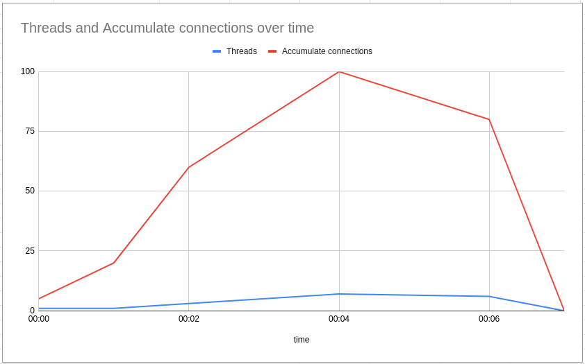
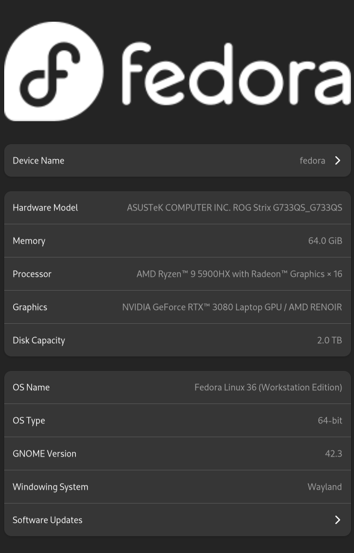
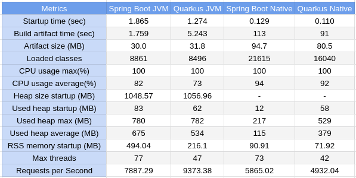

# Spring Boot vs Quarkus

1. 概述

    在本教程中，我们将重点对两个著名的Java框架Spring Boot和Quarkus进行简单比较。到最后，我们将更好地了解它们的异同，以及一些特殊性。

    我们还将进行一些测试来衡量它们的性能并观察它们的行为。

2. Spring Boot

    Spring Boot是一个基于Java的框架，专注于企业应用。它连接了所有的Spring项目，并通过提供许多生产就绪的集成来帮助加速开发者的生产力。

    通过这样做，它减少了配置和模板的数量。此外，由于其约定俗成的配置方法，即根据运行时classpath上的依赖关系自动注册默认配置，Spring Boot大大减少了许多Java应用的上市时间。

3. Quarkus

    Quarkus是另一个框架，其方法与Spring Boot类似，但它还承诺提供更小的工件，具有快速启动时间、更好的资源利用率和效率。

    它针对云、无服务器和容器化环境进行了优化。但是，尽管重点略有不同，Quarkus也能很好地与最流行的Java框架整合。

4. 比较

    如上所述，两个框架都能很好地与其他项目和框架集成。然而，它们的内部实现和架构是不同的。例如，Spring Boot以两种方式提供Web功能：阻塞式（[Servlets](https://www.baeldung.com/spring-mvc-tutorial)）和非阻塞式（[WebFlux](https://www.baeldung.com/spring-webflux)）。

    Quarkus也提供了这两种方式，但与Spring Boot不同，它允许我们[同时使用阻塞和非阻塞策略](https://developers.redhat.com/blog/2019/11/18/how-quarkus-brings-imperative-and-reactive-programming-together)。此外，Quarkus在其架构中嵌入了反应式方法。

    出于这个原因，我们将使用两个完全由Spring WebFlux和Quarkus的反应式功能实现的反应式应用，以便在我们的比较中拥有一个更确切的场景。

    此外，这两个项目中最重要的功能之一是创建本地image（二进制和特定平台的可执行文件）的能力。所以我们也会在比较中包括这两个原生图像。

    值得注意的是，本项目利用的是Spring Boot 2.7版本。在这个版本中，原生image支持处于[实验阶段](https://www.baeldung.com/spring-native-intro)。然而，从第3版开始，Spring Boot有了[原生image支持](https://docs.spring.io/spring-boot/docs/current/reference/html/native-image.html)。要做到这一点，我们需要GraalVM。

    1. 测试应用程序

        我们的应用程序将暴露三个API：一个允许用户创建邮编，一个查找特定邮编的信息，还有一个按城市查询邮编。这些API是利用Spring Boot和Quarkus实现的，完全使用反应式方法，并使用MySQL数据库。

        我们的目标是要有一个简单的示例应用程序，但要比HelloWorld应用程序更复杂一点。当然，这将影响我们的比较，因为像数据库驱动和序列化框架的实现会影响结果。然而，大多数应用程序也可能要处理这些东西。

        因此，我们的比较并不旨在成为哪个框架更好的终极真理，而是一个案例研究，将分析这些特定的实现。

    2. 测试计划

        为了测试这两个实现，我们将使用[Wrk](https://github.com/wg/wrk)来进行测试，并使用其指标报告来分析我们的发现。我们还将使用[VisualVM](https://visualvm.github.io/)在测试执行期间监控应用程序的资源利用率。

        

        测试将运行7分钟，其中所有的API都将被调用，从热身期开始，然后增加连接数，直到达到100个。Wrk通过这种设置可以产生大量的负载。

        所有的测试都在一台具有以下规格的机器上进行：

        

        尽管由于缺乏与其他后台进程的隔离，测试并不理想，但测试的目的只是为了说明建议的比较。如前所述，我们并不打算对这两个框架的性能进行广泛而详细的分析。

        另一点值得一提的是，根据我们的机器规格，我们可能需要调整连接数、线程数等。

    3. 了解我们的测试

        确保我们的测试是正确的是至关重要的，所以为了做到这一点，我们将使用Docker容器来部署我们的Infra。这将使我们能够控制应用程序和数据库的资源限制。我们的目标是给应用程序施加压力，而不是给我们的数据库这一底层系统施加压力。在这个例子中，仅仅限制可用的CPU数量就足够了，但这可能会根据我们机器中的可用资源而改变。

        为了限制可用的资源，我们可以使用[Docker设置](https://www.baeldung.com/ops/docker-memory-limit)、[cpulimit](https://manpages.ubuntu.com/manpages/trusty/man1/cpulimit.1.html)命令或任何其他我们喜欢的工具。此外，我们可以使用[docker stats](https://docs.docker.com/engine/reference/commandline/stats/)和[top](https://www.baeldung.com/linux/top-command)命令来监控系统的资源。最后，关于内存，我们将测量堆的使用和[RSS](https://en.wikipedia.org/wiki/Resident_set_size)的使用。要做到这一点，我们将使用[ps](https://man7.org/linux/man-pages/man1/ps.1.html)（`ps -o pid,rss,command -p <pid>`）命令。

5. 研究结果

    两个项目的开发者体验都很好，但值得一提的是，Spring Boot有更好的文档和更多的材料，我们可以在网上找到。Quarkus在这方面也在不断改进，拥有大量的功能，有助于提高生产力。然而，在文档和堆栈溢出问题方面，它仍然落后。

    在指标方面，我们有：

    

    通过这个实验，我们可以看到Quarkus在启动时间上比Spring Boot快，无论是JVM还是本地版本。此外，Quarkus的构建时间在本地图像的情况下也要快得多。构建时间为91秒（Quarkus），而Spring Boot为113秒。JVM的构建时间为5.24秒（Quarkus），而Spring Boot为1.75秒，所以在这一点上Spring胜出。

    关于工件的大小，Spring Boot和Quarkus产生的可运行工件在JVM版本方面相似，但在本地工件方面，Quarkus做得更好。

    然而，关于其他指标，结论并不直接。因此，让我们更深入地看看其中一些指标。

    1. CPU

        如果我们关注CPU的使用情况，我们会发现JVM版本在开始的热身阶段会消耗更多的CPU。在那之后，CPU的使用趋于稳定，所有版本的消耗都变得相对相等。

        下面是Spring和Quarkus在JVM和Native版本中的CPU消耗情况，依次为：：

        (Spring JVM)

        (Quarkus JVM)

        (Spring Native)

        (Quarkus Native)

        Quarkus在这两种情况下都做得更好。然而，差异太小，也可以认为是平局。另一点值得一提的是，在图表中，我们看到的是基于机器中可用的CPU数量的消耗。不过，为了确保我们是在给选项而不是系统的其他部分施加压力，我们将应用程序可用的核心数量限制为三个。

    2. 内存

        关于内存，情况就更复杂了。首先，两个框架的JVM版本都为堆保留了更多的内存，几乎是相同的内存量。关于堆的使用，JVM版本比本地版本消耗更多的内存，但看一下这对组合，Quarkus在JVM版本中似乎比Spring消耗的内存略少。但是，同样的，差别也是超级小的：

        (Spring Boot JVM)

        (Quarkus JVM)

        Quarkus内存

        然后，看一下本地图像，事情似乎发生了变化。Spring Native版本似乎更频繁地收集内存，并保持较低的内存占用率：

        (Spring Boot Native)

        (Quarkus Native)

        另一个重要的亮点是，在RSS内存测量方面，Quarkus似乎在两个版本中都超过了Spring。我们只在启动时加入了RSS比较，但在测试过程中也可以使用同样的命令。

        尽管如此，在这次比较中，我们只使用了默认参数。因此，没有对GC、JVM选项或任何其他参数进行修改。不同的应用程序可能需要不同的设置，我们在实际环境中使用时应该记住这一点。

    3. 响应时间

        关于响应时间，我们将使用一种不同的方法，因为许多可用的基准工具都存在一个叫做[协调遗漏](https://www.slideshare.net/InfoQ/how-not-to-measure-latency-60111840)的问题。我们将使用[hyperfoil](https://hyperfoil.io/)，一个旨在避免这个问题的工具。在测试过程中，会产生许多请求，但我们的想法是不要给应用程序施加太多压力，只要足以测量其响应时间即可。

        不过，测试结构与之前的测试相当类似：

        (Spring Boot JVM)

        (Quarkus JVM)

        吞吐量和响应时间不是一回事，虽然相关，但它们衡量的是不同的东西。Quarkus JVM版本在压力下有很好的性能，在适度负载时也是如此。它似乎有更高的吞吐量和稍低的响应时间。

        再看一下本地版本，数字又发生了变化。现在Spring似乎有一个稍低的响应时间和更高的吞吐量。然而，看看所有的数字，我们可以看到，差异太小，无法定义任何明显的赢家：

        (Spring Boot Native)

        (Quarkus Native)

    4. 连接这些点

        综合考虑，这两个框架都被证明是实现Java应用的绝佳选择。

        本机应用程序显示出快速、低资源消耗的特点，使它们成为无服务器、短命的应用程序和低资源消耗至关重要的环境的最佳选择。

        另一方面，JVM应用程序似乎有更多的开销，但随着时间的推移，有很好的稳定性和高吞吐量，这对于健壮的、长期存在的应用程序来说是理想的。

        最后，至少对于我们的例子来说，所有的版本都具有强大的性能。差异是如此之小，以至于我们可以说它们有类似的性能。当然，我们可以说JVM版本在吞吐量方面更好地处理了重负荷，同时消耗了更多的资源，而本地版本消耗的资源更少。然而，根据使用情况，这种差异甚至可能不相关。

        最后，我们应该注意到，在Spring应用程序中，我们不得不更换数据库驱动程序，因为文档中推荐的驱动程序有问题。相比之下，Quarkus开箱即用，没有任何问题。

6. 结论

    在这篇文章中，我们比较了Spring Boot和Quarkus框架以及它们不同的部署模式，即JVM和Native。我们还探讨了这些应用程序的一些其他指标和方面。

## 相关文章

- [ ] [Spring Boot vs Quarkus](https://www.baeldung.com/spring-boot-vs-quarkus)

## Code

像往常一样，测试应用程序的代码和用于测试的脚本都可以在[GitHub](https://github.com/eugenp/tutorials/tree/master/quarkus-modules/quarkus-vs-springboot)上找到。

要遵循本教程，你将需要以下东西：

- GRAALVM (<https://www.graalvm.org/>)
- VisualVM (<https://visualvm.github.io/>)
- Maven（嵌入式，IDE，或本地安装）
- Docker (<https://www.docker.com/>)
- Jmeter (<https://jmeter.apache.org/>)
- wrk (<https://github.com/wg/wrk>)
- hyperfoil (<https://hyperfoil.io/>)
- lua (<https://www.lua.org/>)

为了创建这个测试，我使用了Jmeter的一些自定义功能。你可以在这里安装Jmeter插件管理器：
<https://loadium.com/blog/how-to-install-use-jmeter-plugin>。之后，请安装以下插件：

- <https://jmeter-plugins.org/?search=jpgc-casutg>

测试文件是`load_test.jmx`，以备任何修改需要。你可以用Jmeter GUI打开它。例如，要运行启动，你可以执行文件`run_test.sh`或运行下面的注释：

```bash
$jmeter_home/bin/jmeter -n -t load_test.jmx -l log.csv -e -o ./report
```

只需记住用JMeter文件夹的路径来改变变量`jmeter_home`。数据文件的路径是相对的，所以要么把它们放在与测试相同的文件夹中，要么使用Jmeter GUI来改变它。请记住，正如文章中提到的，由于协调遗漏问题，我们不能考虑Jmeter记录的响应时间。

打开VisualVM应用程序，选择你的应用程序，在运行测试前开始监测，当然，先启动样本应用程序。

### Spring Boot

为了构建应用程序，你只需要在Spring项目根中运行以下命令：

```bash
./mvnw clean package -f pom.xml
```

或者在你想构建本地的情况下执行这个命令：

```bash
./mvnw clean package -Pnative -f pom.xml
```

在这种情况下，你需要定义`GRAALVM_HOME`环境变量。只有当你想在本地构建镜像时才需要这个。否则，你可以利用Spring Boot的maven插件，用docker来构建它。它将拉出一个GraalVM的docker镜像，并以此创建应用程序的本地镜像。要做到这一点，请运行：

```bash
./mvnw clean package spring-boot:build-image -Pnative -f pom.xml
```

你也可以通过运行脚本`build.sh`来创建一个JVM版本的应用程序的docker镜像，或者：

```bash
./mvnw clean package spring-boot:build-image -f pom.xml
```

你可以执行脚本`start_app.sh`或`start_jvm.sh`来在本地运行应用程序。在这种情况下，你将需要Mysql数据库。你可以用命令在docker中运行它：

```bash
docker run --name mysqldb --network=host -p 3306:3306 -e MYSQL_ROOT_PASSWORD=root -e MYSQL_DATABASE=baeldung -d mysql:5.7.38 --character-set-server=utf8mb4 --colation-server=utf8mb4_unicode_ci
```

你也可以从docker运行应用程序和数据库，使用：

```bash
docker-compose -f src/main/docker/spring.yml up
```

但记得要重建镜像，以便在本地和JVM版本之间进行切换。

### Quarkus

构建和运行Quarkus应用程序的过程与Spring Boot的过程非常相似。首先，要创建本地镜像，你还需要安装GRAALVM和设置`GRAALVM_HOME`环境变量，或者我们可以使用docker来构建本地镜像。

要在本地构建本地版本，请运行以下命令：

```bash
./mvnw package -Pnative -f pom.xml
```

或者使用docker来构建这个：

```bash
./mvnw package -Pnative -Dquarkus.native.container-build=true -f pom.xml
```

而对JVM版本：

```bash
./mvnw package -f pom.xml
```

要在本地启动应用程序，使用脚本`start_app.sh`和`start_jvm.sh`与docker DB：

```bash
docker run --name mysqldb --network=host -p 3306:3306 -e MYSQL_ROOT_PASSWORD=root -e MYSQL_DATABASE=baeldung -d mysql:5.7.38 --character-set-server=utf8mb4 --collation-server=utf8mb4_unicode_ci
```

或者使用脚本来构建应用程序的docker镜像，运行：

`./build.sh`

```txt
## 脚本内容
./mvnw quarkus:add-extension -Dextensions=container-image-docker
./mvnw package -Dquarkus.container-build=true -f pom.xml &&。
docker build -f src/main/docker/Dockerfile.jvm -t quarkus-project:0.1-SNAPSHOT .
```

要构建JVM版本的docker镜像，并运行以下命令到本地版本：

`./build.sh native`

```txt
## 脚本内容
./mvnw quarkus:add-extension -Dextensions=container-image-docker
./mvnw package -Pnative -Dquarkus.native.container-build=true -f pom.xml &&
docker build -f src/main/docker/Dockerfile.native -t quarkus-project:0.1-SNAPSHOT .
```

然后，再一次，你也可以从docker运行应用程序和数据库，使用：

`docker-compose -f src/main/docker/quarkus.yml up`

现在你有了所有你需要的东西，可以在你的机器上重现这些测试。

### Wrk

执行负载测试的另一个选择是使用Werk。这个库能够只用一个核心就能产生相当高的负载。要安装它，你只需要签出项目编译它（使用make）并定义`wrk_home`环境变量。要运行测试，请使用：

`./run_test_wrk.sh`

你将需要在你的机器上安装lua。

如果你想在你的机器上运行应用程序，你可以使用以下命令来限制应用程序可用的CPU：

`cpulimit -l 300 -p`

300意味着最多三个核心。

这将确保负载是在应用程序上，而不是在数据库上。

### Hyperfoil

通过hyperfoil测试来获得关于应用程序性能的报告，它的吞吐量和响应时间。你可以从hyperfoil文件夹中运行`docker_run.sh`，或者如下：

```bash
docker run -it -v volume:/benchmarks:Z -v tmp/reports:/tmp/reports:Z -network=host quay.io/hyperfoil/hyperfoil cli
```

然后：

`start-local && upload /benchmarks/benchmark.hf.yaml && run benchmark`

另外，我们可以通过运行，从中提取一份HTML报告：

`report --destination=/tmp/reports`