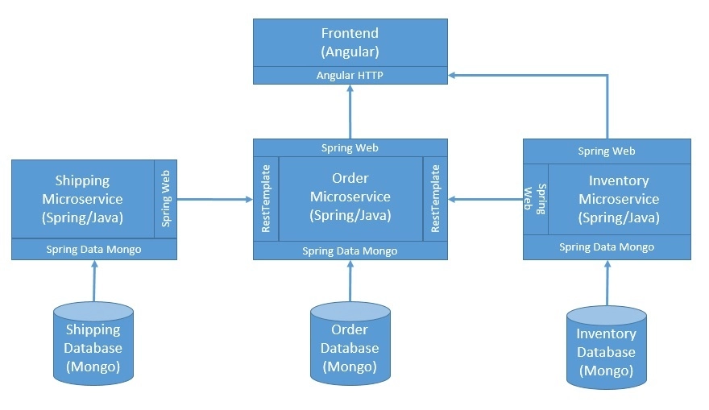
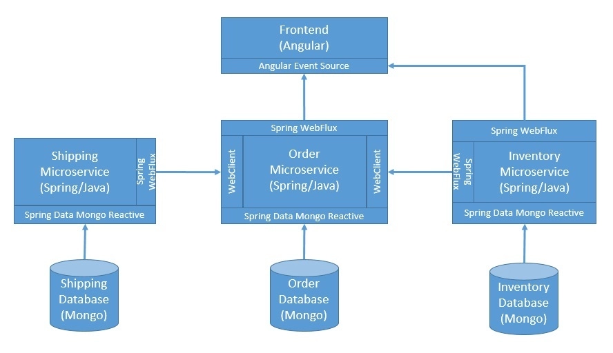
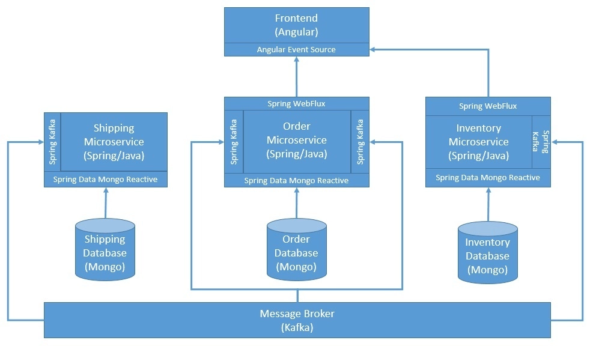

# Java中的反应式系统

这个模块包含了关于Java中反应式系统的文章的服务。请注意，这些服务包括一个全栈应用程序的一部分，以展示反应式系统的能力。除非有一篇文章对这个概念进行了扩展，否则这个模块可能不适合添加其他代码。

1. 简介

    在本教程中，我们将了解使用Spring及其他工具和框架在Java中创建反应式系统的基础知识。
    在这个过程中，我们将讨论反应式编程如何只是创建反应式系统的一个驱动力。这将有助于我们理解创建反应式系统的理由，以及它一路走来所激发的不同规范、库和标准。
2. 什么是反应式系统？

    在过去的几十年里，技术领域出现了一些颠覆性的变化，导致我们看待技术价值的方式发生了彻底的转变。互联网之前的计算世界永远无法想象它将以何种方式和途径改变我们今天的生活。
    随着互联网对大众的影响，以及它所承诺的不断发展的体验，应用架构师需要站在他们的角度来满足他们的需求。
    从根本上说，这意味着我们永远不能用以前的方式来设计一个应用程序。一个高度响应的应用程序不再是一种奢侈品，而是一种必需品。

    这也是在面对随机故障和不可预测的负载时。现在的需求不仅仅是得到正确的结果，而且要快速得到它！这一点非常重要！这对推动我们承诺提供的惊人的用户体验相当重要。
    这就是对能够给我们提供反应式系统的架构风格的需求。
    1. 反应式宣言

        早在2013年，一个由Jonas Boner领导的开发者团队聚集在一起，在一份名为[《反应式宣言》](https://www.reactivemanifesto.org/)的文件中定义了一系列核心原则。这就为创建反应式系统的架构风格奠定了基础。从那时起，这个宣言已经从开发者社区聚集了大量的关注。
        基本上，这份文件规定了反应式系统的配方，即灵活(flexible)、松散耦合(loosely-coupled)和可扩展(scalable)。这使得这样的系统易于开发，能够容忍失败，最重要的是高度响应，这是令人难以置信的用户体验的基础。
        那么，这个秘方是什么呢？嗯，这几乎不是什么秘密 该宣言定义了反应式系统的基本特征或原则：

        - 响应性： 一个反应式系统应该提供快速和一致的响应时间，从而提供一致的服务质量。
        - 适应性强： 反应式系统应该通过复制和隔离，在发生随机故障的情况下保持反应能力。
        - 弹性：这样的系统应该通过成本效益高的可扩展性，在不可预测的工作负荷下保持响应性。
        - 消息驱动型： 它应该依赖于系统组件之间的异步消息传递。
        这些原则听起来简单合理，但在复杂的企业架构中并不总是容易实现。在本教程中，我们将以这些原则为基础，在Java中开发一个示例系统!
3. 什么是反应式编程？

    在我们继续之前，了解反应式编程和反应式系统之间的区别很重要。我们经常使用这两个术语，而且很容易把一个误解为另一个。正如我们前面看到的，反应式系统是一种特定的架构风格的结果。
    相比之下，反应式编程是一种编程范式，重点是开发异步和非阻塞组件。反应式编程的核心是一个数据流，我们可以观察和反应，甚至也可以施加反压力。这导致了非阻塞式的执行，从而以较少的执行线程获得更好的可扩展性。
    现在，这并不意味着反应式系统和反应式编程是相互排斥的。事实上，反应式编程是实现反应式系统的一个重要步骤，但它并不是全部!
    1. 反应式流（Reactive Streams）

        [Reactive Streams](http://www.reactive-streams.org/)是一个社区倡议，早在2013年就开始了，旨在为非阻塞反压的异步流处理提供一个标准。这里的目标是定义一套可以描述必要操作和实体的接口、方法和协议。

        从那时起，在多种编程语言中出现了一些符合反应式流规范的实现。其中包括Akka Streams、Ratpack和Vert.x，仅举几例。
    2. Java的反应式库

        反应式流背后的最初目标之一是最终被列为官方的Java标准库。因此，反应式流的规范在语义上等同于Java 9中引入的Java Flow库。
        除此以外，在Java中实现反应式编程有几个流行的选择：

        - [Reactive Extensions](http://reactivex.io/)： 俗称ReactiveX，它们为使用可观察流的异步编程提供API。这些可用于多种编程语言和平台，包括Java，它被称为[RxJava](https://github.com/ReactiveX/RxJava)。
        - [Project Reactor](https://projectreactor.io/)： 这是另一个反应式库，以反应式流规范为基础，目标是在JVM上构建非应用程序。它也恰好是[Spring生态系统中反应式堆栈](https://spring.io/reactive)的基础。

4. 一个简单的应用程序

    在本教程中，我们将开发一个基于微服务架构的简单应用，并配备一个最小的前端。该应用架构应该有足够的元素来创建一个反应式系统。
    对于我们的应用，我们将采用端到端的反应式编程和其他模式和工具来完成反应式系统的基本特征。

    1. 架构

        我们将首先定义一个简单的应用架构，它不一定表现出反应式系统的特征。从那里开始，我们将进行必要的改变以逐一实现这些特性。
        所以，首先，让我们从定义一个简单的架构开始：

        

        这是一个相当简单的架构，它有一堆微服务来促进商务用例，我们可以下订单。它也有一个用于用户体验的前端，所有的通信都是通过HTTP的REST方式进行。此外，每个微服务都在单独的数据库中管理他们的数据，这种做法被称为 "database-per-service"。
        我们将在下面的小节中继续创建这个简单的应用程序。这将是我们了解这种架构的谬误以及采用原则和实践的方式方法的基础，这样我们就可以将其转化为一个反应式系统。
    2. 库存微服务

        库存微服务将负责管理产品的清单和它们的当前库存。它还将允许在处理订单时改变库存。我们将使用Spring Boot和MongoDB来开发这个服务。
        让我们首先定义一个控制器，暴露一些端点：

        ```java
        @GetMapping
        public List<Product> getAllProducts() {
            return productService.getProducts();
        }
        @PostMapping
        public Order processOrder(@RequestBody Order order) {
            return productService.handleOrder(order);
        }
        @DeleteMapping
        public Order revertOrder(@RequestBody Order order) {
            return productService.revertOrder(order);
        }
        ```

        和一个服务来封装我们的业务逻辑：

        ```java
        @Transactional
        public Order handleOrder(Order order) {       
            order.getLineItems()
            .forEach(l -> {
                Product> p = productRepository.findById(l.getProductId())
                    .orElseThrow(() -> new RuntimeException("Could not find the product: " + l.getProductId()));
                if (p.getStock() >= l.getQuantity()) {
                    p.setStock(p.getStock() - l.getQuantity());
                    productRepository.save(p);
                } else {
                    throw new RuntimeException("Product is out of stock: " + l.getProductId());
                }
            });
            return order.setOrderStatus(OrderStatus.SUCCESS);
        }
        @Transactional
        public Order revertOrder(Order order) {
            order.getLineItems()
            .forEach(l -> {
                Product p = productRepository.findById(l.getProductId())
                    .orElseThrow(() -> new RuntimeException("Could not find the product: " + l.getProductId()));
                p.setStock(p.getStock() + l.getQuantity());
                productRepository.save(p);
            });
            return order.setOrderStatus(OrderStatus.SUCCESS);
        }
        ```

        请注意，我们是在一个事务中持久化实体，这可以确保在出现异常时不会产生不一致的状态。
        除了这些，我们还必须定义领域实体、存储库接口，以及为使一切正常工作所需的一堆配置类。
        但由于这些大多是模板，我们将避免去看它们，它们可以在本文最后一节提供的GitHub仓库中参考。
    3. 发货微服务

        运货微服务也不会有很大的不同。它将负责检查是否可以为订单生成货物，并在可能的情况下创建一个货物。
        和以前一样，我们将定义一个控制器来暴露我们的端点，事实上只有一个端点：

        ```java
        @PostMapping
        public Order process(@RequestBody Order order) {
            return shippingService.handleOrder(order);
        }
        ```

        和一个服务来封装与订单发货有关的业务逻辑：

        ```java
        public Order handleOrder(Order order) {
            LocalDate shippingDate = null;
            if (LocalTime.now().isAfter(LocalTime.parse("10:00"))
            && LocalTime.now().isBefore(LocalTime.parse("18:00"))) {
                shippingDate = LocalDate.now().plusDays(1);
            } else {
                throw new RuntimeException("The current time is off the limits to place order.");
            }
            shipmentRepository.save(new Shipment()
            .setAddress(order.getShippingAddress())
            .setShippingDate(shippingDate));
            return order.setShippingDate(shippingDate)
            .setOrderStatus(OrderStatus.SUCCESS);
        }
        ```

        我们简单的发货服务只是检查下订单的有效时间窗口。我们将像以前一样避免讨论其余的模板代码。
    4. 订单微服务

        最后，我们将定义一个订单微服务，它将负责创建一个新的订单，而不是其他事情。有趣的是，它也将作为一个协调器服务（orchestrator service），与库存服务和订单的运输服务进行通信。
        让我们用所需的端点来定义我们的控制器：

        ```java
        @PostMapping
        public Order create(@RequestBody Order order) {
            Order processedOrder = orderService.createOrder(order);
            if (OrderStatus.FAILURE.equals(processedOrder.getOrderStatus())) {
                throw new RuntimeException("Order processing failed, please try again later.");
            }
            return processedOrder;
        }
        @GetMapping
        public List<Order> getAll() {
            return orderService.getOrders();
        }
        ```

        还有，一个服务来封装与订单有关的业务逻辑：

        ```java
        public Order createOrder(Order order) {
            boolean success = true;
            Order savedOrder = orderRepository.save(order);
            Order inventoryResponse = null;
            try {
                inventoryResponse = restTemplate.postForObject(
                inventoryServiceUrl, order, Order.class);
            } catch (Exception ex) {
                success = false;
            }
            Order shippingResponse = null;
            try {
                shippingResponse = restTemplate.postForObject(
                shippingServiceUrl, order, Order.class);
            } catch (Exception ex) {
                success = false;
                HttpEntity<Order> deleteRequest = new HttpEntity<>(order);
                ResponseEntity<Order> deleteResponse = restTemplate.exchange(
                inventoryServiceUrl, HttpMethod.DELETE, deleteRequest, Order.class);
            }
            if (success) {
                savedOrder.setOrderStatus(OrderStatus.SUCCESS);
                savedOrder.setShippingDate(shippingResponse.getShippingDate());
            } else {
                savedOrder.setOrderStatus(OrderStatus.FAILURE);
            }
            return orderRepository.save(savedOrder);
        }
        public List<Order> getOrders() {
            return orderRepository.findAll();
        }
        ```

        在我们协调调用库存和运输服务的情况下，对订单的处理远非理想。多个微服务的分布式事务本身就是一个复杂的话题，超出了本教程的范围。
        然而，我们将在本教程的后面看到一个反应式系统如何在一定程度上避免对分布式事务的需求。
    5. 前端

        让我们也添加一个用户界面，使讨论完整。用户界面将基于Angular，并将是一个简单的单页应用程序。
        我们将需要在Angular中创建一个简单的组件来处理创建和获取订单。特别重要的是我们调用我们的API来创建订单的部分：

        ```js
        createOrder() {
            let headers = new HttpHeaders({'Content-Type': 'application/json'});
            let options = {headers: headers}
            this.http.post('http://localhost:8080/api/orders', this.form.value, options)
            .subscribe(
                (response) => {
                this.response = response
                },
                (error) => {
                this.error = error
                }
            )
        }
        ```

        上面的代码片段希望订单数据被捕获在一个表单中，并在组件的范围内可用。Angular为使用[反应式和模板驱动的表单](https://angular.io/guide/forms-overview)创建简单到复杂的表单提供了绝佳的支持。
        同样重要的是，我们获得先前创建的订单的部分：

        ```js
        getOrders() {
        this.previousOrders = this.http.get(''http://localhost:8080/api/orders'')
        }
        ```

        请注意，[Angular HTTP](https://angular.io/guide/http)模块在本质上是异步的，因此会返回RxJS可观察数据。我们可以在我们的视图中通过异步管道传递它们来处理响应：

        ```html
        <div class="container" *ngIf="previousOrders !== null">
        <h2>Your orders placed so far:</h2>
        <ul>
            <li *ngFor="let order of previousOrders | async">
            <p>Order ID: {{ order.id }}, Order Status: {{order.orderStatus}}, Order Message: {{order.responseMessage}}</p>
            </li>
        </ul>
        </div>
        ```

        当然，Angular需要模板、样式和配置才能工作。请注意，我们在这里把所有东西都捆绑在一个组件中，这在理想情况下是不应该做的。
        但是，对于本教程来说，这些问题不在范围之内。
    6. 部署应用程序

        现在我们已经创建了应用程序的各个部分，那么我们应该如何去部署它们呢？好吧，我们总是可以手动完成这个任务。但我们应该注意，这很快就会变得乏味。
        在本教程中，我们将使用[Docker Compose](https://www.baeldung.com/docker-compose)在Docker机器上构建和部署我们的应用程序。这需要我们在每个服务中添加一个标准的Dockerfile，并为整个应用程序创建一个Docker Compose文件。
        让我们看看这个docker-compose.yml文件的样子：

        ```yaml
        version: '3'
        services:
        frontend:
            build: ./frontend
            ports:
            - "80:80"
        order-service:
            build: ./order-service
            ports:
            - "8080:8080"
        inventory-service:
            build: ./inventory-service
            ports:
            - "8081:8081"
        shipping-service:
            build: ./shipping-service
            ports:
            - "8082:8082"
        ```

        这是Docker Compose中相当标准的服务定义，不需要特别注意。
    7. 这个架构的问题

        现在我们有了一个简单的应用程序，其中有多个服务相互交互，我们可以讨论这个体系结构中的问题。我们将在以下部分中尝试解决这些问题，并最终达到将应用程序转换为反应式系统的状态！
        虽然此应用程序远非生产级软件，而且存在几个问题，但我们将重点关注与反应系统动机相关的问题：

        - 库存服务或运输服务中的故障会产生连带效应
        - 对外部系统和数据库的调用在本质上都是阻塞的
        - 部署不能自动处理故障和波动的负载

5. 反应式编程

    任何程序中的阻塞性调用经常导致关键资源只是在等待事情发生。这些包括数据库调用、对网络服务的调用和文件系统调用。如果我们能把执行线程从这种等待中解放出来，并提供一种机制，一旦有了结果，就会产生更好的资源利用率。
    这就是采用反应式编程范式为我们做的事情。虽然有可能在许多这样的调用中切换到一个反应式库，但可能不是所有的调用都能做到。对我们来说，幸运的是，Spring让我们更容易使用反应式编程与MongoDB和REST API：

    

    [Spring Data Mongo](https://www.baeldung.com/spring-data-mongodb-tutorial)通过MongoDB Reactive Streams Java Driver支持反应式访问。它提供了ReactiveMongoTemplate和ReactiveMongoRepository，两者都有广泛的映射功能。
    [Spring WebFlux](https://www.baeldung.com/spring-webflux)为Spring提供了反应堆网络框架，实现了非阻塞代码和反应流的反压。它利用Reactor作为其反应性库。此外，它还提供了WebClient，用于执行具有反应流反压的HTTP请求。它使用Reactor Netty作为HTTP客户端库。
    1. 库存服务

        我们将首先改变我们的端点，使其发出反应式发布器：

        ```java
        @GetMapping
        public Flux<Product> getAllProducts() {
            return productService.getProducts();
        }
        @PostMapping
        public Mono<Order> processOrder(@RequestBody Order order) {
            return productService.handleOrder(order);
        }
        @DeleteMapping
        public Mono<Order> revertOrder(@RequestBody Order order) {
            return productService.revertOrder(order);
        }
        ```

        很明显，我们也要对服务进行必要的修改：

        ```java
        @Transactional
        public Mono<Order> handleOrder(Order order) {
            return Flux.fromIterable(order.getLineItems())
            .flatMap(l -> productRepository.findById(l.getProductId()))
            .flatMap(p -> {
                int q = order.getLineItems().stream()
                    .filter(l -> l.getProductId().equals(p.getId()))
                    .findAny().get()
                    .getQuantity();
                if (p.getStock() >= q) {
                    p.setStock(p.getStock() - q);
                    return productRepository.save(p);
                } else {
                    return Mono.error(new RuntimeException("Product is out of stock: " + p.getId()));
                }
            })
            .then(Mono.just(order.setOrderStatus("SUCCESS")));
        }
        @Transactional
        public Mono<Order> revertOrder(Order order) {
            return Flux.fromIterable(order.getLineItems())
            .flatMap(l -> productRepository.findById(l.getProductId()))
            .flatMap(p -> {
                int q = order.getLineItems().stream()
                    .filter(l -> l.getProductId().equals(p.getId()))
                    .findAny().get()
                    .getQuantity();
                p.setStock(p.getStock() + q);
                return productRepository.save(p);
            })
            .then(Mono.just(order.setOrderStatus("SUCCESS")));
        }
        ```

    2. 运输服务

        同样地，我们将改变我们的运输服务的端点：

        ```java
        @PostMapping
        public Mono<Order> process(@RequestBody Order order) {
            return shippingService.handleOrder(order);
        }
        ```

        并且，在服务中进行相应的修改，以利用反应式编程：

        ```java
        public Mono<Order> handleOrder(Order order) {
            return Mono.just(order)
            .flatMap(o -> {
                LocalDate shippingDate = null;
                if (LocalTime.now().isAfter(LocalTime.parse("10:00"))
                    && LocalTime.now().isBefore(LocalTime.parse("18:00"))) {
                    shippingDate = LocalDate.now().plusDays(1);
                } else {
                    return Mono.error(new RuntimeException("The current time is off the limits to place order."));
                }
                return shipmentRepository.save(new Shipment()
                    .setAddress(order.getShippingAddress())
                    .setShippingDate(shippingDate));
            })
            .map(s -> order.setShippingDate(s.getShippingDate())
                .setOrderStatus(OrderStatus.SUCCESS));
            }
        ```

    3. 订单服务

        我们必须对订单服务的端点进行类似的修改：

        ```java
        @PostMapping
        public Mono<Order> create(@RequestBody Order order) {
            return orderService.createOrder(order)
            .flatMap(o -> {
                if (OrderStatus.FAILURE.equals(o.getOrderStatus())) {
                    return Mono.error(new RuntimeException("Order processing failed, please try again later. " + o.getResponseMessage()));
                } else {
                    return Mono.just(o);
                }
            });
        }
        @GetMapping
        public Flux<Order> getAll() {
            return orderService.getOrders();
        }
        ```

        对服务的修改将涉及更多，因为我们必须使用Spring WebClient来调用库存和运输的反应式端点：

        ```java
        public Mono<Order> createOrder(Order order) {
            return Mono.just(order)
            .flatMap(orderRepository::save)
            .flatMap(o -> {
                return webClient.method(HttpMethod.POST)
                    .uri(inventoryServiceUrl)
                    .body(BodyInserters.fromValue(o))
                    .exchange();
            })
            .onErrorResume(err -> {
                return Mono.just(order.setOrderStatus(OrderStatus.FAILURE)
                    .setResponseMessage(err.getMessage()));
            })
            .flatMap(o -> {
                if (!OrderStatus.FAILURE.equals(o.getOrderStatus())) {
                    return webClient.method(HttpMethod.POST)
                        .uri(shippingServiceUrl)
                        .body(BodyInserters.fromValue(o))
                        .exchange();
                } else {
                    return Mono.just(o);
                }
            })
            .onErrorResume(err -> {
                return webClient.method(HttpMethod.POST)
                    .uri(inventoryServiceUrl)
                    .body(BodyInserters.fromValue(order))
                    .retrieve()
                    .bodyToMono(Order.class)
                    .map(o -> o.setOrderStatus(OrderStatus.FAILURE)
                    .setResponseMessage(err.getMessage()));
            })
            .map(o -> {
                if (!OrderStatus.FAILURE.equals(o.getOrderStatus())) {
                    return order.setShippingDate(o.getShippingDate())
                        .setOrderStatus(OrderStatus.SUCCESS);
                } else {
                    return order.setOrderStatus(OrderStatus.FAILURE)
                        .setResponseMessage(o.getResponseMessage());
                }
            })
            .flatMap(orderRepository::save);
        }

        public Flux<Order> getOrders() {
            return orderRepository.findAll();
        }
        ```

        这种使用反应式API的协调工作并不容易，往往容易出错，也很难调试。我们将在下一节中看到如何简化这种情况。
    4. 前端

        现在，我们的API能够在事件发生时进行流式处理，很自然地，我们也应该能够在我们的前端利用这一点。幸运的是，Angular支持[EventSource](https://developer.mozilla.org/en-US/docs/Web/API/EventSource)，即服务器发送事件的接口。
        让我们来看看如何将我们之前的所有订单作为一个事件流来提取和处理：

        ```js
        getOrderStream() {
            return Observable.create((observer) => {
                let eventSource = new EventSource('http://localhost:8080/api/orders')
                eventSource.onmessage = (event) => {
                    let json = JSON.parse(event.data)
                    this.orders.push(json)
                    this._zone.run(() => {
                        observer.next(this.orders)
                    })
                }
                eventSource.onerror = (error) => {
                    if(eventSource.readyState === 0) {
                        eventSource.close()
                        this._zone.run(() => {
                            observer.complete()
                        })
                    } else {
                        this._zone.run(() => {
                            observer.error('EventSource error: ' + error)
                        })
                    }
                }
            })
        }
        ```

6. 消息驱动的架构

    我们要解决的第一个问题是关于服务与服务之间的通信。现在，这些通信是同步的，这带来了几个问题。这些问题包括级联故障、复杂的协调和分布式事务，仅举几例。
    解决这个问题的一个明显方法是使这些通信成为异步的。一个用于促进所有服务与服务之间的通信的消息代理可以为我们做这个工作。我们将使用Kafka作为我们的消息代理，并使用[Spring for Kafka](https://www.baeldung.com/spring-kafka)来生产和消费消息：

    

    我们将使用一个主题来生产和消费具有不同订单状态的订单消息，以便服务做出反应。
    让我们看看每个服务需要如何改变。
    1. 库存服务

        让我们首先为我们的库存服务定义消息生产者：

        ```java
        @Autowired
        private KafkaTemplate<String, Order> kafkaTemplate;
        public void sendMessage(Order order) {
            this.kafkaTemplate.send("orders", order);
        }
        ```

        接下来，我们要为库存服务定义一个消息消费者，以便对主题上的不同消息做出反应：

        ```java
        @KafkaListener(topics = "orders", groupId = "inventory")
        public void consume(Order order) throws IOException {
            if (OrderStatus.RESERVE_INVENTORY.equals(order.getOrderStatus())) {
                productService.handleOrder(order)
                .doOnSuccess(o -> {
                    orderProducer.sendMessage(order.setOrderStatus(OrderStatus.INVENTORY_SUCCESS));
                })
                .doOnError(e -> {
                    orderProducer.sendMessage(order.setOrderStatus(OrderStatus.INVENTORY_FAILURE)
                        .setResponseMessage(e.getMessage()));
                }).subscribe();
            } else if (OrderStatus.REVERT_INVENTORY.equals(order.getOrderStatus())) {
                productService.revertOrder(order)
                .doOnSuccess(o -> {
                    orderProducer.sendMessage(order.setOrderStatus(OrderStatus.INVENTORY_REVERT_SUCCESS));
                })
                .doOnError(e -> {
                    orderProducer.sendMessage(order.setOrderStatus(OrderStatus.INVENTORY_REVERT_FAILURE)
                        .setResponseMessage(e.getMessage()));
                }).subscribe();
            }
        }
        ```

        这也意味着我们现在可以安全地从控制器中删除一些多余的端点。这些变化足以在我们的应用程序中实现异步通信。
    2. 运输服务

        运输服务的变化与我们之前对库存服务所做的相对类似。消息生产者是相同的，而消息消费者是特定于运输逻辑的：

        ```java
        @KafkaListener(topics = "orders", groupId = "shipping")
        public void consume(Order order) throws IOException {
            if (OrderStatus.PREPARE_SHIPPING.equals(order.getOrderStatus())) {
                shippingService.handleOrder(order)
                .doOnSuccess(o -> {
                    orderProducer.sendMessage(order.setOrderStatus(OrderStatus.SHIPPING_SUCCESS)
                        .setShippingDate(o.getShippingDate()));
                })
                .doOnError(e -> {
                    orderProducer.sendMessage(order.setOrderStatus(OrderStatus.SHIPPING_FAILURE)
                        .setResponseMessage(e.getMessage()));
                }).subscribe();
            }
        }
        ```

        我们现在可以安全地放弃控制器中的所有端点，因为我们不再需要它们了。
    3. 订单服务

        订单服务的变化会更多一些，因为这是我们之前做所有协调工作的地方。
        然而，消息生产者保持不变，而消息消费者承担了订单服务的特定逻辑：

        ```java
        @KafkaListener(topics = "orders", groupId = "orders")
        public void consume(Order order) throws IOException {
            if (OrderStatus.INITIATION_SUCCESS.equals(order.getOrderStatus())) {
                orderRepository.findById(order.getId())
                .map(o -> {
                    orderProducer.sendMessage(o.setOrderStatus(OrderStatus.RESERVE_INVENTORY));
                    return o.setOrderStatus(order.getOrderStatus())
                        .setResponseMessage(order.getResponseMessage());
                })
                .flatMap(orderRepository::save)
                .subscribe();
            } else if ("INVENTORY-SUCCESS".equals(order.getOrderStatus())) {
                orderRepository.findById(order.getId())
                .map(o -> {
                    orderProducer.sendMessage(o.setOrderStatus(OrderStatus.PREPARE_SHIPPING));
                    return o.setOrderStatus(order.getOrderStatus())
                        .setResponseMessage(order.getResponseMessage());
                })
                .flatMap(orderRepository::save)
                .subscribe();
            } else if ("SHIPPING-FAILURE".equals(order.getOrderStatus())) {
                orderRepository.findById(order.getId())
                .map(o -> {
                    orderProducer.sendMessage(o.setOrderStatus(OrderStatus.REVERT_INVENTORY));
                    return o.setOrderStatus(order.getOrderStatus())
                        .setResponseMessage(order.getResponseMessage());
                })
                .flatMap(orderRepository::save)
                .subscribe();
            } else {
                orderRepository.findById(order.getId())
                .map(o -> {
                    return o.setOrderStatus(order.getOrderStatus())
                        .setResponseMessage(order.getResponseMessage());
                })
                .flatMap(orderRepository::save)
                .subscribe();
            }
        }
        ```

        这里的消费者只是对具有不同订单状态的订单消息做出反应。这就是我们在不同服务之间进行编排的原因。
        最后，我们的订单服务也将不得不改变，以支持这种编排：

        ```java
        public Mono<Order> createOrder(Order order) {
            return Mono.just(order)
            .flatMap(orderRepository::save)
            .map(o -> {
                orderProducer.sendMessage(o.setOrderStatus(OrderStatus.INITIATION_SUCCESS));
                return o;
            })
            .onErrorResume(err -> {
                return Mono.just(order.setOrderStatus(OrderStatus.FAILURE)
                    .setResponseMessage(err.getMessage()));
            })
            .flatMap(orderRepository::save);
        }
        ```

        注意，这比我们在上一节中用反应式端点编写的服务要简单得多。异步编排通常会带来更简单的代码，尽管它确实以最终的一致性和复杂的调试和监控为代价。正如我们可能猜到的，我们的前端将不再立即获得订单的最终状态。
7. 容器协调服务

    我们要解决的最后一块难题与部署有关。
    我们在应用中想要的是充足的冗余和根据需要自动扩大或缩小的趋势。
    我们已经通过Docker实现了服务的容器化，并通过Docker Compose管理它们之间的依赖关系。虽然这些工具本身是非常棒的，但它们并不能帮助我们实现我们想要的东西。

    因此，我们需要一个容器编排服务，可以照顾到我们应用程序的冗余和可扩展性。虽然有几个选择，但其中一个流行的选择包括Kubernetes。Kubernetes为我们提供了一种与云厂商无关的方式来实现容器化工作负载的高度可扩展部署。
    [Kubernetes](https://www.baeldung.com/kubernetes)将Docker等容器包装成Pod，这是最小的部署单位。此外，我们可以使用[Deployment](https://kubernetes.io/docs/concepts/workloads/controllers/deployment/)来声明性地描述所需的状态。
    部署会创建ReplicaSets，它在内部负责将Pod带起来。我们可以描述在任何时间点都应该运行的最小数量的相同的pod。这提供了冗余，从而提供了高可用性。
    让我们看看如何为我们的应用程序定义一个Kubernetes部署：

    ```yaml
    apiVersion: apps/v1
    kind: Deployment
    metadata: 
    name: inventory-deployment
    spec: 
    replicas: 3
    selector:
        matchLabels:
        name: inventory-deployment
    template: 
        metadata: 
        labels: 
            name: inventory-deployment
        spec: 
        containers:
        - name: inventory
            image: inventory-service-async:latest
            ports: 
            - containerPort: 8081
    ---
    apiVersion: apps/v1
    kind: Deployment
    metadata: 
    name: shipping-deployment
    spec: 
    replicas: 3
    selector:
        matchLabels:
        name: shipping-deployment
    template: 
        metadata: 
        labels: 
            name: shipping-deployment
        spec: 
        containers:
        - name: shipping
            image: shipping-service-async:latest
            ports: 
            - containerPort: 8082
    ---
    apiVersion: apps/v1
    kind: Deployment
    metadata: 
    name: order-deployment
    spec: 
    replicas: 3
    selector:
        matchLabels:
        name: order-deployment
    template: 
        metadata: 
        labels: 
            name: order-deployment
        spec: 
        containers:
        - name: order
            image: order-service-async:latest
            ports: 
            - containerPort: 8080
    ```

    在这里，我们要声明我们的部署在任何时候都要保持三个相同的pod副本。虽然这是一个增加冗余的好方法，但对于不同的负载可能是不够的。Kubernetes提供了另一种资源，称为[Horizontal Pod Autoscaler](https://kubernetes.io/docs/tasks/run-application/horizontal-pod-autoscale/)，它可以根据观察到的CPU利用率等指标来扩展部署中的pod数量。
    请注意，我们只是涵盖了托管在Kubernetes集群上的应用程序的可扩展性方面。这并不一定意味着底层集群本身是可扩展的。创建一个高可用性的Kubernetes集群是一项非同寻常的任务，超出了本教程的范围。
8. 形成的反应式系统

    现在我们已经对架构进行了一些改进，也许是时候根据反应式系统的定义来评估了。我们将根据本教程前面讨论的反应式系统的四个特征来进行评估：

    - 响应性： 采用反应式编程范式应该有助于我们实现端到端的非阻塞，从而实现响应式应用
    - 弹性的： Kubernetes的部署与所需数量的pod的ReplicaSet应提供对随机故障的弹性。
    - 弹性：Kubernetes集群和资源应该为我们提供必要的支持，以便在面对不可预知的负载时保持弹性。
    - 消息驱动： 通过Kafka代理异步处理所有服务与服务之间的通信，这对我们有帮助。

    虽然这看起来很有希望，但还远远没有结束。说实话，对一个真正的反应式系统的追求应该是一个不断改进的过程。我们永远不可能在一个高度复杂的基础设施中预防所有可能发生的故障，而我们的应用程序只是其中的一小部分。
    因此，一个反应式系统将要求构成整体的每个部分都具有可靠性。从物理网络到像DNS这样的基础设施服务，它们都应该落到实处，帮助我们实现最终目标。

    通常情况下，我们可能无法对所有这些部分进行管理和提供必要的保障。而这正是管理云基础设施帮助我们减轻痛苦的地方。我们可以从IaaS（Infeastrure-as-a-Service）、BaaS（Backend-as-a-Service）和PaaS（Platform-as-a-Service）等一系列服务中选择，将责任委托给外部各方。这让我们尽可能地承担起我们的应用程序的责任。
9. 结语

    在这个教程中，我们经历了反应式系统的基础知识，以及它与反应式编程的比较。我们创建了一个带有多个微服务的简单应用，并强调了我们打算用反应式系统解决的问题。
    此外，我们继续前进，在架构中引入了反应式编程、基于消息的架构和容器协调服务，以实现一个反应式系统。
    最后，我们讨论了所产生的架构，以及它是如何在实现反应式系统的过程中保持了优势! 本教程并没有向我们介绍所有可以帮助我们创建反应式系统的工具、框架或模式，但它向我们介绍了这个旅程。

## Relevant Articles

- [Reactive Systems in Java](https://www.baeldung.com/java-reactive-systems)

## Code

像往常一样，这篇文章的源代码可以在[GitHub](https://github.com/eugenp/tutorials/tree/master/reactive-systems)上找到。
