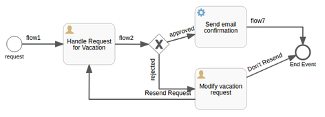
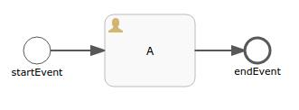

# Spring Activiti

## 使用Java的Activiti指南

1. 概述

    Activiti API是一个工作流和业务流程管理系统。我们可以在其中定义一个流程，执行它，并使用API提供的服务以不同方式操作它。它需要JDK 7+。

    使用API的开发可以在任何IDE中完成，但要使用[Activiti Designer](https://www.activiti.org/userguide/index.html?_ga=2.55182893.76071610.1499064413-1368418377.1499064413#eclipseDesignerInstallation)，我们需要Eclipse。

    我们可以使用BPMN 2.0标准在其中定义一个流程。还有一种不太流行的方式--使用Java类，如StartEvent、EndEvent、UserTask、SequenceFlow等。

    如果我们想运行一个流程或访问任何服务，我们需要创建一个ProcessEngineConfiguration。

    我们可以使用ProcessEngineConfiguration获得ProcessEngine，在某些方面，我们将在本文中进一步讨论。通过ProcessEngine，我们可以执行工作流和BPMN操作。

2. Maven的依赖性

    要使用这个API，我们需要包含Activiti的依赖性：

    ```xml
    <dependency>
        <groupId>org.activiti</groupId>
        <artifactId>activiti-engine</artifactId>
    </dependency>
    ```

3. 创建一个ProcessEngine

    Activiti的ProcessEngine通常使用XML文件activiti.cfg.xml进行配置。这个配置文件的一个例子是：

    ```xml
    <beans xmlns="...">
        <bean id="processEngineConfiguration" class=
        "org.activiti.engine.impl.cfg.StandaloneProcessEngineConfiguration">
            <property name="jdbcUrl" 
            value="jdbc:h2:mem:activiti;DB_CLOSE_DELAY=1000" />
            <property name="jdbcDriver" value="org.h2.Driver" />
            <property name="jdbcUsername" value="root" />
            <property name="jdbcPassword" value="" />
            <property name="databaseSchemaUpdate" value="true" />
        </bean>
    </beans>
    ```

    现在我们可以使用ProcessEngines类获得ProcessEngine：

    `ProcessEngine processEngine = ProcessEngines.getDefaultProcessEngine();`

    该语句将在classpath中寻找activiti.cfg.xml文件，并根据该文件中的配置构建一个ProcessEngine。

    配置文件的示例代码显示，它只是一个基于Spring的配置。但是，这并不意味着我们只能在Spring环境下使用Activiti。Spring的能力只是在内部用于创建ProcessEngine。

    让我们写一个JUnit测试案例，它将使用上面显示的配置文件创建ProcessEngine：

    ```java
    @Test
    public void givenXMLConfig_whenGetDefault_thenGotProcessEngine() {
        ProcessEngine processEngine 
        = ProcessEngines.getDefaultProcessEngine();
        assertNotNull(processEngine);
        assertEquals("root", processEngine.getProcessEngineConfiguration()
        .getJdbcUsername());
    }
    ```

4. Activiti流程引擎API和服务

    与API互动的入口点是ProcessEngine。通过ProcessEngine，我们可以访问提供工作流/BPMN方法的各种服务。ProcessEngine和所有的服务对象都是线程安全的。

    

    摘自<https://www.activiti.org/userguide/images/api.services.png>

    ProcessEngines 类将扫描 activiti.cfg.xml 和 activiti-context.xml 文件。如前所述，对于所有 activiti.cfg.xml 文件，ProcessEngine 将以典型的方式创建。

    而对于所有的activiti-context.xml文件，它将以Spring的方式创建--我将创建Spring应用上下文，并从其中获取ProcessEngine。在一个流程的执行过程中，所有的步骤都将按照BPMN文件中定义的顺序被访问。

    在流程的执行过程中，所有的步骤都将按照BPMN文件中定义的顺序被访问。

    1. 流程定义和相关术语

        ProcessDefinition代表一个业务流程。它被用来定义流程中不同步骤的结构和行为。部署一个流程定义意味着将流程定义加载到Activiti数据库中。

        流程定义大多是由BPMN 2.0标准定义的。也可以用Java代码来定义它们。本节中定义的所有术语也可以作为Java类使用。

        一旦我们开始运行一个流程定义，它就可以被称为一个流程

        一个ProcessInstance是一个ProcessDefinition的一个执行。

        一个StartEvent与每个业务流程相关联。它表示流程的进入点。同样地，有一个EndEvent，它表示流程的结束。我们可以在这些事件上定义条件。

        在开始和结束之间的所有步骤（或元素）被称为任务。任务可以是各种类型的。最常用的任务是UserTasks和ServiceTasks。

        UserTasks，顾名思义，是指需要由用户手动执行的任务。

        另一方面，服务任务是用一段代码配置的。每当执行到他们时，他们的代码块将被执行。

        SequenceFlows连接任务。我们可以通过它们要连接的源和目标元素来定义SequenceFlows。同样，我们也可以在SequenceFlows上定义条件，在这个过程中创建条件路径。

    2. 服务

        我们将简要地讨论Activiti提供的服务：

        - RepositoryService 帮助我们操作流程定义的部署。该服务处理与流程定义相关的静态数据
        - RuntimeService 管理ProcessInstances（当前运行的进程）以及进程变量。
        - TaskService 跟踪UserTasks。需要由用户手动执行的任务是Activiti API的核心。我们可以通过这个服务来创建一个任务，要求并完成一个任务，操纵任务的受让人等。
        - FormService 是一个可选的服务。没有它，API也可以使用，而且不会牺牲其任何功能。它被用来定义流程中的起始表单和任务表单。
        - IdentityService 管理用户和组
        - HistoryService 跟踪Activiti Engine的历史。我们还可以设置不同的历史级别。
        - ManagementService 与元数据有关，在创建一个应用程序时通常不需要。
        - DynamicBpmnService 帮助我们改变流程中的任何东西，而不需要重新部署它。
5. 与Activiti服务一起工作

    为了了解我们如何使用不同的服务并运行一个流程，让我们以 "员工休假申请" 的流程为例：

    

    这个流程的BPMN 2.0文件，VacationRequest.bpmn20.xml，将把开始事件定义为：

    ```xml
    <startEvent id="startEvent" name="request" 
    activiti:initiator="employeeName">
        <extensionElements>
            <activiti:formProperty id="numberOfDays" 
            name="Number of days" type="long" required="true"/>
            <activiti:formProperty id="startDate" 
            name="Vacation start date (MM-dd-yyyy)" type="date" 
            datePattern="MM-dd-yyyy hh:mm" required="true"/>
            <activiti:formProperty id="reason" name="Reason for leave" 
            type="string"/>
        </extensionElements>
    </startEvent>
    ```

    同样地，第一个用户任务，分配给用户组 "管理"，将看起来像这样：

    ```xml
    <userTask id="handle_vacation_request" name=
    "Handle Request for Vacation">
        <documentation>${employeeName} would like to take ${numberOfDays} day(s)
        of vacation (Motivation: ${reason}).</documentation>
        <extensionElements>
            <activiti:formProperty id="vacationApproved" name="Do you approve
            this vacation request?" type="enum" required="true"/>
            <activiti:formProperty id="comments" name="Comments from Manager"
            type="string"/>
        </extensionElements>
        <potentialOwner>
        <resourceAssignmentExpression>
            <formalExpression>management</formalExpression>
        </resourceAssignmentExpression>
        </potentialOwner>
    </userTask>
    ```

    有了ServiceTask，我们需要定义要执行的那段代码。我们将这段代码作为一个Java类：

    ```xml
    <serviceTask id="send-email-confirmation" name="Send email confirmation" 
    activiti:class=
    "com.example.activiti.servicetasks.SendEmailServiceTask.java">
    </serviceTask>
    ```

    通过在 "sequenceFlow" 中添加 "conditionExpression" 标签，条件流将被显示：

    ```xml
    <sequenceFlow id="flow3" name="approved" 
    sourceRef="sid-12A577AE-5227-4918-8DE1-DC077D70967C" 
    targetRef="send-email-confirmation">
        <conditionExpression xsi:type="tFormalExpression">
        <![CDATA[${vacationApproved == 'true'}]]>
        </conditionExpression>
    </sequenceFlow>
    ```

    这里， vacationApproved 是上面显示的 UserTask 的 formProperty。

    正如我们在图中看到的，这是一个非常简单的过程。雇员提出一个休假请求，提供休假天数和开始日期。该请求被转给经理。他们可以批准/不批准该请求。

    如果批准，有一个服务任务定义为发送确认电子邮件。如果不批准，雇员可以选择修改并重新发送请求，或者什么都不做。

    服务任务被提供了一些要执行的代码（在这里是一个Java类）。我们已经给出了SendEmailServiceTask.java这个类。

    这些类型的类应该扩展JavaDelegate。同时，我们需要覆盖它的execute()方法，当流程执行到这一步时，将执行该方法。

    1. 部署一个流程

        为了让Activiti引擎知道我们的流程，我们需要部署该流程。我们可以使用RepositoryService以编程方式完成。让我们写一个JUnit测试来说明这一点：

        ```java
        @Test 
        public void givenBPMN_whenDeployProcess_thenDeployed() {
            ProcessEngine processEngine 
            = ProcessEngines.getDefaultProcessEngine();
            RepositoryService repositoryService 
            = processEngine.getRepositoryService();
            repositoryService.createDeployment()
            .addClasspathResource(
            "org/activiti/test/vacationRequest.bpmn20.xml")
            .deploy();
            Long count=repositoryService.createProcessDefinitionQuery().count();
            assertEquals("1", count.toString());
        }
        ```

        部署意味着引擎将解析BPMN文件并将其转换为可执行的东西。同时，每次部署都会有一条记录被添加到Repository表中。

        因此，之后我们可以查询Repository服务以获得部署的流程；ProcessDefinitions。

    2. 启动一个ProcessInstance

        将ProcessDefinition部署到Activiti Engine后，我们可以通过创建ProcessInstances来执行该流程。ProcessDefinition是一个蓝图(blueprint)，而ProcessInstance是它的运行时执行。

        对于一个ProcessDefinition，可以有多个ProcessInstances。

        所有与ProcessInstances有关的细节都可以通过RuntimeService访问。

        在我们的例子中，在开始事件中，我们需要传递休假天数、开始日期和原因。我们将使用过程变量，并在创建ProcessInstance时传递它们。

        让我们写一个JUnit测试案例，以获得更好的想法：

        ```java
        @Test
        public void givenDeployedProcess_whenStartProcessInstance_thenRunning() {
            //deploy the process definition    
            Map<String, Object> variables = new HashMap>();
            variables.put("employeeName", "John");
            variables.put("numberOfDays", 4);
            variables.put("vacationMotivation", "I need a break!");
            RuntimeService runtimeService = processEngine.getRuntimeService();
            ProcessInstance processInstance = runtimeService
            .startProcessInstanceByKey("vacationRequest", variables);
            Long count=runtimeService.createProcessInstanceQuery().count();
            assertEquals("1", count.toString());
        }
        ```

        一个进程定义的多个实例将因进程变量而不同。

        有多种方法来启动一个进程实例。这里，我们使用的是进程的键。在启动进程实例后，我们可以通过查询RuntimeService来获得关于它的信息。

    3. 完成任务

        当我们的流程实例开始运行时，第一步是一个用户任务，分配给用户组 "管理"。

        用户可能有一个收件箱，里面会有一个要由他们完成的任务列表。现在，如果我们想继续执行流程，用户需要完成这个任务。对于Activiti Engine来说，这被称为 "完成任务"。

        我们可以查询TaskService，以获得任务对象，然后完成它。

        我们需要为此编写的代码看起来像：

        ```java
        @Test 
        public void givenProcessInstance_whenCompleteTask_thenGotNextTask() {
            // deploy process and start process instance   
            TaskService taskService = processEngine.getTaskService();
            List<Task> tasks = taskService.createTaskQuery()
            .taskCandidateGroup("management").list();
            Task task = tasks.get(0);
            Map<String, Object> taskVariables = new HashMap<>();
            taskVariables.put("vacationApproved", "false");
            taskVariables.put("comments", "We have a tight deadline!");
            taskService.complete(task.getId(), taskVariables);
            Task currentTask = taskService.createTaskQuery()
            .taskName("Modify vacation request").singleResult();
            assertNotNull(currentTask);
        }
        ```

        注意，TaskService的complete()方法也接收了所需的过程变量。我们传入管理器的回复。

        在这之后，流程引擎将继续进行下一个步骤。在这里，下一步会询问员工是否要重新发送休假请求。

        所以，我们的ProcessInstance现在正在等待这个UserTask，它的名字是 "修改休假请求"。

    4. 暂停和激活一个进程

        我们可以暂停一个ProcessDefinition，也可以暂停一个ProcessInstance。如果我们暂停一个ProcessDefinition，在它被暂停时我们不能创建它的实例。我们可以使用RepositoryService来做到这一点：

        ```java
        @Test(expected = ActivitiException.class)
        public void givenDeployedProcess_whenSuspend_thenNoProcessInstance() {
            // deploy the process definition
            repositoryService.suspendProcessDefinitionByKey("vacationRequest");
            runtimeService.startProcessInstanceByKey("vacationRequest");
        }
        ```

        要再次激活它，我们只需要调用repositoryService.activateProcessDefinitionXXX方法中的一个。

        同样地，我们可以暂停一个ProcessInstance，使用RuntimeService。

6. 结语

    在这篇文章中，我们看到了如何用Java来使用Activiti。我们创建了一个ProcessEngineCofiguration文件样本，它可以帮助我们创建ProcessEngine。

    使用它，我们访问了由API提供的各种服务。这些服务帮助我们管理和跟踪ProcessDefinitions、ProcessInstances、UserTasks等。

## 使用Spring的Activiti简介

1. 概述

    简单地说，Activiti是一个工作流和业务流程管理平台。

    我们可以通过创建一个ProcessEngineConfiguration（通常基于一个配置文件）来快速入门。从这里，我们可以获得一个ProcessEngine--通过ProcessEngine，我们可以执行工作流和BPM操作。

    该API提供了各种服务，可用于访问和管理流程。这些服务可以为我们提供关于流程历史的信息，当前正在运行的流程以及已经部署但尚未运行的流程。

    这些服务还可以用来定义进程结构和操纵进程的状态，即运行、暂停、取消等。

2. 用Spring Boot设置

    让我们看看如何将Activiti设置为Spring Boot Maven应用程序并开始使用它。

    1. 初始设置

        像往常一样，我们需要添加maven的依赖性：

        ```xml
        <dependency>
            <groupId>org.activiti</groupId>
            <artifactId>activiti-spring-boot-starter</artifactId>
        </dependency>
        ```

        该API的最新稳定版本可以在这里找到。

        我们也可以使用<https://start.spring.io>，生成一个Spring Boot项目，并选择Activiti作为依赖项。

        只要把这个依赖关系和@EnableAutoConfiguration注解添加到Spring Boot应用中，它就能完成初始设置：

        - 创建数据源（该API需要一个数据库来创建ProcessEngine）。
        - 创建并公开ProcessEngine Bean
        - 创建并公开Activiti服务豆类
        - 创建Spring作业执行器
    2. 创建和运行一个流程

        让我们来构建一个创建和运行业务流程的例子。为了定义一个流程，我们将需要创建一个BPMN文件。

        然后，只要下载BPMN文件。我们将需要把这个文件放在src/main/resources/processes文件夹中。默认情况下，Spring Boot会在这个文件夹中查找，以部署流程定义。

        我们将创建一个包含一个用户任务的演示流程：

        

        用户任务的分配者被设定为流程的发起者。这个流程定义的BPMN文件看起来像：

        ```xml
        <process id="my-process" name="say-hello-process" isExecutable="true">
            <startEvent id="startEvent" name="startEvent">
            </startEvent>
            <sequenceFlow id="sequence-flow-1" sourceRef="startEvent" targetRef="A">
            </sequenceFlow>     
            <userTask id="A" name="A" activiti:assignee="$INITIATOR">
            </userTask>
            <sequenceFlow id="sequence-flow-2" sourceRef="A" targetRef="endEvent">
            </sequenceFlow>
            <endEvent id="endEvent" name="endEvent">
            </endEvent>
        </process>
        ```

        现在，我们将创建一个REST控制器来处理启动这个流程的请求：

        ```java
        @Autowired
        private RuntimeService runtimeService;
        @GetMapping("/start-process")
        public String startProcess() {
            runtimeService.startProcessInstanceByKey("my-process");
            return "Process started. Number of currently running"
            + "process instances = "
            + runtimeService.createProcessInstanceQuery().count();
        }
        ```

        这里，runtimeService.startProcessInstanceByKey("my-process")开始执行键值为 "my-process "的进程。runtimeService.createProcessInstanceQuery().count()将获得进程实例的数量。

        每次我们点击路径"/start-process"，一个新的ProcessInstance就会被创建，我们会看到当前运行的进程的计数有一个增量。

        一个JUnit测试案例向我们展示了这种行为：

        ```java
        @Test
        public void givenProcess_whenStartProcess_thenIncreaseInProcessInstanceCount() 
        throws Exception {
        
            String responseBody = this.mockMvc
            .perform(MockMvcRequestBuilders.get("/start-process"))
            .andReturn().getResponse().getContentAsString();
        
            assertEquals("Process started. Number of currently running"
            + " process instances = 1", responseBody);
                
            responseBody = this.mockMvc
            .perform(MockMvcRequestBuilders.get("/start-process"))
            .andReturn().getResponse().getContentAsString();
        
            assertEquals("Process started. Number of currently running"
            + " process instances = 2", responseBody);
                
            responseBody = this.mockMvc
            .perform(MockMvcRequestBuilders.get("/start-process"))
            .andReturn().getResponse().getContentAsString();
        
            assertEquals("Process started. Number of currently running"
            + " process instances = 3", responseBody);
        }
        ```

3. 玩转进程

    现在我们在Activiti中使用Spring Boot有了一个正在运行的进程，让我们扩展上面的例子来演示我们如何访问和操作这个进程。

    1. 获取一个给定的ProcessInstance的任务列表

        我们有两个用户任务A和B。当我们启动一个进程时，它会等待第一个任务A完成，然后会执行任务B。让我们创建一个处理方法，接受请求，查看与给定的processInstance相关的任务。

        像任务这样的对象，不能直接作为响应发送，因此我们需要创建一个自定义对象，并将任务转换为我们的自定义对象。我们将这个类称为TaskRepresentation：

        ```java
        class TaskRepresentation {
            private String id;
            private String name;
            private String processInstanceId;
            // standard constructors
        }
        ```

        处理方法将看起来像：

        ```java
        @GetMapping("/get-tasks/{processInstanceId}")
        public List<TaskRepresentation> getTasks(
        @PathVariable String processInstanceId) {
            List<Task> usertasks = taskService.createTaskQuery()
            .processInstanceId(processInstanceId)
            .list();
            return usertasks.stream()
            .map(task -> new TaskRepresentation(
                task.getId(), task.getName(), task.getProcessInstanceId()))
            .collect(Collectors.toList());
        }
        ```

        在这里，taskService.createTaskQuery().processInstanceId(processInstanceId).list()使用TaskService，并为我们获得与给定processInstanceId相关的任务列表。我们可以看到，当我们开始运行我们创建的进程时，我们将通过向我们刚刚定义的方法发出请求来获得任务A：

        ```java
        @Test
        public void givenProcess_whenProcessInstance_thenReceivedRunningTask() 
        throws Exception {
        
            this.mockMvc.perform(MockMvcRequestBuilders.get("/start-process"))
            .andReturn()
            .getResponse();
            ProcessInstance pi = runtimeService.createProcessInstanceQuery()
            .orderByProcessInstanceId()
            .desc()
            .list()
            .get(0);
            String responseBody = this.mockMvc
            .perform(MockMvcRequestBuilders.get("/get-tasks/" + pi.getId()))
            .andReturn()
            .getResponse()
            .getContentAsString();

            ObjectMapper mapper = new ObjectMapper();
            List<TaskRepresentation> tasks = Arrays.asList(mapper
            .readValue(responseBody, TaskRepresentation[].class));
        
            assertEquals(1, tasks.size());
            assertEquals("A", tasks.get(0).getName());
        }
        ```

    2. 完成一个任务

        现在，我们将看看当我们完成任务A时会发生什么。我们创建一个处理方法，该方法将处理完成给定进程实例的任务A的请求：

        ```java
        @GetMapping("/complete-task-A/{processInstanceId}")
        public void completeTaskA(@PathVariable String processInstanceId) {
            Task task = taskService.createTaskQuery()
            .processInstanceId(processInstanceId)
            .singleResult();
            taskService.complete(task.getId());
        }
        ```

        taskService.createTaskQuery().processInstanceId(processInstanceId).singleResult()在任务服务上创建一个查询，并给我们提供给定processInstance的任务。下一行taskService.complete(task.getId)完成了这个任务，这就是UserTask A。
        因此，现在进程已经到达终点，RuntimeService不包含任何ProcessInstances。我们可以通过JUnit测试案例看到这一点：

        ```java
        @Test
        public void givenProcess_whenCompleteTaskA_thenNoProcessInstance() 
        throws Exception {

            this.mockMvc.perform(MockMvcRequestBuilders.get("/start-process"))
            .andReturn()
            .getResponse();
            ProcessInstance pi = runtimeService.createProcessInstanceQuery()
            .orderByProcessInstanceId()
            .desc()
            .list()
            .get(0);
            this.mockMvc.perform(MockMvcRequestBuilders.get("/complete-task-A/" + pi.getId()))
            .andReturn()
            .getResponse()
            .getContentAsString();
            List<ProcessInstance> list = runtimeService.createProcessInstanceQuery().list();
            assertEquals(0, list.size());
        }
        ```

        这就是我们如何使用Activiti服务与进程一起工作。

4. 总结

    在这篇文章中，我们回顾了在Spring Boot中使用Activiti API的概况。关于API的更多信息可以在用户指南中找到。我们还看到了如何创建一个流程并使用Activiti服务对其执行各种操作。

    Spring Boot使其易于使用，因为我们不需要担心创建数据库、部署进程或创建ProcessEngine的问题。

## Relevant articles

- [ ] [A Guide to Activiti with Java](https://www.baeldung.com/java-activiti)
- [ ] [Introduction to Activiti with Spring](https://www.baeldung.com/spring-activiti)
- [Activiti with Spring Security](https://www.baeldung.com/activiti-spring-security)
- [ProcessEngine Configuration in Activiti](https://www.baeldung.com/activiti-process-engine)

## Code

一如既往，我们在文章中看到的例子的代码在[GitHub](https://github.com/eugenp/tutorials/tree/master/spring-activiti)上。
