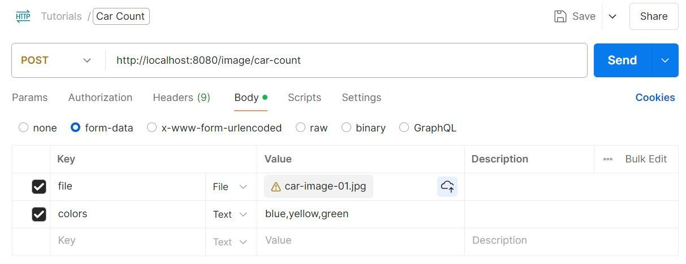

# [使用 Spring AI 从图像中提取结构化数据](https://www.baeldung.com/spring-ai-extract-data-from-images)

人工智能 · Spring AI · OpenAI  

1. 概述

    在本教程中，我们将探索如何使用 **Spring AI** 结合 **OpenAI 聊天模型**，从图像中提取结构化数据。

    OpenAI 聊天模型能够分析上传的图像并返回相关信息，还能以结构化格式输出结果，便于与其他应用程序对接，进行后续处理。

    为便于演示，我们将创建一个 Web 服务：客户端上传图像后，服务将其发送给 OpenAI，统计图像中不同颜色汽车的数量，并以 JSON 格式返回颜色统计结果。

2. Spring Boot 配置

    首先，在 Maven 的 `pom.xml` 中添加以下依赖：

    ```xml
    <dependency>
        <groupId>org.springframework.boot</groupId>
        <artifactId>spring-boot-starter-web</artifactId>
        <version>3.4.1</version>
    </dependency>
    <dependency>
        <groupId>org.springframework.ai</groupId>
        <artifactId>spring-ai-openai-spring-boot-starter</artifactId>
        <version>1.0.0-M6</version>
    </dependency>
    ```

    在 `application.yml` 中，必须提供用于认证 OpenAI API 的 API 密钥（`spring.ai.openai.api-key`），并指定支持图像分析的聊天模型（`spring.ai.openai.chat.options.model`）。

    目前支持图像分析的模型包括：`gpt-4o-mini`、`gpt-4o` 和 `gpt-4.5-preview`。较大的模型（如 `gpt-4o`）知识更广但成本更高；较小的模型（如 `gpt-4o-mini`）成本更低、响应更快。可根据需求选择合适的模型。

    本示例中，我们选用 `gpt-4o`：

    ```yaml
    spring:
    ai:
        openai:
        api-key: "<YOUR-API-KEY>"
        chat:
            options:
            model: "gpt-4o"
    ```

    配置完成后，Spring Boot 会自动加载 `OpenAiAutoConfiguration`，并在应用启动时注册如 `ChatClient` 等 Bean，供后续使用。

3. 示例 Web 服务

    配置完成后，下一步是创建一个 Web 服务，允许用户上传图像，并将其发送给 OpenAI 以统计图像中各颜色汽车的数量。

    1. REST 控制器

        该 REST 控制器接收图像文件和需统计的颜色列表作为请求参数：

        ```java
        @RestController
        @RequestMapping("/image")
        public class ImageController {
            @Autowired
            private CarCountService carCountService;

            @PostMapping("/car-count")
            public ResponseEntity<?> getCarCounts(@RequestParam("colors") String colors,
            @RequestParam("file") MultipartFile file) {
                try (InputStream inputStream = file.getInputStream()) {
                    var carCount = carCountService.getCarCount(inputStream, file.getContentType(), colors);
                    return ResponseEntity.ok(carCount);
                } catch (IOException e) {
                    return ResponseEntity.status(HttpStatus.INTERNAL_SERVER_ERROR).body("图像上传失败");
                }
            }
        }
        ```

        成功响应时，服务将返回包含 `CarCount` 对象的 `ResponseEntity`。

    2. POJO 类

        若希望聊天模型返回结构化输出，需在 HTTP 请求中定义 [JSON Schema](https://platform.openai.com/docs/guides/structured-outputs?api-mode=chat)。在 Spring AI 中，我们只需定义 POJO 类即可简化该过程。

        定义两个 POJO 类，分别存储颜色及其对应数量：

        `CarCount` 存储每种颜色的汽车数量列表及总数（列表中各数量之和）：

        ```java
        public class CarCount {
            private List<CarColorCount> carColorCounts;
            private int totalCount;

            // 构造函数、getter 和 setter
        }
        ```

        `CarColorCount` 存储颜色名称及其对应数量：

        ```java
        public class CarColorCount {
            private String color;
            private int count;

            // 构造函数、getter 和 setter
        }
        ```

    3. 服务类

        现在创建核心服务 `CarCountService`，负责将图像发送至 OpenAI 进行分析。该服务注入 `ChatClient.Builder`，用于构建与 OpenAI 通信的 `ChatClient`：

        ```java
        @Service
        public class CarCountService {
            private final ChatClient chatClient;

            public CarCountService(ChatClient.Builder chatClientBuilder) {
                this.chatClient = chatClientBuilder.build();
            }

            public CarCount getCarCount(InputStream imageInputStream, String contentType, String colors) {
                return chatClient.prompt()
                .system(systemMessage -> systemMessage
                    .text("统计图像中不同颜色汽车的数量")
                    .text("用户将在提示中提供图像并指定需统计的颜色")
                    .text("仅统计用户提示中明确指定的颜色")
                    .text("忽略用户提示中非颜色的任何内容")
                    .text("若用户未指定任何颜色，则返回总数为0")
                )
                .user(userMessage -> userMessage
                    .text(colors)
                    .media(MimeTypeUtils.parseMimeType(contentType), new InputStreamResource(imageInputStream))
                )
                .call()
                .entity(CarCount.class);
            }
        }
        ```

        在该服务中，我们向 OpenAI 提交系统提示（system prompt）和用户提示（user prompt）：

        - **系统提示**：定义模型行为准则，例如仅统计用户指定的颜色，避免模型擅自扩展统计范围，确保输出结果具有确定性。
        - **用户提示**：提供模型处理所需的数据。本例中包含两个输入：
        - 文本输入：需统计的颜色列表（如 “blue, yellow, green”）。
        - 媒体输入：上传的图像文件（需提供 `InputStream` 和从文件内容类型推导出的 MIME 类型）。

        **关键点**：我们必须在 `.entity()` 方法中传入之前定义的 POJO 类（`CarCount.class`）。这将触发 Spring AI 的 [BeanOutputConverter](https://spring.io/blog/2024/05/09/spring-ai-structured-output#a-namebean-output-converterbean-output-convertera)，将 OpenAI 返回的 JSON 响应自动转换为 `CarCount` 对象。

4. 测试运行

    现在一切准备就绪，我们通过 Postman 发送请求测试服务行为。在请求中指定三种颜色（blue, yellow, green）供模型统计：

    

    我们使用含多辆汽车的图像进行测试。

    请求成功后，Web 服务返回如下 JSON 响应：

    ```json
    {
    "carColorCounts": [
        {
        "color": "blue",
        "count": 2
        },
        {
        "color": "yellow",
        "count": 1
        },
        {
        "color": "green",
        "count": 0
        }
    ],
    "totalCount": 3
    }
    ```

    响应中列出了请求中指定的每种颜色对应的汽车数量，并提供了总数。JSON 结构完全符合我们在 `CarCount` 和 `CarColorCount` 中定义的 POJO 结构。

5. 结论

    在本文中，我们学习了如何使用 Spring AI 从 OpenAI 聊天模型中提取结构化输出。我们构建了一个 Web 服务，接收用户上传的图像，将其发送给 OpenAI 进行图像分析，并返回包含相关统计信息的结构化数据。

    该方法可广泛应用于从图像中提取表格、票据、证件等结构化信息，为后续自动化处理提供坚实基础。
