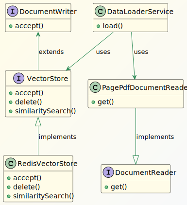
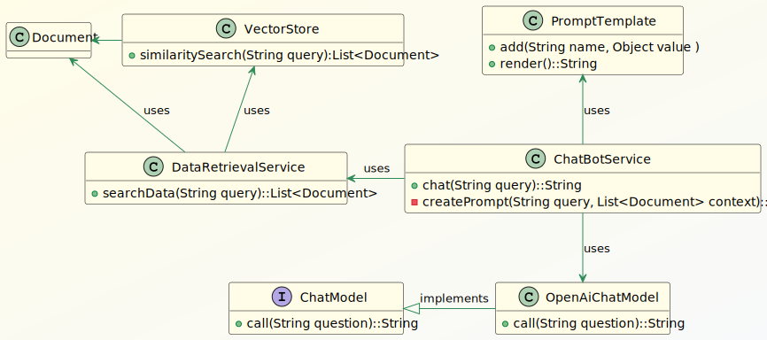

# [使用Redis和Spring AI创建RAG（检索增强生成）应用程序](https://www.baeldung.com/spring-ai-redis-rag-app)

1. 一览表

    在本教程中，我们将使用Spring AI框架和RAG（[检索增强生成](https://www.baeldung.com/cs/retrieval-augmented-generation)）技术构建一个聊天机器人。在Spring AI的帮助下，我们将与[Redis Vector数据库](https://redis.io/docs/latest/develop/get-started/vector-database/)集成，以存储和检索数据，以增强LLM（大型语言模型）的提示。一旦LLM收到包含相关数据的提示，它就会有效地生成带有自然语言最新数据的回复用户查询。

2. 什么是Rag？

    LLM 是根据互联网上的大量数据集预先训练的机器学习模型。要使 LLM 在私营企业中发挥作用，我们必须根据特定组织的知识库对其进行微调。然而，微调通常是一个耗时的过程，需要大量的计算资源。此外，经过微调的 LLM 很有可能会对查询生成不相关或误导性的响应。这种行为通常被称为 LLM 幻觉。

    在这种情况下，RAG 是限制 LLM 响应或将其上下文化的绝佳技术。矢量数据库在 RAG 架构中发挥着重要作用，可为 LLM 提供上下文信息。但是，在 RAG 架构中使用矢量数据库之前，应用程序必须通过 ETL（提取、转换和加载）流程对其进行填充：

    

    读者从不同的来源检索组织的知识库文档。然后，Transformer将检索到的文档拆分为更小的块，并使用嵌入模型对内容进行矢量化。最后，写入器将矢量或嵌入加载到矢量DB中。Vector DBs是专门的数据库，可以将这些嵌入存储在多维空间中。

    在RAG中，如果矢量数据库从组织的知识库中定期更新，LLM可以响应几乎实时的数据。

    一旦矢量数据库准备好数据，应用程序就可以使用它来检索用户查询的上下文数据：

    [RAG架构](pic/RAG-Architecture.svg)

    应用程序形成提示，将用户查询与来自矢量DB的上下文数据相结合，并最终将其发送到LLM。LLM在上下文数据的边界内用自然语言生成响应，并将其发回应用程序。

3. 使用Spring AI和Redis实现RAG

    Redis堆栈提供矢量搜索服务，我们将使用Spring AI框架与之集成，并构建基于RAG的ChatBot应用程序。此外，我们将使用OpenAI的GPT-3.5 Turbo LLM模型来生成最终响应。

    1. 先决条件

        对于ChatBot服务，为了验证OpenAI服务，我们需要API密钥。在创建[OpenAI帐户](https://platform.openai.com/)后，我们将创建一个：OpenAI密钥

        我们还将创建一个[Redis Cloud](https://app.redislabs.com/)帐户来访问免费的Redis Vector DB：

        为了与Redis Vector DB和OpenAI服务集成，我们将使用Spring AI库更新Maven依赖项：

        ```xml
        <dependency>
            <groupId>org.springframework.ai</groupId>
            <artifactId>spring-ai-openai-spring-boot-starter</artifactId>
            <version>1.0.0-M1</version>
        </dependency>
        <dependency>
            <groupId>org.springframework.ai</groupId>
            <artifactId>spring-ai-transformers-spring-boot-starter</artifactId>
            <version>1.0.0-M1</version>
        </dependency>
        <dependency>
            <groupId>org.springframework.ai</groupId>
            <artifactId>spring-ai-redis-spring-boot-starter</artifactId>
            <version>1.0.0-M1</version>
        </dependency>
        <dependency>
            <groupId>org.springframework.ai</groupId>
            <artifactId>spring-ai-pdf-document-reader</artifactId>
            <version>1.0.0-M1</version>
        </dependency>
        ```

    2. 将数据加载到Redis中的关键类

        在Spring Boot应用程序中，我们将创建组件，从Redis Vector DB加载和检索数据。例如，我们将员工手册PDF文档加载到Redis DB中。

        现在，让我们来看看所涉及的课程：

        

        DocumentReader是一个用于阅读文档的Spring AI接口。我们将使用[DocumentReader](https://docs.spring.io/spring-ai/docs/current/api/org/springframework/ai/document/DocumentReader.html)的开箱即用[PagePdfDocumentReader](https://docs.spring.io/spring-ai/docs/current/api/org/springframework/ai/reader/pdf/PagePdfDocumentReader.html)实现。同样，[DocumentWriter](https://docs.spring.io/spring-ai/docs/current/api/org/springframework/ai/document/DocumentWriter.html)和[VectorStore](https://docs.spring.io/spring-ai/docs/current/api/org/springframework/ai/vectorstore/VectorStore.html)是将数据写入存储系统的接口。[RedisVectorStore](https://docs.spring.io/spring-ai/docs/current/api/org/springframework/ai/vectorstore/RedisVectorStore.html)是VectorStore的众多开箱即用实现之一，我们将使用它在Redis Vector DB中加载和搜索数据。我们将使用迄今为止讨论的Spring AI框架类编写DataLoaderService。

    3. 实施数据加载器服务

        让我们来了解一下DataLoaderService类中的load（）方法：

        ```java
        @Service
        public class DataLoaderService {
            private static final Logger logger = LoggerFactory.getLogger(DataLoaderService.class);

            @Value("classpath:/data/Employee_Handbook.pdf")
            private Resource pdfResource;

            @Autowired
            private VectorStore vectorStore;

            public void load() {
                PagePdfDocumentReader pdfReader = new PagePdfDocumentReader(this.pdfResource,
                    PdfDocumentReaderConfig.builder()
                    .withPageExtractedTextFormatter(ExtractedTextFormatter.builder()
                        .withNumberOfBottomTextLinesToDelete(3)
                        .withNumberOfTopPagesToSkipBeforeDelete(1)
                        .build())
                    .withPagesPerDocument(1)
                    .build());

                var tokenTextSplitter = new TokenTextSplitter();
                this.vectorStore.accept(tokenTextSplitter.apply(pdfReader.get()));
            }
        }
        ```

        load（）方法使用PagePdfDocumentReader类读取PDF文件并将其加载到Redis Vector DB。Spring AI框架使用命名空间spring.ai.vectorstore中的[配置属性](https://docs.spring.io/spring-ai/reference/api/vectordbs/redis.html#_configuration_properties)自动配置VectoreStore接口：

        ```yml
        spring:
        ai:
            vectorstore:
            redis:
                uri: redis://:PQzkkZLOgOXXX@redis-19438.c330.asia-south1-1.gce.redns.redis-cloud.com:19438
                index: faqs
                prefix: "faq:"
                initialize-schema: true
        ```

        该框架将RedisVectorStore对象（VectorStore接口的实现）注入DataLoaderService中。

        [TokenTextSplitter](https://docs.spring.io/spring-ai/docs/current/api/org/springframework/ai/transformer/splitter/TokenTextSplitter.html)类拆分文档，最后，VectorStore类将块加载到Redis Vector DB中。

    4. 生成最终响应的关键类

        一旦Redis Vector DB准备就绪，我们就可以检索与用户查询相关的上下文信息。之后，此上下文用于形成LLM生成最终响应的提示。让我们来看看关键类：

        

        DataRetrievalService类中的searchData（）方法获取查询，然后从VectorStore检索上下文数据。ChatBotService使用此数据使用PromptTemplate类形成提示，然后将其发送到OpenAI服务。Spring Boot框架从application.yml文件中读取相关的OpenAI相关属性，然后自动配置OpenAIChatModel对象。

        让我们跳到实施，以详细了解。

    5. 实施聊天机器人服务

        让我们来看看ChatBotService类：

        ```java
        @Service
        public class ChatBotService {
            @Autowired
            private ChatModel chatClient;
            @Autowired
            private DataRetrievalService dataRetrievalService;

            private final String PROMPT_BLUEPRINT = """
            Answer the query strictly referring the provided context:
            {context}
            Query:
            {query}
            In case you don't have any answer from the context provided, just say:
            I'm sorry I don't have the information you are looking for.
            """;

            public String chat(String query) {
                return chatClient.call(createPrompt(query, dataRetrievalService.searchData(query)));
            }

            private String createPrompt(String query, List<Document> context) {
                PromptTemplate promptTemplate = new PromptTemplate(PROMPT_BLUEPRINT);
                promptTemplate.add("query", query);
                promptTemplate.add("context", context);
                return promptTemplate.render();
            }
        }
        ```

        SpringAI框架使用namespacespring.ai.openai中的[OpenAI](https://docs.spring.io/spring-ai/reference/api/chat/openai-chat.html)配置属性创建[ChatModel](https://docs.spring.io/spring-ai/reference/api/chatmodel.html) bean：

        ```yml
        spring:
        ai:
            vectorstore:
            redis:
                # Redis vector store related properties...
            openai:
            temperature: 0.3
            api-key: ${SPRING_AI_OPENAI_API_KEY}
            model: gpt-3.5-turbo
            #embedding-base-url: https://api.openai.com
            #embedding-api-key: ${SPRING_AI_OPENAI_API_KEY}
            #embedding-model: text-embedding-ada-002
        ```

        该框架还可以从环境变量SPRING_AI_OPENAI_API_KEY中读取API密钥，这是一个非常安全的选项。我们可以启用从文本嵌入开始的密钥来创建OpenAiEmbeddingModel bean，该bean用于从知识库文档中创建矢量嵌入。

        OpenAI服务的提示必须明确无誤。因此，我们在提示蓝图PROMPT_BLUEPRINT中严格指示仅从上下文信息中形成响应。

        在chat（）方法中，我们检索文档，匹配来自Redis Vector DB的查询。然后，我们使用这些文档和用户查询在createPrompt（）方法中生成提示。最后，我们调用ChatModel类的call（）方法来接收来自OpenAI服务的响应。

        现在，让我们通过从之前加载到Redis Vector DB的员工手册中提问来检查聊天机器人服务的运行：

        ```java
        @Test
        void whenQueryAskedWithinContext_thenAnswerFromTheContext() {
            String response = chatBotService.chat("How are employees supposed to dress?");
            assertNotNull(response);
            logger.info("Response from LLM: {}", response);
        }
        ```

        然后，我们将看到输出：

        `Response from LLM: Employees are supposed to dress appropriately for their individual work responsibilities and position.`

        输出与加载到Redis Vector DB的员工手册PDF文档对齐。

        让我们看看如果我们问一些员工手册中没有的东西会发生什么：

        ```java
        @Test
        void whenQueryAskedOutOfContext_thenDontAnswer() {
            String response = chatBotService.chat("What should employees eat?");
            assertEquals("I'm sorry I don't have the information you are looking for.", response);
            logger.info("Response from the LLM: {}", response);
        }
        ```

        这是结果的输出：

        `Response from the LLM: I'm sorry I don't have the information you are looking for.`

        LLM在提供的上下文中找不到任何东西，因此无法回答查询。

4. 结论

    在本文中，我们讨论了使用Spring AI框架实现基于RAG架构的应用程序。使用上下文信息形成提示对于从LLM中生成正确的响应至关重要。因此，Redis Vector DB是在文档矢量上存储和执行相似性搜索的绝佳解决方案。此外，对获取正确的记录和限制提示令牌的成本同样重要。
