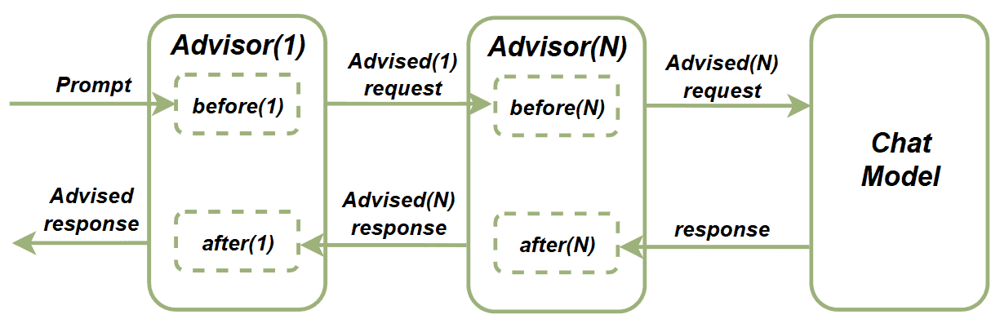

# [Spring AI 顾问（Advisors）指南](https://www.baeldung.com/spring-ai-advisors)

人工智能 · Spring AI · LLM  

1. 概述

    AI 驱动的应用程序已成为我们的新常态。我们广泛实现各类 RAG 应用、提示 API，并使用 LLM 构建令人印象深刻的项目。借助 **Spring AI**，我们可以更快、更一致地完成这些任务。

    在本文中，我们将介绍一个名为 **Spring AI Advisors** 的实用功能，它可帮助我们自动化处理各种常规任务。

2. 什么是 Spring AI Advisor？

    Advisors 是拦截器，用于处理 AI 应用中的请求和响应。我们可以利用它们为提示流程设置额外功能，例如：建立聊天历史、过滤敏感词、或为每个请求添加额外上下文。

    该功能的核心组件是 `CallAroundAdvisor` 接口。我们通过实现该接口创建一个 Advisor 链，影响请求或响应。其流程如下图所示：

    

    > 我们将提示发送给连接了 Advisor 链的聊天模型。在提示送达前，链中每个 Advisor 依次执行其 `before` 操作；在我们收到聊天模型响应前，每个 Advisor 依次执行其 `after` 操作。

3. 聊天记忆顾问（Chat Memory Advisors）

    **Chat Memory Advisors** 是一组非常实用的 Advisor 实现，可用于在聊天提示中提供对话历史，从而提高聊天响应的准确性。

    1. MessageChatMemoryAdvisor

        通过 `MessageChatMemoryAdvisor`，我们可以使用 `messages` 属性在聊天客户端调用中提供聊天历史。所有消息保存在 `ChatMemory` 实现中，我们可以控制历史记录大小。

        下面是一个简单示例：

        ```java
        @SpringBootTest(classes = ChatModel.class)
        @EnableAutoConfiguration
        @ExtendWith(SpringExtension.class)
        public class SpringAILiveTest {

            @Autowired
            @Qualifier("openAiChatModel")
            ChatModel chatModel;
            ChatClient chatClient;

            @BeforeEach
            void setup() {
                chatClient = ChatClient.builder(chatModel).build();
            }

            @Test
            void givenMessageChatMemoryAdvisor_whenAskingChatToIncrementTheResponseWithNewName_thenNamesFromTheChatHistoryExistInResponse() {
                ChatMemory chatMemory = new InMemoryChatMemory();
                MessageChatMemoryAdvisor chatMemoryAdvisor = new MessageChatMemoryAdvisor(chatMemory);

                String responseContent = chatClient.prompt()
                .user("将此名字加入列表并返回所有值：Bob")
                .advisors(chatMemoryAdvisor)
                .call()
                .content();

                assertThat(responseContent)
                .contains("Bob");

                responseContent = chatClient.prompt()
                .user("将此名字加入列表并返回所有值：John")
                .advisors(chatMemoryAdvisor)
                .call()
                .content();

                assertThat(responseContent)
                .contains("Bob")
                .contains("John");

                responseContent = chatClient.prompt()
                .user("将此名字加入列表并返回所有值：Anna")
                .advisors(chatMemoryAdvisor)
                .call()
                .content();

                assertThat(responseContent)
                .contains("Bob")
                .contains("John")
                .contains("Anna");
            }
        }
        ```

        在此测试中，我们创建了一个内含 `InMemoryChatMemory` 的 `MessageChatMemoryAdvisor` 实例。接着我们发送多个提示，要求聊天模型返回包含历史数据的人名列表。结果可见，对话中所有名字均被正确返回。

    2. PromptChatMemoryAdvisor

        使用 `PromptChatMemoryAdvisor` 同样可以实现提供对话历史的目标，区别在于它将聊天记忆直接注入提示文本中。底层实现会在提示中追加如下内容：

        ```txt
        Use the conversation memory from the MEMORY section to provide accurate answers.
        ---------------------
        MEMORY:
        {memory}
        ---------------------
        ```

        让我们验证其效果：

        ```java
        @Test
        void givenPromptChatMemoryAdvisor_whenAskingChatToIncrementTheResponseWithNewName_thenNamesFromTheChatHistoryExistInResponse() {
            ChatMemory chatMemory = new InMemoryChatMemory();
            PromptChatMemoryAdvisor chatMemoryAdvisor = new PromptChatMemoryAdvisor(chatMemory);

            String responseContent = chatClient.prompt()
            .user("将此名字加入列表并返回所有值：Bob")
            .advisors(chatMemoryAdvisor)
            .call()
            .content();

            assertThat(responseContent)
            .contains("Bob");

            responseContent = chatClient.prompt()
            .user("将此名字加入列表并返回所有值：John")
            .advisors(chatMemoryAdvisor)
            .call()
            .content();

            assertThat(responseContent)
            .contains("Bob")
            .contains("John");

            responseContent = chatClient.prompt()
            .user("将此名字加入列表并返回所有值：Anna")
            .advisors(chatMemoryAdvisor)
            .call()
            .content();

            assertThat(responseContent)
            .contains("Bob")
            .contains("John")
            .contains("Anna");
        }
        ```

        这次我们使用 `PromptChatMemoryAdvisor` 请求聊天模型考虑对话历史。结果如预期，所有历史数据均被正确返回。

    3. VectorStoreChatMemoryAdvisor

        使用 `VectorStoreChatMemoryAdvisor`，我们获得更强大的功能：通过向量库中的相似度匹配搜索消息上下文，并根据对话 ID 检索相关文档。本例中我们使用稍作修改的 `SimpleVectorStore`，但也可替换为任意向量数据库。

        首先，创建向量存储 Bean：

        ```java
        @Configuration
        public class SimpleVectorStoreConfiguration {

            @Bean
            public VectorStore vectorStore(@Qualifier("openAiEmbeddingModel") EmbeddingModel embeddingModel) {
                return new SimpleVectorStore(embeddingModel) {
                    @Override
                    public List<Document> doSimilaritySearch(SearchRequest request) {
                        float[] userQueryEmbedding = embeddingModel.embed(request.query);
                        return this.store.values()
                        .stream()
                        .map(entry -> Pair.of(entry.getId(),
                            EmbeddingMath.cosineSimilarity(userQueryEmbedding, entry.getEmbedding())))
                        .filter(s -> s.getSecond() >= request.getSimilarityThreshold())
                        .sorted(Comparator.comparing(Pair::getSecond))
                        .limit(request.getTopK())
                        .map(s -> this.store.get(s.getFirst()))
                        .toList();
                    }
                };
            }
        }
        ```

        这里我们创建了 `SimpleVectorStore` Bean 并重写了 `doSimilaritySearch()` 方法。默认的 `SimpleVectorStore` 不支持元数据过滤，但本测试仅涉及单一对话，因此此方法完全适用。

        现在，测试历史上下文行为：

        ```java
        @Test
        void givenVectorStoreChatMemoryAdvisor_whenAskingChatToIncrementTheResponseWithNewName_thenNamesFromTheChatHistoryExistInResponse() {
            VectorStoreChatMemoryAdvisor chatMemoryAdvisor = new VectorStoreChatMemoryAdvisor(vectorStore);

            String responseContent = chatClient.prompt()
            .user("从我们的聊天历史中找出猫，加入 Lion 并返回列表")
            .advisors(chatMemoryAdvisor)
            .call()
            .content();

            assertThat(responseContent)
            .contains("Lion");

            responseContent = chatClient.prompt()
            .user("从我们的聊天历史中找出猫，加入 Puma 并返回列表")
            .advisors(chatMemoryAdvisor)
            .call()
            .content();

            assertThat(responseContent)
            .contains("Lion")
            .contains("Puma");

            responseContent = chatClient.prompt()
            .user("从我们的聊天历史中找出猫，加入 Leopard 并返回列表")
            .advisors(chatMemoryAdvisor)
            .call()
            .content();

            assertThat(responseContent)
            .contains("Lion")
            .contains("Puma")
            .contains("Leopard");
        }
        ```

        我们要求聊天模型逐步向列表添加项目，底层则通过相似度搜索获取相关文档，LLM 据此生成包含历史内容的响应。

4. 问答顾问（QuestionAnswerAdvisor）

    在 RAG 应用中，我们广泛使用 `QuestionAnswerAdvisor`。该顾问通过相似度搜索从向量库中检索上下文，构建基于上下文的提问提示。

    验证其行为：

    ```java
    @Test
    void givenQuestionAnswerAdvisor_whenAskingQuestion_thenAnswerShouldBeProvidedBasedOnVectorStoreInformation() {
        Document document = new Document("天空是绿色的");
        List<Document> documents = new TokenTextSplitter().apply(List.of(document));
        vectorStore.add(documents);
        QuestionAnswerAdvisor questionAnswerAdvisor = new QuestionAnswerAdvisor(vectorStore);

        String responseContent = chatClient.prompt()
        .user("天空是什么颜色？")
        .advisors(questionAnswerAdvisor)
        .call()
        .content();

        assertThat(responseContent)
        .containsIgnoringCase("green");
    }
    ```

    我们将特定信息存入向量库，然后使用 `QuestionAnswerAdvisor` 构建提示，验证响应内容是否与文档一致。

5. 安全防护顾问（SafeGuardAdvisor）

    有时我们需要阻止客户端提示中使用某些敏感词。毫无疑问，`SafeGuardAdvisor` 可帮助我们实现此目标：只需指定禁用词列表并将其加入提示顾问实例。若请求中包含禁用词，将被拒绝并提示用户重新措辞：

    ```java
    @Test
    void givenSafeGuardAdvisor_whenSendPromptWithSensitiveWord_thenExpectedMessageShouldBeReturned() {
        List<String> forbiddenWords = List.of("Word2");
        SafeGuardAdvisor safeGuardAdvisor = new SafeGuardAdvisor(forbiddenWords);

        String responseContent = chatClient.prompt()
        .user("请将 'Word2' 拆分为字符")
        .advisors(safeGuardAdvisor)
        .call()
        .content();

        assertThat(responseContent)
        .contains("我无法回应此内容，因其包含敏感信息");
    }
    ```

    本例中，我们创建了一个含单个禁用词的 `SafeGuardAdvisor`，并在提示中使用该词，如预期收到验证失败消息。

6. 实现自定义顾问（Custom Advisor）

    当然，我们也可以实现任何自定义逻辑的顾问。下面创建一个 `CustomLoggingAdvisor`，用于记录所有聊天请求和响应：

    ```java
    public class CustomLoggingAdvisor implements CallAroundAdvisor {
        private final static Logger logger = LoggerFactory.getLogger(CustomLoggingAdvisor.class);

        @Override
        public AdvisedResponse aroundCall(AdvisedRequest advisedRequest, CallAroundAdvisorChain chain) {
            advisedRequest = this.before(advisedRequest);
            AdvisedResponse advisedResponse = chain.nextAroundCall(advisedRequest);
            this.observeAfter(advisedResponse);
            return advisedResponse;
        }

        private void observeAfter(AdvisedResponse advisedResponse) {
            logger.info(advisedResponse.response()
            .getResult()
            .getOutput()
            .getContent());
        }

        private AdvisedRequest before(AdvisedRequest advisedRequest) {
            logger.info(advisedRequest.userText());
            return advisedRequest;
        }

        @Override
        public String getName() {
            return "CustomLoggingAdvisor";
        }

        @Override
        public int getOrder() {
            return Integer.MAX_VALUE; // 确保在链中最后执行
        }
    }
    ```

    我们实现了 `CallAroundAdvisor` 接口，并在调用前后添加日志记录逻辑。`getOrder()` 返回最大整数值，确保该顾问在链中最后执行。

    测试自定义顾问：

    ```java
    @Test
    void givenCustomLoggingAdvisor_whenSendPrompt_thenPromptTextAndResponseShouldBeLogged() {
        CustomLoggingAdvisor customLoggingAdvisor = new CustomLoggingAdvisor();

        String responseContent = chatClient.prompt()
        .user("从1数到10")
        .advisors(customLoggingAdvisor)
        .call()
        .content();

        assertThat(responseContent)
        .contains("1")
        .contains("10");
    }
    ```

    创建并附加 `CustomLoggingAdvisor` 后，查看日志输出：

    ```log
    c.b.s.advisors.CustomLoggingAdvisor      : 从1数到10
    c.b.s.advisors.CustomLoggingAdvisor      : 1, 2, 3, 4, 5, 6, 7, 8, 9, 10
    ```

    可见，我们的顾问成功记录了提示文本和聊天响应。

7. 结论

    在本教程中，我们探索了 **Spring AI Advisors** 这一强大功能。借助 Advisors，我们可轻松实现聊天记忆、敏感词控制、向量库无缝集成等功能。同时，我们也能自由创建自定义扩展，添加特定业务逻辑。使用 Advisors，我们可以一致且简洁地实现上述所有能力。
