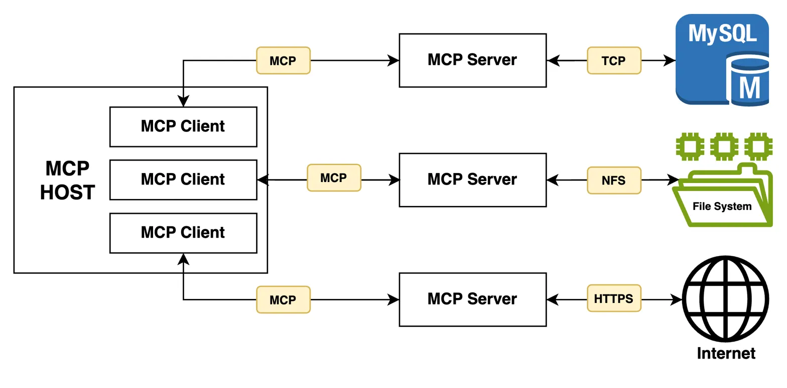

# [使用 Spring AI 探索模型上下文协议 (MCP)](https://www.baeldung.com/spring-ai-model-context-protocol-mcp)

人工智能 Spring AI

Spring Boot

1. 概述

    现代 Web 应用程序正越来越多地集成大型语言模型（LLM），以构建解决方案，这些方案不仅限于基于通用知识的问答。

    为了增强 AI 模型的响应能力并使其更具上下文感知能力，我们可以将其连接到外部数据源，如搜索引擎、数据库和文件系统。然而，集成和管理具有不同格式和协议的多个数据源是一项挑战。

    由 Anthropic 提出的模型上下文协议（MCP）正是为解决这一集成难题而生，它提供了一种标准化方式，用于将 AI 驱动的应用程序与外部数据源连接起来。通过 MCP，我们可以在原生 LLM 基础上构建复杂的智能体和工作流。

    在本教程中，我们将通过使用 Spring AI 实际实现其客户端-服务器架构来理解 MCP 的概念。我们将创建一个简单的聊天机器人，并通过 MCP 服务器扩展其功能，以执行网络搜索、执行文件系统操作并访问自定义业务逻辑。

2. 模型上下文协议 101

    在深入实现之前，让我们先仔细了解一下 MCP 及其各个组件：

    模型上下文协议（MCP）架构图，展示主机、客户端、服务器和外部数据源之间的关系。

    

    MCP 采用围绕几个关键组件构建的客户端-服务器架构：

    - MCP 主机：是我们的主应用程序，它集成了一个 LLM，并需要该 LLM 连接到外部数据源。
    - MCP 客户端：是与 MCP 服务器建立并维护一对一连接的组件。
    - MCP 服务器：是集成外部数据源并向客户端公开交互功能的组件。
    - 工具：指 MCP 服务器公开供客户端调用的可执行函数/方法。

    此外，为了处理客户端和服务器之间的通信，MCP 提供了两种传输通道。

    为了通过标准输入和输出流与本地进程和命令行工具进行通信，它提供了标准输入/输出（Standard Input/Output, stdio）传输类型。或者，对于客户端和服务器之间基于 HTTP 的通信，它提供了服务器发送事件（Server-Sent Events, SSE）传输类型。

    MCP 是一个复杂且庞大的主题，请参考[官方文档](https://modelcontextprotocol.io/introduction)以了解更多信息。

3. 创建 MCP 主机

    现在我们对 MCP 有了高层次的理解，让我们开始实际实现 MCP 架构。

    我们将使用 Anthropic 的 Claude 模型构建一个聊天机器人，它将作为我们的 MCP 主机。或者，我们也可以通过 Hugging Face 或 Ollama 使用本地 LLM，因为对于本演示而言，具体的 AI 模型并不重要。

    1. 依赖项

        让我们首先在项目的 pom.xml 文件中添加必要的依赖项：

        ```xml
        <dependency>
            <groupId>org.springframework.ai</groupId>
            <artifactId>spring-ai-starter-model-anthropic</artifactId>
            <version>1.0.1</version>
        </dependency>
        <dependency>
            <groupId>org.springframework.ai</groupId>
            <artifactId>spring-ai-starter-mcp-client</artifactId>
            <version>1.0.1</version>
        </dependency>
        ```

        Anthropic starter 依赖项是对 [Anthropic Message API](https://docs.anthropic.com/en/api/messages) 的封装，我们将在应用程序中使用它来与 Claude 模型进行交互。

        此外，我们导入 MCP 客户端 [starter](https://mvnrepository.com/artifact/org.springframework.ai/spring-ai-starter-mcp-client) 依赖项，这将允许我们在 Spring Boot 应用程序中配置客户端，这些客户端与 MCP 服务器保持一对一的连接。

        鉴于我们在项目中使用了多个 Spring AI starter，让我们也在 pom.xml 中包含 Spring AI 的物料清单（[BOM](https://mvnrepository.com/artifact/org.springframework.ai/spring-ai-bom)）：

        ```xml
        <dependencyManagement>
            <dependencies>
                <dependency>
                    <groupId>org.springframework.ai</groupId>
                    <artifactId>spring-ai-bom</artifactId>
                    <version>1.0.1</version>
                    <type>pom</type>
                    <scope>import</scope>
                </dependency>
            </dependencies>
        </dependencyManagement>
        ```

        添加此内容后，我们现在可以从两个 starter 依赖项中移除版本标签。BOM 消除了版本冲突的风险，并确保我们的 Spring AI 依赖项相互兼容。

        接下来，让我们在 application.yaml 文件中配置我们的 Anthropic API 密钥和聊天模型：

        ```yaml
        spring:
        ai:
            anthropic:
            api-key: ${ANTHROPIC_API_KEY}
            chat:
                options:
                model: claude-opus-4-20250514
        ```

        我们使用 ${} 属性占位符从环境变量加载 API 密钥的值。

        此外，我们通过 claude-opus-4-20250514 模型 ID 指定使用 Anthropic 的 [Claude 4 Opus](https://www.anthropic.com/claude/opus)。您可以根据需求自由探索和使用[不同的模型](https://console.anthropic.com/settings/keys)。

        配置上述属性后，Spring AI 会自动创建一个 ChatModel 类型的 Bean，使我们能够与指定的模型进行交互。

    2. 为 Brave Search 和文件系统服务器配置 MCP 客户端

        现在，让我们为两个预构建的 MCP 服务器实现配置 MCP 客户端：[Brave Search](https://github.com/modelcontextprotocol/servers-archived/tree/main/src/brave-search) 和[文件系统](https://github.com/modelcontextprotocol/servers/tree/main/src/filesystem)。这些服务器将使我们的聊天机器人能够执行网络搜索和文件系统操作。

        首先，让我们在 application.yaml 文件中为 Brave Search MCP 服务器注册一个 MCP 客户端：

        ```yaml
        spring:
        ai:
            mcp:
            client:
                stdio:
                connections:
                    brave-search:
                    command: npx
                    args:
                        - "-y"
                        - "@modelcontextprotocol/server-brave-search"
                    env:
                        BRAVE_API_KEY: ${BRAVE_API_KEY}
        ```

        在这里，我们配置了一个使用 stdio 传输的客户端。我们指定了 [npx](https://docs.npmjs.com/cli/v11/commands/npx) 命令来下载并运行基于 TypeScript 的 [@modelcontextprotocol/server-brave-search](https://www.npmjs.com/package/@modelcontextprotocol/server-brave-search) 包，并使用 -y 标志确认所有安装提示。

        此外，我们将 [BRAVE_API_KEY](https://api-dashboard.search.brave.com/app/keys) 作为环境变量提供。

        接下来，让我们为文件系统 MCP 服务器配置一个 MCP 客户端：

        ```yaml
        spring:
        ai:
            mcp:
            client:
                stdio:
                connections:
                    filesystem:
                    command: npx
                    args:
                        - "-y"
                        - "@modelcontextprotocol/server-filesystem"
                        - "./"
        ```

        与之前的配置类似，我们指定了运行[文件系统 MCP 服务器](https://www.npmjs.com/package/@modelcontextprotocol/server-filesystem)包所需的命令和参数。此设置允许我们的聊天机器人在指定目录中执行创建、读取和写入文件等操作。

        在这里，我们仅配置当前目录（./）用于文件系统操作，但我们可以通过将它们添加到 args 列表中来指定多个目录。

        在应用程序启动期间，Spring AI 将扫描我们的配置，创建 MCP 客户端，并与相应的 MCP 服务器建立连接。它还会创建一个 SyncMcpToolCallbackProvider 类型的 Bean，该 Bean 提供了由已配置的 MCP 服务器公开的所有工具的列表。

    3. 构建一个基础聊天机器人

        在配置好我们的 AI 模型和 MCP 客户端后，让我们构建一个简单的聊天机器人：

        ```java
        @Bean
        ChatClient chatClient(ChatModel chatModel, SyncMcpToolCallbackProvider toolCallbackProvider) {
            return ChatClient
            .builder(chatModel)
            .defaultToolCallbacks(toolCallbackProvider.getToolCallbacks())
            .build();
        }
        ```

        我们首先使用 ChatModel 和 SyncMcpToolCallbackProvider Bean 创建一个 ChatClient 类型的 Bean。ChatClient 类将作为我们与聊天完成模型（即 Claude 4 Opus）交互的主要入口点。

        接下来，让我们注入 ChatClient Bean 来创建一个新的 ChatbotService 类：

        ```java
        String chat(String question) {
            return chatClient
            .prompt()
            .user(question)
            .call()
            .content();
        }
        ```

        我们创建了一个 chat() 方法，在其中我们将用户的问题传递给聊天客户端 Bean，并简单地返回 AI 模型的响应。

        现在我们已经实现了服务层，让我们在其之上暴露一个 REST API：

        ```java
        @PostMapping("/chat")
        ResponseEntity<ChatResponse> chat(@RequestBody ChatRequest chatRequest) {
            String answer = chatbotService.chat(chatRequest.question());
            return ResponseEntity.ok(new ChatResponse(answer));
        }

        record ChatRequest(String question) {}

        record ChatResponse(String answer) {}
        ```

        稍后在本教程中，我们将使用上述 API 端点与我们的聊天机器人进行交互。

4. 创建自定义 MCP 服务器

    除了使用预构建的 MCP 服务器外，我们还可以创建自己的 MCP 服务器，以使用我们的业务逻辑扩展聊天机器人的功能。

    让我们探索如何使用 Spring AI 创建自定义 MCP 服务器。

    在本节中，我们将创建一个新的 Spring Boot 应用程序。

    1. 依赖项

        首先，让我们在 pom.xml 文件中包含必要的依赖项：

        ```xml
        <dependency>
            <groupId>org.springframework.ai</groupId>
            <artifactId>spring-ai-starter-mcp-server-webmvc</artifactId>
            <version>1.0.0</version>
        </dependency>
        ```

        我们导入了 Spring AI 的 MCP 服务器依赖项，它提供了创建支持基于 HTTP 的 SSE 传输的自定义 MCP 服务器所需的类。

    2. 定义和公开自定义工具

        接下来，让我们定义我们的 MCP 服务器将公开的一些自定义工具。

        我们将创建一个 AuthorRepository 类，该类提供获取作者详细信息的方法：

        ```java
        class AuthorRepository {
            @Tool(description = "使用文章标题获取 Baeldung 作者的详细信息")
            Author getAuthorByArticleTitle(String articleTitle) {
                return new Author("John Doe", "john.doe@baeldung.com");
            }

            @Tool(description = "获取评分最高的 Baeldung 作者")
            List<Author> getTopAuthors() {
                return List.of(
                new Author("John Doe", "john.doe@baeldung.com"),
                new Author("Jane Doe", "jane.doe@baeldung.com")
                );
            }

            record Author(String name, String email) {
            }
        }
        ```

        为了演示，我们返回硬编码的作者详细信息，但在实际应用中，这些工具通常会与数据库或外部 API 交互。

        我们使用 @Tool 注解来注解我们的两个方法，并为每个方法提供简短的描述。该描述有助于 AI 模型根据用户输入决定是否以及何时调用这些工具，并将结果纳入其响应中。

        接下来，让我们将我们的作者工具注册到 MCP 服务器：

        ```java
        @Bean
        ToolCallbackProvider authorTools() {
            return MethodToolCallbackProvider
            .builder()
            .toolObjects(new AuthorRepository())
            .build();
        }
        ```

        我们使用 MethodToolCallbackProvider 从 AuthorRepository 类中定义的工具创建一个 ToolCallbackProvider Bean。在应用程序启动时，使用 @Tool 注解的方法将作为 MCP 工具公开。

        或者，我们可以根据特定条件在运行时动态注册工具：

        ```java
        @Bean
        CommandLineRunner commandLineRunner(
            McpSyncServer mcpSyncServer,
            @Value("${com.baeldung.author-tools.enabled:false}") boolean authorToolsEnabled
        ) {
            return args -> {
                if (authorToolsEnabled) {
                    ToolCallback[] toolCallbacks = ToolCallbacks.from(new AuthorRepository());
                    List<SyncToolSpecification> tools = McpToolUtils.toSyncToolSpecifications(toolCallbacks);
                    tools.forEach(tool -> {
                        mcpSyncServer.addTool(tool);
                        mcpSyncServer.notifyToolsListChanged();
                    });
                }
            };
        }
        ```

        在这里，我们注入了由 Spring AI 自动创建的 McpSyncServer Bean，以根据配置属性有条件地注册我们的工具。与 addTool() 方法类似，McpSyncServer 类还提供了 removeTool() 方法来移除特定工具。

        为了演示，我们使用了 [CommandLineRunner](https://www.baeldung.com/running-setup-logic-on-startup-in-spring#6-spring-boot-commandlinerunner) 接口；但是，我们可以在调用 REST API 或响应应用程序事件时添加/删除工具。这对于根据用户权限、订阅层级或其他业务逻辑启用或禁用功能特别有用。

    3. 为我们的自定义 MCP 服务器配置 MCP 客户端

        最后，为了在我们的聊天机器人应用程序中使用我们的自定义 MCP 服务器，我们需要为其配置一个 MCP 客户端：

        ```yaml
        spring:
        ai:
            mcp:
            client:
                sse:
                connections:
                    author-tools-server:
                    url: http://localhost:8081
        ```

        在 application.yaml 文件中，我们针对我们的自定义 MCP 服务器配置了一个新客户端。请注意，我们在这里使用的是 SSE 传输类型。

        此配置假设 MCP 服务器在 <http://localhost:8081> 上运行。如果它在不同的主机或端口上运行，我们需要确保更新 url。

        此外，如果我们已启用 MCP 服务器以在运行时动态添加或删除工具，我们可以注册一个监听器来检测这些工具更改：

        @Bean
        McpSyncClientCustomizer mcpSyncClientCustomizer() {
            return (name, mcpClientSpec) -> {
                mcpClientSpec.toolsChangeConsumer(tools -> {
                    logger.info("Detected tools changes.");
                });
            };
        }

        在这里，我们定义了一个 McpSyncClientCustomizer 类型的 Bean，并使用 toolsChangeConsumer() 方法注册了一个监听器。虽然为了简单起见，我们在这里只是记录日志，但在实际应用中，我们可以[刷新](https://www.baeldung.com/spring-reinitialize-singleton-bean) ChatClient Bean 或以[编程方式重启](https://www.baeldung.com/java-restart-spring-boot-app)我们的应用程序。

        通过此配置，我们的 MCP 客户端现在可以调用我们自定义服务器公开的工具，以及 Brave Search 和文件系统 MCP 服务器提供的工具。

5. 与我们的聊天机器人交互

    现在我们已经构建了我们的聊天机器人并将其与各种 MCP 服务器集成，让我们与它进行交互并进行测试。

    我们将使用 [HTTPie CLI](https://www.baeldung.com/httpie-http-client-command-line) 调用聊天机器人的 API 端点：

    `http POST :8080/chat question="How much was Elon Musk's initial offer to buy OpenAI in 2025?"`

    在这里，我们向聊天机器人发送了一个关于发生在 [LLM 知识截止日期](https://github.com/HaoooWang/llm-knowledge-cutoff-dates?tab=readme-ov-file#:~:text=Claude%203.5%20Sonnet,Source)之后的事件的简单问题。让我们看看我们会得到什么回应：

    ```json
    {
        "answer": "Elon Musk's initial offer to buy OpenAI was $97.4 billion. [Source](https://www.reuters.com/technology/openai-board-rejects-musks-974-billion-offer-2025-02-14/)."
    }
    ```

    正如我们所见，聊天机器人能够使用配置的 Brave Search MCP 服务器执行网络搜索，并提供准确的答案及来源。

    接下来，让我们验证聊天机器人是否可以使用文件系统 MCP 服务器执行文件系统操作：

    `http POST :8080/chat question="Create a text file named 'mcp-demo.txt' with content 'This is awesome!'."`

    我们指示聊天机器人创建一个包含特定内容的 mcp-demo.txt 文件。让我们看看它是否能够满足请求：

    ```json
    {
        "answer": "The text file named 'mcp-demo.txt' has been successfully created with the content you specified."
    }
    ```

    聊天机器人以成功响应进行回复。我们可以验证该文件是否已在 application.yaml 文件中指定的目录中创建。

    最后，让我们验证聊天机器人是否可以调用我们自定义 MCP 服务器公开的其中一个工具。我们将通过提及文章标题来查询作者详细信息：

    `http POST :8080/chat question="Who wrote the article 'Testing CORS in Spring Boot?' on Baeldung, and how can I contact them?"`

    让我们调用 API，看看聊天机器人的响应是否包含硬编码的作者详细信息：

    ```json
    {
        "answer": "The article 'Testing CORS in Spring Boot' on Baeldung was written by John Doe. You can contact him via email at [john.doe@baeldung.com](mailto:john.doe@baeldung.com)."
    }
    ```

    上述响应验证了聊天机器人使用我们自定义 MCP 服务器公开的 getAuthorByArticleTitle() 工具获取了作者详细信息。

    我们强烈建议您在本地设置代码库，并使用不同的提示与聊天机器人进行互动。

6. 结论

    在本文中，我们探索了模型上下文协议，并使用 Spring AI 实现了其客户端-服务器架构。

    首先，我们使用 Anthropic 的 Claude 4 Opus 模型构建了一个简单的聊天机器人，作为我们的 MCP 主机。

    然后，为了为我们的聊天机器人提供网络搜索能力并使其能够执行文件系统操作，我们为 Brave Search API 和文件系统的预构建 MCP 服务器实现配置了 MCP 客户端。

    最后，我们创建了一个自定义 MCP 服务器，并在其主机应用程序中配置了相应的 MCP 客户端。
