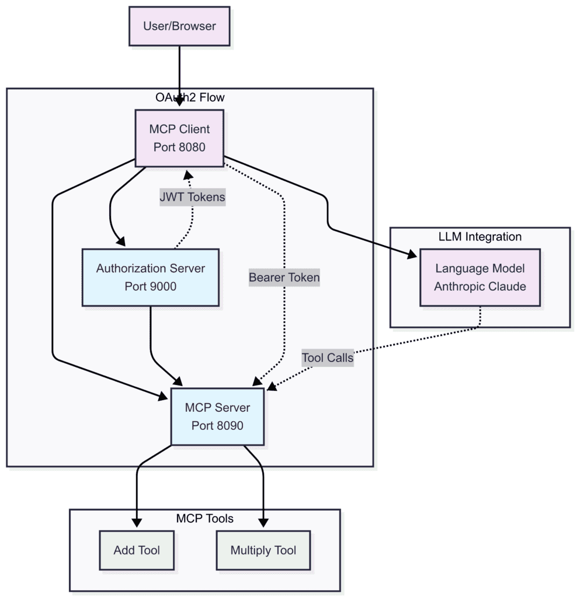

# [使用 Spring AI 与 OAuth2 实现 MCP 授权](https://www.baeldung.com/spring-ai-oath2-mcp-authorization)

Spring+Spring AI

OAuth

1. 概述

    模型上下文协议（MCP）允许 AI 模型通过安全 API 访问业务数据。当我们构建处理敏感信息的 MCP 服务器时，需要适当的授权机制来控制谁可以访问哪些数据。

    OAuth2 提供了与 MCP 系统良好兼容的基于令牌的安全机制。我们无需构建自定义身份验证，而是可以使用 OAuth2 标准来保护我们的 MCP 服务器并管理客户端访问权限。

    在本文中，我们将演示如何使用 Spring AI 和 OAuth2 保护 MCP 服务器和客户端。我们将构建一个完整的示例，包含三个组件：授权服务器、受保护的提供计算器工具的 MCP 服务器，以及一个能处理用户和系统请求的客户端。

2. MCP 安全架构

    为了保护 MCP 服务器，首先需要理解如何在 MCP 服务器前集成授权服务器。

    我们的系统包含：

    - **授权服务器**：负责颁发包含适当权限的 JWT 令牌。
    - **MCP 服务器**：验证令牌并控制对计算器工具的访问。
    - **MCP 客户端**：获取令牌并为不同类型的请求管理身份验证。

    

    MCP 服务器充当 OAuth2 资源服务器。它们在处理任何操作之前会检查请求头中的 JWT 令牌，从而将安全关注点与业务逻辑分离。客户端从 OAuth2 授权服务器获取访问令牌，然后在 MCP 请求中包含这些令牌。最后，MCP 服务器在允许操作前验证令牌。这就是我们各组件的工作方式。

3. 构建授权服务器

    我们将从授权服务器开始，因为其他组件都依赖于它。

    1. 添加依赖项

        我们需要添加 OAuth2 授权服务器依赖项：

        ```xml
        <dependency>
            <groupId>org.springframework.boot</groupId>
            <artifactId>spring-boot-starter-oauth2-authorization-server</artifactId>
        </dependency>
        <dependency>
            <groupId>org.springframework.boot</groupId>
            <artifactId>spring-boot-starter-web</artifactId>
        </dependency>
        ```

    2. 配置授权服务器

        让我们在 `application.yml` 中配置服务器：

        ```yaml
        server:
        port: 9000

        spring:
        security:
            user:
            name: user
            password: password
            oauth2:
            authorizationserver:
                client:
                oidc-client:
                    registration:
                    client-id: "mcp-client"
                    client-secret: "{noop}mcp-secret"
                    client-authentication-methods:
                        - "client_secret_basic"
                    authorization-grant-types:
                        - "authorization_code"
                        - "client_credentials"
                        - "refresh_token"
                    redirect-uris:
                        - "http://localhost:8080/authorize/oauth2/code/authserver"
                    scopes:
                        - "openid"
                        - "profile"
                        - "calc.read"
                        - "calc.write"
        ```

        此配置在端口 9000 上设置了一个授权服务器，并配置了一个客户端，该客户端同时支持授权码流程（用于用户）和客户端凭证流程（用于系统）。

4. 保护 MCP 服务器

    现在我们将创建一个需要 OAuth2 令牌并提供计算器工具的 MCP 服务器。

    1. 为 MCP 服务器配置依赖项

        添加 OAuth2 资源服务器支持：

        ```xml
        <dependency>
            <groupId>org.springframework.ai</groupId>
            <artifactId>spring-ai-starter-mcp-server-webmvc</artifactId>
            <version>1.0.0-M7</version>
        </dependency>

        <dependency>
            <groupId>org.springframework.boot</groupId>
            <artifactId>spring-boot-starter-oauth2-resource-server</artifactId>
        </dependency>
        ```

    2. 服务器配置

        将 MCP 服务器配置为 OAuth2 资源服务器：

        ```properties
        server.port=8090

        spring.security.oauth2.resourceserver.jwt.issuer-uri=http://localhost:9000

        spring.ai.mcp.server.enabled=true
        spring.ai.mcp.server.name=mcp-calculator-server
        spring.ai.mcp.server.version=1.0.0
        spring.ai.mcp.server.stdio=false
        ```

        当我们设置 `issuer-uri` 时，Spring Boot 会自动处理 JWT 验证。现在，每个对 MCP 服务器的请求都需要在 `Authorization` 头中包含有效的 JWT 令牌。

    3. 创建 MCP 工具

        LLM 通常不擅长数学运算，因此我们需要为它们提供能够根据请求计算结果的工具：

        ```java
        @Tool(description = "将两个数字相加")
        public CalculationResult add(
        @ToolParam(description = "第一个数字") double a,
        @ToolParam(description = "第二个数字") double b) {
            double result = a + b;
            return new CalculationResult("加法", a, b, result);
        }

        @Tool(description = "将两个数字相乘")
        public CalculationResult multiply(
        @ToolParam(description = "第一个数字") double a,
        @ToolParam(description = "第二个数字") double b) {
            double result = a * b;
            return new CalculationResult("乘法", a, b, result);
        }
        ```

        安全配置会自动保护所有 MCP 工具。没有有效令牌的请求将被拒绝。这些工具会被添加到上下文中，并在每次用户查询时提供给 LLM，然后 LLM 决定使用哪个工具来响应用户查询。

5. 构建 MCP 客户端

    现在，我们需要构建客户端来处理最复杂的部分，因为它需要同时处理用户请求和系统初始化。

    1. 客户端依赖项

        首先添加 `mcp-client` 和 `oauth2-client` 依赖项：

        ```xml
        <dependency>
            <groupId>org.springframework.ai</groupId>
            <artifactId>spring-ai-starter-mcp-client-webflux</artifactId>
        </dependency>
        <dependency>
            <groupId>org.springframework.boot</groupId>
            <artifactId>spring-boot-starter-oauth2-client</artifactId>
        </dependency>
        ```

    2. 客户端配置

        在 `application.properties` 中配置两个 OAuth2 客户端注册：

        ```properties
        server.port=8080

        spring.ai.mcp.client.sse.connections.server1.url=http://localhost:8090
        spring.ai.mcp.client.type=SYNC

        spring.security.oauth2.client.provider.authserver.issuer-uri=http://localhost:9000

        # 用于用户发起请求的 OAuth2 客户端（授权码模式）
        spring.security.oauth2.client.registration.authserver.client-id=mcp-client
        spring.security.oauth2.client.registration.authserver.client-secret=mcp-secret
        spring.security.oauth2.client.registration.authserver.authorization-grant-type=authorization_code
        spring.security.oauth2.client.registration.authserver.provider=authserver
        spring.security.oauth2.client.registration.authserver.scope=openid,profile,mcp.read,mcp.write
        spring.security.oauth2.client.registration.authserver.redirect-uri={baseUrl}/authorize/oauth2/code/{registrationId}

        # 用于机器对机器请求的 OAuth2 客户端（客户端凭证模式）
        spring.security.oauth2.client.registration.authserver-client-credentials.client-id=mcp-client
        spring.security.oauth2.client.registration.authserver-client-credentials.client-secret=mcp-secret
        spring.security.oauth2.client.registration.authserver-client-credentials.authorization-grant-type=client_credentials
        spring.security.oauth2.client.registration.authserver-client-credentials.provider=authserver
        spring.security.oauth2.client.registration.authserver-client-credentials.scope=mcp.read,mcp.write

        spring.ai.anthropic.api-key=${ANTHROPIC_API_KEY}
        ```

        我们需要两个注册配置以支持不同的认证流程：

        - `authserver` 注册使用授权码流程处理用户发起的请求。
        - `authserver-client-credentials` 注册使用客户端凭证流程处理系统启动时的请求。

    3. 安全配置

        设置 Spring Security 以处理 OAuth2：

        ```java
        @Bean
        WebClient.Builder webClientBuilder(McpSyncClientExchangeFilterFunction filterFunction) {
            return WebClient.builder()
            .apply(filterFunction.configuration());
        }

        @Bean
        SecurityFilterChain securityFilterChain(HttpSecurity http) throws Exception {
            return http.authorizeHttpRequests(auth -> auth.anyRequest().permitAll())
            .oauth2Client(Customizer.withDefaults())
            .csrf(CsrfConfigurer::disable)
            .build();
        }
        ```

    4. 选择正确的令牌

        这里的整个挑战在于为每个请求选择正确的令牌。我们需要一个自定义的 `ExchangeFilterFunction` 实现来检测请求上下文：

        ```java
        @Component
        public class McpSyncClientExchangeFilterFunction implements ExchangeFilterFunction {

            private final ClientCredentialsOAuth2AuthorizedClientProvider clientCredentialTokenProvider = new ClientCredentialsOAuth2AuthorizedClientProvider();
            private final ServletOAuth2AuthorizedClientExchangeFilterFunction delegate;
            private final ClientRegistrationRepository clientRegistrationRepository;
            private static final String AUTHORIZATION_CODE_CLIENT_REGISTRATION_ID = "authserver";
            private static final String CLIENT_CREDENTIALS_CLIENT_REGISTRATION_ID = "authserver-client-credentials";

            public McpSyncClientExchangeFilterFunction(OAuth2AuthorizedClientManager clientManager,
                ClientRegistrationRepository clientRegistrationRepository) {
                this.delegate = new ServletOAuth2AuthorizedClientExchangeFilterFunction(clientManager);
                this.delegate.setDefaultClientRegistrationId(AUTHORIZATION_CODE_CLIENT_REGISTRATION_ID);
                this.clientRegistrationRepository = clientRegistrationRepository;
            }

            @Override
            public Mono<ClientResponse> filter(ClientRequest request, ExchangeFunction next) {
                if (RequestContextHolder.getRequestAttributes() instanceof ServletRequestAttributes) {
                    return this.delegate.filter(request, next);
                }
                else {
                    var accessToken = getClientCredentialsAccessToken();
                    var requestWithToken = ClientRequest.from(request)
                    .headers(headers -> headers.setBearerAuth(accessToken))
                    .build();
                    return next.exchange(requestWithToken);
                }
            }

            private String getClientCredentialsAccessToken() {
                var clientRegistration = this.clientRegistrationRepository
                .findByRegistrationId(CLIENT_CREDENTIALS_CLIENT_REGISTRATION_ID);

                var authRequest = OAuth2AuthorizationContext.withClientRegistration(clientRegistration)
                .principal(new AnonymousAuthenticationToken("client-credentials-client", "client-credentials-client",
                    AuthorityUtils.createAuthorityList("ROLE_ANONYMOUS")))
                .build();
                return this.clientCredentialTokenProvider.authorize(authRequest).getAccessToken().getTokenValue();
            }

            public Consumer<WebClient.Builder> configuration() {
                return builder -> builder.defaultRequest(this.delegate.defaultRequest()).filter(this);
            }
        }
        ```

        该过滤器检查是否存在活跃的 Web 请求。如果存在，则使用用户的授权码令牌；如果不存在（例如在应用启动期间），则使用客户端凭证。

6. 使用受保护的 MCP 系统

    现在我们已经涵盖了所有组件，让我们看看如何有效地使用这个受保护的 MCP 系统。

    1. 创建 ChatClient

        将所有内容通过 `ChatClient` 绑定在一起：

        ```java
        @Bean
        ChatClient chatClient(ChatClient.Builder chatClientBuilder, List<McpSyncClient> mcpClients) {
            return chatClientBuilder.defaultToolCallbacks(new SyncMcpToolCallbackProvider(mcpClients))
            .build();
        }
        ```

    2. 发起请求

        现在我们可以像往常一样使用 `ChatClient`，安全机制会自动生效：

        ```java
        @GetMapping("/calculate")
        public String calculate(@RequestParam String expression, @RegisteredOAuth2AuthorizedClient("authserver") OAuth2AuthorizedClient authorizedClient) {
            String prompt = String.format("请使用可用的计算器工具计算以下数学表达式：%s", expression);

            return chatClient.prompt()
            .user(prompt)
            .call()
            .content();
        }
        ```

        在启动期间，MCP 客户端初始化使用客户端凭证令牌。当用户通过 Web 界面发起请求时，它使用他们的授权码令牌。

7. 验证设置

    为了理解应用程序的工作原理，我们需要查看它产生的结果。在启动任何应用程序之前，我们必须为 LLM 设置所需的环境变量。设置完成后，我们首先在端口 9000 启动授权服务器，因为所有其他模块都依赖于它。然后在端口 8090 启动 MCP 服务器，接着在端口 8080 启动 MCP 客户端。

    测试完整流程非常简单。我们需要访问 MCP 客户端端点并进行尝试：

    ```t
    http://{base_url}:8080/calculate?expression=15+25
    ```

    客户端将从授权服务器获取令牌，使用该令牌调用 MCP 服务器，并返回计算结果。我们必须确保使用配置文件中指定的凭据登录授权服务器。

8. 结论

    在本教程中，我们探讨了 OAuth2 如何通过标准的基于令牌的授权机制为 MCP 系统提供强大的安全性。Spring Security 的 OAuth2 支持以最少的配置实现了良好的保护。通过将授权服务器、MCP 服务器和 MCP 客户端分离，我们创建了一个架构，其中每个组件都专注于自己的职责，从而提供了灵活性。

    本文配套的代码可在 [GitHub](https://github.com/eugenp/tutorials/tree/master/spring-ai-modules/spring-ai-mcp) 上获取。
