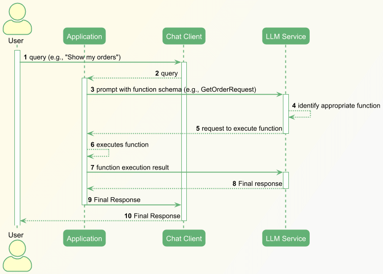
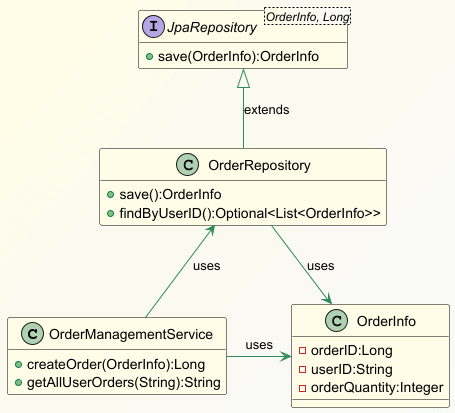
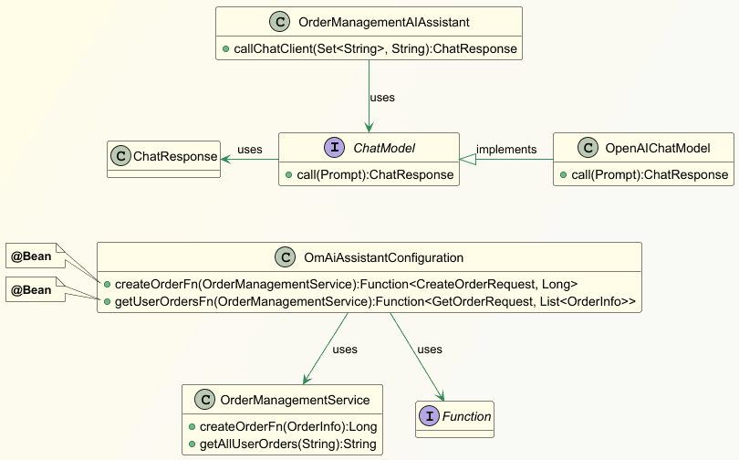

# [使用 Spring AI 实现 AI 助手](https://www.baeldung.com/spring-ai-assistant)

人工智能 · Spring AI · 大语言模型（LLM）· OpenAI  

1. 概述

    在本教程中，我们将探讨 **Spring AI** 的核心概念，学习如何利用 ChatGPT、Ollama、Mistral 等大语言模型（LLM）构建 AI 助手。

    企业正越来越多地采用 AI 助手，以增强现有业务功能的用户体验，例如：

    - 回答用户问题
    - 根据用户输入执行交易
    - 摘要长句或文档

    这些只是 LLM 的基础能力，其潜力远不止于此。

2. Spring AI 核心特性

    Spring AI 框架提供了一系列强大功能，助力构建 AI 驱动的应用：

    - 与底层 LLM 服务和向量数据库无缝集成的接口
    - 利用 RAG（检索增强生成）和函数调用 API 实现上下文感知的响应生成与动作执行
    - 结构化输出转换器，将 LLM 响应转换为 POJO 或 JSON 等机器可读格式
    - 通过 Advisor API 的拦截器丰富提示词并设置防护规则
    - 通过维护对话状态提升用户交互体验

    我们可以将其架构可视化如下：

    

    为演示部分功能，我们将在一个**传统订单管理系统（OMS）** 中构建一个聊天机器人。

    典型 OMS 功能包括：

    - 创建订单
    - 查询用户订单

3. 前置条件

    首先，我们需要一个 OpenAI 订阅账户以使用其 LLM 服务。接着，在 Spring Boot 应用中添加 Spring AI 的 Maven 依赖（其他文章已详述，此处不再赘述）。

    为快速启动，我们将使用内存型 HSQLDB 数据库。创建必要表并插入测试数据：

    ```sql
    CREATE TABLE User_Order (
        order_id BIGINT NOT NULL PRIMARY KEY,
        user_id VARCHAR(20) NOT NULL,
        quantity INT
    );

    INSERT INTO User_Order (order_id, user_id, quantity) VALUES (1, 'Jenny', 2);
    INSERT INTO User_Order (order_id, user_id, quantity) VALUES (2, 'Mary', 5);
    INSERT INTO User_Order (order_id, user_id, quantity) VALUES (3, 'Alex', 1);
    INSERT INTO User_Order (order_id, user_id, quantity) VALUES (4, 'John', 3);
    INSERT INTO User_Order (order_id, user_id, quantity) VALUES (5, 'Sophia', 4);
    -- 继续插入更多数据...
    ```

    在 `application.properties` 中配置 [HSQLDB](https://www.baeldung.com/spring-boot-hsqldb) 和 OpenAI 客户端：

    ```properties
    spring.datasource.driver-class-name=org.hsqldb.jdbc.JDBCDriver
    spring.datasource.url=jdbc:hsqldb:mem:testdb;DB_CLOSE_DELAY=-1
    spring.datasource.username=sa
    spring.datasource.password=
    spring.jpa.hibernate.ddl-auto=none

    spring.ai.openai.chat.options.model=gpt-4o-mini
    spring.ai.openai.api-key=xxxxxxx
    ```

    > **模型选择提示**：为特定用例选择合适模型是一个复杂的迭代过程，需大量试错。但对本文的简单演示而言，性价比高的 **GPT-4o mini** 模型已足够。

4. 函数调用 API（Function Calling API）

    这是基于 LLM 的“智能体（Agentic）”架构的核心支柱之一，使应用能自主执行复杂、精确的任务组合并做出决策。

    例如，在传统订单管理系统中，聊天机器人可通过自然语言帮助用户：

    - 提交订单请求
    - 查询订单历史
    - 执行更多操作

    这些能力由一个或多个应用函数驱动。我们在发送给 LLM 的提示中定义算法及配套函数模式（schema），LLM 接收后识别应调用的函数，并将决策返回给应用。

    最后，应用执行函数并将结果反馈给 LLM：

    

    1. 传统应用核心组件

        首先，查看传统应用的主要类结构：

        

        `OrderManagementService` 类包含两个核心函数：创建订单和获取用户订单历史，均通过 `OrderRepository` Bean 与数据库交互：

        ```java
        @Service
        public class OrderManagementService {
            @Autowired
            private OrderRepository orderRepository;

            public Long createOrder(OrderInfo orderInfo) {
                return orderRepository.save(orderInfo).getOrderID();
            }

            public Optional<List<OrderInfo>> getAllUserOrders(String userID) {
            return orderRepository.findByUserID(userID);
            }
        }
        ```

    2. 使用 Spring AI 实现聊天机器人

        

        在类图中，`OmAiAssistantConfiguration` 是一个 Spring 配置类，用于注册函数回调 Bean：`createOrderFn` 和 `getUserOrderFn`：

        ```java
        @Configuration
        public class OmAiAssistantConfiguration {
            @Bean
            @Description("创建订单。订单ID由orderID标识，订单数量由orderQuantity标识，用户由userID标识。订单数量必须为正整数。若缺少用户ID或订单数量等参数，请提示用户提供缺失信息。")
            public Function<CreateOrderRequest, Long> createOrderFn(OrderManagementService orderManagementService) {
                return createOrderRequest -> orderManagementService.createOrder(createOrderRequest.orderInfo());
            }

            @Bean
            @Description("获取指定用户的全部订单。用户ID由userID标识。")
            public Function<GetOrderRequest, List<OrderInfo>> getUserOrdersFn(OrderManagementService orderManagementService) {
                return getOrderRequest -> orderManagementService.getAllUserOrders(getOrderRequest.userID()).get();
            }
        }
        ```

        - `@Description` 注解用于生成函数模式（schema），应用会将其作为提示的一部分发送给 LLM。
        - 函数直接复用 `OrderManagementService` 的现有方法，促进代码重用。

        `CreateOrderRequest` 和 `GetOrderRequest` 是记录类（Record），帮助 Spring AI 为下游服务调用生成 POJO：

        ```java
        record GetOrderRequest(String userID) {}

        record CreateOrderRequest(OrderInfo orderInfo) {}
        ```

        最后，创建 `OrderManagementAIAssistant` 类，负责将用户查询发送给 LLM 服务：

        ```java
        @Service
        public class OrderManagementAIAssistant {
            @Autowired
            private ChatModel chatClient;

            public ChatResponse callChatClient(Set<String> functionNames, String promptString) {
                Prompt prompt = new Prompt(promptString, OpenAiChatOptions
                .builder()
                .withFunctions(functionNames)
                .build()
                );
                return chatClient.call(prompt);
            }
        }
        ```

        `callChatClient()` 方法在 `Prompt` 对象中注册函数，然后调用 `ChatModel#call()` 获取 LLM 响应。

5. 函数调用场景

    针对用户向 AI 助手提出的查询或指令，我们将探讨几种基本场景：

    - LLM 识别并执行一个或多个函数
    - LLM 因信息不全拒绝执行函数
    - LLM 根据条件决定是否执行函数

    1. 单次或多次执行回调函数

        测试 LLM 在接收到包含用户查询和函数模式的提示时的行为。

        示例一：创建单个订单

        ```java
        void whenOrderInfoProvided_thenSaveInDB(String promptString) {
            ChatResponse response = this.orderManagementAIAssistant
            .callChatClient(Set.of("createOrderFn"), promptString);
            String resultContent = response.getResult().getOutput().getText();
            logger.info("LLM 服务响应：{}", resultContent);
        }
        ```

        结果令人满意：

        | 提示词                                                                                      | LLM 响应                                                                                                                   | 观察                         |
        | ------------------------------------------------------------------------------------------- | -------------------------------------------------------------------------------------------------------------------------- | ---------------------------- |
        | 为用户 Jenny 创建数量为 20 的订单，随机生成正整数作为订单 ID                                | 订单已成功创建：<br>– **订单 ID**: 123456<br>– **用户 ID**: Jenny<br>– **数量**: 20                                        | 程序根据提示信息成功创建订单 |
        | 创建两个订单：第一个为用户 Sophia（数量 30），第二个为用户 Mary（数量 40），随机生成订单 ID | 订单已成功创建：<br>1. **Sophia 的订单**：ID 1，数量 30<br>2. **Mary 的订单**：ID 2，数量 40<br>如需其他帮助，请随时告知！ | LLM 智能地请求执行函数两次   |

        示例二：查询用户订单

        ```java
        void whenUserIDProvided_thenFetchUserOrders(String promptString) {
            ChatResponse response = this.orderManagementAIAssistant
            .callChatClient(Set.of("getUserOrdersFn"), promptString);
            String resultContent = response.getResult().getOutput().getText();
            logger.info("LLM 服务响应：{}", resultContent);
        }
        ```

        结果与之前类似：LLM 成功识别应执行的函数，Spring Boot 应用调用函数并返回用户订单详情。

    2. 条件性执行回调函数

        考虑仅在满足特定条件时才创建订单的场景：

        ```java
        void whenUserIDProvided_thenCreateOrderIfUserHasLessThanTwoOrders(String promptString) {
            ChatResponse response = this.orderManagementAIAssistant
            .callChatClient(Set.of("getUserOrdersFn", "createOrderFn"), promptString);
            String resultContent = response.getResult().getOutput().getText();
            logger.info("LLM 服务响应：{}", resultContent);
        }
        ```

        我们向 `ChatModel` 注册了 `getUserOrdersFn` 和 `createOrderFn` 两个函数，LLM 需判断哪个函数最适合当前请求。

        结果依然出色：

        | 提示词                                                                            | 输出                                                         | 观察                                                                              |
        | --------------------------------------------------------------------------------- | ------------------------------------------------------------ | --------------------------------------------------------------------------------- |
        | 为用户 Alex 创建数量为 25 的订单。若用户订单数超过 2 个则不创建。随机生成订单 ID  | 用户 Alex 已有超过 2 个订单（共 4 个），因此不会创建新订单。 | LLM 能根据前序函数输出条件性调用下游函数                                          |
        | 为用户 David 创建数量为 25 的订单。若用户订单数超过 2 个则不创建。随机生成订单 ID | 已为用户 David 成功创建订单，数量 25，订单 ID 42。           | 此次 `getUserOrdersFn` 返回 David 订单数少于 2，因此 LLM 决定执行 `createOrderFn` |
        | 创建数量为 20 的订单                                                              | 请提供您的用户 ID 以创建订单。                               | LLM 一开始就识别到缺少用户 ID，中止后续处理                                       |

6. Spring AI Advisor API

    前文讨论了应用的功能性方面，但所有功能都面临一些共性问题，例如：

    - 防止用户输入敏感信息
    - 记录和审计用户查询
    - 维护对话状态
    - 丰富提示词内容

    **Advisor API** 可一致地解决这些问题（详见我们其他[文章](https://www.baeldung.com/spring-ai-advisors)）。

7. Spring AI 结构化输出 API 与 RAG

    LLM 通常以自然语言生成响应，但下游服务更理解 POJO、JSON 等机器可读格式。此时，Spring AI 的**结构化输出能力**就至关重要。

    此外，应用有时需查询向量数据库，对存储数据进行语义搜索以获取额外信息，再将结果注入提示词，为 LLM 提供上下文——这称为**RAG（检索增强生成）技术**，也可通过 Spring AI 实现。

8. 结论

    本文探讨了 Spring AI 的关键特性，展示如何构建 AI 助手。Spring AI 正快速发展，提供大量开箱即用功能。然而，无论使用何种编程框架，**选择合适的底层 LLM 服务和向量数据库都至关重要**。同时，优化这些服务的配置颇具挑战，需投入大量精力——但这对应用的广泛采用至关重要。

    通过 Spring AI，开发者能以最小成本快速构建智能、安全、上下文感知的 AI 助手，为企业应用注入下一代交互体验。
