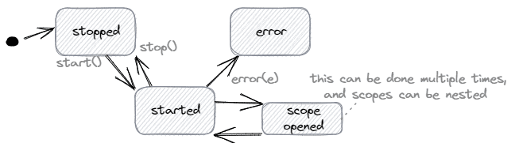

# [Spring Boot 可观察性](https://www.baeldung.com/spring-boot-3-observability)

1. 一览表

    在本教程中，我们将学习如何使用Spring Boot 3配置可观察性。可观察性是指仅通过其外部输出（日志、度量和跟踪）来测量系统的内部状态的能力。我们可以学习“[分布式系统中的可观察性](https://www.baeldung.com/distributed-systems-observability)”的基础知识。

    此外，我们必须意识到，Spring Boot 2（Spring 5）和Spring Boot 3（Spring 6）之间存在重大变化。Spring 6引入了Spring Observability，这是一项基于Micrometer和Micrometer追踪（前身为Spring Cloud Sleuth）的新计划。它更适用于使用Micrometer高效地记录应用程序指标，并通过OpenZipkin的Brave或OpenTelemetry等提供商实现跟踪。Spring Observability得分高于基于代理的可观察性解决方案，因为它在原生编译的Spring应用程序中无缝工作，并更有效地提供更好的信息。

    在这里，我们只捕捉有关Spring Boot 3的详细信息。如果我们想从Spring Boot 2迁移，我们可以在[这里](https://github.com/micrometer-metrics/micrometer/wiki/Migrating-to-new-1.10.0-Observation-API)找到详细的说明。

2. Micrometer观测API

    [Micrometer](https://micrometer.io/)是一个提供供应商中立的应用程序指标立面的项目。它定义了仪表、速率聚合、计数器、仪表和计时器(meters, rate aggregation, counters, gauges, and timers)等[概念](https://micrometer.io/docs/concepts)，每个供应商都可以适应自己的概念和工具。一个核心部分是Observation API，它允许对代码进行一次仪器化，并具有多种好处。

    它作为Spring框架的几个部分的依赖项包含，因此我们需要了解此API，以便了解观察在Spring Boot中的工作原理。我们可以用一个简单的例子来做到这一点。

    1. 观察和观察注册

        从[dictionary.com](https://www.dictionary.com/browse/observation)来看，观察是“出于某种科学或其他特殊目的而查看或指出事实或事件的行为或实例。”在我们的代码中，我们可以观察单个操作或完成HTTP请求处理。在这些观察中，我们可以进行测量，为分布式跟踪创建跨度，或者只是注销其他信息。

        要创建观察，我们需要一个观察注册表：

        ```properties
        ObservationRegistry observationRegistry = ObservationRegistry.create();
        Observation observation = Observation.createNotStarted("sample", observationRegistry);
        ```

        观察有一个生命周期，就像这个图一样简单：

        

        我们可以像这样使用观察类型：

        ```java
        observation.start();
        try (Observation.Scope scope = observation.openScope()) {
            // ... the observed action
        } catch (Exception e) {
            observation.error(e);
            // further exception handling
        } finally {
            observation.stop();
        }
        ```

        或者只是：

        ```java
        observation.observe(() -> {
            // ... the observed action
        });
        ```

    2. ObservationHandler

        数据收集代码作为ObservationHandler实现。此处理程序收到有关观察生命周期事件的通知，因此提供回调方法。只需打印事件的简单处理程序可以以这种方式实现：

        ```java
        public class SimpleLoggingHandler implements ObservationHandler<Observation.Context> {

            private static final Logger log = LoggerFactory.getLogger(SimpleLoggingHandler.class);

            @Override
            public boolean supportsContext(Observation.Context context) {
                return true;
            }

            @Override
            public void onStart(Observation.Context context) {
                log.info("Starting");
            }

            @Override
            public void onScopeOpened(Observation.Context context) {
                log.info("Scope opened");
            }

            @Override
            public void onScopeClosed(Observation.Context context) {
                log.info("Scope closed");
            }

            @Override
            public void onStop(Observation.Context context) {
                log.info("Stopping");
            }

            @Override
            public void onError(Observation.Context context) {
                log.info("Error");
            }
        }
        ```

        然后，在创建观察之前，我们在观察注册表上注册观察处理程序：

        ```java
        observationRegistry
        .observationConfig()
        .observationHandler(new SimpleLoggingHandler());
        ```

        对于简单的日志记录，已经存在一个实现。例如，要简单地将事件记录到控制台，我们可以使用：

        ```java
        observationRegistry
        .observationConfig()
        .observationHandler(new ObservationTextPublisher(System.out::println));
        ```

        要使用计时器样本和计数器，我们可以配置以下：

        ```java
        MeterRegistry meterRegistry = new SimpleMeterRegistry();
        observationRegistry
        .observationConfig()
        .observationHandler(new DefaultMeterObservationHandler(meterRegistry));

        // ... observe using Observation with name "sample"

        // fetch maximum duration of the named observation
        Optional<Double> maximumDuration = meterRegistry.getMeters().stream()
        .filter(m -> "sample".equals(m.getId().getName()))
        .flatMap(m -> StreamSupport.stream(m.measure().spliterator(), false))
        .filter(ms -> ms.getStatistic() == Statistic.MAX)
        .findFirst()
        .map(Measurement::getValue);
        ```

3. Spring整合

    1. 执行器

        我们在Spring Boot应用程序中与Actuator依赖项的最佳集成：

        ```xml
        <dependency>
            <groupId>org.springframework.boot</groupId>
            <artifactId>spring-boot-starter-actuator</artifactId>
        </dependency>
        ```

        它包含一个ObservationAutoConfiguration，该配置提供了一个ObservationRegistry的可注入实例（如果它尚未存在），并配置ObservationHandlers来收集指标和跟踪。

        例如，我们可以使用注册表在服务中创建自定义观察：

        ```java
        @Service
        public class GreetingService {
            private ObservationRegistry observationRegistry;
            // constructor
            public String sayHello() {
                return Observation
                .createNotStarted("greetingService", observationRegistry)
                .observe(this::sayHelloNoObserver);
            }
            private String sayHelloNoObserver() {
                return "Hello World!";
            }
        }
        ```

        此外，它在ObsationRegistry上注册ObservationHandler beans。我们只需要提供Bean：

        ```java
        @Configuration
        public class ObservationTextPublisherConfiguration {
            private static final Logger log = LoggerFactory.getLogger(ObservationTextPublisherConfiguration.class);
            @Bean
            public ObservationHandler<Observation.Context> observationTextPublisher() {
                return new ObservationTextPublisher(log::info);
            }
        }
        ```

    2. 网络

        对于MVC，有一个过滤器（org.springframework.web.filter.ServerHttpObservationFilter），我们可以用于HTTP服务器观察。当执行器是我们应用程序的一部分时，此过滤器已注册并激活。如果没有，我们需要配置它：

        ```java
        @Configuration
        public class ObservationFilterConfiguration {
            // if an ObservationRegistry is configured
            @ConditionalOnBean(ObservationRegistry.class)
            // if we do not use Actuator
            @ConditionalOnMissingBean(ServerHttpObservationFilter.class)
            @Bean
            public ServerHttpObservationFilter observationFilter(ObservationRegistry registry) {
                return new ServerHttpObservationFilter(registry);
            }
        }
        ```

        对于WebFlux，也有这样的过滤器（org.springframework.web.filter.reactive.ServerHttpObservationFilter），但自Spring Framework版本6.1（Spring Boot 3.2）以来，它已被弃用。相反，创建了一个WebHttpHandlerBuilder。使用执行器，这也是自动配置的。

    3. AOP

        Micrometer观察API还声明一个@Observed注释，并基于AspectJ的方面实现。为了使这个工作，我们需要将AOP依赖性添加到我们的项目中：

        ```xml
        <dependency>
            <groupId>org.springframework.boot</groupId>
            <artifactId>spring-boot-starter-aop</artifactId>
        </dependency>
        ```

        然后，我们将将方面实现注册为Spring-managed bean：

        ```java
        @Configuration
        public class ObservedAspectConfiguration {
            @Bean
            public ObservedAspect observedAspect(ObservationRegistry observationRegistry) {
                return new ObservedAspect(observationRegistry);
            }
        }
        ```

        现在，我们可以很快编写GreetingService，而不是在我们的代码中创建观察：

        ```java
        @Observed(name = "greetingService")
        @Service
        public class GreetingService {
            public String sayHello() {
                return "Hello World!";
            }
        }
        ```

        结合Actuator，我们可以使用 <http://localhost:8080/actuator/metrics/greetingService> 读取预配置的指标（在我们至少调用一次服务后），我们将得到如下结果：

        ```json
        {
            "name": "greetingService",
            "baseUnit": "seconds",
            "measurements": [
                {
                    "statistic": "COUNT",
                    "value": 15
                },
                {
                    "statistic": "TOTAL_TIME",
                    "value": 0.0237577
                },
                {
                    "statistic": "MAX",
                    "value": 0.0035475
                }
            ],
            ...
        }
        ```

4. 测试观察

    Micrometer可观察性API提供了一个模块，允许我们编写测试。为此，我们需要添加此依赖项：

    ```xml
    <dependency>
        <groupId>io.micrometer</groupId>
        <artifactId>micrometer-observation-test</artifactId>
        <scope>test</scope>
    </dependency>
    ```

    micrometer-bom是Spring Boot托管依赖项的一部分，因此我们不需要指定任何版本。

    由于整个可观察性自动配置默认用于测试，因此每当我们想要测试默认观测时，我们需要使用@AutoConfigureObservability重新启用它。

    1. 测试观察注册

        我们可以使用允许基于AssertJ的断言的TestObservationRegistry。因此，我们必须用TestObservationRegistry实例替换已经在上下文中的ObservationRegistry实例。

        因此，例如，如果我们想测试GreetingService的观察，我们可以使用此测试设置：

        ```java
        @ExtendWith(SpringExtension.class)
        @ComponentScan(basePackageClasses = GreetingService.class)
        @EnableAutoConfiguration
        @Import(ObservedAspectConfiguration.class)
        @AutoConfigureObservability
        class GreetingServiceObservationIntegrationTest {

            @Autowired
            GreetingService service;
            @Autowired
            TestObservationRegistry registry;

            @TestConfiguration
            static class ObservationTestConfiguration {

                @Bean
                TestObservationRegistry observationRegistry() {
                    return TestObservationRegistry.create();
                }
            }

            // ...
        }
        ```

        我们也可以使用JUnit元注释来配置：

        ```java
        @Documented
        @Inherited
        @Retention(RetentionPolicy.RUNTIME)
        @Target(ElementType.TYPE)
        @Import({
        ObservedAspectConfiguration.class,
        EnableTestObservation.ObservationTestConfiguration.class
        })
        @AutoConfigureObservability
        public @interface EnableTestObservation {

            @TestConfiguration
            class ObservationTestConfiguration {

                @Bean
                TestObservationRegistry observationRegistry() {
                    return TestObservationRegistry.create();
                }
            }
        }
        ```

        接下来，我们需要在我们的测试类中添加注释：

        ```java
        @ExtendWith(SpringExtension.class)
        @ComponentScan(basePackageClasses = GreetingService.class)
        @EnableAutoConfiguration
        @EnableTestObservation
        class GreetingServiceObservationIntegrationTest {

            @Autowired
            GreetingService service;
            @Autowired
            TestObservationRegistry registry;

            // ...
        }
        ```

        然后我们可以调用服务，并检查观察是否已完成：

        ```java
        import static io.micrometer.observation.tck.TestObservationRegistryAssert.assertThat;

        // ...

        @Test
        void testObservation() {
            // invoke service
            service.sayHello();
            assertThat(registry)
            .hasObservationWithNameEqualTo("greetingService")
            .that()
            .hasBeenStarted()
            .hasBeenStopped();
        }
        ```

    2. 观察处理程序兼容性套件

        为了测试我们的ObservationHandler实现，有几个基本类（所谓的兼容性套件），我们可以在测试中继承：

        - NullContextObservationHandlerCompatibilityKit测试观察处理程序在空值参数的情况下是否正常工作。
        - AnyContextObservationHandlerCompatibilityKit测试，在未指定的测试上下文参数的情况下，观察处理程序是否正常工作。这也包括NullContextObservationHandlerCompatibilityKit。
        - ConcreteContextObservationHandlerCompatibilityKit测试了观察处理程序在上下文类型的测试上下文的情况下是否正常工作。

        实施很简单：

        ```java
        public class SimpleLoggingHandlerUnitTest
        extends AnyContextObservationHandlerCompatibilityKit {

            SimpleLoggingHandler handler = new SimpleLoggingHandler();

            @Override
            public ObservationHandler<Observation.Context> handler() {
                return handler;
            }
        }
        ```

        这将导致以下输出：

        ```log
        SimpleLoggingHandlerTest (com.baeldung.samples.config)      416 ms
            compatibility test provides a null context accepting observation handler        382 ms
            compatibility test provides a test context accepting observation handler        34 ms
        ```

5. Micrometer追踪

    前Spring Cloud Sleuth项目已转移到Micrometer，自Spring Boot 3以来，Micrometer跟踪的核心。我们可以在[文档](https://micrometer.io/docs/tracing)中找到Micrometer跟踪的定义：

    > Micrometer跟踪为最受欢迎的示踪器库提供了一个简单的立面(facade)，允许您在没有供应商锁定的情况下仪器出基于JVM的应用程序代码。它旨在为您的跟踪收集活动增加很少或没有开销，同时最大限度地提高您的跟踪工作的可移植性。

    我们可以单独使用它，但它也通过提供ObservationHandler扩展与Observation API集成。

    1. 集成到观察API中

        要使用Micrometer跟踪，我们需要将以下依赖项添加到我们的项目中。该版本由Spring Boot管理：

        ```xml
        <dependency>
            <groupId>io.micrometer</groupId>
            <artifactId>micrometer-tracing</artifactId>
        </dependency>
        ```

        接下来，我们需要一个受支持的跟踪器（目前是OpenZipkin Brave或OpenTelemetry）。然后，我们必须为特定于供应商的集成添加一个依赖项，以微米跟踪：

        ```xml
        <dependency>
            <groupId>io.micrometer</groupId>
            <artifactId>micrometer-tracing-bridge-brave</artifactId>
        </dependency>

        <dependency>
            <groupId>io.micrometer</groupId>
            <artifactId>micrometer-tracing-bridge-otel</artifactId>
        </dependency>
        ```

        Spring Actuator对两个跟踪器都有自动配置，即它注册了供应商特定对象和Micrometer跟踪观察处理程序的实现，将这些对象委派到应用程序上下文中。因此，不需要进一步的配置步骤。

    2. 测试支持

        出于测试目的，我们需要在我们的项目中添加以下依赖项。该版本由Spring Boot管理：

        ```xml
        <dependency>
            <groupId>io.micrometer</groupId>
            <artifactId>micrometer-tracing-test</artifactId>
            <scope>test</scope>
        </dependency>
        ```

        然后，我们可以在测试期间使用SimpleTracer类来收集和验证跟踪数据。为了使其正常工作，我们将在应用程序上下文中用SimpleTracer替换原始的、特定于供应商的Tracer。我们还必须记得使用@AutoConfigureObservability启用跟踪的自动配置。

        因此，跟踪的最小测试配置可能如下：

        ```java
        @ExtendWith(SpringExtension.class)
        @EnableAutoConfiguration
        @AutoConfigureObservability
        public class GreetingServiceTracingIntegrationTest {

            @TestConfiguration
            static class ObservationTestConfiguration {
                @Bean
                TestObservationRegistry observationRegistry() {
                    return TestObservationRegistry.create();
                }
                @Bean
                SimpleTracer simpleTracer() {
                    return new SimpleTracer();
                }
            }

            @Test
            void shouldTrace() {
                // test
            }
        }
        ```

        或者，如果我们使用JUnit元注释：

        ```java
        @Documented
        @Inherited
        @Retention(RetentionPolicy.RUNTIME)
        @Target(ElementType.TYPE)
        @AutoConfigureObservability
        @Import({
        ObservedAspectConfiguration.class,
        EnableTestObservation.ObservationTestConfiguration.class
        })
        public @interface EnableTestObservation {

            @TestConfiguration
            class ObservationTestConfiguration {

                @Bean
                TestObservationRegistry observationRegistry() {
                    return TestObservationRegistry.create();
                }

                @Bean
                SimpleTracer simpleTracer() {
                    return new SimpleTracer();
                }
            }
        }
        ```

        然后，我们可以通过以下示例测试来测试我们的GreetingService：

        ```java
        import static io.micrometer.tracing.test.simple.TracerAssert.assertThat;

        // ...

        @Autowired
        GreetingService service;
        @Autowired
        SimpleTracer tracer;

        // ...

        @Test
        void testTracingForGreeting() {
            service.sayHello();
            assertThat(tracer)
            .onlySpan()
            .hasNameEqualTo("greeting-service#say-hello")
            .isEnded();
        }
        ```

6. 结论

    在本文中，我们探讨了Micrometer观察API和与Spring Boot 3的集成。我们了解到，Micrometer是独立于供应商的仪器的API，Micrometer跟踪是一个扩展。我们还确定，执行器有一组预先配置的观测和跟踪，默认情况下，测试禁用可观测性自动配置。
