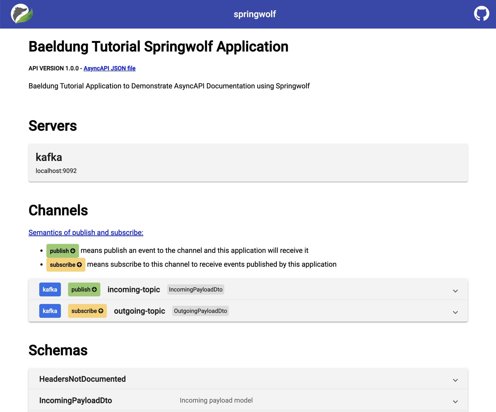
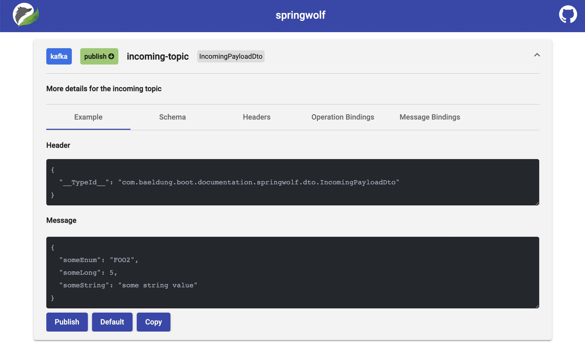

# [使用 AsyncAPI 和 Springwolf 记录 Spring 事件驱动 API](https://www.baeldung.com/java-spring-doc-asyncapi-springwolf)

1. 概述

    记录 API 是构建应用程序的重要组成部分。它是我们与客户之间的共同契约。此外，它还详细记录了我们的集成点是如何工作的。文档应易于访问、理解和实施。

    在本教程中，我们将了解 [Springwolf](https://www.springwolf.dev/) 如何记录事件驱动的 Spring Boot 服务。Springwolf 实现了 [AsyncAPI](https://www.asyncapi.com/) 规范，这是针对事件驱动 API 的 [OpenAPI](https://www.openapis.org/) 规范的改编。Springwolf 与协议无关，涵盖 Spring Kafka、Spring RabbitMQ 和 Spring CloudStream 实现。

    使用 Spring Kafka 作为我们的事件驱动系统，Springwolf 会根据代码为我们生成 AsyncAPI 文档。有些消费者会被自动检测到。其他信息由我们提供。

2. 设置 Springwolf

    要开始使用 Springwolf，我们需要添加依赖并进行配置。

    1. 添加依赖

        假设我们有一个使用 Spring Kafka 的正在运行的 Spring 应用程序，我们可以在 pom.xml 文件中将 springwolf-kafka 作为依赖添加到 Maven 项目中：

        ```xml
        <dependency>
            <groupId>io.github.springwolf</groupId>
            <artifactId>springwolf-kafka</artifactId>
            <version>0.14.0</version>
        </dependency>
        ```

        最新版本可在 Maven Central 上找到，除 Spring Kafka 外，项目网站上还提到了对其他绑定的支持。

    2. application.properties 配置

        在最基本的形式下，我们在 application.properties 中添加以下 Springwolf 配置：

        ```properties
        # Springwolf Configuration
        springwolf.docket.base-package=com.baeldung.boot.documentation.springwolf.adapter
        springwolf.docket.info.title=${spring.application.name}
        springwolf.docket.info.version=1.0.0
        springwolf.docket.info.description=Baeldung Tutorial Application to Demonstrate AsyncAPI Documentation using Springwolf

        # Springwolf Kafka Configuration
        springwolf.docket.servers.kafka.protocol=kafka
        springwolf.docket.servers.kafka.url=localhost:9092
        ```

        第一块设置 Springwolf 的常规配置。其中包括 Springwolf 用于自动检测侦听器的 base-package。此外，我们还在 docket 配置键下设置了一般信息，该信息出现在 AsyncAPI 文档中。

        然后，我们设置 springwolf-kafka 的特定配置。这同样出现在 AsyncAPI 文档中。

    3. 验证

        现在，我们可以运行应用程序了。应用程序启动后，AsyncAPI 文档默认位于 /springwolf/docs 路径下：

        `http://localhost:8080/springwolf/docs`

3. AsyncAPI 文档

    AsyncAPI 文档的结构与 [OpenAPI 文档类似](https://www.asyncapi.com/docs/tutorials/getting-started/coming-from-openapi)。首先，我们只看关键部分。该[规范](https://www.asyncapi.com/docs/reference/specification/latest)可在 AsyncAPI 网站上查阅。为简洁起见，我们将只查看部分属性。

    在接下来的小节中，我们将逐步查看 JSON 格式的 AsyncAPI 文档。我们从以下结构开始：

    ```json
    {
        "asyncapi": "2.6.0",
        "info": { ... },
        "servers": { ... },
        "channels": { ... },
        "components": { ... }
    }
    ```

    1. 信息部分

        文档的信息部分包含应用程序本身的信息。至少包括以下字段：标题、应用程序版本和说明。

        根据我们添加到配置中的信息，创建了以下结构：

        ```json
        "info": {
            "title": "Baeldung Tutorial Springwolf Application",
            "version": "1.0.0",
            "description": "Baeldung Tutorial Application to Demonstrate AsyncAPI Documentation using Springwolf"
        }
        ```

    2. 服务器部分

        同样，服务器部分包含有关 Kafka 代理的信息，并基于上述 application.properties 配置：

        ```properties
        "servers": {
            "kafka": {
                "url": "localhost:9092",
                "protocol": "kafka"
            }
        }
        ```

    3. 通道部分

        这部分目前是空的，因为我们还没有在应用程序中配置任何消费者或生产者。在后面的章节中配置它们后，我们将看到以下结构：

        ```properties
        "channels": {
            "my-topic-name": {
                "publish": {
                    "message": {
                        "title": "IncomingPayloadDto",
                        "payload": {
                            "$ref": "#/components/schemas/IncomingPayloadDto"
                        }
                    }
                }
            }
        }
        ```

        通用术语通道指的是 Kafka 术语中的主题。

        每个主题可以提供两种操作：发布和/或订阅。值得注意的是，从应用程序的角度来看，这些语义可能会被混淆：

        - 将消息发布到此通道，以便我们的应用程序可以使用它们。
        - 订阅此频道，以便从我们的应用程序接收信息。

        操作对象本身包含描述和消息等信息。消息对象包含标题和有效载荷等信息。

        为避免在多个主题和操作中重复相同的有效载荷信息，AsyncAPI 在 AsyncAPI 文档的组件部分使用 $ref 符号表示引用。

    4. 组件部分

        这一部分目前也是空的，但将具有以下结构：

        ```properties
        "components": {
            "schemas": {
                "IncomingPayloadDto": {
                    "type": "object",
                    "properties": {
                        ...
                        "someString": {
                            "type": "string"
                        }
                    },
                    "example": {
                        "someEnum": "FOO2",
                        "someLong": 1,
                        "someString": "string"
                    }
                }
            }
        }
        ```

        组件部分包含 $ref 引用的所有详细信息，包括 #/components/schemas/IncomingPayloadDto。除了有效载荷的数据类型和属性外，模式还可以包含有效载荷的示例（JSON）。

4. 记录用户

    Springwolf 会自动检测所有 @KafkaListener 注释，这些注解如下所示。此外，我们还使用 @AsyncListener 注解来手动提供更多细节。

    1. 自动检测 @KafkaListener 注解

        通过在方法上使用 Spring-Kafka 的 @KafkaListener 注解，Springwolf 可以自动在基础包中找到消费者：

        ```java
        @KafkaListener(topics = TOPIC_NAME)
        public void consume(IncomingPayloadDto payload) {
            // ...
        }
        ```

        现在，AsyncAPI 文档确实包含了带有发布操作和 IncomingPayloadDto 模式的通道 TOPIC_NAME，正如我们之前看到的那样。

    2. 通过 @AsyncListener 注释手动编写消费者文档

        同时使用自动检测和 @AsyncListener 可能会导致重复。为了能够手动添加更多信息，我们完全禁用 @KafkaListener 自动检测，并在 application.properties 文件中添加以下一行：

        `springwolf.plugin.kafka.scanner.kafka-listener.enabled=false`

        接下来，我们在同一方法中添加 Springwolf @AsyncListener 注解，并为 AsyncAPI 文档提供额外信息：

        ```java
        @KafkaListener(topics = TOPIC_NAME)
        @AsyncListener(
            operation = @AsyncOperation(
                channelName = TOPIC_NAME,
                description = "More details for the incoming topic"
            )
        )
        @KafkaAsyncOperationBinding
        public void consume(IncomingPayloadDto payload) {
            // ...
        }
        ```

        此外，我们还添加了 @KafkaAsyncOperationBinding 注解，以便将通用的 @AsyncOperation 注解与服务器部分的 Kafka 代理连接起来。特定于 Kafka 协议的信息也使用该注解进行设置。

        更改后，AsyncAPI 文档包含了更新后的文档。

5. 记录生产者

    生产者是通过使用 Springwolf @AsyncPublisher 注解手动记录的。

    1. 通过 @AsyncPublisher 注解手动编写生产者文档

        与 @AsyncListener 注解类似，我们在发布者方法中添加 @AsyncPublisher 注解，并同时添加 @KafkaAsyncOperationBinding 注解：

        ```java
        @AsyncPublisher(
            operation = @AsyncOperation(
                channelName = TOPIC_NAME,
                description = "More details for the outgoing topic"
            )
        )
        @KafkaAsyncOperationBinding
        public void publish(OutgoingPayloadDto payload) {
            kafkaTemplate.send(TOPIC_NAME, payload);
        }
        ```

        在此基础上，Springwolf 使用上述信息为 TOPIC_NAME 频道添加了一个订阅操作到频道部分。从方法签名中提取 payload 类型的方法与 @AsyncListener 的方法相同。

6. 增强文档

    AsyncAPI 规范涵盖的功能比我们上面介绍的还要多。接下来，我们将记录 Spring Kafka 的默认头 `__TypeId__` 并改进有效负载的文档。

    1. 添加 Kafka 头

        运行原生 Spring Kafka 应用程序时，Spring Kafka 会自动添加头 `__TypeId__` 以协助消费者对有效负载进行反序列化。

        我们通过在 @AsyncListener（或 @AsyncPublisher）注解的 @AsyncOperation 中设置 headers 字段，将 `__TypeId__` 标头添加到文档中：

        ```java
        @AsyncListener(
            operation = @AsyncOperation(
                ...,
                headers = @AsyncOperation.Headers(
                    schemaName = "SpringKafkaDefaultHeadersIncomingPayloadDto",
                    values = {
                        // this header is generated by Spring by default
                        @AsyncOperation.Headers.Header(
                            name = DEFAULT_CLASSID_FIELD_NAME,
                            description = "Spring Type Id Header",
                            value = "com.baeldung.boot.documentation.springwolf.dto.IncomingPayloadDto"
                        ),
                    }
                )
            )
        )
        ```

        现在，AsyncAPI 文档包含了一个新的字段标题，作为消息对象的一部分。

    2. 添加有效载荷详细信息

        我们使用 Swagger [@Schema](https://javadoc.io/doc/io.swagger.core.v3/swagger-annotations/latest/io/swagger/v3/oas/annotations/media/Schema.html) 注解来提供有关有效负载的附加信息。在下面的代码片段中，我们设置了描述、示例值以及字段是否必填：

        ```java
        @Schema(description = "Outgoing payload model")
        public class OutgoingPayloadDto {
            @Schema(description = "Foo field", example = "bar", requiredMode = NOT_REQUIRED)
            private String foo;
            @Schema(description = "IncomingPayload field", requiredMode = REQUIRED)
            private IncomingPayloadDto incomingWrapped;
        }
        ```

        在此基础上，我们在 AsyncAPI 文档中看到了丰富的 OutgoingPayloadDto 模式：

        ```properties
        "OutgoingPayloadDto": {
            "type": "object",
            "description": "Outgoing payload model",
            "properties": {
                "incomingWrapped": {
                    "$ref": "#/components/schemas/IncomingPayloadDto"
                },
                "foo": {
                    "type": "string",
                    "description": "Foo field",
                    "example": "bar"
                }
            },
            "required": [
                "incomingWrapped"
            ],
            "example": {
                "incomingWrapped": {
                    "someEnum": "FOO2",
                    "someLong": 5,
                    "someString": "some string value"
                },
                "foo": "bar"
            }
        }
        ```

        我们应用程序的完整 AsyncAPI 文档可在链接的[示例项目](/src/test/resources/asyncapi.json)中查看。

7. 使用 Springwolf 用户界面

    Springwolf 拥有自己的用户界面，不过也可以使用任何符合 AsyncAPI 的文档渲染器。

    1. 添加 springwolf-ui 依赖项

        要使用 springwolf-ui，我们需要在 pom.xml 中添加依赖关系，然后重建并重启应用程序：

        ```xml
        <dependency>
            <groupId>io.github.springwolf</groupId> 
            <artifactId>springwolf-ui</artifactId
            <version>0.8.0</version>
        </dependency>
        ```

    2. 查看 AsyncAPI 文档

        现在，我们通过访问 <http://localhost:8080/springwolf/asyncapi-ui.html> 在浏览器中打开文档。

        该网页的结构与 AsyncAPI 文档类似，显示有关应用程序、服务器详细信息、通道和模式的信息：

        

    3. 发布消息

        Springwolf 允许我们直接从浏览器发布消息。展开一个通道后，点击 "发布"（Publish）按钮即可直接在 Kafka 上发布消息。消息绑定（包括 Kafka 消息密钥）、标题和消息都可以根据需要进行调整：

        

        出于安全考虑，该功能默认为禁用。要启用发布功能，我们在 application.properties 文件中添加以下一行：

        `springwolf.plugin.kafka.publishing.enabled=true`

8. 结论

    在本文中，我们在现有的 Spring Boot Kafka 应用程序中设置了 Springwolf。

    使用消费者自动检测功能，自动生成了 AsyncAPI 符合文档。我们通过手动配置进一步增强了文档。

    除了通过提供的 REST 端点下载 AsyncAPI 文档外，我们还使用 springwolf-ui 在浏览器中查看文档。
