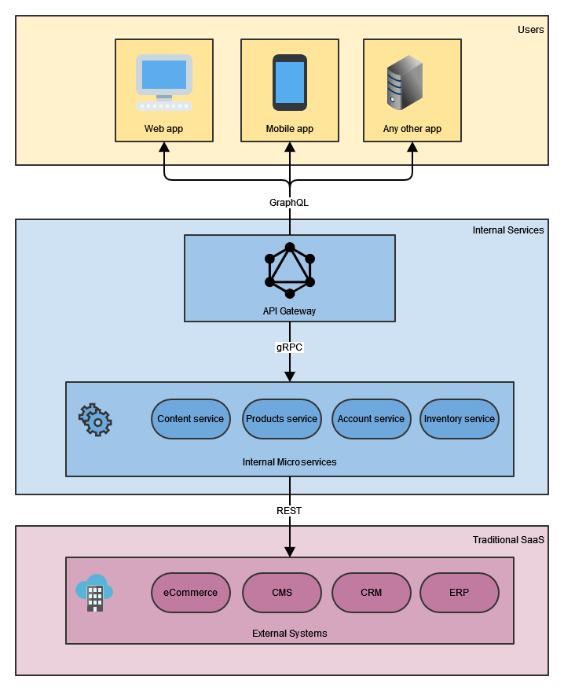

# [REST vs. GraphQL vs. gRPC - 选择哪个API？](https://www.baeldung.com/rest-vs-graphql-vs-grpc)

1. 概述

    多年来，REST一直是设计网络API的事实上的工业标准架构风格。然而，GraphQL和gRPC最近出现了，以解决REST的一些限制。这些API方法中的每一种都有很大的好处，也有一些折衷的地方。

    在本教程中，我们将首先看一下每种API设计方法。然后，我们将在Spring Boot中使用这三种不同的方法构建一个简单的服务。接下来，我们将通过研究在决定采用哪种方法之前应该考虑的几个标准来比较它们。

    最后，由于没有一个放之四海而皆准的方法，我们将看到不同的方法如何在不同的应用层上混合使用。

2. REST

    Representational State Transfer（REST）是全世界最常用的API架构风格。它早在2000年由Roy Fielding定义。

    1. 架构风格

        REST不是一个框架或库，而是一种架构风格，描述了一种基于URL结构和HTTP协议的接口。它描述了一个无状态的、可缓存的、基于约定的客户端-服务器互动的架构。它使用URL来解决适当的资源，使用HTTP方法来表达要采取的行动。

        - GET用于获取现有资源或多个资源
        - POST用于创建一个新的资源
        - PUT用于更新一个资源或在其不存在时创建它
        - DELETE用于删除一个资源
        - PATCH用于部分更新一个现有的资源
        REST可以用各种编程语言实现，支持多种数据格式，如JSON和XML。

    2. 服务实例

        我们可以通过使用@RestController注解定义一个控制器类，在Spring中建立一个REST服务。接下来，我们通过@GetMapping注解定义一个与HTTP方法对应的函数，例如GET。最后，在注解参数中，我们提供了一个资源路径，该方法应该被触发。

        ```java
        @GetMapping("/rest/books")
        public List<Book> books() {
            return booksService.getBooks();
        }
        ```

        MockMvc为Spring中的REST服务的集成测试提供支持。它封装了所有的Web应用Bean，并使它们可用于测试。

        ```java
        this.mockMvc.perform(get("/rest/books"))
        .andDo(print())
        .andExpect(status().isOk())
        .andExpect(content().json(expectedJson));
        ```

        由于它们是基于HTTP的，REST服务可以在浏览器中或使用Postman或CURL等工具进行测试。

        `$ curl http://localhost:8082/rest/books`

    3. 优点和缺点

        REST最大的优势在于它是科技界最成熟的API架构风格。由于它的流行，许多开发者已经熟悉了REST，并发现它很容易操作。然而，由于它的灵活性，REST在开发者之间可以有不同的解释。

        鉴于每个资源通常位于一个独特的URL后面，它很容易监测和限制API的速率。REST还通过利用HTTP的优势使缓存变得简单。通过缓存HTTP响应，我们的客户端和服务器不需要不断地相互交流。

        REST很容易出现获取不足和获取过度的情况。例如，为了获取嵌套的实体，我们可能需要进行多次请求。另一方面，在REST API中，通常不可能只获取特定的一块实体数据。客户端总是会收到所请求的端点被配置为返回的所有数据。

3. GraphQL

    GraphQL是Facebook开发的一种开源的API查询语言。

    1. 架构风格

        GraphQL提供了一种用于开发API的查询语言，并有一个框架来完成这些查询。它不依赖HTTP方法来操作数据，大部分只使用POST。相比之下，GraphQL使用了查询、突变和订阅。

        - Queries 查询是用来向服务器请求数据的
        - Mutations 突变用于修改服务器上的数据
        - Subscriptions 订阅用于在数据变化时获得实时更新。
        GraphQL是客户驱动的，因为它使其客户能够准确地定义他们在特定的使用情况下需要的数据。然后在一次往返中从服务器上检索所请求的数据。

    2. 服务实例

        在GraphQL中，数据是用定义对象、其字段和类型的模式来表示的。因此，我们将首先为我们的示例服务定义一个GraphQL模式。

        ```graphql
        type Author {
            firstName: String!
            lastName: String!
        }

        type Book {
            title: String!
            year: Int!
            author: Author!
        }

        type Query {
            books: [Book]
        }
        ```

        通过使用@RestController类注解，我们可以在Spring中建立GraphQL服务，与REST服务类似。接下来，我们用[@QueryMapping](https://www.baeldung.com/spring-graphql)来注解我们的函数，将其标记为GraphQL数据获取组件。

        ```java
        @QueryMapping
        public List<Book> books() {
            return booksService.getBooks();
        }
        ```

        HttpGraphQlTester为Spring中的GraphQL服务的集成测试提供支持。它封装了所有的Web应用Bean，并使它们可用于测试。

        ```java
        this.graphQlTester.document(document)
        .execute()
        .path("books")
        .matchesJson(expectedJson);
        ```

        GraphQL服务可以用Postman或CURL等工具来测试。然而，他们需要在POST正文中指定一个查询。

        `$ curl -X POST -H "Content-Type: application/json" -d "{\"query\":\"query{books{title}}\"}" http://localhost:8082/graphql`

    3. 优点和缺点

        GraphQL对其客户非常灵活，因为它只允许获取和交付所要求的数据。由于没有不必要的数据被发送到网络上，GraphQL可以带来更好的性能。

        与REST的模糊性相比，它使用更严格的规范。此外，GraphQL为调试目的提供详细的错误描述，并自动生成关于API变化的文档。

        由于每个查询可以是不同的，GraphQL打破了中间代理缓存，使缓存的实现更加困难。另外，由于GraphQL查询有可能执行一个大型复杂的服务器端操作，所以查询往往受到复杂性的限制，以避免服务器过载。

4. gRPC

    RPC代表远程程序性调用，[gRPC](https://www.baeldung.com/grpc-introduction)是谷歌创建的高性能、开源的RPC框架。

    1. 架构风格

        gRPC框架是基于客户端-服务器模式的远程过程调用。客户端应用程序可以直接调用服务器应用程序的方法，就像它是一个本地对象一样。这是一种基于契约的严格方法，客户和服务器都需要访问同一个模式定义。

        在gRPC中，一个叫做协议缓冲区语言的DSL定义了请求和响应类型。协议缓冲区编译器然后生成服务器和客户端的代码工件。我们可以用自定义的业务逻辑扩展生成的服务器代码，并提供响应数据。

        该框架支持几种类型的客户-服务器交互：

        - 传统的请求-响应互动
        - 服务器流，其中来自客户端的一个请求可能产生多个响应
        - 客户端流，客户端的多个请求会产生一个响应

        客户端和服务器通过HTTP/2通信，使用紧凑的二进制格式，使gRPC消息的编码和解码非常有效。

    2. 服务实例

        与GraphQL类似，我们首先定义了一个模式，该模式定义了服务、请求和响应，包括其字段和类型。

        ```text
        message BooksRequest {}

        message AuthorProto {
            string firstName = 1;
            string lastName = 2;
        }

        message BookProto {
            string title = 1;
            AuthorProto author = 2;
            int32 year = 3;
        }

        message BooksResponse {
            repeated BookProto book = 1;
        }

        service BooksService {
            rpc books(BooksRequest) returns (BooksResponse);
        }
        ```

        然后，我们需要将我们的协议缓冲区文件传递给协议缓冲区编译器，以便生成所需代码。我们可以选择使用某个预编译的二进制文件手动执行这一操作，或者使用protobuf-maven-plugin使其成为构建过程的一部分。

        ```xml
        <plugin>
            <groupId>org.xolstice.maven.plugins</groupId>
            <artifactId>protobuf-maven-plugin</artifactId>
            <version>${protobuf-plugin.version}</version>
            <configuration>
                <protocArtifact>com.google.protobuf:protoc:${protobuf.version}:exe:${os.detected.classifier}</protocArtifact>
                <pluginId>grpc-java</pluginId>
                <pluginArtifact>io.grpc:protoc-gen-grpc-java:${grpc.version}:exe:${os.detected.classifier}</pluginArtifact>
            </configuration>
            <executions>
                <execution>
                    <goals>
                        <goal>compile</goal>
                        <goal>compile-custom</goal>
                    </goals>
                </execution>
            </executions>
        </plugin>
        ```

        现在，我们可以扩展生成的BooksServiceImplBase类，用@GrpcService注解来注解它，并重写books方法。

        ```java
        @Override
        public void books(BooksRequest request, StreamObserver<BooksResponse> responseObserver) {
            List<Book> books = booksService.getBooks();
            BooksResponse.Builder responseBuilder = BooksResponse.newBuilder();
            books.forEach(book -> responseBuilder.addBook(GrpcBooksMapper.mapBookToProto(book)));
            responseObserver.onNext(responseBuilder.build());
            responseObserver.onCompleted();
        }
        ```

        在Spring中对gRPC服务进行集成测试是可行的，但还没有像REST和GraphQL那样成熟。

        ```java
        BooksRequest request = BooksRequest.newBuilder().build();
        BooksResponse response = booksServiceGrpc.books(request);
        List<Book> books = response.getBookList().stream()
        .map(GrpcBooksMapper::mapProtoToBook)
        .collect(Collectors.toList());     
        JSONAssert.assertEquals(objectMapper.writeValueAsString(books), expectedJson, true);
        ```

        为了使这个集成测试工作，我们需要用以下内容来注解我们的测试类。

        - @SpringBootTest以配置客户端连接到所谓的gRPC "in process" 测试服务器
        - @SpringJUnitConfig来准备和提供应用bean。
        - @DirtiesContext以确保每次测试后服务器都能正确关闭
        Postman最近增加了对测试gRPC服务的支持。与CURL类似，一个名为[grpcurl](https://github.com/fullstorydev/grpcurl)的命令行工具使我们能够与gRPC服务器交互。

        `$ grpcurl --plaintext localhost:9090 com.baeldung.choiceapi.BooksService/books`

        这个工具使用JSON编码，使协议缓冲区的编码对测试来说更人性化。

    3. 优点和缺点

        gRPC最大的优势是性能，这是由紧凑的数据格式、快速的消息编码和解码以及HTTP/2的使用所带来的。另外，它的代码生成功能支持多种编程语言，可以帮助我们节省一些编写模板代码的时间。

        通过要求HTTP 2和TLS/SSL，gRPC提供了更好的安全默认值和对流媒体的内置支持。接口合同的语言无关性定义使得用不同编程语言编写的服务之间可以进行通信。

        然而，目前在开发者社区，gRPC远不如REST流行。它的数据格式对人类来说是不可读的，所以需要额外的工具来分析有效载荷并进行调试。另外，HTTP/2只在现代浏览器的最新版本中通过TLS支持。

5. 选择哪个API

    现在我们已经熟悉了这三种API设计方法，让我们看看在决定选择哪一种之前应该考虑的几个标准。

    1. 数据格式

        在请求和响应数据格式方面，REST是最灵活的方法。我们可以实现REST服务来支持一种或多种数据格式，如JSON和XML。

        另一方面，GraphQL定义了自己的查询语言，在请求数据时需要使用。GraphQL服务以JSON格式响应。尽管有可能将响应转换为其他格式，但这并不常见，而且可能会影响性能。

        gRPC框架使用协议缓冲区，这是一种自定义的二进制格式。它对人类来说是不可读的，但它也是使gRPC表现如此出色的主要原因之一。虽然有几种编程语言支持，但这种格式不能被定制。

    2. 数据获取

        GraphQL是最有效的从服务器上获取数据的API方法。因为它允许客户端选择要获取的数据，所以通常不会有额外的数据通过网络发送。

        REST和gRPC都不支持这种先进的客户端查询。因此，除非在服务器上开发和部署新的端点或过滤器，否则服务器可能会返回额外的数据。

    3. 浏览器支持

        所有现代浏览器都支持REST和GraphQL APIs。通常，JavaScript客户端代码被用来从浏览器向服务器API发送HTTP请求。

        浏览器对gRPC APIs的支持并没有开箱即用。然而，gRPC在网络上的扩展是可用的。它是基于HTTP 1.1的，但不提供所有的gRPC功能。与Java客户端类似，网络版gRPC要求浏览器客户端代码从协议缓冲区模式中生成一个gRPC客户端。

    4. 代码生成

        GraphQL需要在Spring这样的核心框架中添加额外的库。这些库为处理GraphQL模式、基于注解的编程和GraphQL请求的服务器处理增加了支持。从GraphQL模式生成代码是可能的，但不是必须的。任何与模式中定义的GraphQL类型相匹配的自定义POJO都可以被使用。

        gRPC框架还需要在核心框架中添加额外的库，以及一个强制性的代码生成步骤。协议缓冲区编译器会生成服务器和客户端的模板代码，然后我们可以对其进行扩展。如果我们使用自定义的POJO，它们将需要被映射到自动生成的协议缓冲区类型中。

        REST是一种架构风格，可以使用任何编程语言和各种HTTP库来实现。它不使用预定义的模式，也不需要生成任何代码。也就是说，利用Swagger或[OpenAPI](https://www.baeldung.com/java-openapi-generator-server)，如果我们愿意，可以定义模式并生成代码。

    5. 响应时间

        由于其优化的二进制格式，与REST和GraphQL相比，gRPC的响应时间明显加快。此外，在这三种方法中都可以使用负载均衡，将客户端的请求均匀地分布在多个服务器上。

        然而，此外，gRPC默认使用HTTP 2.0，这使得gRPC的延迟低于REST和GraphQL APIs。利用HTTP 2.0，几个客户端可以同时发送多个请求，而不需要建立新的TCP连接。大多数性能测试报告显示，gRPC的速度大约是REST的5到甚至10倍。

    6. 缓存

        用REST对请求和响应进行缓存是简单而成熟的，因为它允许在HTTP层面对数据进行缓存。每个GET请求都暴露了应用资源，这些资源很容易被浏览器、代理服务器或CDN所缓存。

        由于GraphQL默认使用POST方法，而且每个查询都可能是不同的，这使得缓存的实现更加困难。当客户端和服务器在地理上相距甚远时，情况更是如此。这个问题的一个可能的解决方法是通过GET进行查询，并使用预先计算并存储在服务器上的持久化查询。一些GraphQL中间件服务也提供缓存。

        目前，gRPC中默认不支持缓存请求和响应。然而，可以实现一个自定义的中间件层，它将缓存响应。

    7. 预期的用法

        REST很适合领域，可以很容易地描述为一组资源，而不是行动。利用HTTP方法可以对这些资源进行标准的CRUD操作。通过对HTTP语义的依赖，它对调用者来说是很直观的，使它很适合面向公众的界面。REST的良好缓存支持使其适合于具有稳定使用模式和地理分布的用户的API。

        GraphQL很适合于多个客户需要不同数据集的公共API。因此，GraphQL客户可以通过标准化的查询语言指定他们想要的确切数据。它也是一个很好的选择，适用于从多个来源聚合数据，然后将其提供给多个客户端的API。

        在开发微服务之间频繁互动的内部API时，gRPC框架是很合适的。它通常用于从低级代理（如不同的物联网设备）收集数据。然而，其有限的浏览器支持使其难以用于面向客户的网络应用。

6. 混合和匹配

    这三种API架构风格中的每一种都有其好处。然而，没有一个放之四海而皆准的方法，我们选择哪种方法将取决于我们的用例。

    我们不必每次都做出单一的选择。我们也可以在我们的解决方案架构中混合和匹配不同的风格。

    

    在上面的架构示例图中，我们展示了不同的API风格如何在不同的应用层中应用。

7. 总结

    在这篇文章中，我们探讨了设计网络API的三种流行架构风格。REST、GraphQL和gRPC。我们研究了每种不同风格的用例，并描述了其优点和权衡。

    我们探讨了如何在Spring Boot中使用这三种不同的方法来构建一个简单的服务。此外，我们还通过研究在决定一种方法之前应该考虑的几个标准来比较它们。最后，由于没有放之四海而皆准的方法，我们看到了如何在不同的应用层中混合和匹配不同的方法。

## Code

### GraphQL sample queries

Query

```shell script
curl \
--request POST 'localhost:8080/graphql' \
--header 'Content-Type: application/json' \
--data-raw '{"query":"query {\n    recentPosts(count: 2, offset: 0) {\n        id\n        title\n        author {\n            id\n            posts {\n                id\n            }\n        }\n    }\n}"}'
```

Mutation

```shell script
curl \
--request POST 'localhost:8080/graphql' \
--header 'Content-Type: application/json' \
--data-raw '{"query":"mutation {\n    createPost(title: \"New Title\", authorId: \"Author2\", text: \"New Text\") {\n id\n       category\n        author {\n            id\n            name\n        }\n    }\n}"}'
```
