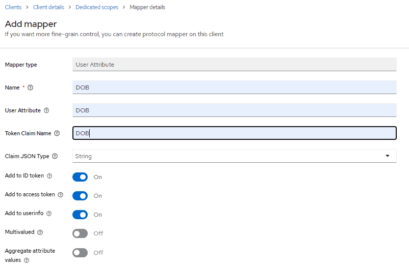
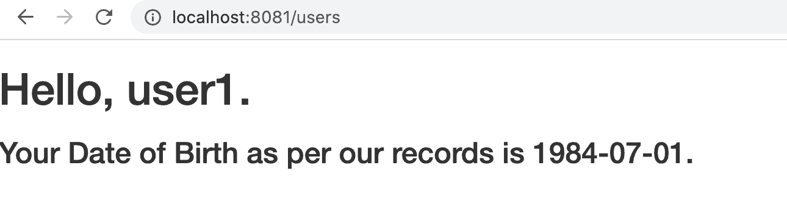

# [使用Keycloak自定义用户属性](https://www.baeldung.com/keycloak-custom-user-attributes)

1. 概述

    Keycloak 是第三方授权服务器，用于管理网络或移动应用程序的用户。

    它提供了一些默认属性，例如为任何给定用户存储的名字、姓氏和电子邮件。但很多时候，这些还不够，我们可能需要为应用程序添加一些额外的用户属性。

    在本教程中，我们将了解如何在 Keycloak 授权服务器中添加自定义用户属性，并在基于 Spring 的后端中访问它们。

    首先，我们将在独立的 Keycloak 服务器上看到这一点，然后在嵌入式服务器上看到这一点。

2. 独立服务器

    1. 添加自定义用户属性

        第一步是进入 Keycloak 的管理控制台。为此，我们需要在 Keycloak 发行版的 bin 文件夹中运行以下命令来启动服务器：

        `kc.bat start-dev`

        然后，我们需要进入管理控制台，键入 initial1/zaq1!QAZ 凭据。

        接下来，我们点击 "管理 "选项卡下的 "用户"。

        在这里我们可以看到[之前](https://www.baeldung.com/spring-boot-keycloak#create-userrole)添加的用户：user1。

        现在让我们点击它的 ID，然后进入属性选项卡添加一个新的属性，DOB 表示出生日期。

        点击保存后，自定义属性就会添加到用户信息中。

        接下来，我们需要为该属性添加一个映射，将其作为自定义声明，以便在用户令牌的 JSON 有效负载中使用。

        为此，我们需要进入管理控制台的应用程序客户端。回想一下我们[之前](https://www.baeldung.com/spring-boot-keycloak#create-client)创建的客户端 login-app。

        现在，让我们点击它，然后点击客户端作用域选项卡。在客户端作用域页面点击 login-app-dedicated 链接，进入 Mappers 标签。现在点击 "配置新映射器(Configure a new mapper)" 并选择 "用户属性(User Attribute)" 来创建新映射：

        

        将名称、用户属性和令牌声明名称设置为 DOB。声明 JSON 类型应设置为字符串。
        (Name, User Attribute, and Token Claim Name as DOB. Claim JSON Type should be set as String.)

        点击"保存(Save)"后，我们的映射就完成了。现在，我们已经可以从 Keycloak 端接收 DOB 作为自定义用户属性了。

        在下一节中，我们将了解如何通过 API 调用来访问它。

    2. 访问自定义用户属性

        在 Spring Boot 应用程序的基础上，让我们添加一个新的 REST 控制器来获取我们添加的用户属性：

        

        正如我们所见，在这里我们首先从安全上下文中获取了身份验证，然后从中提取了 OidcUser。然后，我们获得了 IDToken。 然后可以从 IDToken 的 Claims 中提取 DOB。

        下面是我们用来显示这些信息的模板，名为 userInfo.html：

        ```html
        <div id="container">
            <h1>Hello, <span th:text="${username}">--name--</span>.</h1>
            <h3>Your Date of Birth as per our records is <span th:text="${dob}"/>.</h3>
        </div>
        ```

    3. 测试

        启动 Boot 应用程序后，我们应浏览 <http://localhost:8081/users>。首先会要求我们输入凭据。

        输入 user1 的凭据后，我们将看到此页面：

        

3. 总结

    在本教程中，我们学习了如何在 Keycloak 中为用户添加额外属性。

    我们在独立实例和嵌入实例中都看到了这一点。在这两种情况下，我们还了解了如何在后台通过 REST API 访问这些自定义声明。
