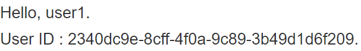

# [在 Spring 中获取 Keycloak 用户 ID](https://www.baeldung.com/spring-keycloak-get-user-id)

1. 概述

    Keycloak 是一个开源身份和访问管理 (IAM) 系统，可与 Spring Boot 应用程序完美集成。在本教程中，我们将介绍如何在 Spring Boot 应用程序中获取 Keycloak 用户 ID。

2. 问题陈述

    Keycloak 提供的功能包括保护 REST API、用户联盟、细粒度授权、社交登录、双因素身份验证 (2FA) 等。此外，我们还可以使用它通过 OpenID Connect ([OIDC](https://openid.net/connect/)) 实现单点登录 ([SSO](https://www.baeldung.com/java-sso-solutions))。假设我们有一个使用 Keycloak 的 OIDC 保护的 Spring Boot 应用程序，我们想在 Spring Boot 应用程序中获取一个用户 ID。在这种情况下，我们需要在 Spring Boot 应用程序中获取访问令牌或安全上下文。

    1. Keycloak 服务器作为授权服务器

        为了简单起见，我们将在 [Spring Boot 应用程序中使用 Keycloak](https://www.baeldung.com/keycloak-embedded-in-spring-boot-app)。假设我们使用的是 [GitHub](https://github.com/Baeldung/spring-security-oauth/tree/master/oauth-resource-server/authorization-server) 上的授权服务器项目。首先，我们将在嵌入式 Keycloak 服务器的 realm baeldung 中定义 customerClient 客户端：keycloak spring boot 然后，我们导出 realm 详情作为 customer-realm.json，并在应用程序-customer.yml 中设置 realm 文件：

        ```yml
        keycloak:
        server:
            contextPath: /auth
            adminUser:
            username: bael-admin
            password: pass
            realmImportFile: customer-realm.json
        ```

        最后，我们可以使用 -spring.profiles.active=customer 选项运行应用程序。现在，授权服务器已经准备就绪。运行服务器后，我们可以访问授权服务器的欢迎页面 <http://localhost:8083/auth/>。

    2. 资源服务器

        配置好授权服务器后，我们来设置资源服务器。为此，我们将使用 [GitHub](https://www.baeldung.com/spring-boot-keycloak) 上的资源服务器项目。首先，将 application-embedded.properties 文件添加为资源：

        ```properties
        keycloak.auth-server-url=http://localhost:8083/auth
        keycloak.realm=baeldung
        keycloak.resource=customerClient
        keycloak.public-client=true
        keycloak.principal-attribute=preferred_username
        ```

        现在，资源服务器使用 OAuth2 授权服务器保证了安全，我们必须登录 SSO 服务器才能访问资源。我们可以使用 -spring.profiles.active=embedded 选项运行应用程序。

3. 获取 Keycloak 用户 ID

    使用[客户端映射](https://www.baeldung.com/keycloak-custom-user-attributes)器可以从 Keycloak 获取用户 ID。

    1. 客户端映射器

        我们可以在客户端映射器中添加用户 ID，并在 Spring Boot 应用程序中获取它。首先，我们在 customerClient 客户端定义一个客户端映射器：

        

        然后，我们在 CustomUserAttrController 类中获取用户 ID：

        

        我们使用 IDToken 的 getClaims() 方法获取映射器。然后，我们将用户 ID 添加到模型属性中。

    2. Thymeleaf

        我们将修改 userInfo.html 模板以显示用户 ID 信息：

        ```html
        <div id="container">
            <h1>
            User ID : <span th:text="${userID}">--userID--</span>.
            </h1>
        </div>
        ```

    3. 测试

        运行应用程序后，我们可以浏览 <http://localhost:8081/users>。输入 baeldung:baeldung 作为凭据，将返回以下内容：

        

4. 结论

    在本文中，我们介绍了如何在 Spring Boot 应用程序中从 Keycloak 获取用户 ID。我们首先设置了调用安全应用程序所需的环境。然后，我们介绍了如何使用 IDToken 和客户端映射器在 Spring Boot 应用程序中获取 Keycloak 用户 ID。
