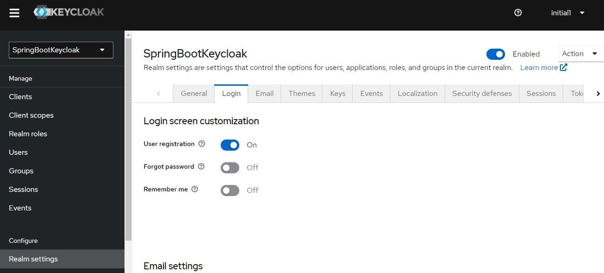

# [Keycloak用户自助注册](https://www.baeldung.com/keycloak-user-registration)

1. 概述

    我们可以使用 Keycloak 作为第三方授权服务器来管理网络或移动应用程序的用户。

    管理员可以添加用户，Keycloak 也可以允许用户自行注册。此外，除了名字、姓氏和电子邮件等默认属性外，我们还可以根据应用程序的需要添加额外的用户属性。

    在本教程中，我们将了解如何在 Keycloak 上启用自助注册并在用户注册页面上添加自定义字段。

    我们将在自定义登录页面的基础上进行构建，因此先完成登录页面的初始设置会很有帮助。

2. 独立服务器

    首先，我们来看看独立 Keycloak 服务器的用户自助注册。

    1. 启用用户注册

        首先，我们需要启用 Keycloak 以允许用户注册。为此，我们首先需要从 Keycloak 发行版的 bin 文件夹中运行以下命令来启动服务器：

        `kc.bat start-dev`

        然后，我们需要进入管理控制台，键入 initial1/zaq1!QAZ 凭据。

        然后，在 "Realm Settings" 页面的 "Login" 选项卡中，切换 "User registration" 按钮：

        

        就这样！自助注册已启用。

        现在，我们将在登录页面上看到一个名为 "Register" 的链接。

        请再次注意，该页面与 Keycloak 的默认登录页面不同，因为我们扩展了之前的自定义功能。

        注册链接将带我们进入注册页面。

        正如我们所见，默认页面上包含了 Keycloak 用户的基本属性。

        在下一节中，我们将看到如何为我们的选择添加额外属性。

    2. 添加自定义用户属性

        继续使用自定义主题，将现有模板 base/login/register.ftl 复制到 custom/login 文件夹。

        现在我们尝试添加一个新字段 dob，表示出生日期。为此，我们需要修改上面的 register.ftl 并添加以下内容：

        ```ftl
        <div class="form-group">
            <div class="${properties.kcLabelWrapperClass!}">
                <label for="user.attributes.dob" class="${properties.kcLabelClass!}">
                Date of birth</label>
            </div>

            <div class="${properties.kcInputWrapperClass!}">
                <input type="date" class="${properties.kcInputClass!}" 
                id="user.attributes.dob" name="user.attributes.dob" 
                value="${(register.formData['user.attributes.dob']!'')}"/>
            </div>
        </div>
        ```

        现在，当我们在此页面注册新用户时，也可以输入其出生日期。

        为了验证，让我们打开管理控制台的 "Users" 页面并查找 Jane。

        接下来，让我们进入 Jane‘s Attributes，查看 DOB（出生日期）。

        很明显，这里显示的出生日期与我们在自我登记表(self-registration form)上填写的相同。

3. 嵌入式服务器

    现在，让我们看看如何为嵌入 Spring Boot 应用程序的 Keycloak 服务器添加自定义属性以进行自助注册。

    与独立服务器的第一步相同，我们需要在一开始就启用用户注册。

    为此，我们可以在领域定义文件 baeldung-realm.json 中将 registrationAllowed 设置为 true：

    `"registrationAllowed" : true,`

    然后，我们需要在 register.ftl 中添加出生日期，方法与之前的完全相同。

    接下来，将此文件复制到 src/main/resources/themes/custom/login 目录。

    现在，启动服务器时，我们的[登录页面](http://localhost:8083/auth/realms/baeldung/protocol/openid-connect/auth?response_type=code&&scope=openid%20write%20read&client_id=newClient&redirect_uri=http://localhost:8089/)上就会出现注册链接。

    下面是带有出生日期自定义字段的自助注册页面。

    需要注意的是，通过嵌入式服务器的自助注册页面添加的用户是瞬态的。

    由于我们没有将该用户添加到预配置文件中，因此重启服务器时该用户将不可用。不过，这在开发阶段很有用，因为我们只需检查设计和功能。

    为了进行测试，在重启服务器之前，我们可以通过管理控制台验证用户是否已将出生日期添加为自定义属性。我们还可以尝试使用新用户的凭据登录。

4. 总结

    在本教程中，我们学习了如何在 Keycloak 中启用用户自助注册。我们还学习了如何在注册新用户时添加自定义属性。

    我们还学习了如何在独立实例和嵌入实例中实现这一功能。
