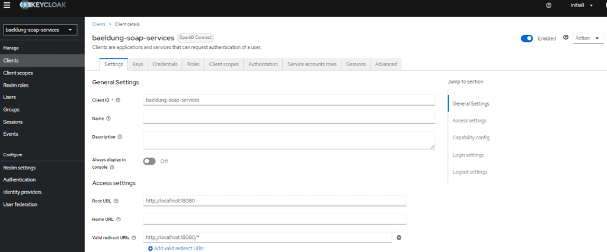
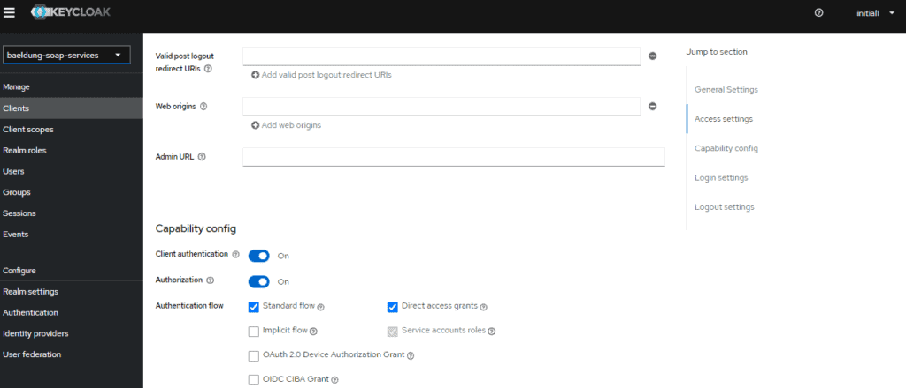
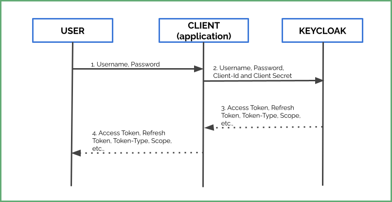

# [用 Keycloak 确保 SOAP 网络服务安全](https://www.baeldung.com/soap-keycloak)

1. 概述

    Keycloak 是一款开源身份和访问管理服务器，可确保现代应用程序（如 SPA、移动应用程序、API 等）的安全。Keycloak 支持安全断言标记语言（SAML）2.0、单点登录（SSO）和 OpenID Connect（OIDC）等行业标准协议。

    此外，在本教程中，我们将学习如何利用 Keycloak 使用 OIDC（OpenID Connect）验证和授权 SOAP 网络服务。

2. 开发 SOAP 网络服务

    让我们学习如何[使用 Spring Boot 构建 SOAP 网络服务](https://www.baeldung.com/spring-boot-soap-web-service)。

    1. 网络服务操作

        首先，让我们定义操作：

        - getProductDetails： 返回给定产品 ID 的产品详细信息。另外，假设具有用户角色的用户可以请求此操作。
        - deleteProduct： 删除给定产品 ID 的产品。此外，只有管理员用户才能请求此操作。

        我们已经定义了两个操作和一个 RBAC（[基于角色的访问控制](https://www.baeldung.com/role-and-privilege-for-spring-security-registration)）。

    2. 定义 XSD

        首先，让我们定义一个 product.xsd：

        

        另外，让我们添加 wsdl4j 和 Spring Boot Webservices 依赖项：

        ```xml
        <dependency>
            <groupId>wsdl4j</groupId>
            <artifactId>wsdl4j</artifactId>
            <version>1.6.3</version>
        </dependency>
        <dependency>
            <groupId>org.springframework.boot</groupId>
            <artifactId>spring-boot-starter-web-services</artifactId>
            <version>2.7.5</version>
        </dependency>
        ```

    3. 网络服务

        接下来，让我们开发一个 SOAP 网络服务。

        ```java
        @PayloadRoot(namespace = "http://www.baeldung.com/springbootsoap/keycloak", localPart = "getProductDetailsRequest")
        @ResponsePayload
        public GetProductDetailsResponse getProductDetails(@RequestPayload GetProductDetailsRequest request) {
            ...
        }
        @PayloadRoot(namespace = "http://www.baeldung.com/springbootsoap/keycloak", localPart = "deleteProductRequest")
        @ResponsePayload
        public DeleteProductResponse deleteProduct(@RequestPayload DeleteProductRequest request) {
            ...
        }
        ```

        我们可以使用 cURL、Postman、SOAPUI 等工具测试该网络服务。接下来，让我们看看如何确保 SOAP 网络服务的安全。

3. 配置 Keycloak

    首先，让我们配置 Keycloak，以便使用 OpenId Connect 保护我们的网络服务。

    1. 创建域和客户端

        首先，创建一个 baeldung-soap-services 领域，然后在此领域中创建 baeldung-soap-services 客户端。

        客户端通常是需要 Keycloaks 身份验证服务的应用程序。此外，在创建客户端时，请选择

        - 应用程序 URL 作为根 URL
        - Application URL as the Root URL
        - 将 openid-connect 作为客户端协议
        - openid-connect as the Client Protocol
        - 机密作为访问类型
        - Confidential as Access Type
        - 启用授权
        - Turn on Authorization Enabled

        此外，启用服务账户可以让我们的应用程序（客户端）通过 Keycloak 进行身份验证。随后，它将为我们的[身份验证流](https://oauth.net/2/grant-types/client-credentials/)提供客户端凭据授予类型的流程：

        

        

        最后，点击 "Save"，然后点击"Credentials"选项卡并记下密码。因此，我们需要将其作为 Spring Boot 配置的一部分。

    2. 用户和角色

        首先，让我们创建角色 - 管理员和用户。Keycloak 允许我们创建两种角色--Realm 角色和 Client 角色。首先，让我们创建客户端角色。

        点击客户端，选择客户端并点击角色选项卡。然后，创建两个角色：管理员和用户。

        虽然 Keycloak 可以从 LDAP 或 AD（活动目录）中获取用户，但为了简单起见，我们还是手动配置用户并为他们分配角色。

        接下来，让我们创建两个用户，并为他们分配角色和密码。

        让我们创建两个用户。首先，我们点击 "Users"，然后点击 " Add User"。

        现在，让我们为用户分配角色。

        再次点击 "Users"，选择用户并点击 "Edit"，然后点击 "Role Mappings" 选项卡，再点击 "Assign role"，从下拉菜单中选择 "Filter by clients"，然后选择一个角色。让我们把管理员角色分配给一个用户，把用户角色分配给另一个用户。

4. Spring Boot 配置

    同样，让我们确保 SOAP 网络服务的安全。

    1. Keycloak - Spring Boot 集成

        首先，我们将把身份验证控制委托给 Keycloak 服务器。为此，我们将使用 spring-boot-starter-oauth2-resource-server 库。它将允许我们通过 Keycloak 服务器验证 JWT 令牌。因此，让我们把它添加到 pom 中：

        ```xml
        <dependency>
            <groupId>org.springframework.boot</groupId>
            <artifactId>spring-boot-starter-oauth2-resource-server</artifactId>
        </dependency>
        ```

    2. 启用全局方法安全性

        除了前面的配置外，我们还必须指定安全约束，以确保网络服务的安全。这些约束允许我们限制未经授权的访问。例如，我们应该限制用户执行管理员操作。

        有两种方法可以设置约束：

        - 在应用程序配置文件中声明安全约束（security-constraints）和安全收集（security-collections）。
        - 使用 [@EnableGlobalMethodSecurity](https://docs.spring.io/spring-security/site/docs/current/api/org/springframework/security/config/annotation/method/configuration/EnableGlobalMethodSecurity.html) 实现方法级安全。

        对于 SOAP 网络服务，安全约束无法提供细粒度控制。此外，声明这些约束也很繁琐。

        因此，让我们利用 @EnableGlobalMethodSecurity 的强大功能来确保 SOAP 网络服务操作的安全。

    3. 定义 KeycloakSecurityConfig

        现在，让我们配置 KeycloakSecurityConfig 类：

        

        我们正在为所有传入请求设置一个新的过滤链。它将根据我们的 Keycloak 服务器验证绑定的 JWT 令牌。

    4. 添加授权

        最后，使用 [@RolesAllowed](https://javaee.github.io/javaee-spec/javadocs/javax/annotation/security/RolesAllowed.html) 注解（[JSR-250](https://download.oracle.com/otndocs/jcp/common_annotations-1_3-mrel3-eval-spec/) 的一部分）授权我们的 SOAP 网络服务操作。

        鉴于此，让我们用访问角色来配置我们的方法。为此，让我们使用 @RolesAllowed 注解。回想一下，我们在 Keycloak 中定义了用户和管理员两种不同的角色。让我们为每个网络服务定义一个角色：

        ```java
        @RolesAllowed("user")
        @PayloadRoot(namespace = "http://www.baeldung.com/springbootsoap/keycloak", localPart = "getProductDetailsRequest")
        @ResponsePayload
        public GetProductDetailsResponse getProductDetails(@RequestPayload GetProductDetailsRequest request) {
            ...
        }
        @RolesAllowed("admin")
        @PayloadRoot(namespace = "http://www.baeldung.com/springbootsoap/keycloak", localPart = "deleteProductRequest")
        @ResponsePayload
        public DeleteProductResponse deleteProduct(@RequestPayload DeleteProductRequest request) {
            ...
        }
        ```

        至此，我们完成了配置。

5. 测试应用程序

    1. 检查设置

        现在应用程序已经准备就绪，让我们开始使用 curl 测试 SOAP 网络服务：

        `curl -d @request.xml -i -o -X POST --header 'Content-Type: text/xml' http://localhost:18080/ws/api/v1`

        最终，如果所有配置都正确，我们会收到拒绝访问的响应：

        ```xml
        <SOAP-ENV:Fault>
            <faultcode>SOAP-ENV:Server</faultcode>
            <faultstring xml:lang="en">Access is denied</faultstring>
        </SOAP-ENV:Fault>
        ```

        不出所料，Keycloak 拒绝了请求，因为请求中不包含访问令牌。

    2. 获取访问令牌

        现在，让我们从 Keycloak 获取访问令牌，以访问我们的 SOAP 网络服务。通常，流程包括

        

        - 首先，用户向应用程序发送凭据
        - 应用程序将客户 ID 和客户保密信息以及这些凭证传递给 Keycloak 服务器。
        - 最后，Keycloak 根据用户凭证和角色返回访问令牌、刷新令牌和其他元数据。

        Keycloak 为客户端请求访问令牌提供了一个令牌端点。 通常，该端点的形式为

        `<PROTOCOL>://<HOST>:<PORT>/realms/<REALM_NAME>/protocol/openid-connect/token`

        例如

        <http://localhost:8080/realms/baeldung/protocol/openid-connect/token>

        现在，我们来获取访问令牌：

        ```shell
        curl -L -X POST 'http://localhost:8080/realms/baeldung-soap-services/protocol/openid-connect/token' \
        -H 'Content-Type: application/x-www-form-urlencoded' \
        --data-urlencode 'grant_type=password' \
        --data-urlencode 'client_id=baeldung-soap-services' \
        --data-urlencode 'client_secret=14da6f9e-261f-489a-9bf0-1441e4a9ddc4' \
        --data-urlencode 'username=janedoe' \
        --data-urlencode 'password=password'
        ```

        实际上，我们会得到一个访问令牌和刷新令牌以及元数据：

        ```json
        {
            "access_token": "eyJh ...",
            "expires_in": 300,
            "refresh_expires_in": 1800,
            "refresh_token": "eyJh ...",
            "token_type": "Bearer",
            "not-before-policy": 0,
            "session_state": "364b8f3e-34ff-4ca0-8895-bfbdb8b466d4",
            "scope": "profile email"
        }
        ```

        此外，可配置的 expires_in 键定义了此令牌的有效期。例如，上述访问令牌将在 5 分钟（300 秒）后过期。

    3. 使用访问令牌调用网络服务

        让我们在本例中使用上一节获取的访问令牌。使用访问令牌作为[承载令牌](https://datatracker.ietf.org/doc/html/rfc6750)调用 SOAP 网络服务。

        `curl -d @request.xml -i -o -X POST -H 'Authorization: Bearer BwcYg94bGV9TLKH8i2Q' \
        -H 'Content-Type: text/xml' http://localhost:18080/ws/api/v1`

        有了正确的访问令牌，响应就是

        ```xml
        <ns2:getProductDetailsResponse xmlns:ns2="http://www.baeldung.com/springbootsoap/keycloak">
            <ns2:product>
                <ns2:id>1</ns2:id>
                    ...
                </ns2:product>
        </ns2:getProductDetailsResponse>
        ```

    4. 授权

        回顾一下，我们为具有用户角色的用户 janedoe 生成了访问令牌。有了用户访问令牌，我们就可以尝试执行管理操作了。也就是说，让我们尝试调用 deleteProduct：

        ```shell
        curl -d @request.xml -i -o -X POST -H 'Authorization: Bearer sSgGNZ3KbMMTQ' -H 'Content-Type: text/xml' \
        http://localhost:18080/ws/api/v1
        ```

        其中 request.xml 的内容是

        ```xml
        <soapenv:Envelope xmlns:soapenv="http://schemas.xmlsoap.org/soap/envelope/" xmlns:key="http://www.baeldung.com/springbootsoap/keycloak">
            <soapenv:Header/>
            <soapenv:Body>
                <key:deleteProductRequest>
                    <key:id>1</key:id>
                </key:deleteProductRequest>
        </soapenv:Body>
        </soapenv:Envelope>
        ```

        由于用户没有访问管理操作的权限，所以我们收到了拒绝访问：

        ```xml
        <SOAP-ENV:Fault>
            <faultcode>SOAP-ENV:Server</faultcode>
                <faultstring xml:lang="en">Access is denied</faultstring>
        </SOAP-ENV:Fault>
        ```

6. 结论

    本教程展示了如何开发 SOAP 网络服务、配置 Keycloak 以及使用 Keycloak 确保网络服务安全。与确保 REST 网络服务安全的方法一样，我们也必须确保 SOAP 网络服务的安全，防止可疑用户和未经授权的访问。
