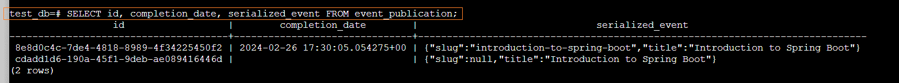

# [使用 Spring Modulith 实现事件外部化](https://www.baeldung.com/spring-modulith-event-externalization)

1. 概述

    在本文中，我们将讨论在 [@Transactional](https://www.baeldung.com/transaction-configuration-with-jpa-and-spring) 块中发布消息的需求以及相关的性能挑战，例如数据库连接时间过长。为了解决这个问题，我们将利用 [Spring Modulith](https://www.baeldung.com/spring-modulith) 的功能来监听 Spring 应用程序事件并自动将其发布到 Kafka 主题。

2. 事务操作和消息代理

    在本文的代码示例中，我们假设正在编写负责在 Baeldung 上保存文章的功能：

    ```java
    @Service
    class Baeldung {
        private final ArticleRepository articleRepository;
        // constructor
        @Transactional
        public void createArticle(Article article) {
            validateArticle(article);
            article = addArticleTags(article);
            // ... other business logic
            articleRepository.save(article);
        }
    }
    ```

    此外，我们还需要通知系统的其他部分有关这篇新文章的信息。有了这些信息，其他模块或服务就会做出相应的反应，创建报告或向网站读者发送新闻邮件。

    最简单的方法就是注入一个知道如何发布该事件的依赖关系。在我们的示例中，让我们使用 KafkaOperations 向 "baeldung.articles.published" 主题发送消息，并使用文章的 slug() 作为关键字：

    ```java
    @Service
    class Baeldung {
        private final ArticleRepository articleRepository;
        private final KafkaOperations<String, ArticlePublishedEvent> messageProducer;
        // constructor
        @Transactional
        public void createArticle(Article article) {
            // ... business logic
            article = articleRepository.save(article);
            messageProducer.send(
            "baeldung.articles.published",
            article.slug(),
            new ArticlePublishedEvent(article.slug(), article.title())
            ).join();
        }
    }
    ```

    然而，由于一些不同的原因，这种方法并不理想。从设计角度看，我们将领域服务与消息生产者耦合在一起。此外，领域服务直接依赖于下层组件，这违反了[清洁架构](https://www.baeldung.com/spring-boot-clean-architecture)的基本规则之一。

    此外，这种方法还会影响性能，因为所有事情都是在 @Transactional 方法中发生的。因此，为保存文章而获取的数据库连接将一直处于打开状态，直到消息成功发布。

    最后，这种解决方案还在持久化数据和发布消息之间创建了一种容易出错的关系：

    - 如果生产者未能发布消息，事务就会回滚；
    - 即使消息已经发布，事务最终也会回滚；

3. 使用 Spring 事件实现依赖反转

    我们可以利用 [Spring事件](https://www.baeldung.com/spring-events) 来改进解决方案的设计。我们的目标是避免直接从域服务向 Kafka 发布消息。让我们移除 KafkaOperations 依赖关系，转而发布内部应用程序事件：

    main/.springmodulith.events.externalization/Baeldung.java

    除此之外，我们还将有一个专门的 Kafka 生产者作为基础架构层的一部分。该组件将监听 ArticlePublishedEvents，并将发布委托给底层的 KafkaOperations Bean：

    main/.springmodulith.events.externalization.infra/ArticlePublishedKafkaProducer.java

    有了这个抽象，基础架构组件现在依赖于领域服务产生的事件。换句话说，我们成功地降低了耦合度，并反转了源代码依赖关系。此外，如果其他模块对文章创建感兴趣，它们现在可以无缝监听这些应用程序事件并做出相应反应。

    另一方面，publish() 方法将在与业务逻辑相同的事务中调用。这两个操作间接地耦合在一起，因为其中一个操作的失败会导致另一个操作的失败或回滚。

4. 原子操作与非原子操作

    现在，让我们深入考虑性能问题。首先，我们必须确定当与消息代理的通信失败时，回滚是否是所需的行为。这种选择因具体情况而异。

    如果我们不需要这种原子性，就必须释放数据库连接并异步发布事件。为了模拟这种情况，我们可以尝试创建一篇没有标题的文章，导致 ArticlePublishedKafkaProducer::publish 失败：

    test/.springmodulith.events.externalization/EventsExternalizationLiveTest.java:whenPublishingMessageFails_thenArticleIsStillSavedToDB()

    如果我们现在运行该测试，它将会失败。这是因为 ArticlePublishedKafkaProducer 会抛出异常，导致域服务回滚事务。不过，我们可以用 @TransactionalEventListener 和 @Async 替换 @EventListener 注解，使事件监听器成为异步的：

    ```java
    @Async
    @TransactionalEventListener
    public void publish(ArticlePublishedEvent event) {
        Assert.notNull(event.slug(), "Article Slug must not be null!");
        messageProducer.send("baeldung.articles.published", event);
    }
    ```

    如果现在重新运行测试，我们会发现异常已被记录，事件未被发布，实体已被保存到数据库中。此外，数据库连接被提前释放，允许其他线程使用。

5. 使用 Spring Modulith 实现事件外部化

    我们通过两步方法成功解决了原始代码示例中的设计和性能问题：

    - 使用 Spring 应用程序事件进行依赖反转
    - 利用 @TransactionalEventListener 和 @Async 进行异步发布

    Spring Modulith 允许我们进一步简化代码，为这种模式提供内置支持。首先，让我们将 spring-modulith-events-api 的 maven 依赖项添加到 pom.xml 中：

    ```xml
    <dependency>
        <groupId>org.springframework.modulith</groupId>
        <artifactId>spring-modulith-events-api</artifactId>
        <version>1.1.3</version>
    </dependency>
    ```

    该模块可配置为监听应用程序事件，并自动将其外部化到[各种消息系统](https://docs.spring.io/spring-modulith/reference/events.html#externalization.infrastructure)中。我们将继续使用最初的示例，重点关注 Kafka。为此，我们需要添加 Spring-modulith-events-kafka 依赖项：

    ```xml
    <dependency> 
        <groupId>org.springframework.modulith</groupId> 
        <artifactId>spring-modulith-events-kafka</artifactId> 
        <version>1.1.3</version>
        <scope>runtime</scope> 
    </dependency>
    ```

    现在，我们需要更新 ArticlePublishedEvent，并使用 @Externalized 对其进行注解。该注解需要路由目标的名称和关键字。换句话说，就是 Kafka 主题和消息键。对于关键字，我们将使用 [SpEL](https://www.baeldung.com/spring-expression-language) 表达式来调用 Article::slug()：

    ```java
    @Externalized("baeldung.article.published::#{slug()}")
    public record ArticlePublishedEvent(String slug, String title) {
    }
    ```

6. 事件发布注册表

    如前所述，我们在持久化数据和发布消息之间仍然存在容易出错的关系--未能发布消息会导致事务回滚。另一方面，即使成功发布了消息，事务稍后仍可能回滚。

    Spring Modulith 的事件发布注册中心采用 "事务发件箱(transactional outbox)" 模式来解决这一问题，确保整个系统的最终一致性。当事务性操作发生时，该事件不会立即发送消息到外部系统，而是存储在同一业务事务中的事件发布日志中。

    1. 事件发布日志

        首先，我们需要引入与持久化技术相对应的 Spring-modulith-starter 依赖关系。我们可以查阅[官方文档](https://docs.spring.io/spring-modulith/reference/events.html#starters)，了解支持的启动器的完整列表。由于我们使用 Spring Data JPA 和 PostgreSQL 数据库，因此我们将添加 spring-modulith-starter-jpa 依赖关系：

        ```xml
        <dependency>
            <groupId>org.springframework.modulith</groupId>
            <artifactId>spring-modulith-starter-jpa</artifactId>
            <version>1.1.2</version>
        </dependency>
        ```

        此外，我们将启用 Spring Modulith 创建 "event_publication" 表。该表包含外部化应用程序事件的相关数据。让我们在 application.yml 中添加以下属性：

        ```yml
        spring.modulith:
        events.jdbc-schema-initialization.enabled: true
        ```

        我们的设置使用 Testcontainer 启动一个带有 PostgreSQL 数据库的 Docker 容器。因此，我们可以利用 Testcontainers Desktop 应用程序 "freeze the container shutdown" 并 "open a terminal" 连接到容器本身。然后，我们可以使用以下命令检查数据库：

        - "`psql -U test_user -d test_db`"--打开 PostgreSQL 交互式终端
        - "`\d`" - 列出数据库对象

        我们可以看到，"even_publication" 表已成功创建。让我们执行一次查询，查看测试持久化的事件：

        

        在第一行，我们可以看到第一个测试创建的事件，它涵盖了快乐流程(happy flow)。不过，在第二个测试中，我们故意省略了 "slug"，创建了一个无效事件，以模拟事件发布过程中的故障。由于这篇文章已保存到数据库，但没有成功发布，因此在 events_publication 表中显示的完成日期缺失。

    2. 重新提交事件

        通过 republish-outstanding-events-on-restart 属性，我们可以让 Spring Modulith 在应用程序重启时自动重新提交事件：

        ```java
        spring.modulith:
        republish-outstanding-events-on-restart: true
        ```

        此外，我们还可以使用 IncompleteEventPublications Bean 以编程方式重新提交超过给定时间的失败事件：

        ```java
        @Component
        class EventPublications {
            private final IncompleteEventPublications incompleteEvents;
            private final CompletedEventPublications completeEvents;
            // constructor
            void resubmitUnpublishedEvents() {
                incompleteEvents.resubmitIncompletePublicationsOlderThan(Duration.ofSeconds(60));
            }
        }
        ```

        同样，我们可以使用 CompletedEventPublications Bean 轻松地查询或清除事件发布表：

        ```java
        void clearPublishedEvents() {
            completeEvents.deletePublicationsOlderThan(Duration.ofSeconds(60));
        }
        ```

7. 事件外部化配置

    尽管 @Externalized 注解的值对简洁的 SpEL 表达式很有用，但在某些情况下我们可能还是要避免使用它：

    - 当表达式变得过于复杂时
    - 当我们要将主题信息与应用程序事件分开时
    - 如果我们想为应用程序事件和外部化事件建立不同的模型

    对于这些用例，我们可以使用 EventExternalizationConfiguration 的生成器配置必要的路由和事件映射。之后，我们只需将此配置作为 [Spring Bean](https://www.baeldung.com/spring-bean) 公开即可：

    ```java
    @Bean
    EventExternalizationConfiguration eventExternalizationConfiguration() {
        return EventExternalizationConfiguration.externalizing()
        .select(EventExternalizationConfiguration.annotatedAsExternalized())
        .route(
            ArticlePublishedEvent.class,
            it -> RoutingTarget.forTarget("baeldung.articles.published").andKey(it.slug())
        )
        .mapping(
            ArticlePublishedEvent.class,
            it -> new PostPublishedKafkaEvent(it.slug(), it.title())
        )
        .build();
    }
    ```

    EventExternalizationConfiguration 使我们能够以声明的方式定义应用程序事件的路由和映射。此外，它还能让我们处理各种类型的应用程序事件。例如，如果我们需要处理 "WeeklySummaryPublishedEvent"（每周摘要发布事件）这样的额外事件，只需再添加一个特定类型的路由和映射，就能轻松实现：

    ```java
    @Bean
    EventExternalizationConfiguration eventExternalizationConfiguration() {
        return EventExternalizationConfiguration.externalizing()
        .select(EventExternalizationConfiguration.annotatedAsExternalized())
        .route(
            ...
        )
        .mapping(
            ...
        )
        .route(
            WeeklySummaryPublishedEvent.class,
            it -> RoutingTarget.forTarget("baeldung.articles.published").andKey(it.handle())
        )
        .mapping(
            WeeklySummaryPublishedEvent.class,
            it -> new PostPublishedKafkaEvent(it.handle(), it.heading())
        )
        .build();
    }
    ```

    正如我们所观察到的，映射和路由需要两样东西：类型本身和一个解析 Kafka 主题和有效负载的函数。在我们的示例中，两个应用事件都将映射到一个通用类型，并发送到同一个主题。

    此外，由于我们现在在配置中声明了路由，因此可以从事件本身移除这些信息。因此，事件将只有 @Externalized 注解，而没有值：

    ```java
    @Externalized
    public record ArticlePublishedEvent(String slug, String title) {
    }

    @Externalized
    public record WeeklySummaryPublishedEvent(String handle, String heading) {
    }
    ```

8. 结论

    在本文中，我们讨论了需要在事务块中发布消息的场景。我们发现这种模式会对性能产生很大影响，因为它会阻塞数据库连接较长时间。

    之后，我们使用 Spring Modulith 的功能来监听 Spring 应用程序事件，并自动将其发布到 Kafka 主题。这种方法使我们能够异步地将事件外部化，并更快地释放数据库连接。
