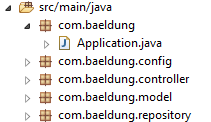

# [从Spring迁移到Spring Boot](https://www.baeldung.com/spring-boot-migration)

1. 概述

    在这篇文章中，我们将看看如何将现有的Spring框架应用迁移到Spring Boot应用。

    Spring Boot的目的不是为了取代Spring，而是为了让它的工作更快、更容易。因此，迁移应用程序所需的大部分变化都与配置有关。在大多数情况下，我们的自定义控制器和其他组件将保持不变。

    使用Spring Boot开发会带来几个优势：

    - 更简单的依赖性管理
    - 默认的自动配置
    - 嵌入式Web服务器
    - 应用指标和健康检查
    - 先进的外部化配置

2. Spring Boot启动器

    首先，我们需要一组新的依赖项。Spring Boot提供了方便的启动器依赖项，这些依赖项描述符可以为某些功能带来所有必要的技术。

    这些的好处是，你不再需要为每个依赖关系指定版本，而是让启动器为你管理依赖关系。

    最快的方法是添加spring-boot-starter-parent pom.xml：

    ```xml
    <parent>
        <groupId>org.springframework.boot</groupId>
        <artifactId>spring-boot-starter-parent</artifactId>
    </parent>
    ```

    这将照顾到依赖性管理。

    我们将在接下来的章节中，根据我们要迁移的功能，再去看一些启动器。作为参考，你可以在这里找到启动器的[完整列表](https://github.com/spring-projects/spring-boot/tree/master/spring-boot-project/spring-boot-starters)。

    一般来说，我们要删除任何明确定义的、也由Spring Boot管理的依赖性版本。否则，我们可能会遇到我们定义的版本和Boot使用的版本不兼容的情况。

3. 应用程序入口点

    使用Spring Boot构建的每个应用程序都需要定义主入口点。这通常是一个带有main方法的Java类，用@SpringBootApplication来注释：

    ```java
    @SpringBootApplication
    public class Application {
        public static void main(String[] args) {
            SpringApplication.run(Application.class, args);
        }
    }
    ```

    @SpringBootApplication注解添加了以下注解：

    - @Configuration - 标记该类为Bean定义的来源
    - @EnableAutoConfiguration - 它告诉框架根据classpath上的依赖关系自动添加bean。
    - @ComponentScan - 扫描其他配置和与Application类相同的包或以下的Bean

    默认情况下，@SpringBootApplication注解会扫描同一包内或下面的所有类。因此，一个方便的包结构可以是这样的：

    

    如果你的应用程序是一个创建ApplicationContext的非Web应用程序，这段代码可以被删除，用上面的@SpringBootApplication类取代。

    我们可能遇到的一个问题是多个配置类发生冲突。为了避免这种情况，我们可以对被扫描的类进行过滤：

    ```java
    @SpringBootAppliaction
    @ComponentScan(excludeFilters = { 
    @ComponentScan.Filter(type = FilterType.REGEX, 
    pattern = "com.baeldung.config.*")})
    public class Application {}
    ```

4. 导入配置和组件

    Spring Boot在很大程度上依赖于配置注释，但你仍然可以以注释和XML格式导入你现有的配置。

    要让你现有的@Configuration或组件类被拾取，你有两个选择：

    - 将现有的类移到与主应用程序类包相同或低于该包的包中
    - 明确地导入这些类

    要明确地导入类，你可以在主类上使用@ComponentScan或@Import注解：

    ```java
    @SpringBootApplication
    @ComponentScan(basePackages="com.baeldung.config")
    @Import(UserRepository.class)
    public class Application {}
    ```

    官方文档建议使用注解而不是XML配置。然而，如果你已经有了XML文件，你不希望转换为Java配置，你仍然可以使用@ImportResource导入这些文件：

    ```java
    @SpringBootApplication
    @ImportResource("applicationContext.xml")
    public class Application {}
    ```

5. 迁移应用程序资源

    默认情况下，Spring Boot会在以下某个位置寻找资源文件：

    - /resources
    - /public
    - /static
    - /META-INF/resources

    为了迁移，我们可以将所有的资源文件移到这些位置之一，或者通过设置spring.resources.static-locations属性自定义资源位置：

    `spring.resources.static-locations=classpath:/images/,classpath:/jsp/`

6. 迁移应用程序属性

    框架将自动加载放置在以下位置的名为application.properties或application.yml的文件中定义的任何属性：

    - 当前目录下的/config子目录
    - 当前目录
    - classpath上的/config目录
    - classpath根目录

    为了避免显式加载属性，我们可以把它们移到这些位置中的一个有此名称的文件中。例如，进入应该存在于classpath上的/resources文件夹。

    我们还可以从名为application-{profile}.properties的文件中自动加载特定的配置文件属性。

    另外，大量的[预定义属性名称](https://docs.spring.io/spring-boot/docs/current/reference/html/appendix-application-properties.html)可用于配置不同的应用行为。

    你在应用中使用的每个Spring框架模块都需要稍作修改，主要与配置有关。让我们来看看一些最常用的功能。

7. 迁移一个Spring Web应用程序

    1. Web启动器

        Spring Boot为Web应用程序提供了一个启动器，它将带来所有必要的依赖。这意味着我们可以从Spring框架中移除所有特定于Web的依赖项，并用spring-boot-starter-web来代替它们：

        ```xml
        <dependency>
            <groupId>org.springframework.boot</groupId>
            <artifactId>spring-boot-starter-web</artifactId>
        </dependency>
        ```

        由于Spring Boot会尽可能地根据classpath自动配置应用程序，所以添加这个依赖将导致在主应用程序类中添加@EnableWebMvc注解，以及设置一个DispatcherServlet Bean。

        如果你有一个WebApplicationInitializer类来设置DispatcherServlet，这就不再需要了，@EnableWebMvc注解也不再需要。

        当然，如果我们想要一个自定义的行为，我们可以定义我们的bean，在这种情况下，我们的bean将被使用。

        如果我们在@Configuration类上明确使用@EnableWebMvc注解，那么MVC的自动配置将不再被启用。

        添加Web Starter也决定了以下Bean的自动配置：

        - 支持从classpath上名为/static、/public、/resources或/META-INF/resources的目录中提供静态内容。
        - HttpMessageConverter Bean，用于常见的使用情况，如JSON和XML
        - 一个处理所有错误的/error映射

    2. 视图技术

        就构建网页而言，官方文档建议不要使用JSP文件，而是使用模板引擎。自动配置包括以下模板引擎： Thymeleaf, Groovy, FreeMarker, Mustache。我们需要做的就是添加特定的启动器来使用它们中的一个：

        ```xml
        <dependency>
            <groupId>org.springframework.boot</groupId>
            <artifactId>spring-boot-starter-thymeleaf</artifactId>
        </dependency>
        ```

        模板文件应该放在/resources/templates文件夹中。

        如果我们想继续使用JSP文件，我们需要对应用程序进行配置，使其能够解析JSP。例如，如果我们的文件在/webapp/WEB-INF/views中，那么我们需要设置以下属性：

        ```properties
        spring.mvc.view.prefix=/WEB-INF/views/。
        spring.mvc.view.suffix=.jsp
        ```

    3. 嵌入式Web服务器

        此外，我们还可以使用嵌入式Tomcat服务器来运行我们的应用程序，通过添加spring-boot-starter-tomcat依赖项，它将被自动配置在8080端口：

        ```xml
        <dependency>
            <groupId>org.springframework.boot</groupId>
            <artifactId>spring-boot-starter-tomcat</artifactId>
        </dependency>
        ```

        Spring Boot提供自动配置的其他Web服务器是Jetty和Undertow。

8. 迁移Spring Security应用程序

    启用Spring Security的启动器是spring-boot-starter-security：

    ```xml
    <dependency>
        <groupId>org.springframework.boot</groupId>
        <artifactId>spring-boot-starter-security</artifactId>
    </dependency>
    ```

    默认情况下，这将创建一个名为 "user" 的用户，并在启动时记录一个随机生成的密码，同时用基本认证来保护所有端点。然而，我们通常想添加我们的安全配置，这与默认值不同。

    出于这个原因，我们将保留我们现有的类，用@EnableWebSecurity注解，它创建了一个SecurityFilterChain豆，并定义了一个自定义配置：

    ```java
    @Configuration
    @EnableWebSecurity
    public class SecurityConfig {
        @Bean
        public SecurityFilterChain filterChain(HttpSecurity http) throws Exception {}
    }
    ```

9. 迁移一个Spring Data应用程序

    根据我们所使用的Spring Data实现，我们需要添加相应的启动器。例如，对于JPA，我们可以添加spring-boot-starter-data-jpa依赖项：

    ```xml
    <dependency>
        <groupId>org.springframework.boot</groupId>
        <artifactId>spring-boot-starter-data-jpa</artifactId>
    </dependency>
    ```

    如果我们想使用内存数据库，添加相应的依赖关系就可以为H2、Derby和HSQLDB类型的数据库进行自动配置。

    例如，为了使用H2内存数据库，我们只需要h2依赖关系：

    ```xml
    <dependency>
        <groupId>com.h2database</groupId>
        <artifactId>h2</artifactId>
    </dependency>
    ```

    如果我们想使用不同的数据库类型和配置，如MySQL数据库，那么我们需要依赖性以及定义一个配置。

    为此，我们可以保留我们的DataSource Bean定义或利用预定义的属性：

    ```properties
    spring.datasource.driver-class-name=com.mysql.cj.jdbc.Driver
    spring.datasource.url=jdbc:mysql://localhost:3306/myDb?createDatabaseIfNotExist=true
    spring.datasource.username=user
    spring.datasource.password=pass
    ```

    Spring Boot将自动配置Hibernate作为默认的JPA提供者，以及一个transactionManager bean。

10. 结语

    在这篇文章中，我们展示了将现有Spring应用程序迁移到较新的Spring Boot框架时遇到的一些常见情况。

    总的来说，你在迁移时的经验当然会高度依赖于你所构建的应用程序。
