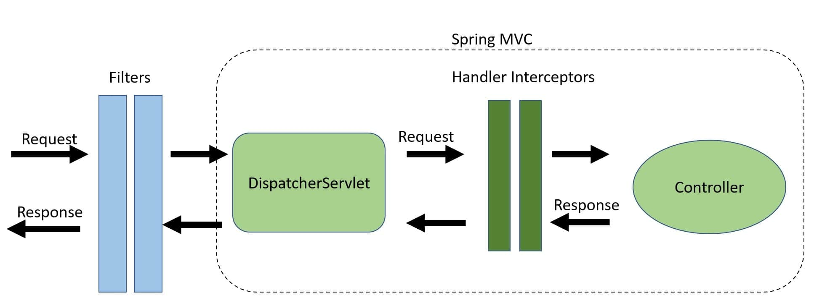

# [Spring MVC中的HandlerInterceptors与过滤器](https://www.baeldung.com/spring-mvc-handlerinterceptor-vs-filter)

1. 一览表

    在本文中，我们将比较Java servlet Filter和Spring MVC HandlerInterceptor，以及何时一个可能优于另一个。

2. 过滤

    过滤器是网络服务器的一部分，而不是Spring框架。对于传入的请求，我们可以使用过滤器来操作甚至阻止请求到达任何[servlet](https://www.baeldung.com/java-servlets-containers-intro)。反之亦然，我们也可以阻止回复到达客户。

    Spring Security是使用过滤器进行身份验证和授权的一个很好的例子。要配置Spring Security，我们只需要添加一个过滤器，即[DelegatingFilterProxy](https://www.baeldung.com/spring-delegating-filter-proxy)。然后，Spring Security可以拦截所有传入和传出的流量。这就是为什么Spring Security可以在Spring MVC之外使用。

    1. 创建过滤器

        要创建过滤器，首先，我们创建一个实现[javax.servlet.Filter](https://docs.oracle.com/javaee/7/api/javax/servlet/Filter.html)接口的类：

        ```java
        @Component
        public class LogFilter implements Filter {

            private Logger logger = LoggerFactory.getLogger(LogFilter.class);

            @Override
            public void doFilter(ServletRequest request, ServletResponse response, FilterChain chain) 
            throws IOException, ServletException {
                logger.info("Hello from: " + request.getLocalAddr());
                chain.doFilter(request, response);
            }

        }
        ```

        接下来，我们覆盖doFilter方法，在那里我们可以访问或操作ServletRequest、ServletResponse或FilterChain对象。我们可以使用FilterChain对象允许或阻止请求。

        最后，我们通过用@Component注释将过滤器添加到Spring上下文中。春天会完成剩下的工作。

3. 处理程序拦截器

    [HandlerInterceptors](https://www.baeldung.com/spring-mvc-handlerinterceptor)是Spring MVC框架的一部分，位于DispatcherServlet和ourControllers之间。我们可以在请求到达我们的控制器之前，以及渲染视图前后拦截请求。

    1. 创建一个HandlerInterceptor

        为了创建HandlerInterceptor，我们创建一个实现[org.springframework.web.servlet.HandlerInterceptor](https://docs.spring.io/spring-framework/docs/current/javadoc-api/org/springframework/web/servlet/HandlerInterceptor.html)接口的类。这让我们可以选择覆盖三种方法：

        - preHandle() – 在目标处理程序被调用之前执行
        - postHandle（）-在目标处理程序之后执行，但在DispatcherServlet渲染视图之前执行
        - afterCompletion() – 完成请求处理和视图渲染后的回调

        让我们将日志记录添加到测试拦截器中的三种方法中：

        ```java
        public class LogInterceptor implements HandlerInterceptor {

            private Logger logger = LoggerFactory.getLogger(LogInterceptor.class);

            @Override
            public boolean preHandle(HttpServletRequest request, HttpServletResponse response, Object handler) 
            throws Exception {
                logger.info("preHandle");
                return true;
            }

            @Override
            public void postHandle(HttpServletRequest request, HttpServletResponse response, Object handler, ModelAndView modelAndView) 
            throws Exception {
                logger.info("postHandle");
            }

            @Override
            public void afterCompletion(HttpServletRequest request, HttpServletResponse response, Object handler, Exception ex) 
            throws Exception {
                logger.info("afterCompletion");
            }

        }
        ```

4. 关键差异和用例

    让我们看看图表，显示过滤器和处理程序拦截器在请求/响应流程中的位置：

    

    过滤器在请求到达DispatcherServlet之前拦截，使其成为粗粒任务的理想选择，例如：

    - 认证
    - 日志记录和审计
    - 图像和数据压缩
    - 我们想要从Spring MVC中分离的任何功能

    另一方面，HandlerIntercepors拦截DispatcherServlet和我们的控制器之间的请求。这是在Spring MVC框架内完成的，提供对Handler和ModelAndView对象的访问。这减少了重复，并允许更精细的功能，例如：

    - 处理应用程序日志记录等交叉问题
    - 详细的授权检查
    - 操作Spring上下文或模型

5. 结论

    在本文中，我们介绍了过滤器和处理程序之间的区别。

    关键的收获是，使用过滤器，我们可以在请求到达我们的控制器和Spring MVC之外之前对请求进行操作。否则，HandlerInterceptors是特定应用程序交叉问题的好地方。通过提供对目标处理程序和ModelAndView对象的访问，我们拥有更精细的控制。
