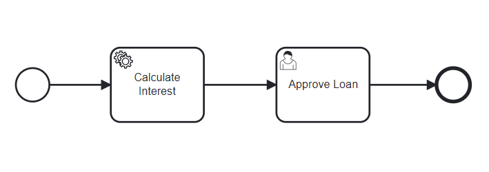

# Camunda引擎

- [ ] [使用嵌入式Camunda引擎运行SpringBoot应用程序](https://www.baeldung.com/spring-boot-embedded-camunda)

## 使用嵌入式Camunda引擎运行SpringBoot应用程序

1. 概述

    工作流引擎在业务流程自动化中发挥着重要作用。[Camunda](https://camunda.com/) 平台是一个开源工作流和业务流程管理系统（BPMS），为业务流程建模提供了一个流程引擎。Spring Boot 与 Camunda 平台集成良好。在本教程中，我们将了解如何在 Spring Boot 应用程序中利用嵌入式 Camunda 引擎。

2. Camunda 工作流引擎

    Camunda 工作流引擎是 [Activiti](https://www.baeldung.com/java-activiti) 的一个分支，它提供了一个基于业务流程建模符号 2.0（[BPMN](https://www.bpmn.org/) 2.0）标准的工作流和模拟引擎。此外，它还包括用于建模、执行和监控的工具和应用程序接口。首先，我们可以使用 [Modeler](https://camunda.com/download/modeler/) 对端到端业务流程进行建模。Camunda 提供用于设计 BPMN 工作流的建模器。建模器作为桌面应用程序在本地运行。然后，我们将业务流程模型部署到工作流引擎并执行它。我们可以使用 REST API 和提供的 Web 应用程序（Cockpit、Tasklist 和 Admin）以不同方式执行业务流程。Camunda 引擎有多种使用方式： SaaS、自我管理(Self-Managed)和嵌入式库(Embeddable library)。在本教程中，我们将重点介绍 Spring Boot 应用程序中的 Camunda 嵌入式引擎。

3. 使用嵌入式 Camunda 引擎创建 Spring Boot 应用程序

    在本节中，我们将使用 [Camunda Platform Initializr](https://start.camunda.com/) 创建和配置带有嵌入式 Camunda 引擎的 Spring Boot 应用程序。

    1. Camunda 平台初始化程序

        我们可以使用 Camunda Platform Initializr 创建与 Camunda 引擎集成的 Spring Boot 应用程序。这是 Camunda 提供的一个网络应用工具，与 Spring Initializr 类似。让我们在 Camunda Platform Initializr 中使用以下信息创建应用程序：init 该工具可让我们添加项目元数据，包括组、工件、Camunda BPM 版本、H2 数据库和 Java 版本。我们还可以添加 Camunda BPM 模块，以便在 Spring Boot 应用程序中支持 Camunda REST API 或 Camunda Web 应用程序。此外，我们还可以添加 Spring Boot Web 和安全模块。另一个选项是设置管理员用户名和密码，这在 Camunda Web 应用程序（如 Cockpit 应用程序登录）中是必需的。现在，我们点击 "生成项目 "下载项目模板的 .zip 文件。最后，解压文件并在集成开发环境中打开 pom.xml。

    2. Camunda 配置

        生成的项目是一个普通的 Spring Boot 应用程序，带有额外的 Camunda 依赖项和配置。

        资源目录中有一个简单的工作流程图 process.bpmn。它使用 start 节点开始执行流程。然后，它将继续执行 Say hello to demo 任务。任务完成后，执行过程会在遇到最终节点时停止。Camunda 属性存在于 application.yaml 中。让我们看看在 application.yaml 中生成的默认 Camunda 属性：camunda.bpm.admin-user

        我们可以使用 camunda.bpm.admin-user 属性更改管理员用户名和密码。

4. 使用 Spring Boot 创建应用程序

    另一种创建内嵌 Camunda 引擎的 Spring Boot 应用程序的方法是，从头开始使用 Spring Boot 并添加 Camunda 库。

    1. Maven 依赖项

        首先，让我们在 pom.xml 中声明 camunda-bpm-spring-boot-starter-webapp 依赖关系：

        ```xml
        <dependency>
            <groupId>org.camunda.bpm.springboot</groupId>
            <artifactId>camunda-bpm-spring-boot-starter-webapp</artifactId>
            <version>7.18.0</version>
        </dependency>
        ```

        我们需要一个数据库来存储流程定义、流程实例、历史信息等。在本教程中，我们使用基于文件的 H2 数据库。因此，我们需要添加 h2 和 spring-boot-starter-jdbc 依赖项：

        ```xml
        <dependency>
            <groupId>com.h2database</groupId>
            <artifactId>h2</artifactId>
        </dependency>
        <dependency>
            <groupId>org.springframework.boot</groupId>
            <artifactId>spring-boot-starter-jdbc</artifactId>
        </dependency>
        ```

    2. 流程模型示例

        我们使用 Camunda Modeler 定义了一个简单的贷款请求工作流程图 loanProcess.bpmn。以下是 loanProcess.bpmn 模型执行顺序的流程图，以帮助我们理解：

        

        我们使用开始节点开始执行流程。然后，执行计算利息任务。接下来，我们将执行批准贷款任务。在完成该任务后，遇到最终节点，执行就会停止。计算利息任务是一项服务任务，会调用 CalculateInterestService Bean：

        camunda.task\CalculateInterestService.java

        我们需要实现 JavaDelegate 接口。该类可用于服务任务和事件监听器。它在执行过程中调用的 execute() 方法中提供了所需的逻辑。现在，应用程序可以启动了。

5. 演示

    现在让我们运行 Spring Boot 应用程序。打开浏览器，输入 URL <http://localhost:8080/>

    输入用户凭证并访问 Camunda 网络应用程序 Cockpit、Tasklist 和 Admin： camunda welcome

    - [ ] ERROR: 无法加载Cockpit。

    1. 驾驶舱Cockpit应用程序

        Camunda 驾驶舱网络应用程序为用户提供了实时监控已实施流程及其运行情况的设施。我们可以看到 Spring Boot 应用程序启动时自动部署的流程数量： camunda cockpit 如我们所见，有一个已部署的流程（loanProcess.bpmn）。我们可以通过点击已部署的进程查看已部署的进程图： loanProcess deploy 现在，该进程尚未启动。我们可以使用任务列表应用程序启动它。

    2. 任务列表Tasklist应用程序

        Camunda 任务列表应用程序用于管理用户与其任务的交互。我们可以通过单击 "Start process" 菜单项来启动我们的示例进程： camunda tasklist 启动进程后，计算利息任务将被执行。它会登录到控制台：

        `2022-11-27 09:34:05.848  INFO 2748 --- [nio-8080-exec-3] c.e.c.task.CalculateInterestService      : calculating interest of the loan`

        现在，我们可以在 Cockpit 应用程序中看到正在运行的进程实例：loanProcess assign 注意，该进程正在等待批准贷款用户任务。在这一步中，我们将任务分配给演示用户。因此，演示用户可以在任务列表应用程序中看到该任务： loanProcess tasklist 我们可以单击 "Complete" 按钮完成任务。最后，我们可以在控制台应用程序中看到运行过程已完成。

    3. 管理应用程序

        Camunda 管理应用程序用于管理用户及其对系统的访问。此外，我们还可以管理租户和群组。

6. 总结

    在本文中，我们讨论了使用嵌入式 Camunda 引擎设置 Spring Boot 应用程序的基础知识。我们使用 Camunda Platform Initializr 工具和 Spring Boot 从零开始创建了应用程序。此外，我们还使用 Camunda Modeler 定义了一个简单的贷款请求流程模型。此外，我们还使用 Camunda 网络应用程序启动并探索了该流程模型。

## Code

本文所示代码的工作版本可在 [GitHub](https://github.com/eugenp/tutorials/tree/master/spring-boot-modules/spring-boot-process-automation) 上获取。
