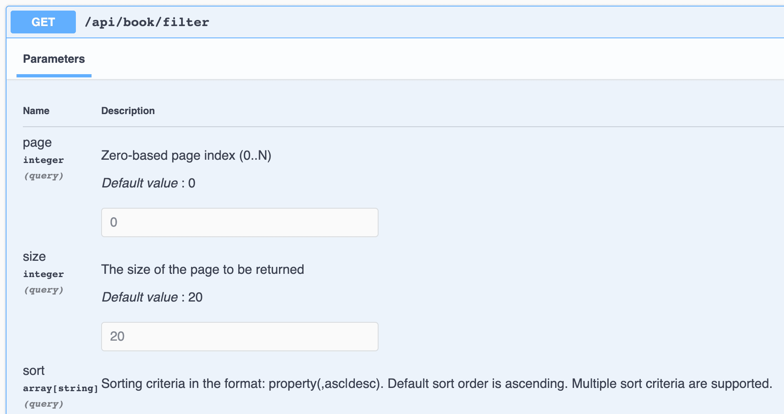
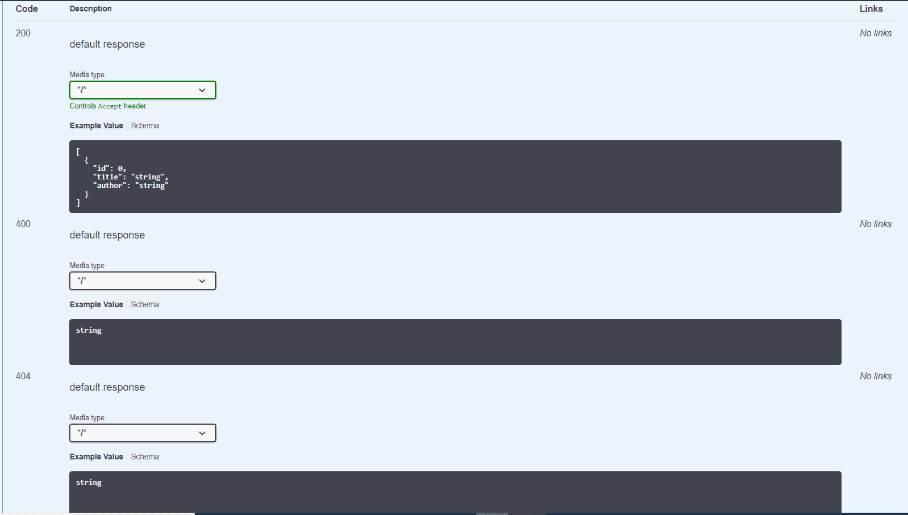
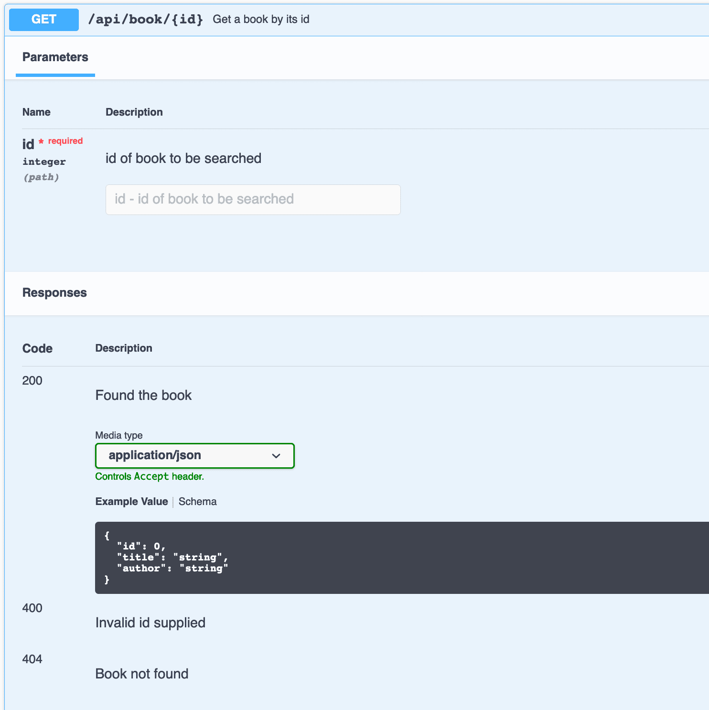
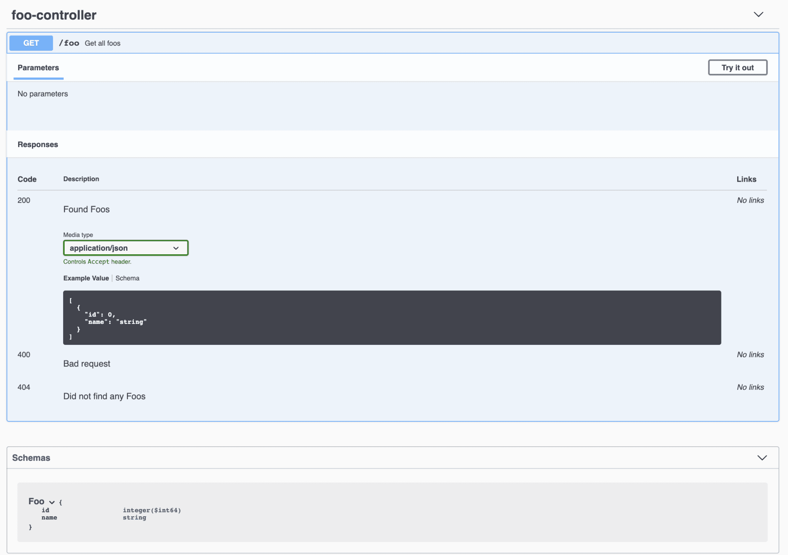

# [使用 OpenAPI 3.0 文档化 Spring REST API](https://www.baeldung.com/spring-rest-openapi-documentation)

1. 概述

    文档是构建 REST API 的重要组成部分。在本教程中，我们将介绍 SpringDoc，它基于 OpenAPI 3 规范简化了 Spring Boot 3.x 应用程序 API 文档的生成和维护。

2. 设置 springdoc-openapi

    Spring Boot 3.x 要求使用第 [2](https://github.com/springdoc/springdoc-openapi/releases/tag/v2.1.0) 版的 [springdoc-openapi](https://central.sonatype.com/search?q=springdoc-openapi-starter-webmvc-ui)：

    ```xml
    <dependency>
        <groupId>org.springdoc</groupId>
        <artifactId>springdoc-openapi-starter-webmvc-ui</artifactId>
        <version>2.5.0</version>
    </dependency>
    ```

    1. OpenAPI 说明路径

        正确设置依赖关系后，我们就可以运行应用程序，并在 /v3/api-docs 中找到 OpenAPI 描述，这是默认路径：

        <http://localhost:8080/v3/api-docs>

        此外，我们还可以使用 springdoc.api-docs 属性在 application.properties 中自定义路径。例如，我们可以将路径设置为 /api-docs：

        `springdoc.api-docs.path=/api-docs`

        然后，我们就可以通过以下网址访问文档了：

        <http://localhost:8080/api-docs>

        OpenAPI 定义默认为 JSON 格式。对于 yaml 格式，我们可以从以下网址获取定义：

        <http://localhost:8080/api-docs.yaml>

3. 与 Swagger UI 集成

    除了生成 OpenAPI 3 规范，我们还可以将 springdoc-openapi 与 Swagger UI 集成，以便与我们的 API 规范交互并使用端点。

    Springdoc-openapi 依赖项中已经包含了 Swagger UI，因此我们可以通过以下网址访问 API 文档：

    <http://localhost:8080/swagger-ui/index.html>

    1. 支持 Swagger-ui 属性

        springdoc-openapi 库还支持 [swagger-ui 属性](https://springdoc.org/#swagger-ui-properties)。这些属性可作为 Spring Boot 属性使用，前缀为 springdoc.swagger-ui。

        例如，我们可以通过更改应用程序 .properties 文件中的 springdoc.swagger-ui.path 属性来自定义 API 文档的路径：

        `springdoc.swagger-ui.path=/swagger-ui-custom.html`

        这样，我们的 API 文档就可以在 <http://localhost:8080/swagger-ui-custom.html> 上找到了。

        再举个例子，我们可以使用 springdoc.swagger-ui.operationsSorter 属性根据 HTTP 方法对 API 路径进行排序：

        `springdoc.swagger-ui.operationsSorter=method`

    2. 示例 API

        假设我们的应用程序有一个用于管理图书的控制器：

        ```java
        @RestController
        @RequestMapping("/api/book")
        public class BookController {

            @Autowired
            private BookRepository repository;

            @GetMapping("/{id}")
            public Book findById(@PathVariable long id) {
                return repository.findById(id)
                    .orElseThrow(() -> new BookNotFoundException());
            }

            @GetMapping("/")
            public Collection<Book> findBooks() {
                return repository.getBooks();
            }

            @PutMapping("/{id}")
            @ResponseStatus(HttpStatus.OK)
            public Book updateBook(
            @PathVariable("id") final String id, @RequestBody final Book book) {
                return book;
            }
        }
        ```

        然后，当我们运行应用程序时，我们可以通过以下网址查看文档：

        <http://localhost:8080/swagger-ui-custom.html>

        让我们深入到 /api/book 端点，查看其请求和响应的详细信息。

4. 将 springdoc-openapi 与 Spring WebFlux 集成

    我们还可以在 Spring WebFlux 应用程序中启用 springdoc.swagger-ui 属性。这样就能在 Spring WebFlux 应用程序上轻松集成 springdoc-openapi 和 Swagger UI。为此，我们在 pom.xml 文件中添加 springdoc-openapi-webflux-ui 依赖项：

    ```xml
    <dependency>
        <groupId>org.springdoc</groupId>
        <artifactId>springdoc-openapi-starter-webflux-ui</artifactId>
        <version>2.1.0</version>
    </dependency>
    ```

5. 公开分页信息

    Spring Data JPA 与 Spring MVC 无缝集成。支持 Pageable 就是这种集成的一个例子：

    ```java
    @GetMapping("/filter")
    public Page<Book> filterBooks(@ParameterObject Pageable pageable) {
        return repository.getBooks(pageable);
    }
    ```

    自 springdoc-openapi v1.6.0 版起，Pageable 的支持已开箱即用。页面、大小和排序查询参数会添加到生成的文档中。

    

6. 使用 springdoc-openapi Maven 插件

    springdoc-openapi 库提供了一个 Maven 插件 Springdoc-openapi-maven-plugin，可生成 JSON 和 YAML 格式的 OpenAPI 说明。

    springdoc-openapi-maven-plugin 插件与 spring-boot-maven 插件配合使用。Maven 会在集成测试阶段运行 openapi 插件。

    让我们看看如何在 pom.xml 中配置该插件：

    ```xml
    <plugin>
        <groupId>org.springframework.boot</groupId>
        <artifactId>spring-boot-maven-plugin</artifactId>
        <version>3.1.5</version>
        <executions>
            <execution>
                <id>pre-integration-test</id>
                <goals>
                    <goal>start</goal>
                </goals>
            </execution>
            <execution>
                <id>post-integration-test</id>
                <goals>
                    <goal>stop</goal>
                </goals>
            </execution>
        </executions>
    </plugin>
    <plugin>
        <groupId>org.springdoc</groupId>
        <artifactId>springdoc-openapi-maven-plugin</artifactId>
        <version>1.4</version>
        <executions>
            <execution>
                <phase>integration-test</phase>
                <goals>
                    <goal>generate</goal>
                </goals>
            </execution>
        </executions>
    </plugin>
    ```

    我们还可以将插件配置为使用自定义值：

    ```xml
    <plugin>
        <executions>
            .........
        </executions>
        <configuration>
            <apiDocsUrl>http://localhost:8080/v3/api-docs</apiDocsUrl>
            <outputFileName>openapi.json</outputFileName>
            <outputDir>${project.build.directory}</outputDir>
        </configuration>
    </plugin>
    ```

    让我们仔细看看我们可以为插件配置的参数：

    - apiDocsUrl - 可以访问 JSON 格式文档的 URL，默认为 <http://localhost:8080/v3/api-docs>
    - outputFileName - 保存定义的文件名；默认为 openapi.json
    - outputDir - 文档存储目录的绝对路径；默认为 ${project.build.directory}

7. 使用 JSR-303 Bean 验证自动生成文档

    当我们的模型包含 JSR-303 Bean 验证注解（如 @NotNull、@NotBlank、@Size、@Min 和 @Max）时，springdoc-openapi 库会使用它们为相应的约束生成额外的模式文档。

    让我们以图书 Bean 为例进行说明：

    ```java
    public class Book {

        private long id;

        @NotBlank
        @Size(min = 0, max = 20)
        private String title;

        @NotBlank
        @Size(min = 0, max = 30)
        private String author;

    }
    ```

    现在，为 Book Bean 生成的文档内容更加丰富了。

8. 使用 @ControllerAdvice 和 @ResponseStatus 生成文档

    在 @RestControllerAdvice 类中的方法上使用 @ResponseStatus 将自动生成响应代码的文档。在这个 @RestControllerAdvice 类中，两个方法都注释了 @ResponseStatus：

    

    因此，我们现在可以看到响应代码 400 和 404 的文档：

    

9. 使用 @Operation 和 @ApiResponses 生成文档

    接下来，让我们看看如何使用几个 [OpenAPI专用注解](https://javadoc.io/doc/io.swagger.core.v3/swagger-annotations/latest/index.html) 为我们的 API 添加一些说明。

    为此，我们将使用 @Operation 和 @ApiResponses 对控制器的 /api/book/{id} 端点进行注解：

    ```java
    @Operation(summary = "Get a book by its id")
    @ApiResponses(value = { 
        @ApiResponse(responseCode = "200", description = "Found the book", 
            content = { @Content(mediaType = "application/json", 
            schema = @Schema(implementation = Book.class)) }),
        @ApiResponse(responseCode = "400", description = "Invalid id supplied", 
            content = @Content), 
        @ApiResponse(responseCode = "404", description = "Book not found", 
            content = @Content) })
    @GetMapping("/{id}")
    public Book findById(@Parameter(description = "id of book to be searched") 
    @PathVariable long id) {
        return repository.findById(id).orElseThrow(() -> new BookNotFoundException());
    }
    ```

    效果如下

    

    我们可以看到，添加到 @Operation 中的文本被置于 API 操作级别。同样，在 @ApiResponses 容器注解中添加到各种 @ApiResponse 元素的说明也在这里可见，从而为我们的 API 响应增添了意义。

    我们没有为上述 400 和 404 响应获取任何模式。由于我们为它们定义了一个空的 @Content，所以只显示了它们的描述。

10. Kotlin 支持

    Spring Boot 2.x 为 Kotlin 提供了一流的支持。由于我们使用的是 Spring Boot 3.x 版本，因此 SpringDoc 支持用 Kotlin 编写的应用程序。

    我们将在 Kotlin 中创建一个简单的 Foo API 以了解其实际效果。

    完成[初始设置](https://www.baeldung.com/spring-boot-kotlin#2-setup)后，我们将添加一个数据类和一个控制器。我们将把它们添加到 Boot 应用程序的一个子包中，这样运行时，它就会将我们的 FooController 与之前的 BookController 一起提取出来：

    ```kt
    @Entity
    data class Foo(
        @Id
        val id: Long = 0,
        
        @NotBlank
        @Size(min = 0, max = 50)
        val name: String = ""
    )
    ```

    ```java
    @RestController
    @RequestMapping("/")
    class FooController() {
        val fooList: List = listOf(Foo(1, "one"), Foo(2, "two"))

        @Operation(summary = "Get all foos")
        @ApiResponses(value = [
        ApiResponse(responseCode = "200", description = "Found Foos", content = [
                (Content(mediaType = "application/json", array = (
                    ArraySchema(schema = Schema(implementation = Foo::class)))))]),
        ApiResponse(responseCode = "400", description = "Bad request", content = [Content()]),
        ApiResponse(responseCode = "404", description = "Did not find any Foos", content = [Content()])]
        )
        @GetMapping("/foo")
        fun getAllFoos(): List = fooList
    }
    ```

    现在，当我们点击 API 文档 URL 时，就会看到 Foo API：

    

    为了增强对 Kotlin 类型的支持，我们可以添加此依赖项：

    ```xml
    <dependency>
        <groupId>org.springdoc</groupId>
        <artifactId>springdoc-openapi-starter-common</artifactId>
        <version>2.1.0</version>
    </dependency>
    ```

    之后，我们的 Foo 模式将看起来更有信息量，就像我们添加 JSR-303 Bean Validation 时一样。

11. 结论

    在本文中，我们学习了在项目中设置 springdoc-openapi。然后，我们了解了如何将 springdoc-openapi 与 Swagger UI 集成。最后，我们还了解了如何在 Spring Webflux 项目中实现这一功能。

    接下来，我们使用 springdoc-openapi Maven 插件为我们的 API 生成 OpenAPI 定义，并了解了如何从 Spring Data 公开分页和排序信息。之后，我们了解了 springdoc-openapi 如何使用 JSR 303 Bean 验证注解和 @ControllerAdvice 类中的 @ResponseStatus 注释自动生成文档。

    我们还学习了如何使用一些 OpenAPI 特有的注解为我们的 API 添加说明。最后，我们还了解了 OpenAPI 对 Kotlin 的支持。

    Springdoc-openapi 可根据 OpenAPI 3 规范生成 API 文档。此外，它还为我们处理了 Swagger UI 配置，使 API 文档的生成变得相当简单。
