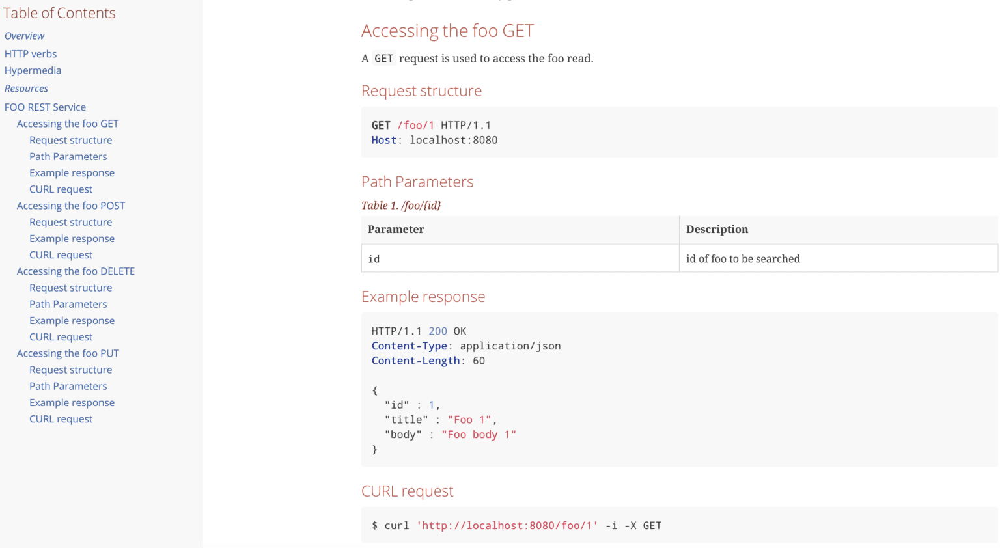

# [Spring REST 文档与 OpenAPI](https://www.baeldung.com/spring-rest-docs-vs-openapi)

1. 概述

    [Spring REST Docs](https://docs.spring.io/spring-restdocs/docs/2.0.2.RELEASE/reference/html5/#introduction) 和 OpenAPI 3.0 是为 REST API 创建 API 文档的两种方法。

    在本教程中，我们将探讨它们的相对优缺点。

2. 起源简介

    Spring REST Docs 是 Spring 社区开发的一个框架，旨在为 RESTful API 创建准确的文档。它采用测试驱动的方法，将文档编写为 Spring MVC 测试、Spring Webflux 的 WebTestClient 或 REST-Assured。

    运行测试的输出结果被创建为 [AsciiDoc](http://asciidoc.org/) 文件，这些文件可以用 [Asciidoctor](https://asciidoctor.org/) 组合在一起，生成描述 API 的 HTML 页面。由于采用了 TDD 方法，Spring REST Docs 自动带来了它的所有优点，如减少代码错误、减少返工和加快反馈周期等等。

    另一方面，[OpenAPI](https://www.baeldung.com/spring-rest-openapi-documentation) 是诞生于 Swagger 2.0 的规范。截至本文撰写之时，其最新版本为 3.0，并有许多已知的[实现](https://github.com/OAI/OpenAPI-Specification/blob/master/IMPLEMENTATIONS.md)。

    与其他规范一样，OpenAPI 也为其实现制定了一些基本规则。简而言之，所有 OpenAPI 实现都应该以 JSON 对象（JSON 或 YAML 格式）生成文档。

    此外，还有[许多工具](https://github.com/OAI/OpenAPI-Specification/blob/master/IMPLEMENTATIONS.md#user-interfaces)可以接收 JSON/YAML，并输出用户界面来可视化和导航 API。例如，这在验收测试时非常有用。在这里的代码示例中，我们将使用 [Springdoc](https://springdoc.org/) - 一个用于 OpenAPI 3 和 Spring Boot 的库。

    在详细了解这两个库之前，让我们快速设置一个要记录的 API。

3. REST API

    让我们使用 Spring Boot 创建一个基本的 CRUD API。

    1. 资源库

        在这里，我们要使用的存储库是一个简易的 PagingAndSortingRepository 接口，其模型为 Foo：

        ```java
        @Repository
        public interface FooRepository extends PagingAndSortingRepository<Foo, Long>{}

        @Entity
        public class Foo {
            @Id
            @GeneratedValue(strategy = GenerationType.IDENTITY)
            private long id;
            
            @Column(nullable = false)
            private String title;
        
            @Column()
            private String body;

            // constructor, getters and setters
        }
        ```

        我们还将使用 schema.sql 和 data.sql [加载存储库](https://www.baeldung.com/spring-boot-data-sql-and-schema-sql)。

    2. 控制器

        接下来，让我们来看看控制器，为简洁起见，跳过其实现细节：

        ```java
        @RestController
        @RequestMapping("/foo")
        public class FooController {}
        ```

    3. 应用程序

        最后是启动应用程序：

        ```java
        @SpringBootApplication()
        public class Application {
            public static void main(String[] args) {
                SpringApplication.run(Application.class, args);
            }
        }
        ```

4. OpenAPI / Springdoc

    现在让我们看看 Springdoc 如何为我们的 Foo REST API 添加文档。

    请记住，它会生成一个 JSON 对象，并根据该对象生成 API 的 UI 可视化。

    1. 基本用户界面

        首先，我们只需添加几个 Maven 依赖项--用于生成 JSON 的 springdoc-openapi-data-rest，以及用于渲染 UI 的 springdoc-openapi-ui。

        该工具将反省我们的 API 代码，并读取控制器方法的注解。在此基础上，它将生成 API JSON，并发布在 <http://localhost:8080/api-docs/> 上。它还将在 <http://localhost:8080/swagger-ui-custom.html> 上提供基本的用户界面。

        正如我们所看到的，在不添加任何代码的情况下，我们获得了一个漂亮的可视化 API，甚至包括 Foo 模式。使用 "Try it out" 按钮，我们甚至可以执行操作并查看结果。

        现在，如果我们想为 API 添加一些真正的文档怎么办？关于 API 的所有内容、所有操作的含义、输入内容以及预期响应？

        我们将在下一节讨论这个问题。

    2. 详细的用户界面

        让我们先看看如何为应用程序接口添加总体描述。

        为此，我们将在 Boot 应用程序中添加一个 OpenAPI Bean：

        ```java
        @Bean
        public OpenAPI customOpenAPI(@Value("${springdoc.version}") String appVersion) {
            return new OpenAPI().info(new Info()
            .title("Foobar API")
            .version(appVersion)
            .description("This is a sample Foobar server created using springdocs - " + 
                "a library for OpenAPI 3 with spring boot.")
            .termsOfService("http://swagger.io/terms/")
            .license(new License().name("Apache 2.0")
            .url("http://springdoc.org")));
        }
        ```

        接下来，为了给我们的 API 操作添加一些信息，我们将用一些 OpenAPI 特有的注解来装饰我们的映射。

        让我们看看如何描述 getFooById。我们将在另一个控制器 FooBarController 中完成这项工作，它与我们的 FooController 类似：

        ```java
        @RestController
        @RequestMapping("/foobar")
        @Tag(name = "foobar", description = "the foobar API with documentation annotations")
        public class FooBarController {
            @Autowired
            FooRepository repository;

            @Operation(summary = "Get a foo by foo id")
            @ApiResponses(value = {
            @ApiResponse(responseCode = "200", description = "found the foo", content = { 
                @Content(mediaType = "application/json", schema = @Schema(implementation = Foo.class))}),
            @ApiResponse(responseCode = "400", description = "Invalid id supplied", content = @Content), 
            @ApiResponse(responseCode = "404", description = "Foo not found", content = @Content) })
            @GetMapping(value = "{id}")
            public ResponseEntity getFooById(@Parameter(description = "id of foo to be searched") 
            @PathVariable("id") String id) {
                // implementation omitted for brevity
            }
            // other mappings, similarly annotated with @Operation and @ApiResponses
        }
        ```

        有了这些最基本的配置，我们 API 的用户现在就可以看到它的内容、使用方法和预期结果了。我们所要做的就是编译代码并运行 Boot App。

5. Spring REST 文档

    REST 文档是一种完全不同的 API 文档。如前所述，其过程是测试驱动的，输出是静态 HTML 页面的形式。

    在我们的示例中，我们将使用 [Spring MVC 测试](https://www.baeldung.com/integration-testing-in-spring)来创建文档片段。

    首先，我们需要在 pom 中添加 [spring-restdocs-mockmvc](https://mvnrepository.com/artifact/org.springframework.restdocs/spring-restdocs-mockmvc) 依赖项和 [asciidoc Maven](https://www.baeldung.com/spring-rest-docs#asciidocs) 插件。

    1. JUnit5 测试

        现在让我们看看包含文档的 JUnit5 测试：

        ```java
        @ExtendWith({ RestDocumentationExtension.class, SpringExtension.class })
        @SpringBootTest(classes = Application.class)
        public class SpringRestDocsIntegrationTest {
            private MockMvc mockMvc;
            
            @Autowired
            private ObjectMapper objectMapper;

            @BeforeEach
            public void setup(WebApplicationContext webApplicationContext, 
            RestDocumentationContextProvider restDocumentation) {
                this.mockMvc = MockMvcBuilders.webAppContextSetup(webApplicationContext)
                .apply(documentationConfiguration(restDocumentation))
                .build();
            }

            @Test
            public void whenGetFooById_thenSuccessful() throws Exception {
                ConstraintDescriptions desc = new ConstraintDescriptions(Foo.class);
                this.mockMvc.perform(get("/foo/{id}", 1))
                .andExpect(status().isOk())
                .andDo(document("getAFoo", preprocessRequest(prettyPrint()), 
                    preprocessResponse(prettyPrint()), 
                    pathParameters(parameterWithName("id").description("id of foo to be searched")),
                    responseFields(fieldWithPath("id")
                    .description("The id of the foo" + 
                        collectionToDelimitedString(desc.descriptionsForProperty("id"), ". ")),
                    fieldWithPath("title").description("The title of the foo"), 
                    fieldWithPath("body").description("The body of the foo"))));
            }

            // more test methods to cover other mappings
        ```

        运行此测试后，我们会在 target/generated-snippets 目录中获得几个文件，其中包含给定 API 操作的相关信息。特别是，当 GetFooById_thenSuccessful 成功时，我们将在该目录下的 getAFoo 文件夹中获得 8 个 adocs。

        下面是一个 http-response.adoc 示例，当然其中包含了响应正文：

        ```adoc
        [source,http,options="nowrap"]
        ----
        HTTP/1.1 200 OK
        Content-Type: application/json
        Content-Length: 60

        {
        "id" : 1,
        "title" : "Foo 1",
        "body" : "Foo body 1"
        }
        ----
        ```

    2. fooapi.adoc

        现在，我们需要一个主文件，将所有这些片段编织在一起，形成一个结构良好的 HTML。

        让我们称它为 fooapi.adoc，并查看其中的一小部分：

        ```adoc
        === Accessing the foo GET
        A `GET` request is used to access the foo read.

        ==== Request structure
        include::{snippets}/getAFoo/http-request.adoc[]

        ==== Path Parameters
        include::{snippets}/getAFoo/path-parameters.adoc[]

        ==== Example response
        include::{snippets}/getAFoo/http-response.adoc[]

        ==== CURL request
        include::{snippets}/getAFoo/curl-request.adoc[]
        ```

        执行 asciidoctor-maven-plugin 之后，我们就能在 target/generated-docs 文件夹中得到最终的 HTML 文件 fooapi.html。

        这就是它在浏览器中打开时的样子：

        

6. 主要收获

    既然我们已经了解了这两种实现方式，让我们来总结一下它们的优缺点。

    使用 springdoc 时，我们不得不使用注释，这使得休息控制器的代码变得杂乱无章，降低了可读性。此外，文档与代码紧密相连，并将进入生产过程。

    毋庸置疑，维护文档是另一个挑战--如果 API 中的某些内容发生了变化，程序员是否会始终记得更新相应的 OpenAPI 注释？

    另一方面，REST Docs 既不像其他用户界面那样引人注目，也不能用于验收测试。但它也有自己的优势。

    值得注意的是，Spring MVC 测试的成功完成不仅为我们提供了测试片段，还像其他单元测试一样验证了我们的 API。这就迫使我们根据 API 的修改（如果有的话）对文档进行相应的修改。此外，文档代码与实现是完全分离的。

    但是，从另一方面来说，我们也不得不编写更多的代码来生成文档。首先是测试本身，它可以说与 OpenAPI 注释一样冗长；其次是主 adoc。

    生成最终的 HTML 还需要更多步骤--先运行测试，然后再运行插件。 而 Springdoc 只要求我们运行启动应用程序。

7. 总结

    在本教程中，我们了解了基于 OpenAPI 的 springdoc 和 Spring REST Docs 之间的区别。我们还了解了如何实现这两种文档，以便为基本的 CRUD API 生成文档。

    总之，二者各有利弊，使用其中一种还是另一种取决于我们的具体需求。
