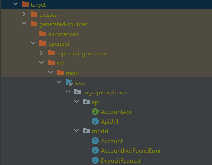

# [使用 Spring Boot 和 OpenAPI 3.0 进行 API 优先开发](https://www.baeldung.com/spring-boot-openapi-api-first-development)

1. 简介

    软件工程行业越来越依赖网络 API。[云计算](https://www.baeldung.com/cs/cloud-computing-saas-vs-paas-vs-iaas)和 [HTTP](https://www.baeldung.com/cs/http-versions) 的使用越来越多可能就是这个原因。

    软件开发团队必须确保设计出有用且用户友好的 API。传统开发方法面临的主要挑战是，在设计 API 合约和实现新产品业务逻辑的同时，如何保持敏捷性。

    在本文中，我们将介绍使用 Spring Boot 和 Open API Specification 3.0 进行的 API 优先开发（API-First Development）。这种方法通过及时的 API 设计反馈、快速失败流程和并行工作来提高团队的沟通和敏捷性。

2. 什么是开放式 API 规范

    OpenAPI Specification ([OAS](https://www.openapis.org/)) 规范了如何创建 API 设计文档。使用 OAS 的 API 优先方法的典型工作流程如下：

    - 团队创建设计文档，并与相关人员共享，以获得反馈和迭代更改。
    - 当团队和利益相关者就应用程序接口设计达成一致意见时，开发人员使用文档生成工具生成服务器端骨架代码。
    - 最后，开发人员开始使用之前生成的代码编写应用程序接口的业务逻辑。

    [OAS 3.1](https://spec.openapis.org/oas/v3.1.0) 允许指定 HTTP 资源、动词、响应代码、数据模型、媒体类型、安全方案和其他 API 组件。

3. 为什么使用 API 优先开发

    [敏捷开发](https://www.baeldung.com/cs/agile-programming)是软件行业最常用的方法之一。敏捷意味着尽可能快地构建小的东西，要么快速失败并改变初始设计，要么继续前进，逐步增加小的改动。

    从敏捷团队的角度来看，API 优先开发有以下几个优势：

    - 提供一种快速反馈 API 设计的方法。
    - 为达成 API 合同协议创建单一的沟通渠道。
    - 允许参与 API 设计的人员并行工作。

    为了充分了解 API 优先方法的优势，我们将比较两个敏捷团队的工作流程方案。第一个团队使用传统方法，而第二个团队使用 API 优先开发方法：

    

    在传统方案中，开发人员被指派构建一个新的产品功能。通常情况下，该开发人员在创建新功能时会先实现业务逻辑，然后将该逻辑与代码内的 API 设计连接起来。因此，只有当开发人员完成该功能的所有代码修改后，API 才能供利益相关者审查。因此，在 API 合同审查和协议方面会出现缓慢和沟通不畅的情况。

    在 API 优先开发阶段，设计人员会在业务逻辑开发阶段之前创建 API 合同文档。该文档为产品利益相关者提供了一种共同语言，用于评估构建工作、提供及时反馈、创建测试用例、记录 API 等。这样，我们就可以在浪费时间开发应用程序之前，通过改变初始设计或继续进行设计来提高敏捷性。

    使用 "应用程序接口优先开发" 的另一个原因是，例如，在创建文档后，多人可以并行处理同一产品功能：

    - 产品经理会评估风险、创建新功能并管理时间。
    - 质量保证分析师构建测试方案。
    - 技术撰稿人记录应用程序接口。
    - 开发人员执行业务逻辑代码。

4. 定义 API 合同

    我们将使用银行演示 REST API 来说明 API 优先方法的工作流程。该 API 允许两种操作：获取余额和存款金额。下表显示了这些操作的资源路径、HTTP verb 和响应代码 (RC)：

    | | HTTP verb      | Resource | Error RCs        | Successful RC’s         |
    |----------------|----------|------------------|-------------------------|----------------------------------|
    | get balance    | GET      | /account         | 404 – Account not found | 200 – Get balance information    |
    | deposit amount | POST     | /account/deposit | 404 – Account not found | 204 – Deposit operation complete |

    现在，我们可以创建 OAS API 规范文件。我们将使用 [Swagger 在线编辑器](https://editor.swagger.io/)，这是一种将 YAML 解释为 Swagger 文档的在线解决方案。

    1. API 的顶层上下文

        让我们从定义 API 的顶层上下文开始。为此，请转到 Swagger 编辑器，用以下 YAML 代码替换编辑器左侧的内容：

        ```yml
        openapi: 3.0.3
        info:
          title: Banking API Specification for account operations
          description: |-
            A simple banking API that allows two operations:
            - get account balance given account number
            - deposit amount to a account 
          version: 1.0-SNAPSHOT
        servers:
          - url: https://testenvironment.org/api/v1
          - url: https://prodenvironment.org/api/v1
        tags:
          - name: accounts
            description: Operations between bank accounts
        ```

        注意：现在不要在意这些错误。它们不会阻碍我们的工作流程，并会随着我们进入下一部分而逐渐消失。

        让我们逐个检查每个关键字：

        - openapi - 使用的 OAS 版本。
        - title - API 的简短标题。
        - description - API 职责描述。
        - version - API 的当前版本，例如 1.0-SNAPSHOT。
        - servers - 客户端可以访问 API 的可用机器。
        - tags - 用于将 API 操作分组的一组唯一标签。

    2. 公开 API 路径

        现在，让我们创建前面所述的 GET /account 和 POST /account/deposit API 端点。为此，请在 YAML 编辑器的根级别添加以下内容：

        ```yml
        paths:
          /account:
            get:
              tags:
                - accounts
              summary: Get account information
              description: Get account information using account number
              operationId: getAccount
              responses:
                200:
                  description: Success
                  content:
                    application/json:
                      schema:
                        $ref: '#/components/schemas/Account'
                404:
                  description: Account not found
                  content:
                    application/json:
                      schema:
                        $ref: '#/components/schemas/AccountNotFoundError'
          /account/deposit:
            post:
              tags:
                - accounts
              summary: Deposit amount to account
              description: Initiates a deposit operation of a desired amount to the account specified 
              operationId: depositToAccount
              requestBody:
                description: Account number and desired amount to deposit
                content:
                  application/json:
                    schema:
                      $ref: '#/components/schemas/DepositRequest'
                required: true
              responses:
                204:
                  description: Success
                404:
                  description: Account not found
                  content:
                    application/json:
                      schema:
                        $ref: '#/components/schemas/AccountNotFoundError'
        ```

        注意：同样，YAML 解释器会显示一些错误，我们将在第 4.3 节中讨论。现在，我们可以忽略它们。

        上面的文档中有很多内容。让我们逐个查看每个关键字，将其分解成若干部分：

        - paths - 定义 API 资源/account 和 /account/deposit。在资源下，我们必须定义可用的 get 和 post 动词。
        - tags - 它所属的组。应与第 4.1 节中描述的标签名称相同。
        - summary - 有关端点功能的简要信息。
        - description - 有关端点如何工作的更详细信息。
        - operationId - 所描述操作的唯一标识符。
        - requestBody - 包含描述、内容和必要关键字的请求有效载荷。我们将在第 4.3 节中定义内容模式。
        - responses - 所有可用响应代码的列表。每个响应代码对象都包含描述和内容关键字。我们将在第 4.3 节中定义该内容模式。
        - content: 信息的 HTTP 内容类型。

    3. 定义数据模型组件

        最后，让我们创建 API 的数据模型对象：请求体、响应体和错误信息。为此，请在 YAML 编辑器的根级添加以下结构：

        ```yml
        components:
          schemas:
            Account:
              type: object
              properties:
                balance:
                  type: number
            AccountNotFoundError:
              type: object
              properties:
                message:
                  type: string
            DepositRequest:
              type: object
              properties:
                accountNumber:
                  type: string
                depositAmount:
                  type: number
        ```

        添加上述内容后，编辑器中的所有解释错误都应该消失了。

        在上述 YAML 代码中，我们定义了与第 4.2 节中模式关键字相同的组件。我们可以随意重复使用一个组件。例如，在两个端点的 404 响应代码中都使用了 AccountNotFoundError 对象。让我们逐一检查代码中的关键字：

        - components - 组件的根级关键字。
        - schemas - 所有对象定义的列表。
        - type - 字段的类型。如果使用对象类型，还必须定义 properties 关键字。
        - properties - 所有对象字段名及其类型的列表。

    4. 查看 API 文档

        至此，API 就可以在网上供产品的利益相关者审阅了。我们知道，"API 优先开发" 的主要优势在于可以快速失败或成功，而不会在开发阶段浪费时间。因此，在进入开发阶段之前，要确保每个人都对提议的 API 资源、响应代码、数据模型以及 API 的描述和职责进行审核和协作。

        一旦团队就设计达成一致，他们就可以并行地开发 API。

5. 导入 Spring Boot 应用程序

    本节展示了开发人员如何将 YAML 文档导入应用程序并自动生成 API 骨架代码。首先，我们必须在 /src/main/resources 文件夹中创建一个名为 account_api_description.yaml 的空 YAML 文件。然后，在 Swagger 在线编辑器中将 account_api_description.yaml 的内容替换为完整的 YAML 代码。最后，我们必须在 Spring Boot Application pom.xml 文件的 `<plugins>` 标记中添加 openapi-generator-maven-plugin 插件：

    ```xml
    <plugin>
        <groupId>org.openapitools</groupId>
        <artifactId>openapi-generator-maven-plugin</artifactId>
        <version>6.2.1</version>
        <executions>
            <execution>
                <goals>
                    <goal>generate</goal>
                </goals>
                <configuration>
                    <skipValidateSpec>true</skipValidateSpec>
                    <inputSpec>./src/main/resources/account_api_description.yaml</inputSpec>
                    <generatorName>spring</generatorName>
                    <configOptions>
                        <openApiNullable>false</openApiNullable>
                        <interfaceOnly>true</interfaceOnly>
                    </configOptions>
                </configuration>
            </execution>
        </executions>
    </plugin>
    ```

    您可以在 OpenAPI 插件[教程](https://www.baeldung.com/java-openapi-generator-server)中找到此处使用的代码。

    现在，让我们运行以下命令，从 YAML 文件生成服务器端代码：

    `mvn clean install`

    之后，我们可以在目标文件夹中查看以下生成的代码：

    

    开发人员可以将生成的类作为开发阶段的起点。例如，我们可以使用下面的 AccountController 类实现 AccountApi 接口：

    

    重载方法 depositToAccount 和 getAccount 分别对应 POST /account/deposit 和 GET /account endpoints/。

6. 结论

    在本文中，我们了解了如何使用 Spring-Boot 和 OAS 进行 API 优先开发。我们还了解了 API 优先的好处，以及它如何帮助现代敏捷软件开发团队。使用 API-First 的最重要原因是提高了敏捷性，减少了创建 API 时浪费的开发时间。使用这种方法，我们可以更快地起草、迭代更改和反馈设计。

    使用 API 优先方法的另一个很好的理由是，利益相关者不需要依赖开发人员完成代码才能开始工作。在创建初始 API 设计文档后，质量保证人员、编写人员、管理人员和开发人员可以并行工作。
