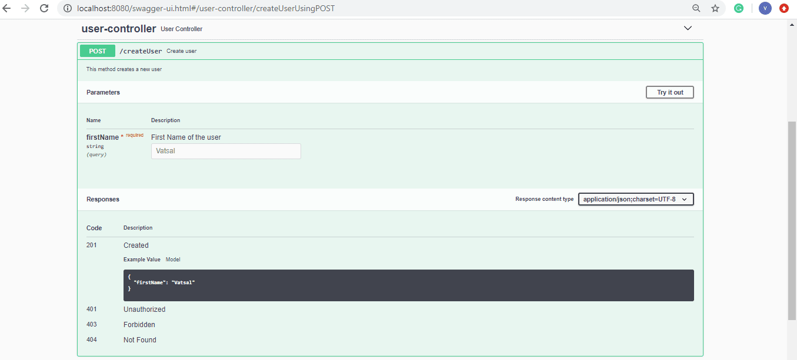
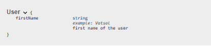

# [Swagger @ApiParam 与 @ApiModelProperty 的比较](https://www.baeldung.com/swagger-apiparam-vs-apimodelproperty)

1. 概述

    在本教程中，我们将简要介绍 Swagger 的 [@ApiParam](https://docs.swagger.io/swagger-core/v1.5.0/apidocs/io/swagger/annotations/ApiParam.html) 和 [@ApiModelProperty](https://docs.swagger.io/swagger-core/v1.5.0/apidocs/io/swagger/annotations/ApiModelProperty.html) 注解。此外，我们还将比较这些注解，并确定每种注解的正确用法。

2. 关键区别

    简单地说，@ApiParam 和 @ApiModelProperty 注解为 Swagger 添加了不同的元数据。@ApiParam 注解用于 API 资源请求的参数，而 @ApiModelProperty 则用于模型的属性。

3. @ApiParam

    @ApiParam 注解仅用于 [JAX-RS 1.x/2.x](https://www.baeldung.com/jersey-request-parameters) 参数注解，如 @PathParam、@QueryParam、@HeaderParam、@FormParam 和 @BeanParam。虽然 swagger-core 默认扫描这些注解，但我们可以使用 @ApiParam 来添加有关参数的更多细节，或在从代码中读取参数时更改参数值。

    @ApiParam 注解有助于指定参数的名称、类型、描述（值）和示例值。此外，我们还可以指定该参数是必填参数还是可选参数。

    让我们来看看它的用法：

    ```java
    @RequestMapping(
        method = RequestMethod.POST,
        value = "/createUser",
        produces = "application/json; charset=UTF-8")
    @ResponseStatus(HttpStatus.CREATED)
    @ResponseBody
    @ApiOperation(value = "Create user",
    notes = "This method creates a new user")
    public User createUser(
    @ApiParam(
        name =  "firstName",
        type = "String",
        value = "First Name of the user",
        example = "Vatsal",
        required = true)
    @RequestParam String firstName) {
        User user = new User(firstName);
        return user;
    }
    ```

    让我们看看 @ApiParam 示例的 Swagger UI 表示法：

    

    现在，让我们来看看 @ApiModelProperty。

4. @ApiModelProperty

    @ApiModelProperty 注解允许我们控制特定于 Swagger 的定义，如模型属性的描述（值）、名称、数据类型、示例值和允许值。

    此外，它还提供了额外的过滤属性，以防我们想在某些情况下隐藏属性。

    让我们为用户的 firstName 字段添加几个模型属性：

    ```java
    @ApiModelProperty(
    value = "first name of the user",
    name = "firstName",
    dataType = "String",
    example = "Vatsal")
    String firstName;
    ```

    现在，让我们看看 Swagger UI 中用户模型的规范：

    

5. 结论

    在这篇短文中，我们介绍了两种 Swagger 注释，可以用来为参数和模型属性添加元数据。然后，我们看了一些使用这些注解的示例代码，并了解了它们在 Swagger UI 中的表现形式。
