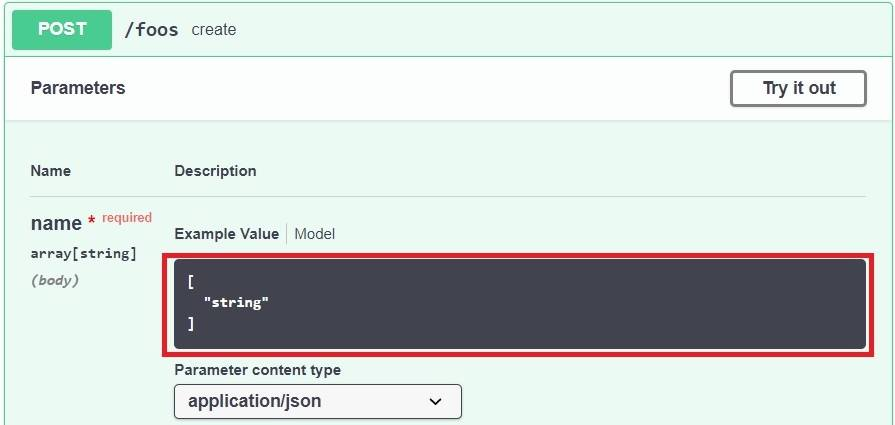
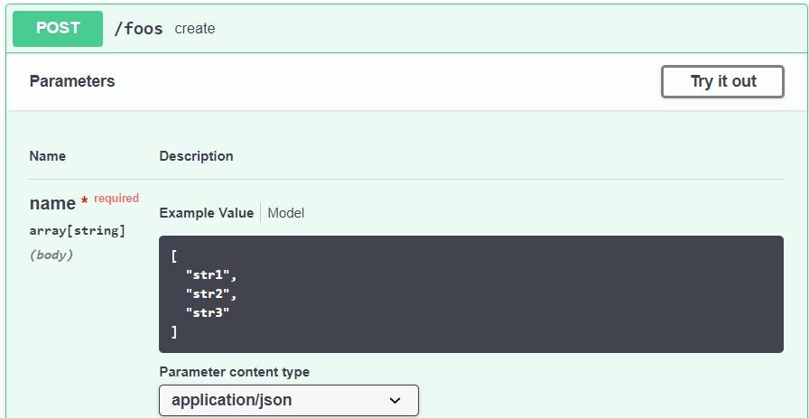

# [在 Swagger 中指定字符串数组作为正文参数](https://www.baeldung.com/swagger-body-array-of-strings)

1. 概述

    Swagger 是一套用于记录和描述 REST API 的规范。它还为端点参数提供了示例值。

    在本教程中，我们将展示如何为字符串数组生成默认示例值，因为默认情况下并未启用此行为。

2. 在 Swagger 中指定字符串数组作为正文参数

    当我们想在 Swagger 中将字符串数组指定为正文参数时，问题就出现了。

    正如我们在 Swagger 编辑器中看到的，Swagger 的默认示例值有点不透明：

    

    因此，在这里我们看到 Swagger 并没有显示数组内容应该是什么样子的示例。让我们看看如何添加一个。

3. YAML

    首先，我们使用 YAML 符号在 Swagger 中指定字符串数组。在模式部分，我们包含了类型：数组和字符串项。

    为了更好地记录 API 和指导用户，我们可以使用示例标签来说明如何插入值：

    ```yml
    parameters:
    - in: body
        description: ""
        required: true
        name: name
        schema:
        type: array
        items:
            type: string
        example: ["str1", "str2", "str3"]
    ```

    让我们看看现在我们的显示内容如何更加丰富：

    

4. Springdoc

    我们也可以使用 [Springdoc](https://springdoc.org/) 实现同样的结果。

    我们需要使用类型：数组，并在数据模型中使用 @Schema 注解示例：

    ```java
    @Schema
    public class Foo {
        private long id;
        @Schema(name = "name", type = "array", example = "[\"str1\", \"str2\", \"str3\"]")
        private List<String> name;
    ```

    之后，我们还需要注释 Controller，让 Swagger 指向数据模型。

    因此，让我们使用 @Parameters 来实现这一点：

    ```java
    @RequestMapping(method = RequestMethod.POST, value = "/foos")
    @ResponseStatus(HttpStatus.CREATED)
    @ResponseBody
    @Parameters({ @Parameter(name = "foo", description = "List of strings") })
    public Foo create(@RequestBody final Foo foo) {}
    ```

    就是这样！

5. 总结

    在记录 REST API 时，我们可能会遇到字符串数组参数。理想情况下，我们会用示例值（Example Values）来记录这些参数。

    我们可以在 Swagger 中使用 example 属性来做到这一点。或者，我们也可以使用 Springdoc 中的示例注解属性。
