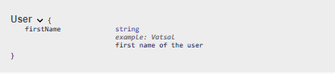

# [Swagger @Parameter vs @Schema](https://www.baeldung.com/swagger-parameter-vs-schema)

1. 概述

    在本教程中，我们将简要介绍 Swagger 的 [@Parameter](https://javadoc.io/static/io.swagger.core.v3/swagger-annotations/2.2.12/io/swagger/v3/oas/annotations/Parameter.html) 和 [@Schema](https://javadoc.io/static/io.swagger.core.v3/swagger-annotations/2.2.12/io/swagger/v3/oas/annotations/media/Schema.html) 注解。此外，我们还将比较这些注解，并确定每种注解的正确用法。

2. 关键区别

    简单地说，@Parameter 和 @Schema 注解为 Swagger 添加了不同的元数据。@Parameter 注解用于 API 资源请求的参数，而 @Schema 则用于模型的属性。

3. 参数

    @Parameter 注解用于在操作或路径的参数部分定义参数。@Parameter 注解有助于指定参数的名称、描述和示例值。此外，我们还可以指定该参数是必需的还是可选的。

    让我们来看看它的用法：

    ```java
    @RequestMapping(
        method = RequestMethod.POST,
        value = "/createUser",
        produces = "application/json; charset=UTF-8")
    @ResponseStatus(HttpStatus.CREATED)
    @ResponseBody
    @Operation(summary  = "Create user",
        description = "This method creates a new user")
    public User createUser(@Parameter(
                    name =  "firstName",
                    description  = "First Name of the user",
                    example = "Vatsal",
                    required = true) 
        @RequestParam String firstName) {
        User user = new User(firstName);
        return user;
    }
    ```

    让我们看看 @Parameter 示例的 Swagger UI 表示法。

    现在，让我们来看看 @Schema。

4. @Schema

    @Schema 注解允许我们控制特定于 Swagger 的定义，如模型属性的描述、名称、类型、示例值和允许值。

    此外，它还提供了额外的过滤属性，以防我们想在某些情况下隐藏属性。

    让我们为用户的 firstName 字段添加几个模型属性：

    ```java
    @Schema(
        description = "first name of the user",
        name = "firstName",
        type = "string",
        example = "Vatsal")
    String firstName;
    ```

    现在，让我们看看 Swagger UI 中的用户模型规范：

    

5. 结论

    在这篇短文中，我们介绍了两种 Swagger 注释，可以用来为参数和模型属性添加元数据。然后，我们看了一些使用这些注解的示例代码，并了解了它们在 Swagger UI 中的表现形式。
