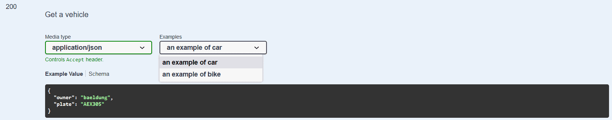
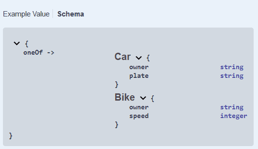
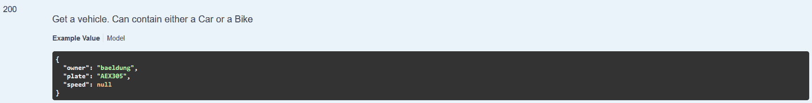
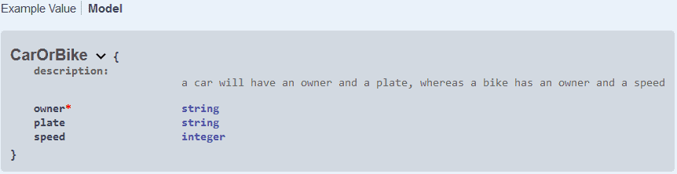

# [Swagger： 使用相同的响应代码指定两个响应](https://www.baeldung.com/swagger-two-responses-one-response-code)

1. 概述

    在本文中，我们将编写一个 API 规范，允许为相同的响应代码返回两个不同的对象。我们将演示如何使用该规范生成 Java 代码和 Swagger 文档。

2. 问题的提出

    让我们定义两个对象。汽车的属性是车主和车牌，都是字符串。另一方面，自行车有车主和速度。速度是一个整数。

    使用 OpenAPI，这些定义对应于以下描述：

    ```yml
    Car:
    type: object
    properties:
        owner:
        type: string
        plate:
        type: string
    Bike:
    type: object
    properties:
        owner:
        type: string
        speed:
        type: integer
    ```

    我们要描述的端点/车辆将接受 GET 请求，并能返回汽车或自行车。也就是说，我们要完成以下描述符：

    ```yml
    paths:
    /vehicle:
        get:
        responses:
            '200':
            # return Car or Bike
    ```

    我们将讨论 OpenAPI 2 和 3 规范的这一主题。

3. 使用 OpenAPI 3 获得两种不同的响应

    OpenAPI 版本 3 引入了 oneOf，这正是我们所需要的。

    1. 创建描述符文件

        在 OpenAPI 3 规范中，oneOf 期望得到一个对象数组，并表示所提供的值应与给定对象之一完全匹配：

        ```yml
        schema:
        oneOf:
            - $ref: '#/components/schemas/Car'
            - $ref: '#/components/schemas/Bike'
        ```

        此外，OpenAPI 3 引入了展示各种响应示例的可能性。为了清晰起见，我们肯定希望至少提供一个汽车响应示例和一个自行车响应示例：

        ```yml
        examples:
        car:
            summary: an example of car
            value:
            owner: baeldung
            plate: AEX305
        bike:
            summary: an example of bike
            value:
            owner: john doe
            speed: 25
        ```

        最后，让我们来看看整个描述符文件：

        

    2. 生成 Java 类

        现在，我们将使用 YAML 文件来生成 API 接口。两个 maven 插件：[swagger-codegen 和 openapi-generator](https://www.baeldung.com/spring-boot-rest-client-swagger-codegen) 可用于从 api.yaml 文件生成 Java 代码。从 6.0.1 版开始，openapi-generator 无法处理 oneOf，因此本文将继续使用 swagger-codegen。

        我们将为 swagger-codegen 插件使用以下配置：

        ```xml
        <plugin>
            <groupId>io.swagger.codegen.v3</groupId>
            <artifactId>swagger-codegen-maven-plugin</artifactId>
            <version>3.0.52</version>
            <executions>
                <execution>
                    <goals>
                        <goal>generate</goal>
                    </goals>
                    <configuration>
                        <inputSpec>${project.basedir}/src/main/resources/static/api.yaml</inputSpec>
                        <language>spring</language>
                        <configOptions>
                            <java8>true</java8>
                            <interfaceOnly>true</interfaceOnly>
                        </configOptions>
                    </configuration>
                </execution>
            </executions>
        </plugin>
        ```

        请注意，我们决定切换只生成接口的选项，以避免生成大量我们不太感兴趣的文件。

        现在让我们执行该插件：

        `mvn clean compile`

        现在我们可以看看生成的文件：

        - 生成了汽车和自行车对象
        - 由于使用了 [@JsonSubTypes](https://www.baeldung.com/jackson-annotations) 注解，生成了 OneOfinlineResponse200 接口来表示可以是汽车或自行车的对象
        - InlineResponse200 是 OneOfinlineResponse200 的基本实现
        - VehicleApi 定义了端点：对该端点的获取请求会返回一个 InlineResponse200

    3. 生成 Swagger UI 文档

        要根据 YAML 描述文件生成 Swagger UI 文档，我们将使用 springdoc-openapi。让我们在 pom.xml 中添加 Springdoc-openapi-ui 的依赖关系：

        ```xml
        <dependency>
            <groupId>org.springdoc</groupId>
            <artifactId>springdoc-openapi-ui</artifactId>
            <version>1.6.10</version>
        </dependency
        ```

        1.6.10 版的 springdoc-openapi-ui 依赖于 4.13.2 版的 swagger-ui，后者可正确处理 oneOf 和各种响应示例。

        要从 YAML 文件生成 Swagger UI 文档，我们需要声明一个 [SpringBootApplication](https://www.baeldung.com/spring-boot-start) 并添加以下三个Bean：

        ```java
        @Bean
        SpringDocConfiguration springDocConfiguration() {
            return new SpringDocConfiguration();
        }

        @Bean
        SpringDocConfigProperties springDocConfigProperties() {
            return new SpringDocConfigProperties();
        }

        @Bean
        ObjectMapperProvider objectMapperProvider(SpringDocConfigProperties springDocConfigProperties) {
            return new ObjectMapperProvider(springDocConfigProperties);
        }
        ```

        最后但并非最不重要的一点是，我们需要确保 YAML 描述符位于 resources/static 目录中，并更新 application.properties，指定我们不想从控制器生成 Swagger UI，而是从 YAML 文件生成：

        ```properties
        springdoc.api-docs.enabled=false
        springdoc.swagger-ui.url=/api.yaml
        ```

        现在我们可以启动应用程序了：

        `mvn spring-boot:run`

        Swagger UI 可通过 <http://localhost:8080/swagger-ui/index.html> 访问。

        我们可以看到有一个下拉菜单，可以在汽车和自行车示例之间切换：

        

        响应模式也已正确呈现：

        

4. 使用 OpenAPI 2 获得两个不同的响应

    在 OpenAPI 2 中，oneOf 并不存在。因此，让我们另辟蹊径。

    1. 创建描述符文件

        我们能做的最好的办法就是定义一个封装对象，它将包含汽车和自行车的所有属性。共同的属性是必需的，而只属于其中一个的属性则是可选的：

        ```yml
        CarOrBike:
        description: a car will have an owner and a plate, whereas a bike has an owner and a speed
        type: object
        required:
            - owner
        properties:
            owner:
            type: string
            plate:
            type: string
            speed:
            type: integer
        ```

        我们的 API 响应将是一个 CarOrBike 对象。我们将在描述中进一步说明。遗憾的是，我们无法添加各种示例，因此我们决定只以汽车为例。

        让我们来看看生成的 api.yaml：

        [swagger: 2.0.0](/src/main/resources/static/api_2.yaml)

    2. 生成 Java 类

        让我们调整 swagger-codegen 插件配置，以解析 OpenAPI 2 文件。为此，我们需要使用 2.x 版本的插件。它也位于另一个软件包中：

        ```xml
        <plugin>
            <groupId>io.swagger</groupId>
            <artifactId>swagger-codegen-maven-plugin</artifactId>
            <version>2.4.27</version>
            <executions>
                <execution>
                    <goals>
                        <goal>generate</goal>
                    </goals>
                    <configuration>
                        <inputSpec>${project.basedir}/src/main/resources/static/api.yaml</inputSpec>
                        <language>spring</language>
                        <configOptions>
                            <java8>true</java8>
                            <interfaceOnly>true</interfaceOnly>
                        </configOptions>
                    </configuration>
                </execution>
            </executions>
        </plugin>
        ```

        现在让我们来看看生成的文件：

        - CarOrBike 对象包含预期的字段，其所有者为 [@NotNull](https://www.baeldung.com/javax-validation)
        - VehicleApi 定义了端点：对该端点的获取请求将返回 CarOrBike

    3. 生成 Swagger UI 文档

        我们可以按照 3.3 中的方法生成文档。

        我们可以看到我们的描述已经显示出来：

        

        而我们的 CarOrBike 模型则按照预期进行了描述：

        

5. 结论

    在本教程中，我们了解了如何为可以返回一个或另一个对象的端点编写 OpenAPI 规范。我们使用 YAML 描述符生成 Java 代码，这要归功于 swagger-codegen，并使用 springdoc-openapi-ui 生成 Swagger UI 文档。
