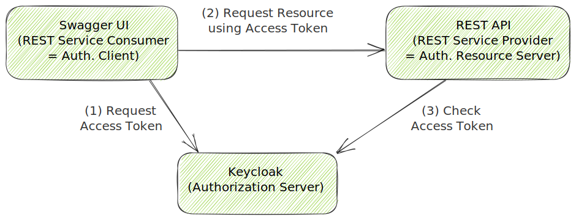
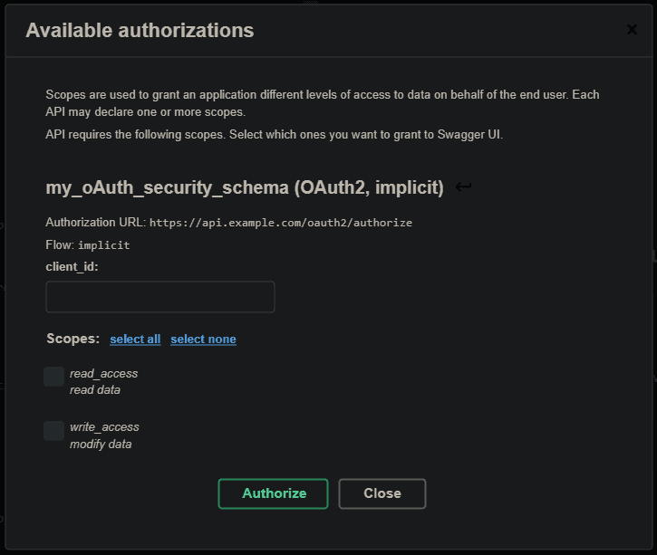
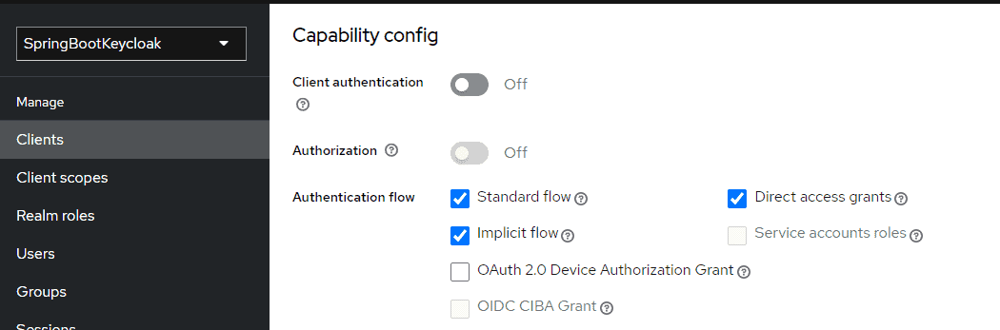
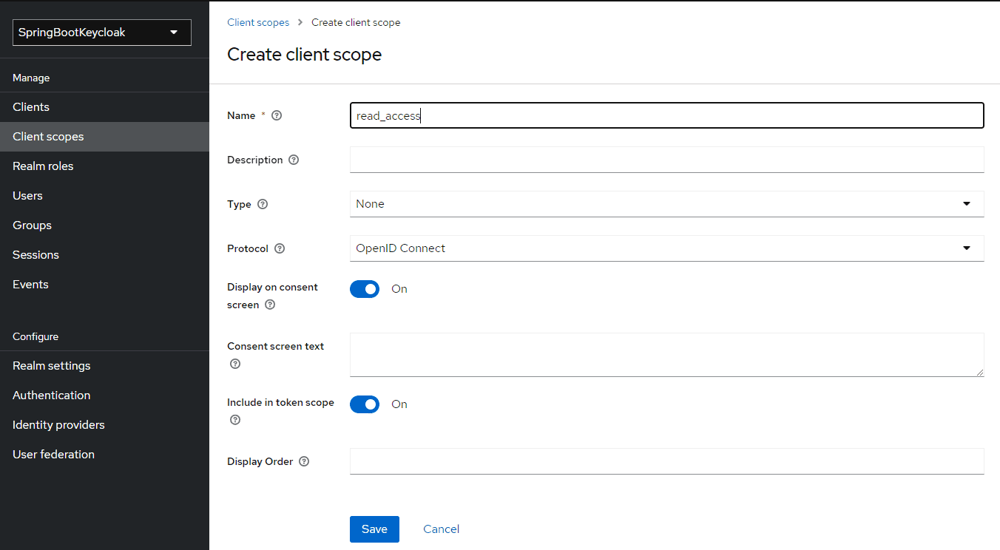
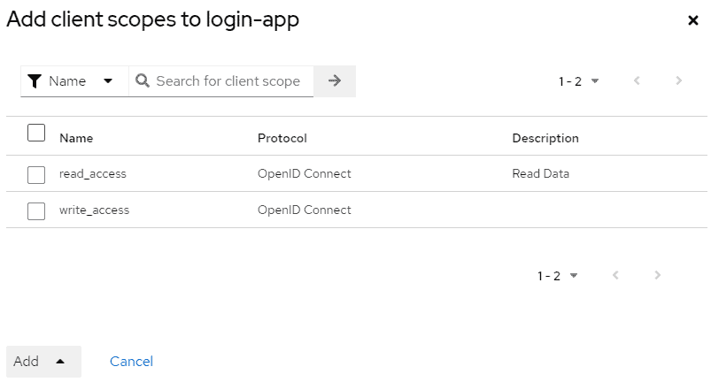
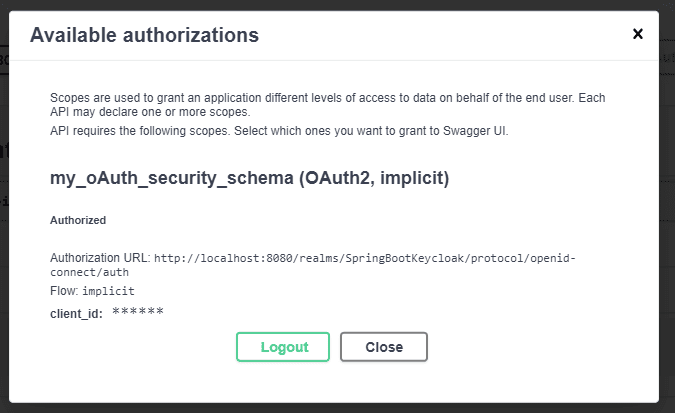
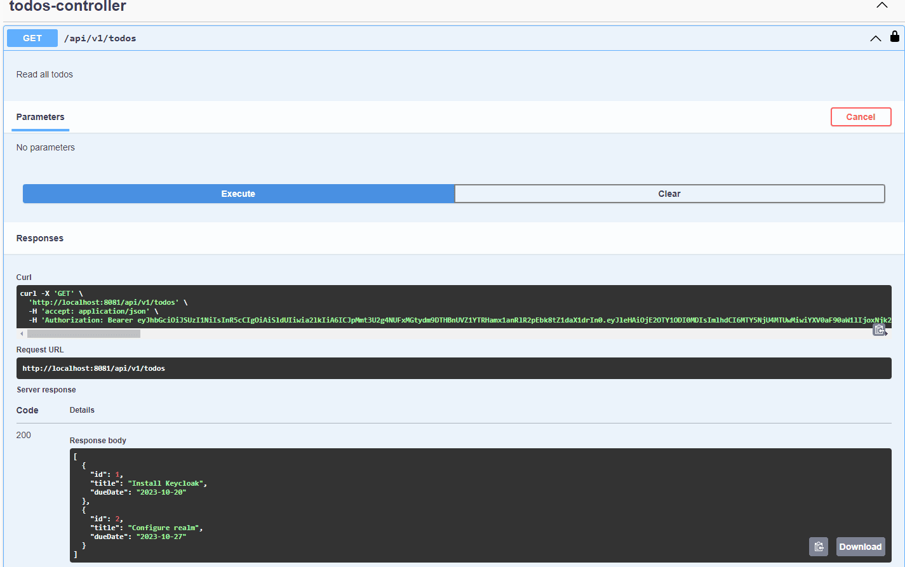

# [Keycloak 集成 - 使用 Swagger UI 的 OAuth2 和 OpenID](https://www.baeldung.com/keycloak-oauth2-openid-swagger)

1. 概述

    在本教程中，我们将重点测试使用 Keycloak 与 Swagger UI 进行身份验证和授权的安全 REST 服务。

2. 挑战

    与其他网络资源一样，REST API 通常是安全的。因此，服务消费者（如 Swagger UI）不仅需要自己处理 HTTP 调用，还需要向服务提供者提供身份验证信息。

    Keycloak 是一个 IAM 服务器，允许在服务提供商的实现之外进行身份验证和授权。它是架构的一部分，如下图所示：

    

    我们可以看到，服务提供商和服务消费者都需要联系 Keycloak 服务器。首先，我们需要安装 Keycloak 服务器，并将其作为 REST 服务提供者集成到 Spring Boot 应用程序中。然后，我们需要扩展 Swagger UI。

3. 集成 Swagger UI

    要整合 Spring-boot 和 Swagger-ui，请将该库添加到项目依赖项列表中（无需额外配置）：

    ```xml
    <dependency>
        <groupId>org.springdoc</groupId>
        <artifactId>springdoc-openapi-starter-webmvc-ui</artifactId>
        <version>2.5.0</version>
    </dependency>
    ```

4. 使用标准

    使用特定于供应商的代码扩展 Swagger UI 只适用于特殊情况。因此，我们更倾向于使用独立于供应商的标准。下文将介绍如何实现这一点。

    1. 现有标准

        首先，我们需要了解现有的标准。对于身份验证和授权，可以使用 [OAuth2](https://oauth.net/2/) 这样的协议。对于 SSO，我们可以使用 OpenID Connect（[OIDC](https://openid.net/connect/)）作为 [OAuth2 的扩展](https://developer.okta.com/blog/2019/10/21/illustrated-guide-to-oauth-and-oidc)。

        描述 REST API 的标准是 [OpenAPI](https://www.openapis.org/)。该标准包括定义多种[安全方案](https://swagger.io/docs/specification/authentication)，其中包括 OAuth2 和 OIDC：

        ```yml
        paths:
        /api/v1/products:
            get:
            ...
            security:
                - my_oAuth_security_schema:
                - read_access
        ...
        securitySchemes:
        my_oAuth_security_schema:
            type: oauth2
            flows:
            implicit:
                authorizationUrl: https://api.example.com/oauth2/authorize
                scopes:
                read_access: read data
                write_access: modify data
        ```

    2. 扩展服务提供者

        在代码优先方法中，服务提供者可以根据代码生成 OpenAPI 文档。因此，安全方案也必须以这种方式提供。例如，使用 Spring Boot（包括 SpringDoc），我们可以编写这样一个配置类：

        

        当然，使用其他技术会导致不同的实现。但我们应该始终注意必须生成的 OpenAPI。

        4.3. 扩展服务消费者

        Swagger UI 默认支持 OpenAPI 身份验证方案，无需对其进行自定义。这样我们就可以进行身份验证了：

        

        其他客户端会有不同的解决方案。例如，有一个用于 Angular 应用程序的 NPM 模块可以直接提供 OAuth2 和 OpenID Connect (OIDC)。

5. 从 SwaggerUI 测试端点

    按照[此文](https://www.baeldung.com/spring-boot-keycloak)提供的配置，您应该已经配置了一个可以登录应用程序的用户。为了使用 Swagger-UI，还应该配置客户端（login-app）并启用隐式流身份验证方法(Implicit Flow Authentication method)：

    

    您还需要链接应用程序作用域（读取和写入），首先在客户端作用域会话中创建作用域：

    

    然后将其添加到应用程序的启用作用域列表中：

    

    现在，您就可以在 [swagger-ui 应用](https://www.baeldung.com/swagger-2-documentation-for-spring-rest-api)程序中使用正确的作用域进行身份验证，访问地址为 <http://localhost:8081/swagger-ui/index.html>：

    

    最后，我们可以使用 swagger 中定义的控制器端点：

    

6. 结论

    在本文中，我们指出了在使用 Keycloak 作为 IAM 的情况下使用 Swagger UI 测试 REST 服务的可能性。最好的解决方案是使用 OpenAPI、OAuth2 和 OpenID Connect 等标准，这些工具都支持这些标准。
